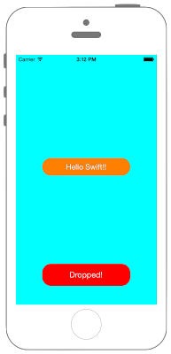

# UIViewに重力を適用させる



```swift fct_label="Swift 4.x"
//
//  ViewController.swift
//  UIKit075
//
//  Created by Misato Morino on 2016/08/15.
//  Copyright © 2016年 Misato Morino. All rights reserved.
//

import UIKit

class ViewController: UIViewController {
    
    //UIDynamicAnimatorはインスタンスを保存しなければアニメーションが実行されない
    var animator : UIDynamicAnimator!
    
    var gravity : UIGravityBehavior!
    
    override func viewDidLoad() {
        
        super.viewDidLoad()
        
        self.view.backgroundColor = UIColor.cyan
        
        // Labelを作成.
        let myLabel: UILabel = UILabel(frame: CGRect(x: 0, y: 0, width: 200, height: 40))
        myLabel.backgroundColor = UIColor.orange
        myLabel.layer.masksToBounds = true
        myLabel.layer.cornerRadius = 20.0
        myLabel.text = "Hello Swift!!"
        myLabel.textColor = UIColor.white
        myLabel.shadowColor = UIColor.gray
        myLabel.textAlignment = NSTextAlignment.center
        myLabel.layer.position = CGPoint(x: self.view.bounds.width/2,y: -200)
        self.view.addSubview(myLabel)
        
        // Buttonを作成.
        let myButton = UIButton(frame: CGRect(x: 0, y: 0, width: 200, height: 50))
        myButton.layer.position = CGPoint(x: self.view.frame.midX, y: 500)
        myButton.layer.masksToBounds = true
        myButton.layer.cornerRadius = 20.0
        myButton.setTitleColor(UIColor.white, for: UIControl.State.normal)
        myButton.setTitleColor(UIColor.black, for: UIControl.State.highlighted)
        myButton.backgroundColor = UIColor.red
        myButton.setTitle("Dropped!", for: UIControl.State.normal)
        myButton.addTarget(self, action: #selector(ViewController.onClickMyButton(sender:)), for: UIControl.Event.touchUpInside)
        self.view.addSubview(myButton)
        
        // UIDynamiAnimatorの生成とインスタンスの保存.
        animator = UIDynamicAnimator(referenceView: self.view)
        
        // 重量を作り、Viewに適用させる.
        gravity = UIGravityBehavior(items: [myLabel])
        
        // Collisionを作成、Viewに適用させる.
        let collision = UICollisionBehavior(items: [myLabel])
        
        // 透明な四角形の当たり判定を作る.
        collision.addBoundary(
            
            // Identifier.
            withIdentifier: "barrier" as NSCopying,
            
            // ベジエで四角形の図形を作る.
            for: UIBezierPath(rect:
                CGRect(x: self.view.frame.midX, y: self.view.frame.midY, width: self.view.frame.maxX, height: 10)
            )
        )
        
        // Collisionのアニメーションを実行.
        animator.addBehavior(collision)
    }
    
    @objc func onClickMyButton(sender : UIButton){
        
        // Gravityのアニメーションを実行.
        animator.addBehavior(gravity)
    }
}
```

```swift fct_label="Swift 3.x"
//
//  ViewController.swift
//  UIKit075
//
//  Created by Misato Morino on 2016/08/15.
//  Copyright © 2016年 Misato Morino. All rights reserved.
//

import UIKit

class ViewController: UIViewController {
    
    //UIDynamicAnimatorはインスタンスを保存しなければアニメーションが実行されない
    var animator : UIDynamicAnimator!
    
    var gravity : UIGravityBehavior!
    
    override func viewDidLoad() {
        
        super.viewDidLoad()
        
        self.view.backgroundColor = UIColor.cyan
    
        // Labelを作成.
        let myLabel: UILabel = UILabel(frame: CGRect(x: 0, y: 0, width: 200, height: 40))
        myLabel.backgroundColor = UIColor.orange
        myLabel.layer.masksToBounds = true
        myLabel.layer.cornerRadius = 20.0
        myLabel.text = "Hello Swift!!"
        myLabel.textColor = UIColor.white
        myLabel.shadowColor = UIColor.gray
        myLabel.textAlignment = NSTextAlignment.center
        myLabel.layer.position = CGPoint(x: self.view.bounds.width/2,y: -200)
        self.view.addSubview(myLabel)
        
        // Buttonを作成.
        let myButton = UIButton(frame: CGRect(x: 0, y: 0, width: 200, height: 50))
        myButton.layer.position = CGPoint(x: self.view.frame.midX, y: 500)
        myButton.layer.masksToBounds = true
        myButton.layer.cornerRadius = 20.0
        myButton.setTitleColor(UIColor.white, for: UIControlState.normal)
        myButton.setTitleColor(UIColor.black, for: UIControlState.highlighted)
        myButton.backgroundColor = UIColor.red
        myButton.setTitle("Dropped!", for: UIControlState.normal)
        myButton.addTarget(self, action: #selector(ViewController.onClickMyButton(sender:)), for: UIControlEvents.touchUpInside)
        self.view.addSubview(myButton)
        
        // UIDynamiAnimatorの生成とインスタンスの保存.
        animator = UIDynamicAnimator(referenceView: self.view)
        
        // 重量を作り、Viewに適用させる.
        gravity = UIGravityBehavior(items: [myLabel])
        
        // Collisionを作成、Viewに適用させる.
        let collision = UICollisionBehavior(items: [myLabel])
        
        // 透明な四角形の当たり判定を作る.
        collision.addBoundary(
            
            // Identifier.
            withIdentifier: "barrier",
            
            // ベジエで四角形の図形を作る.
            for: UIBezierPath(rect:
                CGRect(x: self.view.frame.midX, y: self.view.frame.midY, width: self.view.frame.maxX, height: 10)
            )
        )
        
        // Collisionのアニメーションを実行.
        animator.addBehavior(collision)
    }
    
    func onClickMyButton(sender : UIButton){
        
        // Gravityのアニメーションを実行.
        animator.addBehavior(gravity)
    }
}
```

```swift fct_label="Swift 2.3"
//
//  ViewController.swift
//  UIKit075
//
//  Created by Misato Morino on 2016/08/15.
//  Copyright © 2016年 Misato Morino. All rights reserved.
//

import UIKit

class ViewController: UIViewController {
    
    //UIDynamicAnimatorはインスタンスを保存しなければアニメーションが実行されない
    var animator : UIDynamicAnimator!
    
    var gravity : UIGravityBehavior!
    
    override func viewDidLoad() {
        
        super.viewDidLoad()
        
        self.view.backgroundColor = UIColor.cyanColor()
        
        // Labelを作成.
        let myLabel: UILabel = UILabel(frame: CGRectMake(0,0,200,40))
        myLabel.backgroundColor = UIColor.orangeColor()
        myLabel.layer.masksToBounds = true
        myLabel.layer.cornerRadius = 20.0
        myLabel.text = "Hello Swift!!"
        myLabel.textColor = UIColor.whiteColor()
        myLabel.shadowColor = UIColor.grayColor()
        myLabel.textAlignment = NSTextAlignment.Center
        myLabel.layer.position = CGPoint(x: self.view.bounds.width/2,y: -200)
        self.view.addSubview(myLabel)
        
        // Buttonを作成.
        let myButton = UIButton(frame: CGRectMake(0, 0, 200, 50))
        myButton.layer.position = CGPointMake(self.view.frame.midX, 500)
        myButton.layer.masksToBounds = true
        myButton.layer.cornerRadius = 20.0
        myButton.setTitleColor(UIColor.whiteColor(), forState: UIControlState.Normal)
        myButton.setTitleColor(UIColor.blackColor(), forState: UIControlState.Highlighted)
        myButton.backgroundColor = UIColor.redColor()
        myButton.setTitle("Dropped!", forState: UIControlState.Normal)
        myButton.addTarget(self, action: #selector(ViewController.onClickMyButton(_:)), forControlEvents: UIControlEvents.TouchUpInside)
        self.view.addSubview(myButton)
        
        // UIDynamiAnimatorの生成とインスタンスの保存.
        animator = UIDynamicAnimator(referenceView: self.view)
        
        // 重量を作り、Viewに適用させる.
        gravity = UIGravityBehavior(items: [myLabel])
        
        // Collisionを作成、Viewに適用させる.
        let collision = UICollisionBehavior(items: [myLabel])
        
        // 透明な四角形の当たり判定を作る.
        collision.addBoundaryWithIdentifier(
            
            // Identifier.
            "barrier",
            
            // ベジエで四角形の図形を作る.
            forPath: UIBezierPath(rect:
                CGRectMake(self.view.frame.midX, self.view.frame.midY, self.view.frame.maxX, 10)
            )
        )
        
        // Collisionのアニメーションを実行.
        animator.addBehavior(collision)
    }
    
    func onClickMyButton(sender : UIButton){
        
        // Gravityのアニメーションを実行.
        animator.addBehavior(gravity)
    }
}
```

## 3.xと4.xの差分
* ```UIControlState``` を ```UIControl.State``` に変更
* ```UIControlEvents``` を ```UIControl.Event``` に変更
* ```"barrier"``` を ```"barrier" as NSCopying``` に変更
* ```func onClickMyButton(sender : UIButton)``` に ```@objc``` を追加

## 2.3と3.0の差分
  
* ```addBoundaryWithIdentifier``` から ```addBoundary``` に変更

## Reference

* UIDynamicAnimator
    * [https://developer.apple.com/reference/uikit/uidynamicanimator](https://developer.apple.com/reference/uikit/uidynamicanimator)
* UIGravityBehavior 
    * [https://developer.apple.com/reference/uikit/uigravitybehavior](https://developer.apple.com/reference/uikit/uigravitybehavior)
* UICollisionBehavior
    * [https://developer.apple.com/reference/uikit/uicollisionbehavior](https://developer.apple.com/reference/uikit/uicollisionbehavior)
* UIBezierPath
    * [https://developer.apple.com/reference/uikit/uibezierpath](https://developer.apple.com/reference/uikit/uibezierpath)
