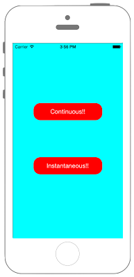

# UIViewを動的に動かす



```swift fct_label="Swift 5.x/4.x"
//
//  ViewController.swift
//  UIKit068
//
//  Created by Misato Morino on 2016/08/15.
//  Copyright © 2016年 Misato Morino. All rights reserved.
//

import UIKit

class ViewController: UIViewController {
    
    // UIDynamicAnimatorのインスタンスを保存しなければアニメーションが実行されない.
    var animator : UIDynamicAnimator!
    
    var continuousPush : UIPushBehavior!
    var instantaneousPush : UIPushBehavior!
    
    override func viewDidLoad() {
        
        super.viewDidLoad()
        
        // 背景を水色に設定.
        self.view.backgroundColor = UIColor.cyan
        
        // ContinuousButtonを作成.
        let myButton = UIButton(frame: CGRect(x: 0, y: 0, width: 200, height: 50))
        myButton.layer.position = CGPoint(x: self.view.center.x, y: self.view.bounds.maxY - myButton.bounds.midY)
        myButton.layer.masksToBounds = true
        myButton.layer.cornerRadius = 20.0
        myButton.setTitleColor(UIColor.white, for: UIControl.State.normal)
        myButton.setTitleColor(UIColor.black, for: UIControl.State.highlighted)
        myButton.backgroundColor = UIColor.red
        myButton.setTitle("Continuous!!", for: UIControl.State.normal)
        myButton.addTarget(self, action: #selector(ViewController.onClickMyButton(sender:)), for: UIControl.Event.touchUpInside)
        myButton.tag = 1
        self.view.addSubview(myButton)
        
        // InstaneousButtonを作成.
        let myButton2 = UIButton(frame: CGRect(x: 0, y: 0, width: 200, height: 50))
        myButton2.layer.position = CGPoint(x: self.view.center.x, y: self.view.bounds.minY + myButton.bounds.midY)
        myButton2.layer.masksToBounds = true
        myButton2.layer.cornerRadius = 20.0
        myButton2.setTitleColor(UIColor.white, for: UIControl.State.normal)
        myButton2.setTitleColor(UIColor.black, for: UIControl.State.highlighted)
        myButton2.backgroundColor = UIColor.red
        myButton2.setTitle("Instantaneous!!", for: UIControl.State.normal)
        myButton2.addTarget(self, action: #selector(ViewController.onClickMyButton(sender:)), for: UIControl.Event.touchUpInside)
        myButton2.tag = 2
        self.view.addSubview(myButton2)
        
        // UIDynamiAnimatorの生成とインスタンスの保存.
        animator = UIDynamicAnimator(referenceView: self.view)
        
        // UIViewを等加速度運動で動かすUIPushBehaviorを生成.
        continuousPush = UIPushBehavior(items: [myButton], mode: UIPushBehavior.Mode.continuous)
        continuousPush.pushDirection = CGVector(dx: 0.0, dy: -1.0)
        
        // UIViewを等速運動で動かすUIPushBehaviorを生成.
        instantaneousPush = UIPushBehavior(items: [myButton2], mode: UIPushBehavior.Mode.instantaneous)
        instantaneousPush.pushDirection = CGVector(dx: 0.0, dy: 1.0)
        
    }
    
    /*
     Buttonが押されたときに呼ばれるメソッド.
     */
    @objc func onClickMyButton(sender : UIButton){
        
        switch(sender.tag){
        case 1:
            animator.addBehavior(continuousPush)
            
        case 2:
            animator.addBehavior(instantaneousPush)
            
        default:
            print("Error")
        }
    }
}
```

```swift fct_label="Swift 3.x"
//
//  ViewController.swift
//  UIKit068
//
//  Created by Misato Morino on 2016/08/15.
//  Copyright © 2016年 Misato Morino. All rights reserved.
//

import UIKit

class ViewController: UIViewController {
    
    // UIDynamicAnimatorのインスタンスを保存しなければアニメーションが実行されない.
    var animator : UIDynamicAnimator!
    
    var continuousPush : UIPushBehavior!
    var instantaneousPush : UIPushBehavior!
    
    override func viewDidLoad() {
        
        super.viewDidLoad()
        
        // 背景を水色に設定.
        self.view.backgroundColor = UIColor.cyan
        
        // ContinuousButtonを作成.
        let myButton = UIButton(frame: CGRect(x: 0, y: 0, width: 200, height: 50))
        myButton.layer.position = CGPoint(x: self.view.center.x, y: self.view.bounds.maxY - myButton.bounds.midY)
        myButton.layer.masksToBounds = true
        myButton.layer.cornerRadius = 20.0
        myButton.setTitleColor(UIColor.white, for: UIControlState.normal)
        myButton.setTitleColor(UIColor.black, for: UIControlState.highlighted)
        myButton.backgroundColor = UIColor.red
        myButton.setTitle("Continuous!!", for: UIControlState.normal)
        myButton.addTarget(self, action: #selector(ViewController.onClickMyButton(sender:)), for: UIControlEvents.touchUpInside)
        myButton.tag = 1
        self.view.addSubview(myButton)
        
        // InstaneousButtonを作成.
        let myButton2 = UIButton(frame: CGRect(x: 0, y: 0, width: 200, height: 50))
        myButton2.layer.position = CGPoint(x: self.view.center.x, y: self.view.bounds.minY + myButton.bounds.midY)
        myButton2.layer.masksToBounds = true
        myButton2.layer.cornerRadius = 20.0
        myButton2.setTitleColor(UIColor.white, for: UIControlState.normal)
        myButton2.setTitleColor(UIColor.black, for: UIControlState.highlighted)
        myButton2.backgroundColor = UIColor.red
        myButton2.setTitle("Instantaneous!!", for: UIControlState.normal)
        myButton2.addTarget(self, action: #selector(ViewController.onClickMyButton(sender:)), for: UIControlEvents.touchUpInside)
        myButton2.tag = 2
        self.view.addSubview(myButton2)
        
        // UIDynamiAnimatorの生成とインスタンスの保存.
        animator = UIDynamicAnimator(referenceView: self.view)
        
        // UIViewを等加速度運動で動かすUIPushBehaviorを生成.
        continuousPush = UIPushBehavior(items: [myButton], mode: UIPushBehaviorMode.continuous)
        continuousPush.pushDirection = CGVector(dx: 0.0, dy: -1.0)
        
        // UIViewを等速運動で動かすUIPushBehaviorを生成.
        instantaneousPush = UIPushBehavior(items: [myButton2], mode: UIPushBehaviorMode.instantaneous)
        instantaneousPush.pushDirection = CGVector(dx: 0.0, dy: 1.0)
        
    }
    
    /*
     Buttonが押されたときに呼ばれるメソッド.
     */
    func onClickMyButton(sender : UIButton){
        
        switch(sender.tag){
        case 1:
            animator.addBehavior(continuousPush)
            
        case 2:
            animator.addBehavior(instantaneousPush)
            
        default:
            print("Error")
        }
    }
}
```

```swift fct_label="Swift 2.3"
//
//  ViewController.swift
//  UIKit068
//
//  Created by Misato Morino on 2016/08/15.
//  Copyright © 2016年 Misato Morino. All rights reserved.
//

import UIKit

class ViewController: UIViewController {
    
    // UIDynamicAnimatorのインスタンスを保存しなければアニメーションが実行されない.
    var animator : UIDynamicAnimator!
    
    var continuousPush : UIPushBehavior!
    var instantaneousPush : UIPushBehavior!
    
    override func viewDidLoad() {
        
        super.viewDidLoad()
        
        // 背景を水色に設定.
        self.view.backgroundColor = UIColor.cyanColor()
        
        // ContinuousButtonを作成.
        let myButton = UIButton(frame: CGRectMake(0, 0, 200, 50))
        myButton.layer.position = CGPointMake(self.view.center.x, self.view.bounds.maxY - myButton.bounds.midY)
        myButton.layer.masksToBounds = true
        myButton.layer.cornerRadius = 20.0
        myButton.setTitleColor(UIColor.whiteColor(), forState: UIControlState.Normal)
        myButton.setTitleColor(UIColor.blackColor(), forState: UIControlState.Highlighted)
        myButton.backgroundColor = UIColor.redColor()
        myButton.setTitle("Continuous!!", forState: UIControlState.Normal)
        myButton.addTarget(self, action: #selector(ViewController.onClickMyButton(_:)), forControlEvents: UIControlEvents.TouchUpInside)
        myButton.tag = 1
        self.view.addSubview(myButton)
        
        // InstaneousButtonを作成.
        let myButton2 = UIButton(frame: CGRectMake(0, 0, 200, 50))
        myButton2.layer.position = CGPointMake(self.view.center.x, self.view.bounds.minY + myButton.bounds.midY)
        myButton2.layer.masksToBounds = true
        myButton2.layer.cornerRadius = 20.0
        myButton2.setTitleColor(UIColor.whiteColor(), forState: UIControlState.Normal)
        myButton2.setTitleColor(UIColor.blackColor(), forState: UIControlState.Highlighted)
        myButton2.backgroundColor = UIColor.redColor()
        myButton2.setTitle("Instantaneous!!", forState: UIControlState.Normal)
        myButton2.addTarget(self, action: #selector(ViewController.onClickMyButton(_:)), forControlEvents: UIControlEvents.TouchUpInside)
        myButton2.tag = 2
        self.view.addSubview(myButton2)
        
        // UIDynamiAnimatorの生成とインスタンスの保存.
        animator = UIDynamicAnimator(referenceView: self.view)
        
        // UIViewを等加速度運動で動かすUIPushBehaviorを生成.
        continuousPush = UIPushBehavior(items: [myButton], mode: UIPushBehaviorMode.Continuous)
        continuousPush.pushDirection = CGVectorMake(0.0, -1.0)
        
        // UIViewを等速運動で動かすUIPushBehaviorを生成.
        instantaneousPush = UIPushBehavior(items: [myButton2], mode: UIPushBehaviorMode.Instantaneous)
        instantaneousPush.pushDirection = CGVector(dx: 0.0, dy: 1.0)
        
    }
    
    /*
     Buttonが押されたときに呼ばれるメソッド.
     */
    func onClickMyButton(sender : UIButton){
        
        switch(sender.tag){
        case 1:
            animator.addBehavior(continuousPush)
            
        case 2:
            animator.addBehavior(instantaneousPush)
            
        default:
            print("Error")
        }
    }
}
```

## 3.xと4.xの差分
* ```UIControlState``` を ```UIControl.State``` に変更
* ```UIControlEvents``` を ```UIControl.Event``` に変更
* ```func onClickMyButton(sender : UIButton)``` に ```@objc``` を追加
* ```UIPushBehaviorMode``` を ```UIPushBehavior.Mode``` に変更

## 2.3と3.0の差分

* CGVectorMakeが廃止

## Reference

* UIDynamicBehavior
    * [https://developer.apple.com/reference/uikit/uidynamicbehavior](https://developer.apple.com/reference/uikit/uidynamicbehavior)
* UIPushBehavior
    * [https://developer.apple.com/reference/uikit/uipushbehavior](https://developer.apple.com/reference/uikit/uipushBehavior)
