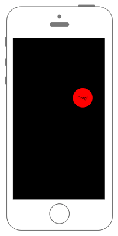

# ドラッグでViewを移動させる




```swift fct_label="Swift 4.x/Swift 3.x"
//
//  ViewController.swift
//  UIKit070
//
//  Created by Misato Morino on 2016/08/15.
//  Copyright © 2016年 Misato Morino. All rights reserved.
//

import UIKit

class ViewController: UIViewController {
    
    var myLabel: UILabel!
    
    override func viewDidLoad() {
        super.viewDidLoad()
        
        // 背景を黒色に設定.
        self.view.backgroundColor = UIColor.black
        
        // Labelを生成.
        myLabel = UILabel(frame: CGRect(x: 0, y: 0, width: 80, height: 80))
        myLabel.text = "Drag!"
        myLabel.textAlignment = NSTextAlignment.center
        myLabel.backgroundColor = UIColor.red
        myLabel.layer.masksToBounds = true
        myLabel.center = self.view.center
        myLabel.layer.cornerRadius = 40.0
        
        // Labelをviewに追加.
        self.view.addSubview(myLabel)
    }
    
    /*
     タッチを感知した際に呼ばれるメソッド.
     */
    override func touchesBegan(_ touches: Set<UITouch>, with event: UIEvent?) {
        print("touchesBegan")
        
        // Labelアニメーション.
        UIView.animate(withDuration: 0.06,
                                   // アニメーション中の処理.
            animations: { () -> Void in
                // 縮小用アフィン行列を作成する.
                self.myLabel.transform = CGAffineTransform(scaleX: 0.9, y: 0.9)
            })
        { (Bool) -> Void in
        }
    }
    
    /*
     ドラッグを感知した際に呼ばれるメソッド.
     (ドラッグ中何度も呼ばれる)
     */
    override func touchesMoved(_ touches: Set<UITouch>, with event: UIEvent?) {
        
        print("touchesMoved")
        
        // タッチイベントを取得.
        let aTouch: UITouch = touches.first!
        
        // 移動した先の座標を取得.
        let location = aTouch.location(in: self.view)
        
        // 移動する前の座標を取得.
        let prevLocation = aTouch.previousLocation(in: self.view)
        
        // CGRect生成.
        var myFrame: CGRect = self.view.frame
        
        // ドラッグで移動したx, y距離をとる.
        let deltaX: CGFloat = location.x - prevLocation.x
        let deltaY: CGFloat = location.y - prevLocation.y
        
        // 移動した分の距離をmyFrameの座標にプラスする.
        myFrame.origin.x += deltaX
        myFrame.origin.y += deltaY
        
        // frameにmyFrameを追加.
        self.view.frame = myFrame
    }
    
    /*
     指が離れたことを感知した際に呼ばれるメソッド.
     */
    override func touchesEnded(_ touches: Set<UITouch>, with event: UIEvent?) {
        
        print("touchesEnded")
        
        // Labelアニメーション.
        UIView.animate(withDuration: 0.1,
                                   
                                   // アニメーション中の処理.
            animations: { () -> Void in
                // 拡大用アフィン行列を作成する.
                self.myLabel.transform = CGAffineTransform(scaleX: 0.4, y: 0.4)
                // 縮小用アフィン行列を作成する.
                self.myLabel.transform = CGAffineTransform(scaleX: 1.0, y: 1.0)
            })
        { (Bool) -> Void in
            
        }
    }
    
    override func didReceiveMemoryWarning() {
        super.didReceiveMemoryWarning()
    }
}
```

```swift fct_label="Swift 2.3"
//
//  ViewController.swift
//  UIKit070
//
//  Created by Misato Morino on 2016/08/15.
//  Copyright © 2016年 Misato Morino. All rights reserved.
//

import UIKit

class ViewController: UIViewController {
    
    var myLabel: UILabel!
    
    override func viewDidLoad() {
        super.viewDidLoad()
        
        // 背景を黒色に設定.
        self.view.backgroundColor = UIColor.blackColor()
        
        // Labelを生成.
        myLabel = UILabel(frame: CGRectMake(0, 0, 80, 80))
        myLabel.text = "Drag!"
        myLabel.textAlignment = NSTextAlignment.Center
        myLabel.backgroundColor = UIColor.redColor()
        myLabel.layer.masksToBounds = true
        myLabel.center = self.view.center
        myLabel.layer.cornerRadius = 40.0
        
        // Labelをviewに追加.
        self.view.addSubview(myLabel)
    }
    
    /*
     タッチを感知した際に呼ばれるメソッド.
     */
    override func touchesBegan(touches: Set<UITouch>, withEvent event: UIEvent?) {
        print("touchesBegan")
        
        // Labelアニメーション.
        UIView.animateWithDuration(0.06,
                                   // アニメーション中の処理.
            animations: { () -> Void in
                // 縮小用アフィン行列を作成する.
                self.myLabel.transform = CGAffineTransformMakeScale(0.9, 0.9)
            })
        { (Bool) -> Void in
        }
    }
    
    /*
     ドラッグを感知した際に呼ばれるメソッド.
     (ドラッグ中何度も呼ばれる)
     */
    override func touchesMoved(touches: Set<UITouch>, withEvent event: UIEvent?) {
        print("touchesMoved")
        
        // タッチイベントを取得.
        let aTouch: UITouch = touches.first!
        
        // 移動した先の座標を取得.
        let location = aTouch.locationInView(self.view)
        
        // 移動する前の座標を取得.
        let prevLocation = aTouch.previousLocationInView(self.view)
        
        // CGRect生成.
        var myFrame: CGRect = self.view.frame
        
        // ドラッグで移動したx, y距離をとる.
        let deltaX: CGFloat = location.x - prevLocation.x
        let deltaY: CGFloat = location.y - prevLocation.y
        
        // 移動した分の距離をmyFrameの座標にプラスする.
        myFrame.origin.x += deltaX
        myFrame.origin.y += deltaY
        
        // frameにmyFrameを追加.
        self.view.frame = myFrame
    }
    
    /*
     指が離れたことを感知した際に呼ばれるメソッド.
     */
    override func touchesEnded(touches: Set<UITouch>, withEvent event: UIEvent?) {
        
        print("touchesEnded")
        
        // Labelアニメーション.
        UIView.animateWithDuration(0.1,
                                   
                                   // アニメーション中の処理.
            animations: { () -> Void in
                // 拡大用アフィン行列を作成する.
                self.myLabel.transform = CGAffineTransformMakeScale(0.4, 0.4)
                // 縮小用アフィン行列を作成する.
                self.myLabel.transform = CGAffineTransformMakeScale(1.0, 1.0)
            })
        { (Bool) -> Void in
            
        }
    }
    
    override func didReceiveMemoryWarning() {
        super.didReceiveMemoryWarning()
    }
}
```

## 2.3と3.0の差分

* ```touchesBegan(touches: Set<UITouch>, withEvent event: UIEvent?)``` から ```touchesBegan(_ touches: Set<UITouch>, with event: UIEvent?)``` に変更

## Reference

* UITouch
    * [https://developer.apple.com/reference/uikit/uitouch](https://developer.apple.com/reference/uikit/uitouch)
