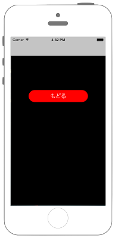

# モーダル表示させる 




### ViewController.swift

```swift fct_label="Swift 4.x"
//
//  ViewController.swift
//  UIKit071
//
//  Created by Misato Morino on 2016/08/15.
//  Copyright © 2016年 Misato Morino. All rights reserved.
//

import UIKit

class ViewController: UIViewController{
    
    override func viewDidLoad() {
        
        // PopButtonを生成.
        let myButton = UIButton()
        myButton.frame = CGRect(x: 0, y: 0, width: 200, height: 40)
        myButton.backgroundColor = UIColor.red
        myButton.layer.masksToBounds = true
        myButton.setTitle("PopOver", for: UIControl.State.normal)
        myButton.setTitleColor(UIColor.white, for: UIControl.State.normal)
        myButton.setTitleColor(UIColor.black, for: UIControl.State.highlighted)
        myButton.layer.cornerRadius = 20.0
        myButton.layer.position = CGPoint(x: self.view.frame.width/2, y:200)
        myButton.tag = 0
        myButton.addTarget(self, action: #selector(ViewController.onClickMyButton(sender:)), for: .touchUpInside)
        
        // viewにButtonを追加.
        self.view.addSubview(myButton)
    }
    
    /*
     Buttonが押された時に呼ばれるメソッド.
     */
    @objc func onClickMyButton(sender : UIButton){
        
        // secondViewControllerのインスタンス生成.
        let second = SecondViewController()
        
        // navigationControllerのrootViewControllerにsecondViewControllerをセット.
        let nav = UINavigationController(rootViewController: second)
        
        // 画面遷移.
        self.present(nav, animated: true, completion: nil)
    }
}
```

```swift fct_label="Swift 3.x"
//
//  ViewController.swift
//  UIKit071
//
//  Created by Misato Morino on 2016/08/15.
//  Copyright © 2016年 Misato Morino. All rights reserved.
//

import UIKit

class ViewController: UIViewController{
    
    override func viewDidLoad() {
        
        // PopButtonを生成.
        let myButton = UIButton()
        myButton.frame = CGRect(x: 0, y: 0, width: 200, height: 40)
        myButton.backgroundColor = UIColor.red
        myButton.layer.masksToBounds = true
        myButton.setTitle("PopOver", for: UIControlState.normal)
        myButton.setTitleColor(UIColor.white, for: UIControlState.normal)
        myButton.setTitleColor(UIColor.black, for: UIControlState.highlighted)
        myButton.layer.cornerRadius = 20.0
        myButton.layer.position = CGPoint(x: self.view.frame.width/2, y:200)
        myButton.tag = 0
        myButton.addTarget(self, action: #selector(ViewController.onClickMyButton(sender:)), for: .touchUpInside)
        
        // viewにButtonを追加.
        self.view.addSubview(myButton)
    }
    
    /*
     Buttonが押された時に呼ばれるメソッド.
     */
    func onClickMyButton(sender : UIButton){
        
        // secondViewControllerのインスタンス生成.
        let second = SecondViewController()
        
        // navigationControllerのrootViewControllerにsecondViewControllerをセット.
        let nav = UINavigationController(rootViewController: second)
        
        // 画面遷移.
        self.present(nav, animated: true, completion: nil)
    }
}
``` 

```swift fct_label="Swift 2.3"
//
//  ViewController.swift
//  UIKit071
//
//  Created by Misato Morino on 2016/08/15.
//  Copyright © 2016年 Misato Morino. All rights reserved.
//

import UIKit

class ViewController: UIViewController{
    
    override func viewDidLoad() {
        
        // PopButtonを生成.
        let myButton = UIButton()
        myButton.frame = CGRectMake(0,0,200,40)
        myButton.backgroundColor = UIColor.redColor()
        myButton.layer.masksToBounds = true
        myButton.setTitle("PopOver", forState: UIControlState.Normal)
        myButton.setTitleColor(UIColor.whiteColor(), forState: UIControlState.Normal)
        myButton.setTitleColor(UIColor.blackColor(), forState: UIControlState.Highlighted)
        myButton.layer.cornerRadius = 20.0
        myButton.layer.position = CGPoint(x: self.view.frame.width/2, y:200)
        myButton.tag = 0
        myButton.addTarget(self, action: #selector(ViewController.onClickMyButton(_:)), forControlEvents: .TouchUpInside)
        
        // viewにButtonを追加.
        self.view.addSubview(myButton)
    }
    
    /*
     Buttonが押された時に呼ばれるメソッド.
     */
    func onClickMyButton(sender : UIButton){
        
        // secondViewControllerのインスタンス生成.
        let second = SecondViewController()
        
        // navigationControllerのrootViewControllerにsecondViewControllerをセット.
        let nav = UINavigationController(rootViewController: second)
        
        // 画面遷移.
        self.presentViewController(nav, animated: true, completion: nil)
    }
}
```

### SecondViewController.swift

```swift fct_label="Swift 4.x"
//
//  SecondViewController.swift
//  UIKit071
//
//  Created by Misato Morino on 2016/08/19.
//  Copyright © 2016年 Misato Morino. All rights reserved.
//

import UIKit

class SecondViewController : UIViewController{
    
    override func viewDidLoad() {
        
        self.view.backgroundColor = UIColor.black
        
        // もどるButtonを生成.
        let myButton = UIButton()
        myButton.frame = CGRect(x: 0, y: 0, width: 200, height: 40)
        myButton.backgroundColor = UIColor.red
        myButton.layer.masksToBounds = true
        myButton.setTitle("もどる", for: UIControl.State.normal)
        myButton.setTitleColor(UIColor.white, for: UIControl.State.normal)
        myButton.setTitleColor(UIColor.black, for: UIControl.State.highlighted)
        myButton.layer.cornerRadius = 20.0
        myButton.layer.position = CGPoint(x: self.view.frame.width/2, y:200)
        myButton.tag = 1
        myButton.addTarget(self, action: #selector(SecondViewController.onClickMyButton(sender:)), for: .touchUpInside)
        
        // viewにButtonを追加.
        self.view.addSubview(myButton)
    }
    
    /*
     Buttonを押した時に呼ばれるメソッド.
     */
    @objc func onClickMyButton(sender : UIButton){
        
        // viewを閉じる.
        self.navigationController?.dismiss(animated: true, completion: nil)
    }
}
```

```swift fct_label="Swift 3.x"
//
//  SecondViewController.swift
//  UIKit071
//
//  Created by Misato Morino on 2016/08/19.
//  Copyright © 2016年 Misato Morino. All rights reserved.
//

import UIKit

class SecondViewController : UIViewController{
    
    override func viewDidLoad() {
        
        self.view.backgroundColor = UIColor.black
        
        // もどるButtonを生成.
        let myButton = UIButton()
        myButton.frame = CGRect(x: 0, y: 0, width: 200, height: 40)
        myButton.backgroundColor = UIColor.red
        myButton.layer.masksToBounds = true
        myButton.setTitle("もどる", for: UIControlState.normal)
        myButton.setTitleColor(UIColor.white, for: UIControlState.normal)
        myButton.setTitleColor(UIColor.black, for: UIControlState.highlighted)
        myButton.layer.cornerRadius = 20.0
        myButton.layer.position = CGPoint(x: self.view.frame.width/2, y:200)
        myButton.tag = 1
        myButton.addTarget(self, action: #selector(SecondViewController.onClickMyButton(sender:)), for: .touchUpInside)
        
        // viewにButtonを追加.
        self.view.addSubview(myButton)
    }
    
    /*
     Buttonを押した時に呼ばれるメソッド.
     */
    func onClickMyButton(sender : UIButton){
        
        // viewを閉じる.
        self.navigationController?.dismiss(animated: true, completion: nil)
    }
} 
```

```swift fct_label="Swift 2.3"
//
//  SecondViewController.swift
//  UIKit071
//
//  Created by Misato Morino on 2016/08/19.
//  Copyright © 2016年 Misato Morino. All rights reserved.
//

import UIKit

class SecondViewController : UIViewController{
    
    override func viewDidLoad() {
        
        self.view.backgroundColor = UIColor.blackColor()
        
        // もどるButtonを生成.
        let myButton = UIButton()
        myButton.frame = CGRectMake(0,0,200,40)
        myButton.backgroundColor = UIColor.redColor()
        myButton.layer.masksToBounds = true
        myButton.setTitle("もどる", forState: UIControlState.Normal)
        myButton.setTitleColor(UIColor.whiteColor(), forState: UIControlState.Normal)
        myButton.setTitleColor(UIColor.blackColor(), forState: UIControlState.Highlighted)
        myButton.layer.cornerRadius = 20.0
        myButton.layer.position = CGPoint(x: self.view.frame.width/2, y:200)
        myButton.tag = 1
        myButton.addTarget(self, action: #selector(SecondViewController.onClickMyButton(_:)), forControlEvents: .TouchUpInside)
        
        // viewにButtonを追加.
        self.view.addSubview(myButton)
    }
    
    /*
     Buttonを押した時に呼ばれるメソッド.
     */
    func onClickMyButton(sender : UIButton){
        
        // viewを閉じる.
        self.navigationController?.dismissViewControllerAnimated(true, completion: nil)
    }
}
```

## 3.xと4.xの差分
* ```UIControlState``` が ```UIControl.State``` に変更
* ```func onClickMyButton(sender : UIButton)``` に ```@objc``` を追加

## 2.3と3.0の差分

* CGRectMakeが廃止
* セレクタが ```Selector("onDownMainButton:")``` から ```#selector(myCusButton.onDownMainButton(sender:)``` に変更

## Reference

* UINavigationController
    * [https://developer.apple.com/reference/uikit/uinavigationcontroller](https://developer.apple.com/reference/uikit/uinavigationcontroller) 
* UIViewController
    * [https://developer.apple.com/reference/uikit/uiviewcontroller](https://developer.apple.com/reference/uikit/uiviewcontroller)
