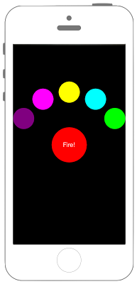

# 一つのボタンから複数のボタンが飛び出す



### ViewController.swift

```swift fct_label="Swift 4.x"
//
//  ViewController.swift
//  UIKit072
//
//  Created by Misato Morino on 2016/08/15.
//  Copyright © 2016年 Misato Morino. All rights reserved.
//

import UIKit

class ViewController: UIViewController {
    
    var mainButton: UIButton = UIButton()
    
    override func viewDidLoad() {
        super.viewDidLoad()
        
        // 背景を黒色に設定.
        self.view.backgroundColor = UIColor.black
        
        // mainボタン生成.
        mainButton = UIButton(frame: CGRect(x: 0, y: 0, width: 100, height: 100))
        mainButton.center = self.view.center
        
        // myCustomButtonクラスのインスタンス生成.
        let myCusButton: MyCustomButton = MyCustomButton(frame: self.view.frame)
        myCusButton.mainButton = self.mainButton
        myCusButton.mainPosition = self.mainButton.layer.position
        
        // インスタンスをviewに追加.
        self.view.addSubview(myCusButton)
        
        // mainボタン各設定.
        mainButton.layer.masksToBounds = true
        mainButton.layer.cornerRadius = 50.0
        mainButton.backgroundColor = UIColor.red
        mainButton.setTitle("Fire!", for: .normal)
        mainButton.setTitleColor(UIColor.white, for: .normal)
        mainButton.addTarget(myCusButton, action: #selector(myCusButton.onDownMainButton(sender:)), for: UIControl.Event.touchUpInside)
        mainButton.addTarget(myCusButton, action: #selector(myCusButton.onUpMainButton(sender:)), for: [.touchUpInside, .touchDragOutside])
        mainButton.tag = 0
        
        // mainボタンをviewに追加.
        self.view.addSubview(mainButton)
    }
    
} 
```

```swift fct_label="Swift 3.x"
//
//  ViewController.swift
//  UIKit072
//
//  Created by Misato Morino on 2016/08/15.
//  Copyright © 2016年 Misato Morino. All rights reserved.
//

import UIKit

class ViewController: UIViewController {
    
    var mainButton: UIButton = UIButton()
    
    override func viewDidLoad() {
        super.viewDidLoad()
        
        // 背景を黒色に設定.
        self.view.backgroundColor = UIColor.black
        
        // mainボタン生成.
        mainButton = UIButton(frame: CGRect(x: 0, y: 0, width: 100, height: 100))
        mainButton.center = self.view.center
        
        // myCustomButtonクラスのインスタンス生成.
        let myCusButton: MyCustomButton = MyCustomButton(frame: self.view.frame)
        myCusButton.mainButton = self.mainButton
        myCusButton.mainPosition = self.mainButton.layer.position
        
        // インスタンスをviewに追加.
        self.view.addSubview(myCusButton)
        
        // mainボタン各設定.
        mainButton.layer.masksToBounds = true
        mainButton.layer.cornerRadius = 50.0
        mainButton.backgroundColor = UIColor.red
        mainButton.setTitle("Fire!", for: .normal)
        mainButton.setTitleColor(UIColor.white, for: .normal)
        mainButton.addTarget(myCusButton, action: #selector(myCusButton.onDownMainButton(sender:)), for: UIControlEvents.touchUpInside)
        mainButton.addTarget(myCusButton, action: #selector(myCusButton.onUpMainButton(sender:)), for: [.touchUpInside, .touchDragOutside])
        mainButton.tag = 0
        
        // mainボタンをviewに追加.
        self.view.addSubview(mainButton)
    }
    
} 
``` 

```swift fct_label="Swift 2.3"
//
//  ViewController.swift
//  UIKit072
//
//  Created by Misato Morino on 2016/08/15.
//  Copyright © 2016年 Misato Morino. All rights reserved.
//

import UIKit

class ViewController: UIViewController {
    
    var mainButton: UIButton = UIButton()
    
    override func viewDidLoad() {
        super.viewDidLoad()
        
        // 背景を黒色に設定.
        self.view.backgroundColor = UIColor.blackColor()
        
        // mainボタン生成.
        mainButton = UIButton(frame: CGRectMake(0, 0, 100, 100))
        mainButton.center = self.view.center
        
        // myCustomButtonクラスのインスタンス生成.
        let myCusButton: MyCustomButton = MyCustomButton(frame: self.view.frame)
        myCusButton.mainButton = self.mainButton
        myCusButton.mainPosition = self.mainButton.layer.position
        
        // インスタンスをviewに追加.
        self.view.addSubview(myCusButton)
        
        // mainボタン各設定.
        mainButton.layer.masksToBounds = true
        mainButton.layer.cornerRadius = 50.0
        mainButton.backgroundColor = UIColor.redColor()
        mainButton.setTitle("Fire!", forState: .Normal)
        mainButton.setTitleColor(UIColor.whiteColor(), forState: .Normal)
        mainButton.addTarget(myCusButton, action: Selector("onDownMainButton:"), forControlEvents: UIControlEvents.TouchDown)
        mainButton.addTarget(myCusButton, action: Selector("onUpMainButton:"), forControlEvents: [UIControlEvents.TouchUpInside, UIControlEvents.TouchDragOutside])
        mainButton.tag = 0
        
        // mainボタンをviewに追加.
        self.view.addSubview(mainButton)
    }
    
}
``` 

### MyCustomeButton.swift

```swift fct_label="Swift 4.x"
//
//  MyCustomButton.swift
//  UIKit072
//
//  Created by Misato Morino on 2016/08/19.
//  Copyright © 2016年 Misato Morino. All rights reserved.
//

import Foundation
import UIKit

class MyCustomButton: UIView {
    
    // subボタン(飛び出すボタン)を生成
    var subButton_1: UIButton = UIButton()
    var subButton_2: UIButton = UIButton()
    var subButton_3: UIButton = UIButton()
    var subButton_4: UIButton = UIButton()
    var subButton_5: UIButton = UIButton()
    
    var mainButton: UIButton!
    
    var colors: NSMutableArray!
    
    var mainPosition: CGPoint!
    
    //var viewControll: UIViewController = ViewController()
    
    required init(coder aDecoder: NSCoder) {
        super.init(coder: aDecoder)!
    }
    
    override init(frame: CGRect) {
        super.init(frame: frame)
    }
    
    /*
     メインボタンイベント(Down)
     */
    @objc func onDownMainButton(sender: UIButton) {
        
        // 背景を黒色に設定.
        self.backgroundColor = UIColor.black
        
        UIView.animate(withDuration: 0.06,
                       
                       // アニメーション中の処理.
            animations: { () -> Void in
                
                // 縮小用アフィン行列を生成する.
                sender.transform = CGAffineTransform(scaleX: 0.9, y: 0.9)
        })
        { (Bool) -> Void in
        }
    }
    
    /*
     subボタンの座標を返すメソッド
     */
    func getPosition(angle: CGFloat, radius: CGFloat) -> CGPoint {
        
        // 度からラジアンに変換.
        let radian = angle * CGFloat(M_PI) / 180.0
        
        // x座標を計算.
        let x_position:CGFloat = mainButton.layer.position.x + radius * cos(radian)
        
        // y座標を計算.
        let y_position = mainPosition.y + radius * sin(radian)
        let position = CGPoint(x: x_position, y: y_position)
        
        return position
    }
    
    /*
     メインボタンイベント(Up)
     */
    @objc func onUpMainButton(sender: UIButton) {
        
        // subボタンを配列に格納.
        let buttons = [subButton_1, subButton_2, subButton_3, subButton_4, subButton_5]
        
        // subボタン用の　UIColorを配列に格納.
        colors = [UIColor.yellow, UIColor.green, UIColor.cyan, UIColor.magenta, UIColor.purple] as NSMutableArray
        
        // mainボタンからの距離(半径).
        let radius: CGFloat = 150
        
        // subボタンに各種設定.
        for i in 0 ..< buttons.count {
            buttons[i].frame = CGRect(x: 0, y: 0, width: 60, height: 60)
            buttons[i].layer.cornerRadius = 30.0
            buttons[i].backgroundColor = colors[i] as? UIColor
            buttons[i].center = self.center
            buttons[i].addTarget(self, action: #selector(MyCustomButton.onClickSubButtons(sender:)), for: UIControl.Event.touchUpInside)
            buttons[i].tag = i+1
            
            // subボタンをviewに追加.
            self.addSubview(buttons[i])
        }
        
        UIView.animate(withDuration: 0.06,
                       
                       // アニメーション中の処理.
            animations: { () -> Void in
                
                // 拡大用アフィン行列を作成する.
                sender.transform = CGAffineTransform(scaleX: 0.4, y: 0.4)
                
                // 縮小用アフィン行列を作成する.
                sender.transform = CGAffineTransform(scaleX: 1.0, y: 1.0)
        })
        { (Bool) -> Void in
        }
        
        UIView.animate(withDuration: 0.7,
                       delay: 0.0,
                       
                       // バネを設定.
            usingSpringWithDamping: 0.5,
            
            // バネの弾性力.
            initialSpringVelocity: 1.5,
            options: UIView.AnimationOptions.curveEaseIn,
            
            // アニメーション中の処理.
            animations: { () -> Void in
                
                // subボタンに座標を設定.
                self.subButton_1.layer.position = self.getPosition(angle: -90, radius: radius)
                self.subButton_2.layer.position = self.getPosition(angle: -30, radius: radius)
                self.subButton_3.layer.position = self.getPosition(angle: -60, radius: radius)
                self.subButton_4.layer.position = self.getPosition(angle: -120, radius: radius)
                self.subButton_5.layer.position = self.getPosition(angle: -150, radius: radius)
        }) { (Bool) -> Void in
        }
    }
    
    
    /*
     subボタンイベント
     背景の色を設定.
     */
    @objc func onClickSubButtons(sender: UIButton) {
        
        // 背景色をsubボタンの色に設定.
        switch(sender.tag) {
        case 1:
            self.backgroundColor = colors[0] as? UIColor
        case 2:
            self.backgroundColor = colors[1] as? UIColor
        case 3:
            self.backgroundColor = colors[2] as? UIColor
        case 4:
            self.backgroundColor = colors[3] as? UIColor
        case 5:
            self.backgroundColor = colors[4] as? UIColor
        default:
            self.backgroundColor = UIColor.black
        }
    }
    
}
```

```swift fct_label="Swift 3.x"
//
//  MyCustomButton.swift
//  UIKit072
//
//  Created by Misato Morino on 2016/08/19.
//  Copyright © 2016年 Misato Morino. All rights reserved.
//

import Foundation
import UIKit

class MyCustomButton: UIView {
    
    // subボタン(飛び出すボタン)を生成
    var subButton_1: UIButton = UIButton()
    var subButton_2: UIButton = UIButton()
    var subButton_3: UIButton = UIButton()
    var subButton_4: UIButton = UIButton()
    var subButton_5: UIButton = UIButton()
    
    var mainButton: UIButton!
    
    var colors: NSMutableArray!
    
    var mainPosition: CGPoint!
    
    //var viewControll: UIViewController = ViewController()
    
    required init(coder aDecoder: NSCoder) {
        super.init(coder: aDecoder)!
    }
    
    override init(frame: CGRect) {
        super.init(frame: frame)
    }
    
    /*
     メインボタンイベント(Down)
     */
    func onDownMainButton(sender: UIButton) {
        
        // 背景を黒色に設定.
        self.backgroundColor = UIColor.black
        
        UIView.animate(withDuration: 0.06,
                                   
                                   // アニメーション中の処理.
            animations: { () -> Void in
                
                // 縮小用アフィン行列を生成する.
                sender.transform = CGAffineTransform(scaleX: 0.9, y: 0.9)
            })
        { (Bool) -> Void in
        }
    }
    
    /*
     subボタンの座標を返すメソッド
     */
    func getPosition(angle: CGFloat, radius: CGFloat) -> CGPoint {
        
        // 度からラジアンに変換.
        let radian = angle * CGFloat(M_PI) / 180.0
        
        // x座標を計算.
        let x_position:CGFloat = mainButton.layer.position.x + radius * cos(radian)
        
        // y座標を計算.
        let y_position = mainPosition.y + radius * sin(radian)
        let position = CGPoint(x: x_position, y: y_position)
        
        return position
    }
    
    /*
     メインボタンイベント(Up)
     */
    func onUpMainButton(sender: UIButton) {
        
        // subボタンを配列に格納.
        let buttons = [subButton_1, subButton_2, subButton_3, subButton_4, subButton_5]
        
        // subボタン用の　UIColorを配列に格納.
        colors = [UIColor.yellow, UIColor.green, UIColor.cyan, UIColor.magenta, UIColor.purple] as NSMutableArray
        
        // mainボタンからの距離(半径).
        let radius: CGFloat = 150
        
        // subボタンに各種設定.
        for i in 0 ..< buttons.count {
            buttons[i].frame = CGRect(x: 0, y: 0, width: 60, height: 60)
            buttons[i].layer.cornerRadius = 30.0
            buttons[i].backgroundColor = colors[i] as? UIColor
            buttons[i].center = self.center
            buttons[i].addTarget(self, action: #selector(MyCustomButton.onClickSubButtons(sender:)), for: UIControlEvents.touchUpInside)
            buttons[i].tag = i+1
            
            // subボタンをviewに追加.
            self.addSubview(buttons[i])
        }
        
        UIView.animate(withDuration: 0.06,
                                   
                                   // アニメーション中の処理.
            animations: { () -> Void in
                
                // 拡大用アフィン行列を作成する.
                sender.transform = CGAffineTransform(scaleX: 0.4, y: 0.4)
                
                // 縮小用アフィン行列を作成する.
                sender.transform = CGAffineTransform(scaleX: 1.0, y: 1.0)
            })
        { (Bool) -> Void in
        }
        
        UIView.animate(withDuration: 0.7,
                                   delay: 0.0,
                                   
                                   // バネを設定.
            usingSpringWithDamping: 0.5,
            
            // バネの弾性力.
            initialSpringVelocity: 1.5,
            options: UIViewAnimationOptions.curveEaseIn,
            
            // アニメーション中の処理.
            animations: { () -> Void in
                
                // subボタンに座標を設定.
                self.subButton_1.layer.position = self.getPosition(angle: -90, radius: radius)
                self.subButton_2.layer.position = self.getPosition(angle: -30, radius: radius)
                self.subButton_3.layer.position = self.getPosition(angle: -60, radius: radius)
                self.subButton_4.layer.position = self.getPosition(angle: -120, radius: radius)
                self.subButton_5.layer.position = self.getPosition(angle: -150, radius: radius)
        }) { (Bool) -> Void in
        }
    }
    
    
    /*
     subボタンイベント
     背景の色を設定.
     */
    func onClickSubButtons(sender: UIButton) {
        
        // 背景色をsubボタンの色に設定.
        switch(sender.tag) {
        case 1:
            self.backgroundColor = colors[0] as? UIColor
        case 2:
            self.backgroundColor = colors[1] as? UIColor
        case 3:
            self.backgroundColor = colors[2] as? UIColor
        case 4:
            self.backgroundColor = colors[3] as? UIColor
        case 5:
            self.backgroundColor = colors[4] as? UIColor
        default:
            self.backgroundColor = UIColor.black
        }
    }
    
} 
```

```swift fct_label="Swift 2.3"
//
//  MyCustomButton.swift
//  UIKit072
//
//  Created by Misato Morino on 2016/08/19.
//  Copyright © 2016年 Misato Morino. All rights reserved.
//

import Foundation
import UIKit

class MyCustomButton: UIView {
    
    // subボタン(飛び出すボタン)を生成
    var subButton_1: UIButton = UIButton()
    var subButton_2: UIButton = UIButton()
    var subButton_3: UIButton = UIButton()
    var subButton_4: UIButton = UIButton()
    var subButton_5: UIButton = UIButton()
    
    var mainButton: UIButton!
    
    var colors: NSMutableArray!
    
    var mainPosition: CGPoint!
    
    //var viewControll: UIViewController = ViewController()
    
    required init(coder aDecoder: NSCoder) {
        super.init(coder: aDecoder)!
    }
    
    override init(frame: CGRect) {
        super.init(frame: frame)
    }
    
    /*
     メインボタンイベント(Down)
     */
    func onDownMainButton(sender: UIButton) {
        
        // 背景を黒色に設定.
        self.backgroundColor = UIColor.blackColor()
        
        UIView.animateWithDuration(0.06,
                                   
                                   // アニメーション中の処理.
            animations: { () -> Void in
                
                // 縮小用アフィン行列を生成する.
                sender.transform = CGAffineTransformMakeScale(0.9, 0.9)
            })
        { (Bool) -> Void in
        }
    }
    
    /*
     subボタンの座標を返すメソッド
     */
    func getPosition(angle: CGFloat, radius: CGFloat) -> CGPoint {
        
        // 度からラジアンに変換.
        let radian = angle * CGFloat(M_PI) / 180.0
        
        // x座標を計算.
        let x_position:CGFloat = mainButton.layer.position.x + radius * cos(radian)
        
        // y座標を計算.
        let y_position = mainPosition.y + radius * sin(radian)
        let position = CGPointMake(x_position, y_position)
        
        return position
    }
    
    /*
     メインボタンイベント(Up)
     */
    func onUpMainButton(sender: UIButton) {
        
        // subボタンを配列に格納.
        let buttons = [subButton_1, subButton_2, subButton_3, subButton_4, subButton_5]
        
        // subボタン用の　UIColorを配列に格納.
        colors = [UIColor.yellowColor(), UIColor.greenColor(), UIColor.cyanColor(), UIColor.magentaColor(), UIColor.purpleColor()] as NSMutableArray
        
        // mainボタンからの距離(半径).
        let radius: CGFloat = 150
        
        // subボタンに各種設定.
        for i in 0 ..< buttons.count {
            buttons[i].frame = CGRectMake(0, 0, 60, 60)
            buttons[i].layer.cornerRadius = 30.0
            buttons[i].backgroundColor = colors[i] as? UIColor
            buttons[i].center = self.center
            buttons[i].addTarget(self, action: #selector(MyCustomButton.onClickSubButtons(_:)), forControlEvents: UIControlEvents.TouchUpInside)
            buttons[i].tag = i+1
            
            // subボタンをviewに追加.
            self.addSubview(buttons[i])
        }
        
        UIView.animateWithDuration(0.06,
                                   
                                   // アニメーション中の処理.
            animations: { () -> Void in
                
                // 拡大用アフィン行列を作成する.
                sender.transform = CGAffineTransformMakeScale(0.4, 0.4)
                
                // 縮小用アフィン行列を作成する.
                sender.transform = CGAffineTransformMakeScale(1.0, 1.0)
            })
        { (Bool) -> Void in
        }
        
        UIView.animateWithDuration(0.7,
                                   delay: 0.0,
                                   
                                   // バネを設定.
            usingSpringWithDamping: 0.5,
            
            // バネの弾性力.
            initialSpringVelocity: 1.5,
            options: UIViewAnimationOptions.CurveEaseIn,
            
            // アニメーション中の処理.
            animations: { () -> Void in
                
                // subボタンに座標を設定.
                self.subButton_1.layer.position = self.getPosition(-90, radius: radius)
                self.subButton_2.layer.position = self.getPosition(-30, radius: radius)
                self.subButton_3.layer.position = self.getPosition(-60, radius: radius)
                self.subButton_4.layer.position = self.getPosition(-120, radius: radius)
                self.subButton_5.layer.position = self.getPosition(-150, radius: radius)
        }) { (Bool) -> Void in
        }
    }
    
    
    /*
     subボタンイベント
     背景の色を設定.
     */
    func onClickSubButtons(sender: UIButton) {
        
        // 背景色をsubボタンの色に設定.
        switch(sender.tag) {
        case 1:
            self.backgroundColor = colors[0] as? UIColor
        case 2:
            self.backgroundColor = colors[1] as? UIColor
        case 3:
            self.backgroundColor = colors[2] as? UIColor
        case 4:
            self.backgroundColor = colors[3] as? UIColor
        case 5:
            self.backgroundColor = colors[4] as? UIColor
        default:
            self.backgroundColor = UIColor.blackColor()
        }
    }
    
} 
```

## 3.xと4.xの差分
* ```UIControlEvents``` を ```UIControl.Event``` に変更
* ```onDownMainButton```、```onUpMainButton```、```onClickSubButtons```に```@objc```を追加
* ```UIViewAnimationOptions``` が ```UIView.AnimationOptions``` に変更

## 2.3と3.0の差分

* CGPointMakeが廃止
* セレクタが ```Selector("onDownMainButton:")``` から ```#selector(myCusButton.onDownMainButton(sender:)``` に変更

## Reference

* UIView
    * [https://developer.apple.com/reference/uikit/uiwebview](https://developer.apple.com/reference/uikit/uiview) 
* UIButton
    * [https://developer.apple.com/reference/uikit/uibutton](https://developer.apple.com/reference/uikit/uibutton)
