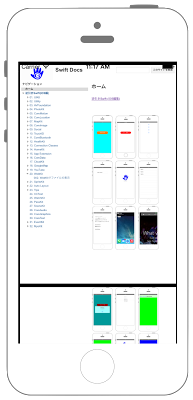

# UIWebViewでファイルの表示



```swift fct_label="Swift 4.x"
//
//  ViewController.swift
//  UIKit075
//
//  Created by Misato Morino on 2016/08/15.
//  Copyright © 2016年 Misato Morino. All rights reserved.
//

import UIKit

class ViewController: UIViewController {
    
    override func viewDidLoad() {
        super.viewDidLoad()
        
        // WebViewを生成.
        let myWebView = UIWebView()
        myWebView.frame = self.view.bounds
        
        // viewにWebViewを追加.
        self.view.addSubview(myWebView)
        
        // プロジェクトに管理されているファイルのpathを取得.
        let path: String = Bundle.main.path(forResource: "document", ofType: "pdf")!
        
        let url = NSURL(fileURLWithPath: path as String)
        let request = NSURLRequest(url: url as URL)
        
        // リクエストロード.
        myWebView.loadRequest(request as URLRequest)
    }
    
    override func didReceiveMemoryWarning() {
        super.didReceiveMemoryWarning()
    }
}
```

```swift fct_label="Swift 3.x"
//
//  ViewController.swift
//  UIKit075
//
//  Created by Misato Morino on 2016/08/15.
//  Copyright © 2016年 Misato Morino. All rights reserved.
//

import UIKit

class ViewController: UIViewController { 
    
    override func viewDidLoad() {
        super.viewDidLoad()
        
        // WebViewを生成.
        let myWebView = UIWebView()
        myWebView.frame = self.view.bounds
        
        // viewにWebViewを追加.
        self.view.addSubview(myWebView)
        
        // プロジェクトに管理されているファイルのpathを取得.
        let path: NSString = Bundle.main.path(forResource: "document", ofType: "pdf")!
        
        let url = NSURL(fileURLWithPath: path as String)
        let request = NSURLRequest(url: url as URL)
        
        // リクエストロード.
        myWebView.loadRequest(request as URLRequest)
    }
    
    override func didReceiveMemoryWarning() {
        super.didReceiveMemoryWarning()
    } 
} 
```

```swift fct_label="Swift 2.3"
//
//  ViewController.swift
//  UIKit075
//
//  Created by Misato Morino on 2016/08/15.
//  Copyright © 2016年 Misato Morino. All rights reserved.
//

import UIKit

class ViewController: UIViewController { 
    
    override func viewDidLoad() {
        super.viewDidLoad()
        
        // WebViewを生成.
        let myWebView = UIWebView()
        myWebView.frame = self.view.bounds
        
        // viewにWebViewを追加.
        self.view.addSubview(myWebView)
        
        // プロジェクトに管理されているファイルのpathを取得.
        let path: NSString = NSBundle.mainBundle().pathForResource("document", ofType: "pdf")!
        
        let url = NSURL(fileURLWithPath: path as String)
        let request = NSURLRequest(URL: url)
        
        // リクエストロード.
        myWebView.loadRequest(request)
    }
    
    override func didReceiveMemoryWarning() {
        super.didReceiveMemoryWarning()
    } 
}
```

## 3.xと4.xの差分
* ```let path: NSString``` を ```let path: String``` に変更

## 2.3と3.0の差分

* ``` NSBundle.mainBundle().pathForResource``` から ```Bundle.main.path``` に変更

## Reference

* UIWebView
    * [https://developer.apple.com/reference/uikit/uiwebview](https://developer.apple.com/reference/uikit/uiwebview)
* NSBundle
    * [https://developer.apple.com/reference/foundation/nsbundle](https://developer.apple.com/reference/foundation/nsbundle)
