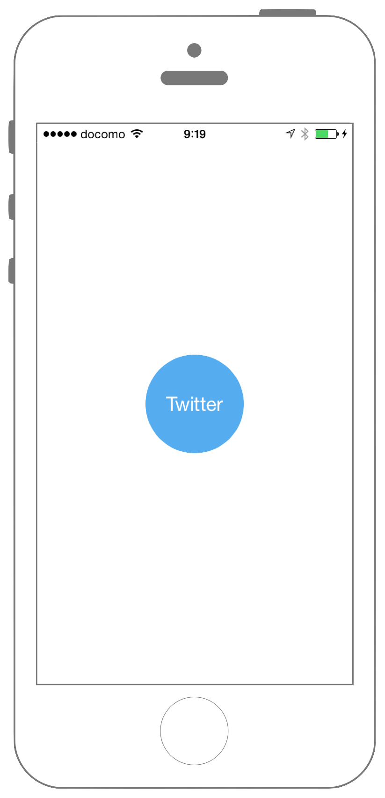
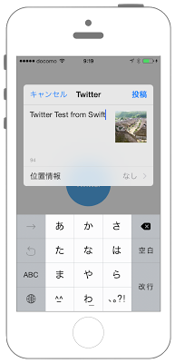

# Twitterに投稿

 

```swift fct_label="Swift 4.x"
//
//  ViewController.swift
//  Social001
//
//  Created by Misato Morino on 2016/08/15.
//  Copyright © 2016年 Misato Morino. All rights reserved.
//

import UIKit
import Social

class ViewController: UIViewController {
    
    var myComposeView : SLComposeViewController!
    var myTwitterButton: UIButton!
    
    override func viewDidLoad() {
        super.viewDidLoad()
        
        // Twitter用のUIButtonの生成.
        let hex: Int = 0x55ACEE
        let red = Double((hex & 0xFF0000) >> 16) / 255.0
        let green = Double((hex & 0xFF00) >> 8) / 255.0
        let blue = Double((hex & 0xFF)) / 255.0
        let myColor: UIColor = UIColor( red: CGFloat(red), green: CGFloat(green), blue: CGFloat(blue), alpha: CGFloat(1.0))
        
        // ボタン.
        myTwitterButton = UIButton()
        myTwitterButton.frame = CGRect(x: 0, y: 0, width: 100, height: 100)
        myTwitterButton.backgroundColor = myColor
        myTwitterButton.layer.masksToBounds = true
        myTwitterButton.setTitle("Twitter", for: UIControl.State.normal)
        myTwitterButton.titleLabel?.font = UIFont.systemFont(ofSize: CGFloat(20))
        myTwitterButton.setTitleColor(UIColor.white, for: UIControl.State.normal)
        myTwitterButton.layer.cornerRadius = 50.0
        myTwitterButton.layer.position = CGPoint(x: self.view.frame.width/2, y:self.view.frame.height/2)
        myTwitterButton.tag = 1
        myTwitterButton.addTarget(self, action: #selector(ViewController.onPostToTwitter(sender:)), for: .touchUpInside)
        
        // buttonをviewに追加.
        self.view.addSubview(myTwitterButton)
    }
    
    // ボタンイベント.
    @objc func onPostToTwitter(sender : AnyObject) {
        
        // SLComposeViewControllerのインスタンス化.
        // ServiceTypeをTwitterに指定.
        myComposeView = SLComposeViewController(forServiceType: SLServiceTypeTwitter)
        
        // 投稿するテキストを指定.
        myComposeView.setInitialText("Twitter Test from Swift")
        
        // 投稿する画像を指定.
        myComposeView.add(UIImage(named: "sample.jpg"))
        
        // myComposeViewの画面遷移.
        self.present(myComposeView, animated: true, completion: nil)
    }
}
```

```swift fct_label="Swift 3.x"
//
//  ViewController.swift
//  Social001
//
//  Created by Misato Morino on 2016/08/15.
//  Copyright © 2016年 Misato Morino. All rights reserved.
//

import UIKit
import Social

class ViewController: UIViewController {
    
    var myComposeView : SLComposeViewController!
    var myTwitterButton: UIButton!
    
    override func viewDidLoad() {
        super.viewDidLoad()
        
        // Twitter用のUIButtonの生成.
        let hex: Int = 0x55ACEE
        let red = Double((hex & 0xFF0000) >> 16) / 255.0
        let green = Double((hex & 0xFF00) >> 8) / 255.0
        let blue = Double((hex & 0xFF)) / 255.0
        let myColor: UIColor = UIColor( red: CGFloat(red), green: CGFloat(green), blue: CGFloat(blue), alpha: CGFloat(1.0))
        
        // ボタン.
        myTwitterButton = UIButton()
        myTwitterButton.frame = CGRect(x: 0, y: 0, width: 100, height: 100)
        myTwitterButton.backgroundColor = myColor
        myTwitterButton.layer.masksToBounds = true
        myTwitterButton.setTitle("Twitter", for: UIControlState.normal)
        myTwitterButton.titleLabel?.font = UIFont.systemFont(ofSize: CGFloat(20))
        myTwitterButton.setTitleColor(UIColor.white, for: UIControlState.normal)
        myTwitterButton.layer.cornerRadius = 50.0
        myTwitterButton.layer.position = CGPoint(x: self.view.frame.width/2, y:self.view.frame.height/2)
        myTwitterButton.tag = 1
        myTwitterButton.addTarget(self, action: #selector(ViewController.onPostToTwitter(sender:)), for: .touchUpInside)
        
        // buttonをviewに追加.
        self.view.addSubview(myTwitterButton)
    }
    
    // ボタンイベント.
    func onPostToTwitter(sender : AnyObject) {
        
        // SLComposeViewControllerのインスタンス化.
        // ServiceTypeをTwitterに指定.
        myComposeView = SLComposeViewController(forServiceType: SLServiceTypeTwitter)
        
        // 投稿するテキストを指定.
        myComposeView.setInitialText("Twitter Test from Swift")
        
        // 投稿する画像を指定.
        myComposeView.add(UIImage(named: "sample.jpg"))
        
        // myComposeViewの画面遷移.
        self.present(myComposeView, animated: true, completion: nil)
    } 
}
```

```swift fct_label="Swift 2.3"
//
//  ViewController.swift
//  Social001
//
//  Created by Misato Morino on 2016/08/15.
//  Copyright © 2016年 Misato Morino. All rights reserved.
//

import UIKit
import Social

class ViewController: UIViewController {
    
    var myComposeView : SLComposeViewController!
    var myTwitterButton: UIButton!
    
    override func viewDidLoad() {
        super.viewDidLoad()
        
        // Twitter用のUIButtonの生成.
        let hex: Int = 0x55ACEE
        let red = Double((hex & 0xFF0000) >> 16) / 255.0
        let green = Double((hex & 0xFF00) >> 8) / 255.0
        let blue = Double((hex & 0xFF)) / 255.0
        let myColor: UIColor = UIColor( red: CGFloat(red), green: CGFloat(green), blue: CGFloat(blue), alpha: CGFloat(1.0))
        
        // ボタン.
        myTwitterButton = UIButton()
        myTwitterButton.frame = CGRectMake(0,0,100,100)
        myTwitterButton.backgroundColor = myColor
        myTwitterButton.layer.masksToBounds = true
        myTwitterButton.setTitle("Twitter", forState: UIControlState.Normal)
        myTwitterButton.titleLabel?.font = UIFont.systemFontOfSize(CGFloat(20))
        myTwitterButton.setTitleColor(UIColor.whiteColor(), forState: UIControlState.Normal)
        myTwitterButton.layer.cornerRadius = 50.0
        myTwitterButton.layer.position = CGPoint(x: self.view.frame.width/2, y:self.view.frame.height/2)
        myTwitterButton.tag = 1
        myTwitterButton.addTarget(self, action: #selector(ViewController.onPostToTwitter(_:)), forControlEvents: .TouchUpInside)
        
        // buttonをviewに追加.
        self.view.addSubview(myTwitterButton)
    }
    
    // ボタンイベント.
    func onPostToTwitter(sender : AnyObject) {
        
        // SLComposeViewControllerのインスタンス化.
        // ServiceTypeをTwitterに指定.
        myComposeView = SLComposeViewController(forServiceType: SLServiceTypeTwitter)
        
        // 投稿するテキストを指定.
        myComposeView.setInitialText("Twitter Test from Swift")
        
        // 投稿する画像を指定.
        myComposeView.addImage(UIImage(named: "sample.jpg"))
        
        // myComposeViewの画面遷移.
        self.presentViewController(myComposeView, animated: true, completion: nil)
    } 
} 
```

## 3.xと4.xの差分
* ```UIControlState``` が ```UIControl.State``` に変更
* ```func onPostToTwitter(sender : AnyObject)``` に ```@objc``` を追加
* ```social.framework``` が、iOS 11.0から使用不可
* ```SLServiceTypeTwitter``` が、iOS 11.0から非推奨

## 2.3と3.0の差分
    
* ```addImage``` から ```add``` へ変更


## Reference

* SLComposeViewController
    * [https://developer.apple.com/reference/social/slcomposeviewcontroller](https://developer.apple.com/reference/social/slcomposeviewcontroller)
