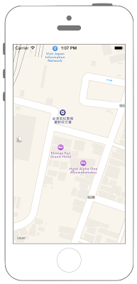

# 現在位置の地図の表示



```swift fct_label="Swift 5.x/4.x"

//
//  ViewController.swift
//  MapKit003
//
//  Created by Misato Morino on 2016/08/15.
//  Copyright © 2016年 Misato Morino. All rights reserved.
//

import UIKit
import MapKit
import CoreLocation

class ViewController: UIViewController, MKMapViewDelegate, CLLocationManagerDelegate {
    
    var myMapView: MKMapView!
    var myLocationManager: CLLocationManager!
    
    override func viewDidLoad() {
        super.viewDidLoad()
        
        // LocationManagerの生成.
        myLocationManager = CLLocationManager()
        
        // Delegateの設定.
        myLocationManager.delegate = self
        
        // 距離のフィルタ.
        myLocationManager.distanceFilter = 100.0
        
        // 精度.
        myLocationManager.desiredAccuracy = kCLLocationAccuracyHundredMeters
        
        // セキュリティ認証のステータスを取得.
        let status = CLLocationManager.authorizationStatus()
        
        // まだ認証が得られていない場合は、認証ダイアログを表示.
        if(status != CLAuthorizationStatus.authorizedWhenInUse) {
            
            print("not determined")
            // まだ承認が得られていない場合は、認証ダイアログを表示.
            myLocationManager.requestWhenInUseAuthorization()
        }
        
        // 位置情報の更新を開始.
        myLocationManager.startUpdatingLocation()
        
        // MapViewの生成.
        myMapView = MKMapView()
        
        // MapViewのサイズを画面全体に.
        myMapView.frame = self.view.bounds
        
        // Delegateを設定.
        myMapView.delegate = self
        
        // MapViewをViewに追加.
        self.view.addSubview(myMapView)
        
        // 中心点の緯度経度.
        let myLat: CLLocationDegrees = 37.506804
        let myLon: CLLocationDegrees = 139.930531
        let myCoordinate: CLLocationCoordinate2D = CLLocationCoordinate2DMake(myLat, myLon) as CLLocationCoordinate2D
        
        // 縮尺.
        let myLatDist : CLLocationDistance = 100
        let myLonDist : CLLocationDistance = 100
        
        // Regionを作成.
        let myRegion: MKCoordinateRegion = MKCoordinateRegion(center: myCoordinate, latitudinalMeters: myLatDist, longitudinalMeters: myLonDist);
        
        // MapViewに反映.
        myMapView.setRegion(myRegion, animated: true)
        
    }
    
    // GPSから値を取得した際に呼び出されるメソッド.
    func locationManager(_ manager: CLLocationManager, didUpdateLocations locations: [CLLocation]) {
        
        print("didUpdateLocations")
        
        // 配列から現在座標を取得.
        let myLocations: NSArray = locations as NSArray
        let myLastLocation: CLLocation = myLocations.lastObject as! CLLocation
        let myLocation:CLLocationCoordinate2D = myLastLocation.coordinate
        
        print("\(myLocation.latitude), \(myLocation.longitude)")
        
        // 縮尺.
        let myLatDist : CLLocationDistance = 100
        let myLonDist : CLLocationDistance = 100
        
        // Regionを作成.
        let myRegion: MKCoordinateRegion = MKCoordinateRegion(center: myLocation, latitudinalMeters: myLatDist, longitudinalMeters: myLonDist);
        
        // MapViewに反映.
        myMapView.setRegion(myRegion, animated: true)
    }
    
    // Regionが変更した時に呼び出されるメソッド.
    func mapView(_ mapView: MKMapView, regionDidChangeAnimated animated: Bool) {
        print("regionDidChangeAnimated")
    }
    
    // 認証が変更された時に呼び出されるメソッド.
    private func locationManager(manager: CLLocationManager, didChangeAuthorizationStatus status: CLAuthorizationStatus) {
        switch status{
        case .authorizedWhenInUse:
            print("AuthorizedWhenInUse")
        case .authorizedAlways:
            print("AuthorizedAlways")
        case .denied:
            print("Denied")
        case .restricted:
            print("Restricted")
        case .notDetermined:
            print("NotDetermined")
        }
    }
}
```

```swift fct_label="Swift 3.x"
//
//  ViewController.swift
//  MapKit003
//
//  Created by Misato Morino on 2016/08/15.
//  Copyright © 2016年 Misato Morino. All rights reserved.
//

import UIKit
import MapKit
import CoreLocation

class ViewController: UIViewController, MKMapViewDelegate, CLLocationManagerDelegate {
    
    var myMapView: MKMapView!
    var myLocationManager: CLLocationManager!
    
    override func viewDidLoad() {
        super.viewDidLoad()
        
        // LocationManagerの生成.
        myLocationManager = CLLocationManager()
        
        // Delegateの設定.
        myLocationManager.delegate = self
        
        // 距離のフィルタ.
        myLocationManager.distanceFilter = 100.0
        
        // 精度.
        myLocationManager.desiredAccuracy = kCLLocationAccuracyHundredMeters
        
        // セキュリティ認証のステータスを取得.
        let status = CLLocationManager.authorizationStatus()
        
        // まだ認証が得られていない場合は、認証ダイアログを表示.
        if(status != CLAuthorizationStatus.authorizedWhenInUse) {
            
            print("not determined")
            // まだ承認が得られていない場合は、認証ダイアログを表示.
            myLocationManager.requestWhenInUseAuthorization()
        }
        
        // 位置情報の更新を開始.
        myLocationManager.startUpdatingLocation()
        
        // MapViewの生成.
        myMapView = MKMapView()
        
        // MapViewのサイズを画面全体に.
        myMapView.frame = self.view.bounds
        
        // Delegateを設定.
        myMapView.delegate = self
        
        // MapViewをViewに追加.
        self.view.addSubview(myMapView)
        
        // 中心点の緯度経度.
        let myLat: CLLocationDegrees = 37.506804
        let myLon: CLLocationDegrees = 139.930531
        let myCoordinate: CLLocationCoordinate2D = CLLocationCoordinate2DMake(myLat, myLon) as CLLocationCoordinate2D
        
        // 縮尺.
        let myLatDist : CLLocationDistance = 100
        let myLonDist : CLLocationDistance = 100
        
        // Regionを作成.
        let myRegion: MKCoordinateRegion = MKCoordinateRegionMakeWithDistance(myCoordinate, myLatDist, myLonDist);
        
        // MapViewに反映.
        myMapView.setRegion(myRegion, animated: true)
        
    }
    
    // GPSから値を取得した際に呼び出されるメソッド.
    func locationManager(_ manager: CLLocationManager, didUpdateLocations locations: [CLLocation]) {
        
        print("didUpdateLocations")
        
        // 配列から現在座標を取得.
        let myLocations: NSArray = locations as NSArray
        let myLastLocation: CLLocation = myLocations.lastObject as! CLLocation
        let myLocation:CLLocationCoordinate2D = myLastLocation.coordinate
        
        print("\(myLocation.latitude), \(myLocation.longitude)")
        
        // 縮尺.
        let myLatDist : CLLocationDistance = 100
        let myLonDist : CLLocationDistance = 100
        
        // Regionを作成.
        let myRegion: MKCoordinateRegion = MKCoordinateRegionMakeWithDistance(myLocation, myLatDist, myLonDist);
        
        // MapViewに反映.
        myMapView.setRegion(myRegion, animated: true)
    }
    
    // Regionが変更した時に呼び出されるメソッド.
    func mapView(_ mapView: MKMapView, regionDidChangeAnimated animated: Bool) {
        print("regionDidChangeAnimated")
    }
    
    // 認証が変更された時に呼び出されるメソッド.
    private func locationManager(manager: CLLocationManager, didChangeAuthorizationStatus status: CLAuthorizationStatus) {
        switch status{
        case .authorizedWhenInUse:
            print("AuthorizedWhenInUse")
        case .authorized:
            print("Authorized")
        case .denied:
            print("Denied")
        case .restricted:
            print("Restricted")
        case .notDetermined:
            print("NotDetermined")
        }
    } 
}
```

```swift fct_label="Swift 2.3"
//
//  ViewController.swift
//  MapKit003
//
//  Created by Misato Morino on 2016/08/15.
//  Copyright © 2016年 Misato Morino. All rights reserved.
//

import UIKit
import MapKit
import CoreLocation

class ViewController: UIViewController, MKMapViewDelegate, CLLocationManagerDelegate {
    
    var myMapView: MKMapView!
    var myLocationManager: CLLocationManager!
    
    override func viewDidLoad() {
        super.viewDidLoad()
        
        // LocationManagerの生成.
        myLocationManager = CLLocationManager()
        
        // Delegateの設定.
        myLocationManager.delegate = self
        
        // 距離のフィルタ.
        myLocationManager.distanceFilter = 100.0
        
        // 精度.
        myLocationManager.desiredAccuracy = kCLLocationAccuracyHundredMeters
        
        // セキュリティ認証のステータスを取得.
        let status = CLLocationManager.authorizationStatus()
        
        // まだ認証が得られていない場合は、認証ダイアログを表示.
        if(status != CLAuthorizationStatus.AuthorizedWhenInUse) {
            
            print("not determined")
            // まだ承認が得られていない場合は、認証ダイアログを表示.
            myLocationManager.requestWhenInUseAuthorization()
        }
        
        // 位置情報の更新を開始.
        myLocationManager.startUpdatingLocation()
        
        // MapViewの生成.
        myMapView = MKMapView()
        
        // MapViewのサイズを画面全体に.
        myMapView.frame = self.view.bounds
        
        // Delegateを設定.
        myMapView.delegate = self
        
        // MapViewをViewに追加.
        self.view.addSubview(myMapView)
        
        // 中心点の緯度経度.
        let myLat: CLLocationDegrees = 37.506804
        let myLon: CLLocationDegrees = 139.930531
        let myCoordinate: CLLocationCoordinate2D = CLLocationCoordinate2DMake(myLat, myLon) as CLLocationCoordinate2D
        
        // 縮尺.
        let myLatDist : CLLocationDistance = 100
        let myLonDist : CLLocationDistance = 100
        
        // Regionを作成.
        let myRegion: MKCoordinateRegion = MKCoordinateRegionMakeWithDistance(myCoordinate, myLatDist, myLonDist);
        
        // MapViewに反映.
        myMapView.setRegion(myRegion, animated: true)
        
    }
    
    // GPSから値を取得した際に呼び出されるメソッド.
    func locationManager(manager: CLLocationManager, didUpdateLocations locations: [CLLocation]) {
        
        print("didUpdateLocations")
        
        // 配列から現在座標を取得.
        let myLocations: NSArray = locations as NSArray
        let myLastLocation: CLLocation = myLocations.lastObject as! CLLocation
        let myLocation:CLLocationCoordinate2D = myLastLocation.coordinate
        
        print("\(myLocation.latitude), \(myLocation.longitude)")
        
        // 縮尺.
        let myLatDist : CLLocationDistance = 100
        let myLonDist : CLLocationDistance = 100
        
        // Regionを作成.
        let myRegion: MKCoordinateRegion = MKCoordinateRegionMakeWithDistance(myLocation, myLatDist, myLonDist);
        
        // MapViewに反映.
        myMapView.setRegion(myRegion, animated: true)
    }
    
    // Regionが変更した時に呼び出されるメソッド.
    func mapView(mapView: MKMapView, regionDidChangeAnimated animated: Bool) {
        print("regionDidChangeAnimated")
    }
    
    // 認証が変更された時に呼び出されるメソッド.
    func locationManager(manager: CLLocationManager, didChangeAuthorizationStatus status: CLAuthorizationStatus) {
        switch status{
        case .AuthorizedWhenInUse:
            print("AuthorizedWhenInUse")
        case .Authorized:
            print("Authorized")
        case .Denied:
            print("Denied")
        case .Restricted:
            print("Restricted")
        case .NotDetermined:
            print("NotDetermined")
        }
    } 
}
```

### Info.plist
```xml
<key>NSLocationWhenInUseUsageDescription</key>
<string>Use Location</string>
```
上記の内容をinfo.plistに追加

## 3.xと4.xの差分
* ```MKCoordinateRegionMakeWithDistance(myCoordinate, myLatDist, myLonDist)``` が ```MKCoordinateRegion(center: myLocation, latitudinalMeters: myLatDist, longitudinalMeters: myLonDist)``` に変更
* switch文の ```Authorized``` を ```authorizedAlways``` に変更

## 2.3と3.0の差分

* ```func mapView(mapView: MKMapView, regionDidChangeAnimated animated: Bool)``` から ```func mapView(_ mapView: MKMapView, regionDidChangeAnimated animated: Bool)``` に変更
* ```func locationManager(manager: CLLocationManager, didUpdateLocations locations: [CLLocation])``` から ```func locationManager(_ manager: CLLocationManager, didUpdateLocations locations: [CLLocation]) ``` に変更

## Reference
* CLLocationManager
    * [https://developer.apple.com/reference/corelocation/cllocationmanager](https://developer.apple.com/reference/corelocation/cllocationmanager)
