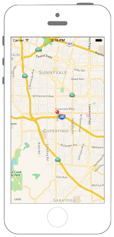

# 指定した座標にピンを立てる



```swift fct_label="Swift 5.x/4.x"
//
//  ViewController.swift
//  MapKit004
//
//  Created by Misato Morino on 2016/08/15.
//  Copyright © 2016年 Misato Morino. All rights reserved.
//

import UIKit
import MapKit

class ViewController: UIViewController {
    
    override func viewDidLoad() {
        super.viewDidLoad()
        
        // MapViewを生成.
        let myMapView: MKMapView = MKMapView()
        myMapView.frame = self.view.frame
        
        // 経度、緯度.
        let myLatitude: CLLocationDegrees = 37.331741
        let myLongitude: CLLocationDegrees = -122.030333
        
        // 中心点.
        let center: CLLocationCoordinate2D = CLLocationCoordinate2DMake(myLatitude, myLongitude)
        
        // MapViewに中心点を設定.
        myMapView.setCenter(center, animated: true)
        
        // 縮尺.
        // 表示領域.
        let mySpan: MKCoordinateSpan = MKCoordinateSpan(latitudeDelta: 0.1, longitudeDelta: 0.1)
        let myRegion: MKCoordinateRegion = MKCoordinateRegion(center: center, span: mySpan)
        
        // MapViewにregionを追加.
        myMapView.region = myRegion
        
        // viewにMapViewを追加.
        self.view.addSubview(myMapView)
        
        // ピンを生成.
        let myPin: MKPointAnnotation = MKPointAnnotation()
        
        // 座標を設定.
        myPin.coordinate = center
        
        // タイトルを設定.
        myPin.title = "タイトル"
        
        // サブタイトルを設定.
        myPin.subtitle = "サブタイトル"
        
        // MapViewにピンを追加.
        myMapView.addAnnotation(myPin)
    }
}
```

```swift fct_label="Swift 3.x"
//
//  ViewController.swift
//  MapKit004
//
//  Created by Misato Morino on 2016/08/15.
//  Copyright © 2016年 Misato Morino. All rights reserved.
//

import UIKit
import MapKit

class ViewController: UIViewController {
    
    override func viewDidLoad() {
        super.viewDidLoad()
        
        // MapViewを生成.
        let myMapView: MKMapView = MKMapView()
        myMapView.frame = self.view.frame
        
        // 経度、緯度.
        let myLatitude: CLLocationDegrees = 37.331741
        let myLongitude: CLLocationDegrees = -122.030333
        
        // 中心点.
        let center: CLLocationCoordinate2D = CLLocationCoordinate2DMake(myLatitude, myLongitude)
        
        // MapViewに中心点を設定.
        myMapView.setCenter(center, animated: true)
        
        // 縮尺.
        // 表示領域.
        let mySpan: MKCoordinateSpan = MKCoordinateSpan(latitudeDelta: 0.1, longitudeDelta: 0.1)
        let myRegion: MKCoordinateRegion = MKCoordinateRegionMake(center, mySpan)
        
        // MapViewにregionを追加.
        myMapView.region = myRegion
        
        // viewにMapViewを追加.
        self.view.addSubview(myMapView)
        
        // ピンを生成.
        let myPin: MKPointAnnotation = MKPointAnnotation()
        
        // 座標を設定.
        myPin.coordinate = center
        
        // タイトルを設定.
        myPin.title = "タイトル"
        
        // サブタイトルを設定.
        myPin.subtitle = "サブタイトル"
        
        // MapViewにピンを追加.
        myMapView.addAnnotation(myPin)
    } 
}
```

```swift fct_label="Swift 2.3"
//
//  ViewController.swift
//  MapKit004
//
//  Created by Misato Morino on 2016/08/15.
//  Copyright © 2016年 Misato Morino. All rights reserved.
//

import UIKit
import MapKit

class ViewController: UIViewController {
    
    override func viewDidLoad() {
        super.viewDidLoad()
        
        // MapViewを生成.
        let myMapView: MKMapView = MKMapView()
        myMapView.frame = self.view.frame
        
        // 経度、緯度.
        let myLatitude: CLLocationDegrees = 37.331741
        let myLongitude: CLLocationDegrees = -122.030333
        
        // 中心点.
        let center: CLLocationCoordinate2D = CLLocationCoordinate2DMake(myLatitude, myLongitude)
        
        // MapViewに中心点を設定.
        myMapView.setCenterCoordinate(center, animated: true)
        
        // 縮尺.
        // 表示領域.
        let mySpan: MKCoordinateSpan = MKCoordinateSpan(latitudeDelta: 0.1, longitudeDelta: 0.1)
        let myRegion: MKCoordinateRegion = MKCoordinateRegionMake(center, mySpan)
        
        // MapViewにregionを追加.
        myMapView.region = myRegion
        
        // viewにMapViewを追加.
        self.view.addSubview(myMapView)
        
        // ピンを生成.
        let myPin: MKPointAnnotation = MKPointAnnotation()
        
        // 座標を設定.
        myPin.coordinate = center
        
        // タイトルを設定.
        myPin.title = "タイトル"
        
        // サブタイトルを設定.
        myPin.subtitle = "サブタイトル"
        
        // MapViewにピンを追加.
        myMapView.addAnnotation(myPin)
    } 
}
```

## 3.xと4.xの差分
* ```MKCoordinateRegionMake(center, mySpan)``` が ```MKCoordinateRegion(center: center, span: mySpan)``` に変更

## 2.3と3.0の差分

* ```setCenterCoordinate``` から ```setCenter``` に変更

## Reference
* MKPointAnnotation
    * [https://developer.apple.com/reference/mapkit/mkpointannotation](https://developer.apple.com/reference/mapkit/mkpointannotation)
