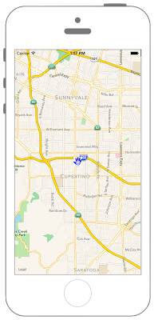

# アノテーションを任意の画像にする



```swift fct_label="Swift 4.x/Swift 3.x"
//
//  ViewController.swift
//  MapKit008
//
//  Created by Misato Morino on 2016/08/15.
//  Copyright © 2016年 Misato Morino. All rights reserved.
//

import UIKit
import MapKit

class ViewController: UIViewController, MKMapViewDelegate {
    
    // 経度緯度.
    let myLan: CLLocationDegrees = 37.331741
    let myLon: CLLocationDegrees = -122.030333
    var myCenter: CLLocationCoordinate2D!
    var myMapView: MKMapView!
    
    override func viewDidLoad() {
        super.viewDidLoad()
        
        // 地図の中心の座標.
        myCenter = CLLocationCoordinate2DMake(myLan, myLon)
        
        // MapViewを生成.
        myMapView = MKMapView(frame: self.view.frame)
        myMapView.center = self.view.center
        myMapView.centerCoordinate = myCenter
        myMapView.delegate = self
        
        // 縮尺を指定.
        let mySpan: MKCoordinateSpan = MKCoordinateSpan(latitudeDelta: 0.1, longitudeDelta: 0.1)
        let myRegion: MKCoordinateRegion = MKCoordinateRegion(center: myCenter, span: mySpan)
        
        // regionをMapViewに追加.
        myMapView.region = myRegion
        
        // PointAnnotationを生成.
        let myPointAnnotation: MKPointAnnotation = MKPointAnnotation()
        myPointAnnotation.coordinate = myCenter
        myMapView.addAnnotation(myPointAnnotation)
        
        // viewにMapViewを追加.
        self.view.addSubview(myMapView)
    }
    
    /*
     addAnnotation後に実行される.
     */
    func mapView(_ mapView: MKMapView, viewFor annotation: MKAnnotation) -> MKAnnotationView? {
        
        let myIdentifier = "myPin"
        
        var myAnnotation: MKAnnotationView!
        
        // annotationが見つからなかったら新しくannotationを生成.
        if myAnnotation == nil {
            myAnnotation = MKAnnotationView(annotation: annotation, reuseIdentifier: myIdentifier)
        }
        
        // 画像を選択.
        myAnnotation.image = UIImage(named: "annotation")!
        myAnnotation.annotation = annotation
        
        return myAnnotation
    }
    
    override func didReceiveMemoryWarning() {
        super.didReceiveMemoryWarning()
    }
}
```

```swift fct_label="Swift 2.3"
//
//  ViewController.swift
//  MapKit008
//
//  Created by Misato Morino on 2016/08/15.
//  Copyright © 2016年 Misato Morino. All rights reserved.
//

import UIKit
import MapKit

class ViewController: UIViewController, MKMapViewDelegate {
    
    // 経度緯度.
    let myLan: CLLocationDegrees = 37.331741
    let myLon: CLLocationDegrees = -122.030333
    var myCenter: CLLocationCoordinate2D!
    var myMapView: MKMapView!
    
    override func viewDidLoad() {
        super.viewDidLoad()
        
        // 地図の中心の座標.
        myCenter = CLLocationCoordinate2DMake(myLan, myLon)
        
        // MapViewを生成.
        myMapView = MKMapView(frame: self.view.frame)
        myMapView.center = self.view.center
        myMapView.centerCoordinate = myCenter
        myMapView.delegate = self
        
        // 縮尺を指定.
        let mySpan: MKCoordinateSpan = MKCoordinateSpan(latitudeDelta: 0.1, longitudeDelta: 0.1)
        let myRegion: MKCoordinateRegion = MKCoordinateRegion(center: myCenter, span: mySpan)
        
        // regionをMapViewに追加.
        myMapView.region = myRegion
        
        // PointAnnotationを生成.
        let myPointAnnotation: MKPointAnnotation = MKPointAnnotation()
        myPointAnnotation.coordinate = myCenter
        myMapView.addAnnotation(myPointAnnotation)
        
        // viewにMapViewを追加.
        self.view.addSubview(myMapView)
    }
    
    /*
     addAnnotation後に実行される.
     */
    func mapView(mapView: MKMapView, viewForAnnotation annotation: MKAnnotation) -> MKAnnotationView? {
        
        let myIdentifier = "myPin"
        
        var myAnnotation: MKAnnotationView!
        
        // annotationが見つからなかったら新しくannotationを生成.
        if myAnnotation == nil {
            myAnnotation = MKAnnotationView(annotation: annotation, reuseIdentifier: myIdentifier)
        }
        
        // 画像を選択.
        myAnnotation.image = UIImage(named: "annotation")!
        myAnnotation.annotation = annotation
        
        return myAnnotation
    }
    
    override func didReceiveMemoryWarning() {
        super.didReceiveMemoryWarning()
    }
}
```

## 2.3と3.0の差分

* ```func mapView(mapView: MKMapView, viewForAnnotation annotation: MKAnnotation) -> MKAnnotationView?``` から ```func mapView(_ mapView: MKMapView, viewFor annotation: MKAnnotation) -> MKAnnotationView?``` に変更

## Reference
* MKPinAnnotationView
    * [https://developer.apple.com/reference/mapkit/mkpinannotationview](https://developer.apple.com/reference/mapkit/mkpinannotationview)
* MKMapView
    * [https://developer.apple.com/reference/mapkit/mkpinannotationview](https://developer.apple.com/reference/mapkit/mkmapview)
