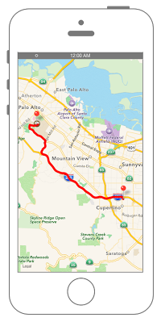

# ルート検索をする



```swift fct_label="Swift 4.x"
//
//  ViewController.swift
//  MapKit009
//
//  Created by Misato Morino on 2016/08/15.
//  Copyright © 2016年 Misato Morino. All rights reserved.
//

import UIKit
import MapKit

class ViewController: UIViewController, MKMapViewDelegate {
    
    override func viewDidLoad() {
        super.viewDidLoad()
        
        // mapViewを生成.
        let myMapView: MKMapView = MKMapView(frame: self.view.frame)
        
        // Delegateを設定.
        myMapView.delegate = self
        
        // 出発点の緯度、経度を設定.
        let myLatitude: CLLocationDegrees = 37.331741
        let myLongitude: CLLocationDegrees = -122.030333
        
        // 目的地の緯度、経度を設定.
        let requestLatitude: CLLocationDegrees = 37.427474
        let requestLongitude: CLLocationDegrees = -122.169719
        
        // 目的地の座標を指定.
        let requestCoordinate: CLLocationCoordinate2D = CLLocationCoordinate2DMake(requestLatitude, requestLongitude)
        let fromCoordinate: CLLocationCoordinate2D = CLLocationCoordinate2DMake(myLatitude, myLongitude)
        
        // 地図の中心を出発点と目的地の中間に設定する.
        let center: CLLocationCoordinate2D = CLLocationCoordinate2DMake((myLatitude + requestLatitude)/2, (myLongitude + requestLongitude)/2)
        
        // mapViewに中心をセットする.
        myMapView.setCenter(center, animated: true)
        
        // 縮尺を指定.
        let mySpan: MKCoordinateSpan = MKCoordinateSpan(latitudeDelta: 0.2, longitudeDelta: 0.2)
        let myRegion: MKCoordinateRegion = MKCoordinateRegion(center: center, span: mySpan)
        
        // regionをmapViewにセット.
        myMapView.region = myRegion
        
        // viewにmapViewを追加.
        self.view.addSubview(myMapView)
        
        // PlaceMarkを生成して出発点、目的地の座標をセット.
        let fromPlace: MKPlacemark = MKPlacemark(coordinate: fromCoordinate, addressDictionary: nil)
        let toPlace: MKPlacemark = MKPlacemark(coordinate: requestCoordinate, addressDictionary: nil)
        
        
        // Itemを生成してPlaceMarkをセット.
        let fromItem: MKMapItem = MKMapItem(placemark: fromPlace)
        let toItem: MKMapItem = MKMapItem(placemark: toPlace)
        
        // MKDirectionsRequestを生成.
        let myRequest: MKDirections.Request = MKDirections.Request()
        
        // 出発地のItemをセット.
        myRequest.source = fromItem
        
        // 目的地のItemをセット.
        myRequest.destination = toItem
        
        // 複数経路の検索を有効.
        myRequest.requestsAlternateRoutes = true
        
        // 移動手段を車に設定.
        myRequest.transportType = MKDirectionsTransportType.automobile
        
        // MKDirectionsを生成してRequestをセット.
        let myDirections: MKDirections = MKDirections(request: myRequest)
        
        // 経路探索.
        myDirections.calculate { (response, error) in
            
            // NSErrorを受け取ったか、ルートがない場合.
            if error != nil || response!.routes.isEmpty {
                return
            }
            
            let route: MKRoute = response!.routes[0] as MKRoute
            print("目的地まで \(route.distance)km")
            print("所要時間 \(Int(route.expectedTravelTime/60))分")
            
            // mapViewにルートを描画.
            myMapView.addOverlay(route.polyline)
        }
        
        // ピンを生成.
        let fromPin: MKPointAnnotation = MKPointAnnotation()
        let toPin: MKPointAnnotation = MKPointAnnotation()
        
        // 座標をセット.
        fromPin.coordinate = fromCoordinate
        toPin.coordinate = requestCoordinate
        
        // titleをセット.
        fromPin.title = "出発地点"
        toPin.title = "目的地"
        
        // mapViewに追加.
        myMapView.addAnnotation(fromPin)
        myMapView.addAnnotation(toPin)
    }
    
    // ルートの表示設定.
    func mapView(_ mapView: MKMapView, rendererFor overlay: MKOverlay) -> MKOverlayRenderer {
        
        let route: MKPolyline = overlay as! MKPolyline
        let routeRenderer: MKPolylineRenderer = MKPolylineRenderer(polyline: route)
        
        // ルートの線の太さ.
        routeRenderer.lineWidth = 3.0
        
        // ルートの線の色.
        routeRenderer.strokeColor = UIColor.red
        return routeRenderer
    }
    
    override func didReceiveMemoryWarning() {
        super.didReceiveMemoryWarning()
    }
}
```

```swift fct_label="Swift 3.x"
//
//  ViewController.swift
//  MapKit009
//
//  Created by Misato Morino on 2016/08/15.
//  Copyright © 2016年 Misato Morino. All rights reserved.
//

import UIKit
import MapKit

class ViewController: UIViewController, MKMapViewDelegate {
    
    override func viewDidLoad() {
        super.viewDidLoad()
        
        // mapViewを生成.
        let myMapView: MKMapView = MKMapView(frame: self.view.frame)
        
        // Delegateを設定.
        myMapView.delegate = self
        
        // 出発点の緯度、経度を設定.
        let myLatitude: CLLocationDegrees = 37.331741
        let myLongitude: CLLocationDegrees = -122.030333
        
        // 目的地の緯度、経度を設定.
        let requestLatitude: CLLocationDegrees = 37.427474
        let requestLongitude: CLLocationDegrees = -122.169719
        
        // 目的地の座標を指定.
        let requestCoordinate: CLLocationCoordinate2D = CLLocationCoordinate2DMake(requestLatitude, requestLongitude)
        let fromCoordinate: CLLocationCoordinate2D = CLLocationCoordinate2DMake(myLatitude, myLongitude)
        
        // 地図の中心を出発点と目的地の中間に設定する.
        let center: CLLocationCoordinate2D = CLLocationCoordinate2DMake((myLatitude + requestLatitude)/2, (myLongitude + requestLongitude)/2)
        
        // mapViewに中心をセットする.
        myMapView.setCenter(center, animated: true)
        
        // 縮尺を指定.
        let mySpan: MKCoordinateSpan = MKCoordinateSpan(latitudeDelta: 0.2, longitudeDelta: 0.2)
        let myRegion: MKCoordinateRegion = MKCoordinateRegion(center: center, span: mySpan)
        
        // regionをmapViewにセット.
        myMapView.region = myRegion
        
        // viewにmapViewを追加.
        self.view.addSubview(myMapView)
        
        // PlaceMarkを生成して出発点、目的地の座標をセット.
        let fromPlace: MKPlacemark = MKPlacemark(coordinate: fromCoordinate, addressDictionary: nil)
        let toPlace: MKPlacemark = MKPlacemark(coordinate: requestCoordinate, addressDictionary: nil)
        
        
        // Itemを生成してPlaceMarkをセット.
        let fromItem: MKMapItem = MKMapItem(placemark: fromPlace)
        let toItem: MKMapItem = MKMapItem(placemark: toPlace)
        
        // MKDirectionsRequestを生成.
        let myRequest: MKDirectionsRequest = MKDirectionsRequest()
        
        // 出発地のItemをセット.
        myRequest.source = fromItem
        
        // 目的地のItemをセット.
        myRequest.destination = toItem
        
        // 複数経路の検索を有効.
        myRequest.requestsAlternateRoutes = true
        
        // 移動手段を車に設定.
        myRequest.transportType = MKDirectionsTransportType.automobile
        
        // MKDirectionsを生成してRequestをセット.
        let myDirections: MKDirections = MKDirections(request: myRequest)
        
        // 経路探索.
        myDirections.calculate { (response, error) in
            
            // NSErrorを受け取ったか、ルートがない場合.
            if error != nil || response!.routes.isEmpty {
                return
            }
            
            let route: MKRoute = response!.routes[0] as MKRoute
            print("目的地まで \(route.distance)km")
            print("所要時間 \(Int(route.expectedTravelTime/60))分")
            
            // mapViewにルートを描画.
            myMapView.add(route.polyline)
        }
        
        // ピンを生成.
        let fromPin: MKPointAnnotation = MKPointAnnotation()
        let toPin: MKPointAnnotation = MKPointAnnotation()
        
        // 座標をセット.
        fromPin.coordinate = fromCoordinate
        toPin.coordinate = requestCoordinate
        
        // titleをセット.
        fromPin.title = "出発地点"
        toPin.title = "目的地"
        
        // mapViewに追加.
        myMapView.addAnnotation(fromPin)
        myMapView.addAnnotation(toPin)
    }
    
    // ルートの表示設定.
    func mapView(_ mapView: MKMapView, rendererFor overlay: MKOverlay) -> MKOverlayRenderer {
        
        let route: MKPolyline = overlay as! MKPolyline
        let routeRenderer: MKPolylineRenderer = MKPolylineRenderer(polyline: route)
        
        // ルートの線の太さ.
        routeRenderer.lineWidth = 3.0
        
        // ルートの線の色.
        routeRenderer.strokeColor = UIColor.red
        return routeRenderer
    }
    
    override func didReceiveMemoryWarning() {
        super.didReceiveMemoryWarning()
    }
}
```

```swift fct_label="Swift 2.3"
//
//  ViewController.swift
//  MapKit009
//
//  Created by Misato Morino on 2016/08/15.
//  Copyright © 2016年 Misato Morino. All rights reserved.
//

import UIKit
import MapKit

class ViewController: UIViewController, MKMapViewDelegate {
    
    override func viewDidLoad() {
        super.viewDidLoad()
        
        // mapViewを生成.
        let myMapView: MKMapView = MKMapView(frame: self.view.frame)
        
        // Delegateを設定.
        myMapView.delegate = self
        
        // 出発点の緯度、経度を設定.
        let myLatitude: CLLocationDegrees = 37.331741
        let myLongitude: CLLocationDegrees = -122.030333
        
        // 目的地の緯度、経度を設定.
        let requestLatitude: CLLocationDegrees = 37.427474
        let requestLongitude: CLLocationDegrees = -122.169719
        
        // 目的地の座標を指定.
        let requestCoordinate: CLLocationCoordinate2D = CLLocationCoordinate2DMake(requestLatitude, requestLongitude)
        let fromCoordinate: CLLocationCoordinate2D = CLLocationCoordinate2DMake(myLatitude, myLongitude)
        
        // 地図の中心を出発点と目的地の中間に設定する.
        let center: CLLocationCoordinate2D = CLLocationCoordinate2DMake((myLatitude + requestLatitude)/2, (myLongitude + requestLongitude)/2)
        
        // mapViewに中心をセットする.
        myMapView.setCenterCoordinate(center, animated: true)
        
        // 縮尺を指定.
        let mySpan: MKCoordinateSpan = MKCoordinateSpan(latitudeDelta: 0.2, longitudeDelta: 0.2)
        let myRegion: MKCoordinateRegion = MKCoordinateRegion(center: center, span: mySpan)
        
        // regionをmapViewにセット.
        myMapView.region = myRegion
        
        // viewにmapViewを追加.
        self.view.addSubview(myMapView)
        
        // PlaceMarkを生成して出発点、目的地の座標をセット.
        let fromPlace: MKPlacemark = MKPlacemark(coordinate: fromCoordinate, addressDictionary: nil)
        let toPlace: MKPlacemark = MKPlacemark(coordinate: requestCoordinate, addressDictionary: nil)
        
        
        // Itemを生成してPlaceMarkをセット.
        let fromItem: MKMapItem = MKMapItem(placemark: fromPlace)
        let toItem: MKMapItem = MKMapItem(placemark: toPlace)
        
        // MKDirectionsRequestを生成.
        let myRequest: MKDirectionsRequest = MKDirectionsRequest()
        
        // 出発地のItemをセット.
        myRequest.source = fromItem
        
        // 目的地のItemをセット.
        myRequest.destination = toItem
        
        // 複数経路の検索を有効.
        myRequest.requestsAlternateRoutes = true
        
        // 移動手段を車に設定.
        myRequest.transportType = MKDirectionsTransportType.Automobile
        
        // MKDirectionsを生成してRequestをセット.
        let myDirections: MKDirections = MKDirections(request: myRequest)
        
        // 経路探索.
        myDirections.calculateDirectionsWithCompletionHandler { (response, error) in
            
            // NSErrorを受け取ったか、ルートがない場合.
            if error != nil || response!.routes.isEmpty {
                return
            }
            
            let route: MKRoute = response!.routes[0] as MKRoute
            print("目的地まで \(route.distance)km")
            print("所要時間 \(Int(route.expectedTravelTime/60))分")
            
            // mapViewにルートを描画.
            myMapView.addOverlay(route.polyline)
        }
        
        // ピンを生成.
        let fromPin: MKPointAnnotation = MKPointAnnotation()
        let toPin: MKPointAnnotation = MKPointAnnotation()
        
        // 座標をセット.
        fromPin.coordinate = fromCoordinate
        toPin.coordinate = requestCoordinate
        
        // titleをセット.
        fromPin.title = "出発地点"
        toPin.title = "目的地"
        
        // mapViewに追加.
        myMapView.addAnnotation(fromPin)
        myMapView.addAnnotation(toPin)
    }
    
    // ルートの表示設定.
    func mapView(mapView: MKMapView, rendererForOverlay overlay: MKOverlay) -> MKOverlayRenderer {
        
        let route: MKPolyline = overlay as! MKPolyline
        let routeRenderer: MKPolylineRenderer = MKPolylineRenderer(polyline: route)
        
        // ルートの線の太さ.
        routeRenderer.lineWidth = 3.0
        
        // ルートの線の色.
        routeRenderer.strokeColor = UIColor.redColor()
        return routeRenderer
    }
    
    override func didReceiveMemoryWarning() {
        super.didReceiveMemoryWarning()
    }
}
```

## 3.xと4.xの差分
* ```MKDirectionsRequest``` が ```MKDirections.Request``` に変更
*  ```add``` が ```addOverlay``` に変更

## 2.3と3.0の差分

* ```setCenterCoordinate``` から ```setCenter``` に変更
* ```addOverlay``` から ```add``` に変更
* ```calculateDirectionsWithCompletionHandler``` から ```calculate``` に変更

## Reference
* MKDirections
    * [https://developer.apple.com/reference/mapkit/mkdirections](https://developer.apple.com/reference/mapkit/mkdirections)
* MKMapView
    * [https://developer.apple.com/reference/mapkit/mkpinannotationview](https://developer.apple.com/reference/mapkit/mkmapview)
