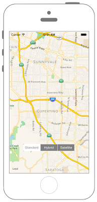
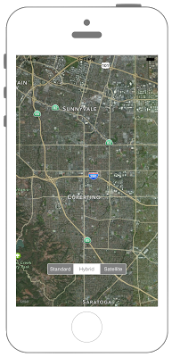
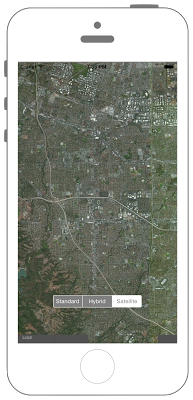

# 地図のタイプを指定





```swift fct_label="Swift 5.x/4.x"
//
//  ViewController.swift
// MapKit011
//
//  Created by Misato Morino on 2016/08/15.
//  Copyright © 2016年 Misato Morino. All rights reserved.
//

import UIKit
import MapKit

class ViewController: UIViewController {
    
    var mapView: MKMapView!
    
    override func viewDidLoad() {
        super.viewDidLoad()
        
        // 表示する配列を作る.
        let mapTypes: NSArray = ["Standard", "Hybrid", "Satellite"]
        
        // SecmentedControlを作成する.
        let mySegCon: UISegmentedControl = UISegmentedControl(items: mapTypes as [AnyObject])
        mySegCon.layer.position = CGPoint(x: self.view.frame.width/2, y: self.view.frame.height-100)
        mySegCon.backgroundColor = UIColor.gray
        mySegCon.tintColor = UIColor.white
        
        // イベントを追加する.
        mySegCon.addTarget(self, action: #selector(ViewController.segconChanged(segcon:)), for: UIControl.Event.valueChanged)
        
        // MapViewを生成.
        mapView = MKMapView(frame: CGRect(x: 0, y: 0, width: self.view.frame.size.width, height: self.view.frame.size.height))
        
        // MapViewの中心位置を指定.
        mapView.centerCoordinate = CLLocationCoordinate2DMake(37.331741, -122.030333)
        
        // 縮尺を変更.
        // 倍率を指定.
        let span : MKCoordinateSpan = MKCoordinateSpan(latitudeDelta: 0.1, longitudeDelta: 0.1)
        
        // MapViewで指定した中心位置とMKCoordinateSapnで宣言したspanを指定する.
        let region : MKCoordinateRegion = MKCoordinateRegion(center: mapView.centerCoordinate, span: span)
        
        // MapViewのregionプロパティにregionを指定.
        mapView.region = region
        
        // MapViewをviewに追加.
        self.view.addSubview(mapView)
        
        // SegmentedControlをviewに追加.
        self.view.addSubview(mySegCon)
    }
    
    @objc func segconChanged(segcon: UISegmentedControl) {
        
        switch(segcon.selectedSegmentIndex) {
        // 地図のタイプを標準に設定.
        case 0:
            mapView.mapType = MKMapType.standard
            
        // 地図のタイプをハイブリッド(航空写真+標準)に設定.
        case 1:
            mapView.mapType = MKMapType.hybrid
            
        // 地図のタイプを航空写真に設定.
        case 2:
            mapView.mapType = MKMapType.satellite
            
        default:
            print("Error")
        }
        
    }
    
    override func didReceiveMemoryWarning() {
        super.didReceiveMemoryWarning()
    }
}
```

```swift fct_label="Swift 3.x"
//
//  ViewController.swift
// MapKit011
//
//  Created by Misato Morino on 2016/08/15.
//  Copyright © 2016年 Misato Morino. All rights reserved.
//

import UIKit
import MapKit

class ViewController: UIViewController {
    
    var mapView: MKMapView!
    
    override func viewDidLoad() {
        super.viewDidLoad()
        
        // 表示する配列を作る.
        let mapTypes: NSArray = ["Standard", "Hybrid", "Satellite"]
        
        // SecmentedControlを作成する.
        let mySegCon: UISegmentedControl = UISegmentedControl(items: mapTypes as [AnyObject])
        mySegCon.layer.position = CGPoint(x: self.view.frame.width/2, y: self.view.frame.height-100)
        mySegCon.backgroundColor = UIColor.gray
        mySegCon.tintColor = UIColor.white
        
        // イベントを追加する.
        mySegCon.addTarget(self, action: #selector(ViewController.segconChanged(segcon:)), for: UIControlEvents.valueChanged)
        
        // MapViewを生成.
        mapView = MKMapView(frame: CGRect(x: 0, y: 0, width: self.view.frame.size.width, height: self.view.frame.size.height))
        
        // MapViewの中心位置を指定.
        mapView.centerCoordinate = CLLocationCoordinate2DMake(37.331741, -122.030333)
        
        // 縮尺を変更.
        // 倍率を指定.
        let span : MKCoordinateSpan = MKCoordinateSpan(latitudeDelta: 0.1, longitudeDelta: 0.1)
        
        // MapViewで指定した中心位置とMKCoordinateSapnで宣言したspanを指定する.
        let region : MKCoordinateRegion = MKCoordinateRegion(center: mapView.centerCoordinate, span: span)
        
        // MapViewのregionプロパティにregionを指定.
        mapView.region = region
        
        // MapViewをviewに追加.
        self.view.addSubview(mapView)
        
        // SegmentedControlをviewに追加.
        self.view.addSubview(mySegCon)
    }
    
    func segconChanged(segcon: UISegmentedControl) {
        
        switch(segcon.selectedSegmentIndex) {
        // 地図のタイプを標準に設定.
        case 0:
            mapView.mapType = MKMapType.standard
            
        // 地図のタイプをハイブリッド(航空写真+標準)に設定.
        case 1:
            mapView.mapType = MKMapType.hybrid
            
        // 地図のタイプを航空写真に設定.
        case 2:
            mapView.mapType = MKMapType.satellite
            
        default:
            print("Error")
        }
        
    }
    
    override func didReceiveMemoryWarning() {
        super.didReceiveMemoryWarning()
    }
}
```

```swift fct_label="Swift 2.3"
//
//  ViewController.swift
//  MapKit011
//
//  Created by Misato Morino on 2016/08/15.
//  Copyright © 2016年 Misato Morino. All rights reserved.
//

import UIKit
import MapKit

class ViewController: UIViewController {
    
    var mapView: MKMapView!
    
    override func viewDidLoad() {
        super.viewDidLoad()
        
        // 表示する配列を作る.
        let mapTypes: NSArray = ["Standard", "Hybrid", "Satellite"]
        
        // SecmentedControlを作成する.
        let mySegCon: UISegmentedControl = UISegmentedControl(items: mapTypes as [AnyObject])
        mySegCon.layer.position = CGPointMake(self.view.frame.width/2, self.view.frame.height-100)
        mySegCon.backgroundColor = UIColor.grayColor()
        mySegCon.tintColor = UIColor.whiteColor()
        
        // イベントを追加する.
        mySegCon.addTarget(self, action: #selector(ViewController.segconChanged(_:)), forControlEvents: UIControlEvents.ValueChanged)
        
        // MapViewを生成.
        mapView = MKMapView(frame: CGRectMake(0, 0, self.view.frame.size.width, self.view.frame.size.height))
        
        // MapViewの中心位置を指定.
        mapView.centerCoordinate = CLLocationCoordinate2DMake(37.331741, -122.030333)
        
        // 縮尺を変更.
        // 倍率を指定.
        let span : MKCoordinateSpan = MKCoordinateSpan(latitudeDelta: 0.1, longitudeDelta: 0.1)
        
        // MapViewで指定した中心位置とMKCoordinateSapnで宣言したspanを指定する.
        let region : MKCoordinateRegion = MKCoordinateRegion(center: mapView.centerCoordinate, span: span)
        
        // MapViewのregionプロパティにregionを指定.
        mapView.region = region
        
        // MapViewをviewに追加.
        self.view.addSubview(mapView)
        
        // SegmentedControlをviewに追加.
        self.view.addSubview(mySegCon)
    }
    
    func segconChanged(segcon: UISegmentedControl) {
        
        switch(segcon.selectedSegmentIndex) {
        // 地図のタイプを標準に設定.
        case 0:
            mapView.mapType = MKMapType.Standard
            
        // 地図のタイプをハイブリッド(航空写真+標準)に設定.
        case 1:
            mapView.mapType = MKMapType.Hybrid
            
        // 地図のタイプを航空写真に設定.
        case 2:
            mapView.mapType = MKMapType.Satellite
            
        default:
            print("Error")
        }
        
    }
    
    override func didReceiveMemoryWarning() {
        super.didReceiveMemoryWarning()
    }
}
```

## 3.xと4.xの差分
* ```UIControlEvents``` が ```UIControl.Event``` に変更
* ```func segconChanged(segcon: UISegmentedControl)``` に ```@objc``` を追加

## 2.3と3.0の差分

* ```CGRectMake``` が廃止

## Reference
* MKMapView
    * [https://developer.apple.com/reference/mapkit/mkmapview](https://developer.apple.com/reference/mapkit/mkmapview)
