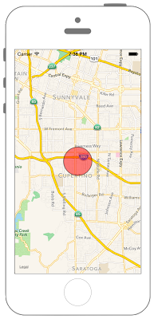

# 地図上に図形を描く(円)



```swift fct_label="Swift 4.x"
//
//  ViewController.swift
//  MapKit012
//
//  Created by Misato Morino on 2016/08/15.
//  Copyright © 2016年 Misato Morino. All rights reserved.
//

import UIKit
import MapKit

class ViewController: UIViewController, MKMapViewDelegate {
    
    // 経度緯度.
    let myLan: CLLocationDegrees = 37.331741
    let myLon: CLLocationDegrees = -122.030333
    
    var center: CLLocationCoordinate2D!
    
    override func viewDidLoad() {
        super.viewDidLoad()
        
        // 地図の中心の座標.
        center = CLLocationCoordinate2DMake(myLan, myLon)
        
        // mapViewを生成.
        let myMapView: MKMapView = MKMapView()
        myMapView.frame = self.view.frame
        myMapView.center = self.view.center
        myMapView.centerCoordinate = center
        myMapView.delegate = self
        
        // 縮尺を設定.
        let mySpan: MKCoordinateSpan = MKCoordinateSpan(latitudeDelta: 0.1, longitudeDelta: 0.1)
        let myRegion: MKCoordinateRegion = MKCoordinateRegion(center: center, span: mySpan)
        
        // regionをmapViewに追加.
        myMapView.region = myRegion
        
        // viewにmapViewを追加.
        self.view.addSubview(myMapView)
        
        // 円を描画する(半径1000m).
        let myCircle: MKCircle = MKCircle(center: center, radius: CLLocationDistance(1000))
        
        // mapViewにcircleを追加.
        myMapView.addOverlay(myCircle)
    }
    
    override func didReceiveMemoryWarning() {
        super.didReceiveMemoryWarning()
    }
    
    /*
     addOverlayした際に呼ばれるデリゲートメソッド.
     */
    func mapView(_ mapView: MKMapView, rendererFor overlay: MKOverlay) -> MKOverlayRenderer {
        
        // rendererを生成.
        let myCircleView: MKCircleRenderer = MKCircleRenderer(overlay: overlay)
        
        // 円の内部を赤色で塗りつぶす.
        myCircleView.fillColor = UIColor.red
        
        // 円周の線の色を黒色に設定.
        myCircleView.strokeColor = UIColor.black
        
        // 円を透過させる.
        myCircleView.alpha = 0.5
        
        // 円周の線の太さ.
        myCircleView.lineWidth = 1.5
        
        return myCircleView
    }
}
```

```swift fct_label=" Swift 3.x"
//
//  ViewController.swift
//  MapKit012
//
//  Created by Misato Morino on 2016/08/15.
//  Copyright © 2016年 Misato Morino. All rights reserved.
//

import UIKit
import MapKit

class ViewController: UIViewController, MKMapViewDelegate {
    
    // 経度緯度.
    let myLan: CLLocationDegrees = 37.331741
    let myLon: CLLocationDegrees = -122.030333
    
    var center: CLLocationCoordinate2D!
    
    override func viewDidLoad() {
        super.viewDidLoad()
        
        // 地図の中心の座標.
        center = CLLocationCoordinate2DMake(myLan, myLon)
        
        // mapViewを生成.
        let myMapView: MKMapView = MKMapView()
        myMapView.frame = self.view.frame
        myMapView.center = self.view.center
        myMapView.centerCoordinate = center
        myMapView.delegate = self
        
        // 縮尺を設定.
        let mySpan: MKCoordinateSpan = MKCoordinateSpan(latitudeDelta: 0.1, longitudeDelta: 0.1)
        let myRegion: MKCoordinateRegion = MKCoordinateRegion(center: center, span: mySpan)
        
        // regionをmapViewに追加.
        myMapView.region = myRegion
        
        // viewにmapViewを追加.
        self.view.addSubview(myMapView)
        
        // 円を描画する(半径1000m).
        let myCircle: MKCircle = MKCircle(center: center, radius: CLLocationDistance(1000))
        
        // mapViewにcircleを追加.
        myMapView.add(myCircle)
    }
    
    override func didReceiveMemoryWarning() {
        super.didReceiveMemoryWarning()
    }
    
    /*
     addOverlayした際に呼ばれるデリゲートメソッド.
     */
    func mapView(_ mapView: MKMapView, rendererFor overlay: MKOverlay) -> MKOverlayRenderer {
        
        // rendererを生成.
        let myCircleView: MKCircleRenderer = MKCircleRenderer(overlay: overlay)
        
        // 円の内部を赤色で塗りつぶす.
        myCircleView.fillColor = UIColor.red
        
        // 円周の線の色を黒色に設定.
        myCircleView.strokeColor = UIColor.black
        
        // 円を透過させる.
        myCircleView.alpha = 0.5
        
        // 円周の線の太さ.
        myCircleView.lineWidth = 1.5
        
        return myCircleView
    } 
} 
```

```swift fct_label="Swift 2.3"
//
//  ViewController.swift
//  MapKit012
//
//  Created by Misato Morino on 2016/08/15.
//  Copyright © 2016年 Misato Morino. All rights reserved.
//

import UIKit
import MapKit

class ViewController: UIViewController, MKMapViewDelegate {
    
    // 経度緯度.
    let myLan: CLLocationDegrees = 37.331741
    let myLon: CLLocationDegrees = -122.030333
    
    var center: CLLocationCoordinate2D!
    
    override func viewDidLoad() {
        super.viewDidLoad()
        
        // 地図の中心の座標.
        center = CLLocationCoordinate2DMake(myLan, myLon)
        
        // mapViewを生成.
        let myMapView: MKMapView = MKMapView()
        myMapView.frame = self.view.frame
        myMapView.center = self.view.center
        myMapView.centerCoordinate = center
        myMapView.delegate = self
        
        // 縮尺を設定.
        let mySpan: MKCoordinateSpan = MKCoordinateSpan(latitudeDelta: 0.1, longitudeDelta: 0.1)
        let myRegion: MKCoordinateRegion = MKCoordinateRegion(center: center, span: mySpan)
        
        // regionをmapViewに追加.
        myMapView.region = myRegion
        
        // viewにmapViewを追加.
        self.view.addSubview(myMapView)
        
        // 円を描画する(半径1000m).
        let myCircle: MKCircle = MKCircle(centerCoordinate: center, radius: CLLocationDistance(1000))
        
        // mapViewにcircleを追加.
        myMapView.addOverlay(myCircle)
    }
    
    override func didReceiveMemoryWarning() {
        super.didReceiveMemoryWarning()
    }
    
    /*
     addOverlayした際に呼ばれるデリゲートメソッド.
     */
    func mapView(mapView: MKMapView, rendererForOverlay overlay: MKOverlay) -> MKOverlayRenderer {
        
        // rendererを生成.
        let myCircleView: MKCircleRenderer = MKCircleRenderer(overlay: overlay)
        
        // 円の内部を赤色で塗りつぶす.
        myCircleView.fillColor = UIColor.redColor()
        
        // 円周の線の色を黒色に設定.
        myCircleView.strokeColor = UIColor.blackColor()
        
        // 円を透過させる.
        myCircleView.alpha = 0.5
        
        // 円周の線の太さ.
        myCircleView.lineWidth = 1.5
        
        return myCircleView
    } 
}
```

## 3.xと4.xの差分

* ```add``` が ```addOverlay``` に変更

## 2.3と3.0の差分

* ```addOverlay``` から ```add``` に変更
* ```init(centerCoordinate: center, radius: CLLocationDistance(1000))``` から ```init(center: center, radius: CLLocationDistance(1000))``` に変更

## Reference
* MKCircle
    * [https://developer.apple.com/reference/mapkit/mkcircle](https://developer.apple.com/reference/mapkit/mkcircle)
* MKCircleRenderer
    * [https://developer.apple.com/reference/mapkit/mkcirclerenderer](https://developer.apple.com/reference/mapkit/mkcirclerenderer)
