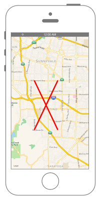

# 地図上に直線を引く



```swift fct_label="Swift 4.x"
//
//  ViewController.swift
//  MapKit013
//
//  Created by Misato Morino on 2016/08/15.
//  Copyright © 2016年 Misato Morino. All rights reserved.
//

import UIKit
import MapKit

class ViewController: UIViewController, MKMapViewDelegate {
    
    override func viewDidLoad() {
        super.viewDidLoad()
        
        // 経度緯度を設定.
        let myLan: CLLocationDegrees = 37.331741
        let myLon: CLLocationDegrees = -122.030333
        
        // 地図の中心の座標.
        let center: CLLocationCoordinate2D = CLLocationCoordinate2DMake(myLan, myLon)
        
        // mapViewを生成.
        let myMapView: MKMapView = MKMapView()
        myMapView.frame = self.view.frame
        myMapView.center = self.view.center
        myMapView.centerCoordinate = center
        myMapView.delegate = self
        
        // 縮尺を指定.
        let mySpan: MKCoordinateSpan = MKCoordinateSpan(latitudeDelta: 0.1, longitudeDelta: 0.1)
        let myRegion: MKCoordinateRegion = MKCoordinateRegion(center: center, span: mySpan)
        
        // regionをmapViewに追加.
        myMapView.region = myRegion
        
        // viewにmapViewを追加.
        self.view.addSubview(myMapView)
        
        // 直線を引く座標を作成.
        let coordinate_1 = CLLocationCoordinate2D(latitude: 37.301741, longitude: -122.050333)
        let coordinate_2 = CLLocationCoordinate2D(latitude: 37.351951, longitude: -122.020314)
        let coordinate_3 = CLLocationCoordinate2D(latitude: 37.301741, longitude: -122.020314)
        let coordinate_4 = CLLocationCoordinate2D(latitude: 37.351951, longitude: -122.050333)
        
        // 座標を配列に格納.
        var coordinates_1 = [coordinate_1, coordinate_2]
        var coordinates_2 = [coordinate_3, coordinate_4]
        
        // polyline作成.
        let myPolyLine_1: MKPolyline = MKPolyline(coordinates: &coordinates_1, count: coordinates_1.count)
        let myPolyLine_2: MKPolyline = MKPolyline(coordinates: &coordinates_2, count: coordinates_2.count)
        
        // mapViewにcircleを追加.
        myMapView.addOverlay(myPolyLine_1)
        myMapView.addOverlay(myPolyLine_2)
    }
    
    override func didReceiveMemoryWarning() {
        super.didReceiveMemoryWarning()
    }
    
    /*
     addOverlayした際に呼ばれるデリゲートメソッド.
     */
    func mapView(_ mapView: MKMapView, rendererFor overlay: MKOverlay) -> MKOverlayRenderer {
        
        // rendererを生成.
        let myPolyLineRendere: MKPolylineRenderer = MKPolylineRenderer(overlay: overlay)
        
        // 線の太さを指定.
        myPolyLineRendere.lineWidth = 5
        
        // 線の色を指定.
        myPolyLineRendere.strokeColor = UIColor.red
        
        return myPolyLineRendere
    }
}
```

```swift fct_label="Swift 3.x"
//
//  ViewController.swift
//  MapKit013
//
//  Created by Misato Morino on 2016/08/15.
//  Copyright © 2016年 Misato Morino. All rights reserved.
//

import UIKit
import MapKit

class ViewController: UIViewController, MKMapViewDelegate {
    
    override func viewDidLoad() {
        super.viewDidLoad()
        
        // 経度緯度を設定.
        let myLan: CLLocationDegrees = 37.331741
        let myLon: CLLocationDegrees = -122.030333
        
        // 地図の中心の座標.
        let center: CLLocationCoordinate2D = CLLocationCoordinate2DMake(myLan, myLon)
        
        // mapViewを生成.
        let myMapView: MKMapView = MKMapView()
        myMapView.frame = self.view.frame
        myMapView.center = self.view.center
        myMapView.centerCoordinate = center
        myMapView.delegate = self
        
        // 縮尺を指定.
        let mySpan: MKCoordinateSpan = MKCoordinateSpan(latitudeDelta: 0.1, longitudeDelta: 0.1)
        let myRegion: MKCoordinateRegion = MKCoordinateRegion(center: center, span: mySpan)
        
        // regionをmapViewに追加.
        myMapView.region = myRegion
        
        // viewにmapViewを追加.
        self.view.addSubview(myMapView)
        
        // 直線を引く座標を作成.
        let coordinate_1 = CLLocationCoordinate2D(latitude: 37.301741, longitude: -122.050333)
        let coordinate_2 = CLLocationCoordinate2D(latitude: 37.351951, longitude: -122.020314)
        let coordinate_3 = CLLocationCoordinate2D(latitude: 37.301741, longitude: -122.020314)
        let coordinate_4 = CLLocationCoordinate2D(latitude: 37.351951, longitude: -122.050333)
        
        // 座標を配列に格納.
        var coordinates_1 = [coordinate_1, coordinate_2]
        var coordinates_2 = [coordinate_3, coordinate_4]
        
        // polyline作成.
        let myPolyLine_1: MKPolyline = MKPolyline(coordinates: &coordinates_1, count: coordinates_1.count)
        let myPolyLine_2: MKPolyline = MKPolyline(coordinates: &coordinates_2, count: coordinates_2.count)
        
        // mapViewにcircleを追加.
        myMapView.add(myPolyLine_1)
        myMapView.add(myPolyLine_2)
    }
    
    override func didReceiveMemoryWarning() {
        super.didReceiveMemoryWarning()
    }
    
    /*
     addOverlayした際に呼ばれるデリゲートメソッド.
     */
    func mapView(_ mapView: MKMapView, rendererFor overlay: MKOverlay) -> MKOverlayRenderer {
        
        // rendererを生成.
        let myPolyLineRendere: MKPolylineRenderer = MKPolylineRenderer(overlay: overlay)
        
        // 線の太さを指定.
        myPolyLineRendere.lineWidth = 5
        
        // 線の色を指定.
        myPolyLineRendere.strokeColor = UIColor.red
        
        return myPolyLineRendere
    }
}
```

```swift fct_label="Swift 2.3"
//
//  ViewController.swift
//  MapKit013
//
//  Created by Misato Morino on 2016/08/15.
//  Copyright © 2016年 Misato Morino. All rights reserved.
//

import UIKit
import MapKit

class ViewController: UIViewController, MKMapViewDelegate {
    
    override func viewDidLoad() {
        super.viewDidLoad()
        
        // 経度緯度を設定.
        let myLan: CLLocationDegrees = 37.331741
        let myLon: CLLocationDegrees = -122.030333
        
        // 地図の中心の座標.
        let center: CLLocationCoordinate2D = CLLocationCoordinate2DMake(myLan, myLon)
        
        // mapViewを生成.
        let myMapView: MKMapView = MKMapView()
        myMapView.frame = self.view.frame
        myMapView.center = self.view.center
        myMapView.centerCoordinate = center
        myMapView.delegate = self
        
        // 縮尺を指定.
        let mySpan: MKCoordinateSpan = MKCoordinateSpan(latitudeDelta: 0.1, longitudeDelta: 0.1)
        let myRegion: MKCoordinateRegion = MKCoordinateRegion(center: center, span: mySpan)
        
        // regionをmapViewに追加.
        myMapView.region = myRegion
        
        // viewにmapViewを追加.
        self.view.addSubview(myMapView)
        
        // 直線を引く座標を作成.
        let coordinate_1 = CLLocationCoordinate2D(latitude: 37.301741, longitude: -122.050333)
        let coordinate_2 = CLLocationCoordinate2D(latitude: 37.351951, longitude: -122.020314)
        let coordinate_3 = CLLocationCoordinate2D(latitude: 37.301741, longitude: -122.020314)
        let coordinate_4 = CLLocationCoordinate2D(latitude: 37.351951, longitude: -122.050333)
        
        // 座標を配列に格納.
        var coordinates_1 = [coordinate_1, coordinate_2]
        var coordinates_2 = [coordinate_3, coordinate_4]
        
        // polyline作成.
        let myPolyLine_1: MKPolyline = MKPolyline(coordinates: &coordinates_1, count: coordinates_1.count)
        let myPolyLine_2: MKPolyline = MKPolyline(coordinates: &coordinates_2, count: coordinates_2.count)
        
        // mapViewにcircleを追加.
        myMapView.addOverlay(myPolyLine_1)
        myMapView.addOverlay(myPolyLine_2)
    }
    
    override func didReceiveMemoryWarning() {
        super.didReceiveMemoryWarning()
    }
    
    /*
     addOverlayした際に呼ばれるデリゲートメソッド.
     */
    func mapView(mapView: MKMapView, rendererForOverlay overlay: MKOverlay) -> MKOverlayRenderer {
        
        // rendererを生成.
        let myPolyLineRendere: MKPolylineRenderer = MKPolylineRenderer(overlay: overlay)
        
        // 線の太さを指定.
        myPolyLineRendere.lineWidth = 5
        
        // 線の色を指定.
        myPolyLineRendere.strokeColor = UIColor.redColor()
        
        return myPolyLineRendere
    }
}
```

## 3.xと4.xの差分
* ```add``` が ```addOverlay``` に変更

## 2.3と3.0の差分

* ```addOverlay``` から ```add``` に変更

## Reference
* MKPolylineRenderer
    * [https://developer.apple.com/reference/mapkit/mkpolylinerenderer](https://developer.apple.com/reference/mapkit/mkpolylinerenderer)
