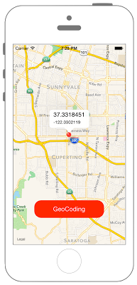

# 正ジオコーディング



```swift fct_label="Swift 4.x"
//
//  ViewController.swift
//  MapKit015
//
//  Created by Misato Morino on 2016/08/15.
//  Copyright © 2016年 Misato Morino. All rights reserved.
//

import UIKit
import MapKit

class ViewController: UIViewController, MKMapViewDelegate {
    
    var myMapView: MKMapView!
    var myPin: MKPointAnnotation!
    
    // 経度、緯度.
    let myLatitude: CLLocationDegrees = 37.331741
    let myLongitude: CLLocationDegrees = -122.030333
    
    override func viewDidLoad() {
        super.viewDidLoad()
        
        // UIButtonを作成する.
        let myButton: UIButton = UIButton(frame: CGRect(x: 0, y: 0, width: 200, height: 50))
        myButton.layer.position = CGPoint(x: self.view.frame.width/2, y: self.view.frame.height-100)
        myButton.layer.masksToBounds = true
        myButton.layer.cornerRadius = 20.0
        myButton.setTitle("GeoCoding", for: .normal)
        myButton.backgroundColor = UIColor.red
        myButton.setTitleColor(UIColor.white, for: .normal)
        myButton.addTarget(self, action: #selector(ViewController.onClickMyButton(sender:)), for: .touchUpInside)
        
        // MapViewを生成.
        myMapView = MKMapView()
        myMapView.frame = self.view.frame
        
        // デリゲートを設定.
        myMapView.delegate = self
        
        // 中心点.
        let center: CLLocationCoordinate2D = CLLocationCoordinate2DMake(myLatitude, myLongitude)
        
        // MapViewに中心点を設定.
        myMapView.setCenter(center, animated: true)
        
        // 縮尺を指定.
        // 表示領域.
        let mySpan: MKCoordinateSpan = MKCoordinateSpan(latitudeDelta: 0.1, longitudeDelta: 0.1)
        let myRegion: MKCoordinateRegion = MKCoordinateRegion(center: center, span: mySpan)
        
        // MapViewにregionを追加.
        myMapView.region = myRegion
        
        // viewにMapViewを追加.
        self.view.addSubview(myMapView)
        
        // UIButtonをviewに追加.
        self.view.addSubview(myButton)
        
        // pinアノテーションを作成.
        myPin = MKPointAnnotation()
        myPin.title = "Latitude"
        myPin.subtitle = "Longitude"
        myPin.coordinate = center
        
        // アノテーションをmapViewに追加.
        myMapView.addAnnotation(myPin)
    }
    
    @objc func onClickMyButton(sender: UIButton) {
        
        // geocoderを作成.
        let myGeocoder: CLGeocoder = CLGeocoder()
        
        // 検索する住所.
        let myAddress: String = "1 Infinite Loop, Cupertino, CA, USA"
        
        // 正ジオコーディング開始
        myGeocoder.geocodeAddressString(myAddress, completionHandler: { (placemarks, error) -> Void in
            
            for placemark in placemarks! {
                // locationにplacemark.locationをCLLocationとして代入する
                let location: CLLocation = placemark.location!
                print("Latitude: \(location.coordinate.latitude)")
                print("Longitude: \(location.coordinate.longitude)")
                
                // アノテーションのtitle, subtitleにそれぞれ緯度経度をセット.
                self.myPin.title = "\(location.coordinate.latitude)"
                self.myPin.subtitle = "\(location.coordinate.longitude)"
            }
        })
        
    }
    
    override func didReceiveMemoryWarning() {
        super.didReceiveMemoryWarning()
    }
}
```

```swift fct_label="Swift 3.x"
//
//  ViewController.swift
//  MapKit015
//
//  Created by Misato Morino on 2016/08/15.
//  Copyright © 2016年 Misato Morino. All rights reserved.
//

import UIKit
import MapKit

class ViewController: UIViewController, MKMapViewDelegate {
    
    var myMapView: MKMapView!
    var myPin: MKPointAnnotation!
    
    // 経度、緯度.
    let myLatitude: CLLocationDegrees = 37.331741
    let myLongitude: CLLocationDegrees = -122.030333
    
    override func viewDidLoad() {
        super.viewDidLoad()
        
        // UIButtonを作成する.
        let myButton: UIButton = UIButton(frame: CGRect(x: 0, y: 0, width: 200, height: 50))
        myButton.layer.position = CGPoint(x: self.view.frame.width/2, y: self.view.frame.height-100)
        myButton.layer.masksToBounds = true
        myButton.layer.cornerRadius = 20.0
        myButton.setTitle("GeoCoding", for: .normal)
        myButton.backgroundColor = UIColor.red
        myButton.setTitleColor(UIColor.white, for: .normal)
        myButton.addTarget(self, action: #selector(ViewController.onClickMyButton(sender:)), for: .touchUpInside)
        
        // MapViewを生成.
        myMapView = MKMapView()
        myMapView.frame = self.view.frame
        
        // デリゲートを設定.
        myMapView.delegate = self
        
        // 中心点.
        let center: CLLocationCoordinate2D = CLLocationCoordinate2DMake(myLatitude, myLongitude)
        
        // MapViewに中心点を設定.
        myMapView.setCenter(center, animated: true)
        
        // 縮尺を指定.
        // 表示領域.
        let mySpan: MKCoordinateSpan = MKCoordinateSpan(latitudeDelta: 0.1, longitudeDelta: 0.1)
        let myRegion: MKCoordinateRegion = MKCoordinateRegionMake(center, mySpan)
        
        // MapViewにregionを追加.
        myMapView.region = myRegion
        
        // viewにMapViewを追加.
        self.view.addSubview(myMapView)
        
        // UIButtonをviewに追加.
        self.view.addSubview(myButton)
        
        // pinアノテーションを作成.
        myPin = MKPointAnnotation()
        myPin.title = "Latitude"
        myPin.subtitle = "Longitude"
        myPin.coordinate = center
        
        // アノテーションをmapViewに追加.
        myMapView.addAnnotation(myPin)
    }
    
    func onClickMyButton(sender: UIButton) {
        
        // geocoderを作成.
        let myGeocoder: CLGeocoder = CLGeocoder()
        
        // 検索する住所.
        let myAddress: String = "1 Infinite Loop, Cupertino, CA, USA"
        
        // 正ジオコーディング開始
        myGeocoder.geocodeAddressString(myAddress, completionHandler: { (placemarks, error) -> Void in
            
            for placemark in placemarks! {
                // locationにplacemark.locationをCLLocationとして代入する
                let location: CLLocation = placemark.location!
                print("Latitude: \(location.coordinate.latitude)")
                print("Longitude: \(location.coordinate.longitude)")
                
                // アノテーションのtitle, subtitleにそれぞれ緯度経度をセット.
                self.myPin.title = "\(location.coordinate.latitude)"
                self.myPin.subtitle = "\(location.coordinate.longitude)"
            }
        })
        
    }
    
    override func didReceiveMemoryWarning() {
        super.didReceiveMemoryWarning()
    }
} 
```

```swift fct_label="Swift 2.3"
//
//  ViewController.swift
//  MapKit015
//
//  Created by Misato Morino on 2016/08/15.
//  Copyright © 2016年 Misato Morino. All rights reserved.
//

import UIKit
import MapKit

class ViewController: UIViewController, MKMapViewDelegate {
    
    var myMapView: MKMapView!
    var myPin: MKPointAnnotation!
    
    // 経度、緯度.
    let myLatitude: CLLocationDegrees = 37.331741
    let myLongitude: CLLocationDegrees = -122.030333
    
    override func viewDidLoad() {
        super.viewDidLoad()
        
        // UIButtonを作成する.
        let myButton: UIButton = UIButton(frame: CGRectMake(0, 0, 200, 50))
        myButton.layer.position = CGPointMake(self.view.frame.width/2, self.view.frame.height-100)
        myButton.layer.masksToBounds = true
        myButton.layer.cornerRadius = 20.0
        myButton.setTitle("GeoCoding", forState: .Normal)
        myButton.backgroundColor = UIColor.redColor()
        myButton.setTitleColor(UIColor.whiteColor(), forState: .Normal)
        myButton.addTarget(self, action: #selector(ViewController.onClickMyButton(_:)), forControlEvents: .TouchUpInside)
        
        // MapViewを生成.
        myMapView = MKMapView()
        myMapView.frame = self.view.frame
        
        // デリゲートを設定.
        myMapView.delegate = self
        
        // 中心点.
        let center: CLLocationCoordinate2D = CLLocationCoordinate2DMake(myLatitude, myLongitude)
        
        // MapViewに中心点を設定.
        myMapView.setCenterCoordinate(center, animated: true)
        
        // 縮尺を指定.
        // 表示領域.
        let mySpan: MKCoordinateSpan = MKCoordinateSpan(latitudeDelta: 0.1, longitudeDelta: 0.1)
        let myRegion: MKCoordinateRegion = MKCoordinateRegionMake(center, mySpan)
        
        // MapViewにregionを追加.
        myMapView.region = myRegion
        
        // viewにMapViewを追加.
        self.view.addSubview(myMapView)
        
        // UIButtonをviewに追加.
        self.view.addSubview(myButton)
        
        // pinアノテーションを作成.
        myPin = MKPointAnnotation()
        myPin.title = "Latitude"
        myPin.subtitle = "Longitude"
        myPin.coordinate = center
        
        // アノテーションをmapViewに追加.
        myMapView.addAnnotation(myPin)
    }
    
    func onClickMyButton(sender: UIButton) {
        
        // geocoderを作成.
        let myGeocoder: CLGeocoder = CLGeocoder()
        
        // 検索する住所.
        let myAddress: String = "1 Infinite Loop, Cupertino, CA, USA"
        
        // 正ジオコーディング開始
        myGeocoder.geocodeAddressString(myAddress, completionHandler: { (placemarks, error) -> Void in
            
            for placemark in placemarks! {
                // locationにplacemark.locationをCLLocationとして代入する
                let location: CLLocation = placemark.location!
                print("Latitude: \(location.coordinate.latitude)")
                print("Longitude: \(location.coordinate.longitude)")
                
                // アノテーションのtitle, subtitleにそれぞれ緯度経度をセット.
                self.myPin.title = "\(location.coordinate.latitude)"
                self.myPin.subtitle = "\(location.coordinate.longitude)"
            }
        })
        
    }
    
    override func didReceiveMemoryWarning() {
        super.didReceiveMemoryWarning()
    }
}
```

## 3.xと4.xの差分　

* ```func onClickMyButton(sender: UIButton)``` に ```@objc``` を追加
* ```MKCoordinateRegionMake(center, mySpan)``` が MKCoordinateRegion(center: center, span: mySpan)に変更

## 2.3と3.0の差分

* ```setCenterCoordinate``` から ```setCenter``` に変更

## Reference
* CLGeocoder
    * [https://developer.apple.com/reference/corelocation/clgeocoder](https://developer.apple.com/reference/corelocation/clgeocoder)
