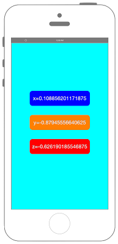

# 加速度センサーの値を取得



```swift fct_label="Swift 5.x/4.x/3.x"
//
//  ViewController.swift
//  coremotion001
//
//  Copyright © 2016年 FaBo, Inc. All rights reserved.
//

import UIKit
import CoreMotion

class ViewController: UIViewController {
    
    var myMotionManager: CMMotionManager!
    
    override func viewDidLoad() {
        
        super.viewDidLoad()
        
        // Labelを作成.
        let myXLabel: UILabel = UILabel()
        myXLabel.frame = CGRect(x: 0, y: 0, width: 200, height: 50)
        myXLabel.backgroundColor = UIColor.blue
        myXLabel.layer.masksToBounds = true
        myXLabel.layer.cornerRadius = 10.0
        myXLabel.textColor = UIColor.white
        myXLabel.shadowColor = UIColor.gray
        myXLabel.textAlignment = NSTextAlignment.center
        myXLabel.layer.position = CGPoint(x: self.view.bounds.width/2,y: 200)
        
        let myYLabel: UILabel = UILabel()
        myYLabel.frame = CGRect(x: 0, y: 0, width: 200, height: 50)
        myYLabel.backgroundColor = UIColor.orange
        myYLabel.layer.masksToBounds = true
        myYLabel.layer.cornerRadius = 10.0
        myYLabel.textColor = UIColor.white
        myYLabel.shadowColor = UIColor.gray
        myYLabel.textAlignment = NSTextAlignment.center
        myYLabel.layer.position = CGPoint(x: self.view.bounds.width/2,y: 280)
        
        let myZLabel: UILabel = UILabel()
        myZLabel.frame = CGRect(x: 0, y: 0, width: 200, height: 50)
        myZLabel.backgroundColor = UIColor.red
        myZLabel.layer.masksToBounds = true
        myZLabel.layer.cornerRadius = 10.0
        myZLabel.textColor = UIColor.white
        myZLabel.shadowColor = UIColor.gray
        myZLabel.textAlignment = NSTextAlignment.center
        myZLabel.layer.position = CGPoint(x: self.view.bounds.width/2,y: 360)
        
        // Viewの背景色を青にする.
        self.view.backgroundColor = UIColor.cyan
        
        // ViewにLabelを追加.
        self.view.addSubview(myXLabel)
        self.view.addSubview(myYLabel)
        self.view.addSubview(myZLabel)
        
        // MotionManagerを生成.
        myMotionManager = CMMotionManager()
        
        // 更新周期を設定.
        myMotionManager.accelerometerUpdateInterval = 0.1
        
        // 加速度の取得を開始.
        myMotionManager.startAccelerometerUpdates(to: OperationQueue.main, withHandler: {(accelerometerData, error) in
            if let e = error {
                print(e.localizedDescription)
                return
            }
            guard let data = accelerometerData else {
                return
            }
            myXLabel.text = "x=\(data.acceleration.x)"
            myYLabel.text = "y=\(data.acceleration.y)"
            myZLabel.text = "z=\(data.acceleration.z)"
        })
    }
    
}
```

```swift fct_label="Swift 2.3"
//
//  ViewController.swift
//  coremotion001
//
//  Copyright © 2016年 FaBo, Inc. All rights reserved.
//
import UIKit
import CoreMotion

class ViewController: UIViewController {
    
    var myMotionManager: CMMotionManager!
    
    override func viewDidLoad() {
        
        super.viewDidLoad()
        
        // Labelを作成.
        let myXLabel: UILabel = UILabel(frame: CGRectMake(0,0,200,50))
        myXLabel.backgroundColor = UIColor.blueColor()
        myXLabel.layer.masksToBounds = true
        myXLabel.layer.cornerRadius = 10.0
        myXLabel.textColor = UIColor.whiteColor()
        myXLabel.shadowColor = UIColor.grayColor()
        myXLabel.textAlignment = NSTextAlignment.Center
        myXLabel.layer.position = CGPoint(x: self.view.bounds.width/2,y: 200)
        
        let myYLabel: UILabel = UILabel(frame: CGRectMake(0,0,200,50))
        myYLabel.backgroundColor = UIColor.orangeColor()
        myYLabel.layer.masksToBounds = true
        myYLabel.layer.cornerRadius = 10.0
        myYLabel.textColor = UIColor.whiteColor()
        myYLabel.shadowColor = UIColor.grayColor()
        myYLabel.textAlignment = NSTextAlignment.Center
        myYLabel.layer.position = CGPoint(x: self.view.bounds.width/2,y: 280)
        
        let myZLabel: UILabel = UILabel(frame: CGRectMake(0,0,200,50))
        myZLabel.backgroundColor = UIColor.redColor()
        myZLabel.layer.masksToBounds = true
        myZLabel.layer.cornerRadius = 10.0
        myZLabel.textColor = UIColor.whiteColor()
        myZLabel.shadowColor = UIColor.grayColor()
        myZLabel.textAlignment = NSTextAlignment.Center
        myZLabel.layer.position = CGPoint(x: self.view.bounds.width/2,y: 360)
        
        // Viewの背景色を青にする.
        self.view.backgroundColor = UIColor.cyanColor()
        
        // ViewにLabelを追加.
        self.view.addSubview(myXLabel)
        self.view.addSubview(myYLabel)
        self.view.addSubview(myZLabel)
        
        // MotionManagerを生成.
        myMotionManager = CMMotionManager()
        
        // 更新周期を設定.
        myMotionManager.accelerometerUpdateInterval = 0.1
        
        // 加速度の取得を開始.
        myMotionManager.startAccelerometerUpdatesToQueue(NSOperationQueue.mainQueue(), withHandler: {(accelerometerData, error) in
            if let e = error {
                print(e.localizedDescription)
                return
            }
            myXLabel.text = "x=\(accelerometerData!.acceleration.x)"
            myYLabel.text = "y=\(accelerometerData!.acceleration.y)"
            myZLabel.text = "z=\(accelerometerData!.acceleration.z)"
        })
        
    }
    
}
```

## 2.xと3.xの差分

* UIColorによる色指定の簡略化
    * 例 : `UIColor.blueColor()`から`UIColor.blue`
* `CMMotionManager.startAccelerometerUpdatesToQueue(NSOperationQueue, withHandler: CMAccelerometerHandler)`から`CMMotionManager.startAccelerometerUpdates(to: OperationQueue, withHandler: CMAccelerometerHandler)`に変更
* `NSOperationQueue.mainQueue()`から`OperationQueue.main`に変更

## Reference

* CMMotionManager
    * https://developer.apple.com/library/ios/documentation/CoreMotion/Reference/CMMotionManager_Class/
* NSOperationQueue
    * https://developer.apple.com/library/mac/documentation/Cocoa/Reference/NSOperationQueue_class/
    * https://developer.apple.com/reference/foundation/nsoperationqueue
