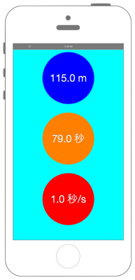

# 活動量計の値の取得



info.plistに`NSMotionUsageDescription`を追加します。

```swift fct_label="Swift 5.x/4.x"
//
//  ViewController.swift
//  coremotion002
//
//  Copyright © 2016年 FaBo, Inc. All rights reserved.
//

import UIKit
import CoreMotion

class ViewController: UIViewController {
    
    var myPedometer = CMPedometer() // ペドメーター(歩数計)を生成.
    let myDistanceLabel: UILabel = UILabel(frame: CGRect(x: 0, y: 0, width: 150, height: 150))
    let myTimeLabel: UILabel = UILabel(frame: CGRect(x: 0, y: 0, width: 150, height: 150))
    let mySpeedLabel: UILabel = UILabel(frame: CGRect(x: 0, y: 0, width: 150, height: 150))
    
    override func viewDidLoad() {
        super.viewDidLoad()
        
        // Labelを作成.
        myDistanceLabel.backgroundColor = UIColor.blue
        myDistanceLabel.layer.masksToBounds = true
        myDistanceLabel.layer.cornerRadius = 75.0
        myDistanceLabel.textColor = UIColor.white
        myDistanceLabel.shadowColor = UIColor.gray
        myDistanceLabel.font = UIFont.systemFont(ofSize: CGFloat(30))
        myDistanceLabel.textAlignment = NSTextAlignment.center
        myDistanceLabel.layer.position = CGPoint(x: self.view.bounds.width/2,y: 100)
        myDistanceLabel.text = "0 m"
        
        myTimeLabel.backgroundColor = UIColor.orange
        myTimeLabel.layer.masksToBounds = true
        myTimeLabel.layer.cornerRadius = 75.0
        myTimeLabel.textColor = UIColor.white
        myTimeLabel.shadowColor = UIColor.gray
        myTimeLabel.font = UIFont.systemFont(ofSize: CGFloat(30))
        myTimeLabel.textAlignment = NSTextAlignment.center
        myTimeLabel.layer.position = CGPoint(x: self.view.bounds.width/2,y: 275)
        myTimeLabel.text = "0 sec"
        
        mySpeedLabel.backgroundColor = UIColor.red
        mySpeedLabel.layer.masksToBounds = true
        mySpeedLabel.layer.cornerRadius = 75.0
        mySpeedLabel.textColor = UIColor.white
        mySpeedLabel.shadowColor = UIColor.gray
        mySpeedLabel.font = UIFont.systemFont(ofSize: CGFloat(30))
        mySpeedLabel.textAlignment = NSTextAlignment.center
        mySpeedLabel.layer.position = CGPoint(x: self.view.bounds.width/2,y: 450)
        mySpeedLabel.text = "0 m/S"
        
        // Viewの背景色を青にする.
        self.view.backgroundColor = UIColor.cyan
        
        // Viewに追加.
        self.view.addSubview(myDistanceLabel)
        self.view.addSubview(myTimeLabel)
        self.view.addSubview(mySpeedLabel)
        
        // ペドメーター(歩数計)で計測開始.
        myPedometer.startUpdates(from: Date(), withHandler: {(pedometerData, error) in
            if let e = error {
                print(e.localizedDescription)
                return
            }
            guard let data = pedometerData else {
                return
            }
            let myDistance = data.distance!.doubleValue
            let myTime: Double = data.endDate.timeIntervalSince(data.startDate)
            let mySpeed = myDistance / myTime
            DispatchQueue.main.async {
                self.myDistanceLabel.text = "\(round(myDistance)) m"
                self.myTimeLabel.text = "\(round(myTime)) sec"
                self.mySpeedLabel.text = "\(round(mySpeed)) m/s"
            }
        })
    }
    
}
```

```swift fct_label="Swift 3.x"
//
//  ViewController.swift
//  coremotion002
//
//  Copyright © 2016年 FaBo, Inc. All rights reserved.
//

import UIKit
import CoreMotion

class ViewController: UIViewController {
    
    var myPedometer = CMPedometer() // ペドメーター(歩数計)を生成.
    let myDistanceLabel: UILabel = UILabel(frame: CGRect(x: 0, y: 0, width: 150, height: 150))
    let myTimeLabel: UILabel = UILabel(frame: CGRect(x: 0, y: 0, width: 150, height: 150))
    let mySpeedLabel: UILabel = UILabel(frame: CGRect(x: 0, y: 0, width: 150, height: 150))
    
    override func viewDidLoad() {
        super.viewDidLoad()
        
        // Labelを作成.
        myDistanceLabel.backgroundColor = UIColor.blue
        myDistanceLabel.layer.masksToBounds = true
        myDistanceLabel.layer.cornerRadius = 75.0
        myDistanceLabel.textColor = UIColor.white
        myDistanceLabel.shadowColor = UIColor.gray
        myDistanceLabel.font = UIFont.systemFont(ofSize: CGFloat(30))
        myDistanceLabel.textAlignment = NSTextAlignment.center
        myDistanceLabel.layer.position = CGPoint(x: self.view.bounds.width/2,y: 100)
        myDistanceLabel.text = "0 m"
        
        myTimeLabel.backgroundColor = UIColor.orange
        myTimeLabel.layer.masksToBounds = true
        myTimeLabel.layer.cornerRadius = 75.0
        myTimeLabel.textColor = UIColor.white
        myTimeLabel.shadowColor = UIColor.gray
        myTimeLabel.font = UIFont.systemFont(ofSize: CGFloat(30))
        myTimeLabel.textAlignment = NSTextAlignment.center
        myTimeLabel.layer.position = CGPoint(x: self.view.bounds.width/2,y: 275)
        myTimeLabel.text = "0 sec"
        
        mySpeedLabel.backgroundColor = UIColor.red
        mySpeedLabel.layer.masksToBounds = true
        mySpeedLabel.layer.cornerRadius = 75.0
        mySpeedLabel.textColor = UIColor.white
        mySpeedLabel.shadowColor = UIColor.gray
        mySpeedLabel.font = UIFont.systemFont(ofSize: CGFloat(30))
        mySpeedLabel.textAlignment = NSTextAlignment.center
        mySpeedLabel.layer.position = CGPoint(x: self.view.bounds.width/2,y: 450)
        mySpeedLabel.text = "0 m/S"
        
        // Viewの背景色を青にする.
        self.view.backgroundColor = UIColor.cyan
        
        // Viewに追加.
        self.view.addSubview(myDistanceLabel)
        self.view.addSubview(myTimeLabel)
        self.view.addSubview(mySpeedLabel)
        
        // ペドメーター(歩数計)で計測開始.
        myPedometer.startUpdates(from: Date(), withHandler: {(pedometerData, error) in
            if let e = error {
                print(e.localizedDescription)
                return
            }
            guard let data = pedometerData else {
                return
            }
            let myDistance = data.distance!.doubleValue
            let myTime: Double = data.endDate.timeIntervalSince(data.startDate)
            let mySpeed = myDistance / myTime
            self.myDistanceLabel.text = "\(round(myDistance)) m"
            self.myTimeLabel.text = "\(round(myTime)) sec"
            self.mySpeedLabel.text = "\(round(mySpeed)) m/s"
        })
    }
    
}
```

```swift fct_label="Swift 2.3"
//
//  ViewController.swift
//  coremotion002
//
//  Copyright © 2016年 FaBo, Inc. All rights reserved.
//

import UIKit
import CoreMotion

class ViewController: UIViewController {
    
    var myPedometer = CMPedometer() // ペドメーター(歩数計)を生成.
    let myDistanceLabel: UILabel = UILabel(frame: CGRectMake(0,0,150,150))
    let myTimeLabel: UILabel = UILabel(frame: CGRectMake(0,0,150,150))
    let mySpeedLabel: UILabel = UILabel(frame: CGRectMake(0,0,150,150))
    
    override func viewDidLoad() {
        super.viewDidLoad()
        
        // Labelを作成.
        myDistanceLabel.backgroundColor = UIColor.blueColor()
        myDistanceLabel.layer.masksToBounds = true
        myDistanceLabel.layer.cornerRadius = 75.0
        myDistanceLabel.textColor = UIColor.whiteColor()
        myDistanceLabel.shadowColor = UIColor.grayColor()
        myDistanceLabel.font = UIFont.systemFontOfSize(CGFloat(30))
        myDistanceLabel.textAlignment = NSTextAlignment.Center
        myDistanceLabel.layer.position = CGPoint(x: self.view.bounds.width/2,y: 100)
        myDistanceLabel.text = "0 m"
        
        myTimeLabel.backgroundColor = UIColor.orangeColor()
        myTimeLabel.layer.masksToBounds = true
        myTimeLabel.layer.cornerRadius = 75.0
        myTimeLabel.textColor = UIColor.whiteColor()
        myTimeLabel.shadowColor = UIColor.grayColor()
        myTimeLabel.font = UIFont.systemFontOfSize(CGFloat(30))
        myTimeLabel.textAlignment = NSTextAlignment.Center
        myTimeLabel.layer.position = CGPoint(x: self.view.bounds.width/2,y: 275)
        myTimeLabel.text = "0 sec"
        
        mySpeedLabel.backgroundColor = UIColor.redColor()
        mySpeedLabel.layer.masksToBounds = true
        mySpeedLabel.layer.cornerRadius = 75.0
        mySpeedLabel.textColor = UIColor.whiteColor()
        mySpeedLabel.shadowColor = UIColor.grayColor()
        mySpeedLabel.font = UIFont.systemFontOfSize(CGFloat(30))
        mySpeedLabel.textAlignment = NSTextAlignment.Center
        mySpeedLabel.layer.position = CGPoint(x: self.view.bounds.width/2,y: 450)
        mySpeedLabel.text = "0 m/S"
        
        // Viewの背景色を青にする.
        self.view.backgroundColor = UIColor.cyanColor()
        
        // Viewに追加.
        self.view.addSubview(myDistanceLabel)
        self.view.addSubview(myTimeLabel)
        self.view.addSubview(mySpeedLabel)
        
        // ペドメーター(歩数計)で計測開始.
        myPedometer.startPedometerUpdatesFromDate(NSDate(), withHandler: { pedometerData, error in
            if let e = error {
                print(e.localizedDescription)
                return
            }
            guard let data = pedometerData else {
                return
            }
            let myDistance = data.distance!.doubleValue
            let myTime: Double = data.endDate.timeIntervalSinceDate(data.startDate)
            let mySpeed = myDistance / myTime
            self.myDistanceLabel.text = "\(round(myDistance)) m"
            self.myTimeLabel.text = "\(round(myTime)) sec"
            self.mySpeedLabel.text = "\(round(mySpeed)) m/s"
        })
        
    }
    
}
```

## 3.xと4.xの差分
* ```self.myDistanceLabel.text = "\(round(myDistance)) m"```  
```self.myTimeLabel.text = "\(round(myTime)) sec"```  
```self.mySpeedLabel.text = "\(round(mySpeed)) m/s"```  
を ```DispatchQueue.main.async {}```で囲む


## 2.3と3.0の差分

* `CGRectMake(CGFloat, CGFloat, CGFloat, CGFloat)`から`CGRect(x: CGFloat, y: CGFloat, width: CGFloat, height: CGFloat)`に変更
* `CMPedometer.startPedometerUpdatesFromDate(NSDate, withHandler: CMPedometerHandler)`から`CMPedometer.startUpdates(from: Date, withHandler: CMPedometerHandler)`に変更
* `NSDate`から`Date`に変更
* `NSDate.endDate.timeIntervalSinceDate(NSDate)`から`Date.endDate.timeIntervalSince(Date)`に変更

## Reference

* CMPedometer
    * https://developer.apple.com/library/ios/documentation/CoreMotion/Reference/CMPedometer_class/
* NSDate
    * https://developer.apple.com/reference/foundation/nsdate
    * https://developer.apple.com/reference/foundation/date
