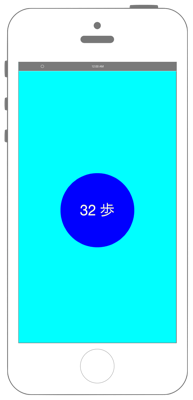

# 万歩計の歩数の取得



info.plistに`NSMotionUsageDescription`を追加します。

```swift fct_label="Swift 4.x"
//
//  ViewController.swift
//  coremotion003
//
//  Copyright © 2016年 FaBo, Inc. All rights reserved.
//

import UIKit
import CoreMotion

class ViewController: UIViewController {
    
    var myPedometer: CMPedometer!
    
    override func viewDidLoad() {
        super.viewDidLoad()
        
        // Labelを作成.
        let myStepLabel: UILabel = UILabel(frame: CGRect(x: 0, y: 0, width: 150, height: 150))
        myStepLabel.backgroundColor = UIColor.orange
        myStepLabel.layer.masksToBounds = true
        myStepLabel.layer.cornerRadius = 75.0
        myStepLabel.textColor = UIColor.white
        myStepLabel.shadowColor = UIColor.gray
        myStepLabel.font = UIFont.systemFont(ofSize: 30)
        myStepLabel.textAlignment = NSTextAlignment.center
        myStepLabel.layer.position = CGPoint(x: self.view.bounds.width/2,y: 300)
        
        // Viewの背景色を青にする.
        self.view.backgroundColor = UIColor.cyan
        
        // Viewに追加.
        self.view.addSubview(myStepLabel)
        
        // 歩数計を生成.
        myPedometer = CMPedometer()
        
        // ペドメーター(歩数計)で計測開始.
        myPedometer.startUpdates(from: NSDate() as Date, withHandler: { (pedometerData, error) in
            if let e = error {
                print(e.localizedDescription)
                return
            }
            guard let data = pedometerData else {
                return
            }
            let myStep = data.numberOfSteps
            DispatchQueue.main.async {
                myStepLabel.text = "\(myStep) 歩"
            }
        })
    }
    
}
```

```swift fct_label="Swift 3.x"
//
//  ViewController.swift
//  coremotion003
//
//  Copyright © 2016年 FaBo, Inc. All rights reserved.
//

import UIKit
import CoreMotion

class ViewController: UIViewController {
    
    var myPedometer: CMPedometer!
    
    override func viewDidLoad() {
        super.viewDidLoad()
        
        // Labelを作成.
        let myStepLabel: UILabel = UILabel(frame: CGRect(x: 0, y: 0, width: 150, height: 150))
        myStepLabel.backgroundColor = UIColor.orange
        myStepLabel.layer.masksToBounds = true
        myStepLabel.layer.cornerRadius = 75.0
        myStepLabel.textColor = UIColor.white
        myStepLabel.shadowColor = UIColor.gray
        myStepLabel.font = UIFont.systemFont(ofSize: 30)
        myStepLabel.textAlignment = NSTextAlignment.center
        myStepLabel.layer.position = CGPoint(x: self.view.bounds.width/2,y: 300)
        
        // Viewの背景色を青にする.
        self.view.backgroundColor = UIColor.cyan
        
        // Viewに追加.
        self.view.addSubview(myStepLabel)
        
        // 歩数計を生成.
        myPedometer = CMPedometer()
        
        // ペドメーター(歩数計)で計測開始.
        myPedometer.startUpdates(from: NSDate() as Date, withHandler: { (pedometerData, error) in
            if let e = error {
                print(e.localizedDescription)
                return
            }
            guard let data = pedometerData else {
                return
            }
            let myStep = data.numberOfSteps
            myStepLabel.text = "\(myStep) 歩"
        })
    }
    
}
```

```swift fct_label="Swift 2.3"
//
//  ViewController.swift
//  coremotion003
//
//  Copyright © 2016年 FaBo, Inc. All rights reserved.
//

import UIKit
import CoreMotion

class ViewController: UIViewController {
    
    var myPedometer: CMPedometer!
    
    override func viewDidLoad() {
        super.viewDidLoad()
        
        // Labelを作成.
        let myStepLabel: UILabel = UILabel(frame: CGRectMake(0,0,150,150))
        myStepLabel.backgroundColor = UIColor.orangeColor()
        myStepLabel.layer.masksToBounds = true
        myStepLabel.layer.cornerRadius = 75.0
        myStepLabel.textColor = UIColor.whiteColor()
        myStepLabel.shadowColor = UIColor.grayColor()
        myStepLabel.font = UIFont.systemFontOfSize(CGFloat(30))
        myStepLabel.textAlignment = NSTextAlignment.Center
        myStepLabel.layer.position = CGPoint(x: self.view.bounds.width/2,y: 300)
        
        // Viewの背景色を青にする.
        self.view.backgroundColor = UIColor.cyanColor()
        
        // Viewに追加.
        self.view.addSubview(myStepLabel)
        
        // 歩数計を生成.
        myPedometer = CMPedometer()
        
        // ペドメーター(歩数計)で計測開始.
        myPedometer.startPedometerUpdatesFromDate(NSDate(), withHandler: { (pedometerData, error) in
            if let e = error {
                print(e.localizedDescription)
                return
            }
            guard let data = pedometerData else {
                return
            }
            let myStep = data.numberOfSteps
            myStepLabel.text = "\(myStep) 歩"
        })
    }
    
}
```

## 3.xと4.xの差分
* ```myStepLabel.text = "\(myStep) 歩"``` を ```DispatchQueue.main.async {}``` で囲む


## 2.3と3.0の差分

* UIColorによる色指定の簡略化
    * 例 : `UIColor.blueColor()`から`UIColor.blue`
* `CGRectMake(CGFloat, CGFloat, CGFloat, CGFloat)`から`CGRect(x: CGFloat, y: CGFloat, width: CGFloat, height: CGFloat)`に変更
* `UIFont.systemFontOfSize(CGFloat)`から`UIFont.systemFont(ofSize fontSize: CGFloat)`に変更
* `NSTextAlignment.Center`から`NSTextAlignment.center`に変更
* `CMPedometer.startPedometerUpdatesFromDate(NSDate, withHandler: CMPedometerHandler)`から`CMPedometer.startUpdates(from: Date, withHandler: CMPedometerHandler)`に変更

## Reference

* CMPedometer
    * https://developer.apple.com/library/ios/documentation/CoreMotion/Reference/CMPedometer_class/
* NSTextAlignment
    * https://developer.apple.com/reference/uikit/nstextalignment
* UIFont
    * https://developer.apple.com/reference/uikit/uifont
