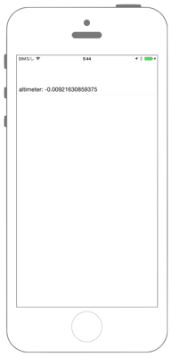

# 高度の計測



※iPhone6以上の端末でないと動作しません

```swift fct_label="Swift 5.x"
//
//  ViewController.swift
//  coremotion004
//

import UIKit
import CoreMotion

class ViewController: UIViewController {

    var myCMAltimeter: CMAltimeter!
    var myAltimeter: UITextField!

    override func viewDidLoad() {
        super.viewDidLoad()

        // CMAltimeterを取得.
        myCMAltimeter = CMAltimeter()

        // CMAltimeterが利用できるか(iPhone5SではNoが返ってくる).
        let isAltimeter = CMAltimeter.isRelativeAltitudeAvailable()

        // UITextFieldを作成.
        myAltimeter = UITextField(frame: CGRect(x: 0, y: 0, width: 200, height: 30))

        // 枠の線を表示.
        myAltimeter.borderStyle = UITextField.BorderStyle.roundedRect

        // UITextFieldの表示する位置.
        myAltimeter.layer.position = CGPoint(x:self.view.bounds.width/2,y:100)

        // Viewに追加.
        self.view.addSubview(myAltimeter)

        // Altimeterのモニタリングのスタート.
        if !isAltimeter {
            print("not use altimeter")
            return
        }
        myCMAltimeter.startRelativeAltitudeUpdates(to: OperationQueue.main, withHandler: {(altimeterData, error) in
            if let e = error {
                print(e.localizedDescription)
            }
            guard let data = altimeterData else {
                return
            }
            self.myAltimeter.text = "Altitude: \(data.relativeAltitude)"
        })
    }
}
```

```swift fct_label="Swift 4.x/Swift 3.x"
//
//  ViewController.swift
//  coremotion004
//
//  Created by akimach on 2016/08/24.
//  Copyright © 2016年 akimacho. All rights reserved.
//

import UIKit
import CoreMotion

class ViewController: UIViewController {
    
    var myCMAltimeter: CMAltimeter!
    var myAltimeter: UITextField!
    
    override func viewDidLoad() {
        super.viewDidLoad()
        
        // CMAltimeterを取得.
        myCMAltimeter = CMAltimeter()
        
        // CMAltimeterが利用できるか(iPhone5SではNoが返ってくる).
        let isAltimeter = CMAltimeter.isRelativeAltitudeAvailable()
        
        // UITextFieldを作成.
        myAltimeter = UITextField(frame: CGRect(x: 0, y: 0, width: 200, height: 30))
        
        // 枠の線を表示.
        myAltimeter.borderStyle = UITextBorderStyle.roundedRect
        
        // UITextFieldの表示する位置.
        myAltimeter.layer.position = CGPoint(x:self.view.bounds.width/2,y:100)
        
        // Viewに追加.
        self.view.addSubview(myAltimeter)
        
        // Altimeterのモニタリングのスタート.
        if !isAltimeter {
            print("not use altimeter")
            return
        }
        myCMAltimeter.startRelativeAltitudeUpdates(to: OperationQueue.main, withHandler: {(altimeterData, error) in
            if let e = error {
                print(e.localizedDescription)
            }
            guard let data = altimeterData else {
                return
            }
            self.myAltimeter.text = "Altitude: \(data.relativeAltitude)"
        })
    }
}
```

```swift fct_label="Swift 2.3"
//
//  ViewController.swift
//  coremotion004
//
//  Created by akimach on 2016/08/24.
//  Copyright © 2016年 akimacho. All rights reserved.
//

import UIKit
import CoreMotion

class ViewController: UIViewController {
    
    var myCMAltimeter: CMAltimeter!
    var myAltimeter: UITextField!
    
    override func viewDidLoad() {
        super.viewDidLoad()
        
        // CMAltimeterを取得.
        myCMAltimeter = CMAltimeter()
        
        // CMAltimeterが利用できるか(iPhone5SではNoが返ってくる).
        let isAltimeter = CMAltimeter.isRelativeAltitudeAvailable()
        
        // UITextFieldを作成.
        myAltimeter = UITextField(frame: CGRectMake(0,0,200,30))
        
        // 枠の線を表示.
        myAltimeter.borderStyle = UITextBorderStyle.RoundedRect
        
        // UITextFieldの表示する位置.
        myAltimeter.layer.position = CGPoint(x:self.view.bounds.width/2,y:100)
        
        // Viewに追加.
        self.view.addSubview(myAltimeter)
        
        // Altimeterのモニタリングのスタート.
        if !isAltimeter {
            print("not use altimeter")
            return
        }
        myCMAltimeter.startRelativeAltitudeUpdatesToQueue(NSOperationQueue.mainQueue(), withHandler: {(altimeterData, error) in
            if let e = error {
                print(e.localizedDescription)
            }
            guard let data = altimeterData else {
                return
            }
            self.myAltimeter.text = "Altitude: \(data.relativeAltitude)"
        })
    }
}
```

## 4.xと5.xの差分
* `UITextBorderStyle` を `UITextField.BorderStyle` に変更

## 2.3と3.0の差分

* `CGRectMake(CGFloat, CGFloat, CGFloat, CGFloat)`から`CGRect(x: CGFloat, y: CGFloat, width: CGFloat, height: CGFloat)`に変更 
* `UITextBorderStyle.RoundedRect`から`UITextBorderStyle.roundedRect`に変更
* `CMAltimeter.startRelativeAltitudeUpdatesToQueue(NSOperationQueue, withHandler: CMAltitudeHandler)`から`CMAltimeter.startRelativeAltitudeUpdates(to: OperationQueue, withHandler: CMAltitudeHandler)`に変更
* `NSOperationQueue.mainQueue()`から`OperationQueue.main`に変更

## Reference

* CMAltimeter
    * https://developer.apple.com/reference/coremotion/cmaltimeter
* NSOperationQueue
    * https://developer.apple.com/library/mac/documentation/Cocoa/Reference/NSOperationQueue_class/
    * https://developer.apple.com/reference/foundation/nsoperationqueue
