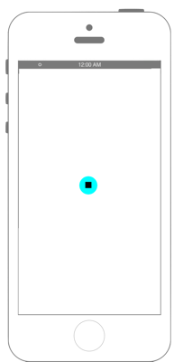

# 音源の再生

 

```swift fct_label="Swift 4.x"
//
//  ViewController.swift
//  avfoundation001
//
//  Copyright © 2016年 FaBo, Inc. All rights reserved.
//

import UIKit
import AVFoundation

//AudioPlayerDelegateプロトコルを採用.
class ViewController: UIViewController,AVAudioPlayerDelegate {
    
    //変数宣言.
    var myAudioPlayer : AVAudioPlayer!
    var myButton : UIButton!
    
    override func viewDidLoad() {
        super.viewDidLoad()
        
        //再生する音源のURLを生成.
        let soundFilePath : String = Bundle.main.path(forResource: "Sample", ofType: "mp3")!
        let fileURL = URL(fileURLWithPath: soundFilePath)
        
        //AVAudioPlayerのインスタンス化.
        myAudioPlayer = try! AVAudioPlayer(contentsOf: fileURL)
        
        //AVAudioPlayerのデリゲートをセット.
        myAudioPlayer.delegate = self
        
        //ボタンの生成.
        myButton = UIButton()
        myButton.frame.size = CGSize(width: 100, height: 100)
        myButton.layer.position = CGPoint(x: self.view.frame.width/2, y: self.view.frame.height/2)
        myButton.setTitle("▶︎", for: UIControl.State.normal)
        myButton.setTitleColor(UIColor.black, for: .normal)
        myButton.backgroundColor = UIColor.cyan
        myButton.addTarget(self, action: #selector(onClickMyButton), for: UIControl.Event.touchUpInside)
        myButton.layer.masksToBounds = true
        myButton.layer.cornerRadius = 50.0
        self.view.addSubview(myButton)
    }
    
    //ボタンがタップされた時に呼ばれるメソッド.
    @objc func onClickMyButton(sender: UIButton) {
        
        //playingプロパティがtrueであれば音源再生中.
        if myAudioPlayer.isPlaying == true {
            
            //myAudioPlayerを一時停止.
            myAudioPlayer.pause()
            sender.setTitle("▶︎", for: .normal)
        } else {
            
            //myAudioPlayerの再生.
            myAudioPlayer.play()
            sender.setTitle("■", for: .normal)
        }
    }
    
    // MARK: - AVAudioPlayerDelegate
    
    //音楽再生が成功した時に呼ばれるメソッド.
    func audioPlayerDidFinishPlaying(_ player: AVAudioPlayer, successfully flag: Bool) {
        if !flag { return }
        
        print("Music Finish")
        //再度myButtonを"▶︎"に設定.
        myButton.setTitle("▶︎", for: .normal)
    }
    
    //デコード中にエラーが起きた時に呼ばれるメソッド.
    func audioPlayerDecodeErrorDidOccur(_ player: AVAudioPlayer, error: Error?) {
        if let e = error {
            print("Error")
            print(e.localizedDescription)
            return
        }
    }
}
```
 
```swift fct_label="Swift 3.x"
//
//  ViewController.swift
//  avfoundation001
//
//  Copyright © 2016年 FaBo, Inc. All rights reserved.
//

import UIKit
import AVFoundation

//AudioPlayerDelegateプロトコルを採用.
class ViewController: UIViewController,AVAudioPlayerDelegate {
    
    //変数宣言.
    var myAudioPlayer : AVAudioPlayer!
    var myButton : UIButton!
    
    override func viewDidLoad() {
        super.viewDidLoad()
        
        //再生する音源のURLを生成.
        let soundFilePath : String = Bundle.main.path(forResource: "Sample", ofType: "mp3")!
        let fileURL = URL(fileURLWithPath: soundFilePath)
        
        //AVAudioPlayerのインスタンス化.
        myAudioPlayer = try! AVAudioPlayer(contentsOf: fileURL)
        
        //AVAudioPlayerのデリゲートをセット.
        myAudioPlayer.delegate = self
        
        //ボタンの生成.
        myButton = UIButton()
        myButton.frame.size = CGSize(width: 100, height: 100)
        myButton.layer.position = CGPoint(x: self.view.frame.width/2, y: self.view.frame.height/2)
        myButton.setTitle("▶︎", for: UIControlState.normal)
        myButton.setTitleColor(UIColor.black, for: .normal)
        myButton.backgroundColor = UIColor.cyan
        myButton.addTarget(self, action: #selector(onClickMyButton), for: UIControlEvents.touchUpInside)
        myButton.layer.masksToBounds = true
        myButton.layer.cornerRadius = 50.0
        self.view.addSubview(myButton)
    }
    
    //ボタンがタップされた時に呼ばれるメソッド.
    func onClickMyButton(sender: UIButton) {
        
        //playingプロパティがtrueであれば音源再生中.
        if myAudioPlayer.isPlaying == true {
            
            //myAudioPlayerを一時停止.
            myAudioPlayer.pause()
            sender.setTitle("▶︎", for: .normal)
        } else {
            
            //myAudioPlayerの再生.
            myAudioPlayer.play()
            sender.setTitle("■", for: .normal)
        }
    }
    
    // MARK: - AVAudioPlayerDelegate
    
    //音楽再生が成功した時に呼ばれるメソッド.
    func audioPlayerDidFinishPlaying(_ player: AVAudioPlayer, successfully flag: Bool) {
        if !flag { return }
        
        print("Music Finish")
        //再度myButtonを"▶︎"に設定.
        myButton.setTitle("▶︎", for: .normal)
    }
    
    //デコード中にエラーが起きた時に呼ばれるメソッド.
    func audioPlayerDecodeErrorDidOccur(_ player: AVAudioPlayer, error: Error?) {
        if let e = error {
            print("Error")
            print(e.localizedDescription)
            return
        }
    }
}
```

```swift fct_label="Swift 2.3"
//
//  ViewController.swift
//  avfoundation001
//
//  Copyright © 2016年 FaBo, Inc. All rights reserved.
//

import UIKit
import AVFoundation

//AudioPlayerDelegateプロトコルを採用.
class ViewController: UIViewController,AVAudioPlayerDelegate {
    
    //変数宣言.
    var myAudioPlayer : AVAudioPlayer!
    var myButton : UIButton!
    
    override func viewDidLoad() {
        super.viewDidLoad()
        
        
        //再生する音源のURLを生成.
        let soundFilePath : NSString = NSBundle.mainBundle().pathForResource("Sample", ofType: "mp3")!
        let fileURL : NSURL = NSURL(fileURLWithPath: soundFilePath as String)
        
        //AVAudioPlayerのインスタンス化.
        myAudioPlayer = try! AVAudioPlayer(contentsOfURL: fileURL)
        
        //AVAudioPlayerのデリゲートをセット.
        myAudioPlayer.delegate = self
        //ボタンの生成.
        myButton = UIButton()
        myButton.frame.size = CGSizeMake(100, 100)
        myButton.layer.position = CGPoint(x: self.view.frame.width/2, y: self.view.frame.height/2)
        myButton.setTitle("▶︎", forState: UIControlState.Normal)
        myButton.setTitleColor(UIColor.blackColor(), forState: .Normal)
        myButton.backgroundColor = UIColor.cyanColor()
        myButton.addTarget(self, action: #selector(ViewController.onClickMyButton(_:)), forControlEvents: UIControlEvents.TouchUpInside)
        myButton.layer.masksToBounds = true
        myButton.layer.cornerRadius = 50.0
        self.view.addSubview(myButton)
    }
    
    //ボタンがタップされた時に呼ばれるメソッド.
    func onClickMyButton(sender: UIButton) {
        
        //playingプロパティがtrueであれば音源再生中.
        if myAudioPlayer.playing == true {
            
            //myAudioPlayerを一時停止.
            myAudioPlayer.pause()
            sender.setTitle("▶︎", forState: .Normal)
        } else {
            
            //myAudioPlayerの再生.
            myAudioPlayer.play()
            sender.setTitle("■", forState: .Normal)
        }
    }
    
    // MARK: - AVAudioPlayerDelegate
    
    //音楽再生が成功した時に呼ばれるメソッド.
    func audioPlayerDidFinishPlaying(player: AVAudioPlayer, successfully flag: Bool) {
        if !flag { return }
        
        print("Music Finish")
        //再度myButtonを"▶︎"に設定.
        myButton.setTitle("▶︎", forState: .Normal)
    }
    
    //デコード中にエラーが起きた時に呼ばれるメソッド.
    func audioPlayerDecodeErrorDidOccur(player: AVAudioPlayer, error: NSError?) {
        if let e = error {
            print("Error")
            print(e.localizedDescription)
            return
        }
    }
}
```

## 3.xと4.xの差分

* ```UIControlState``` が ```UIControl.State``` に変更
* ```UIControlEvents``` が ```UIControl.Event``` に変更
* ```func onClickMyButton(sender: UIButton)``` に ```@objc``` を追加

## 2.xと3.xの差分

* `NSBundle`から`Bundle`に変更
    * `NSBundle.mainBundle().pathForResource(String?, ofType: String?)`から`Bundle.main.path(forResource: String?, ofType: String?)`に変更
* `NSURL`から`URL`に変更
* `CGSizeMake(CGFloat, CGFloat)`から`CGSize(width: CGFloat, height: CGFloat)`に変更
* `UIControlState.Normal`から`UIControlState.normal`に変更
* `UIButton.setTitle(String?, forState: UIControlState)`から`UIButton.setTitle(String?, for: UIControlState)`に変更
* UIColorによる色指定の簡略化
    * 例 : `UIColor.blueColor()`から`UIColor.blue`に変更
* `UIControlEvents.TouchUpInside`から`UIControlEvents.touchUpInside`に変更
* `AVAudioPlayer`のプロパティ名変更
    * `AVAudioPlayer.isPlaying` → `AVAudioPlayer.playing`
* `AVAudioPlayerDelegate`プロトコルのメソッドのインタフェース変更
    * `func audioPlayerDidFinishPlaying(player: AVAudioPlayer, successfully flag: Bool)``func audioPlayerDidFinishPlaying(_ player: AVAudioPlayer, successfully flag: Bool)`
    * `func audioPlayerDecodeErrorDidOccur(player: AVAudioPlayer, error: NSError?)` → `func audioPlayerDecodeErrorDidOccur(_ player: AVAudioPlayer, error: Error?)`

## Reference

* NSBundle
    * https://developer.apple.com/reference/foundation/nsbundle
    * https://developer.apple.com/library/mac/documentation/Cocoa/Reference/Foundation/Classes/NSBundle_Class/
* AV Foundation Framework
    * https://developer.apple.com/library/ios/documentation/AVFoundation/Reference/AVFoundationFramework/
* AVAudioPlayerDelegate
    * https://developer.apple.com/library/ios/documentation/AVFoundation/Reference/AVAudioPlayerDelegateProtocolReference/index.html#//apple_ref/occ/intf/AVAudioPlayerDelegate
