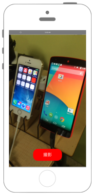

# カメラの起動と画像の保存



`Info.plist`に`NSCameraUsageDescription`と`NSPhotoLibraryUsageDescription`と`NSPhotoLibraryAddUsageDescription`を追加します

```swift fct_label="Swift 4.x"
//
//  ViewController.swift
//  avfoundation002
//
//  Copyright © 2016年 FaBo, Inc. All rights reserved.
//

import UIKit
import AVFoundation

class ViewController: UIViewController {
    
    // セッション.
    var mySession : AVCaptureSession!
    // デバイス.
    var myDevice : AVCaptureDevice!
    // 画像のアウトプット.
    var myImageOutput: AVCaptureStillImageOutput!
    
    override func viewDidLoad() {
        super.viewDidLoad()
        
        // セッションの作成.
        mySession = AVCaptureSession()
        
        // デバイス一覧の取得.
        let devices = AVCaptureDevice.devices()
        
        // バックカメラをmyDeviceに格納.
        for device in devices {
            if(device.position == AVCaptureDevice.Position.back){
                myDevice = device as! AVCaptureDevice
            }
        }
        
        // バックカメラからVideoInputを取得.
        let videoInput = try! AVCaptureDeviceInput.init(device: myDevice)
        // セッションに追加.
        mySession.addInput(videoInput)
        
        // 出力先を生成.
        myImageOutput = AVCaptureStillImageOutput()
        
        // セッションに追加.
        mySession.addOutput(myImageOutput)
        
        // 画像を表示するレイヤーを生成.
        let myVideoLayer = AVCaptureVideoPreviewLayer.init(session: mySession)
        myVideoLayer.frame = self.view.bounds
        myVideoLayer.videoGravity = AVLayerVideoGravity.resizeAspectFill
        
        // Viewに追加.
        self.view.layer.addSublayer(myVideoLayer)
        
        // セッション開始.
        mySession.startRunning()
        
        // UIボタンを作成.
        let myButton = UIButton(frame: CGRect(x: 0, y: 0, width: 120, height: 50))
        myButton.backgroundColor = UIColor.red
        myButton.layer.masksToBounds = true
        myButton.setTitle("撮影", for: .normal)
        myButton.layer.cornerRadius = 20.0
        myButton.layer.position = CGPoint(x: self.view.bounds.width/2, y:self.view.bounds.height-50)
        myButton.addTarget(self, action: #selector(onClickMyButton), for: .touchUpInside)
        
        // UIボタンをViewに追加.
        self.view.addSubview(myButton);
        
    }
    
    // ボタンイベント.
    @objc func onClickMyButton(sender: UIButton){
        
        // ビデオ出力に接続.
        // let myVideoConnection = myImageOutput.connectionWithMediaType(AVMediaTypeVideo)
        let myVideoConnection = myImageOutput.connection(with: AVMediaType.video)
        
        // 接続から画像を取得.
        self.myImageOutput.captureStillImageAsynchronously(from: myVideoConnection!, completionHandler: {(imageDataBuffer, error) in
            if let e = error {
                print(e.localizedDescription)
                return
            }
            // 取得したImageのDataBufferをJpegに変換.
            let myImageData = AVCapturePhotoOutput.jpegPhotoDataRepresentation(forJPEGSampleBuffer: imageDataBuffer!, previewPhotoSampleBuffer: nil)
            // JpegからUIIMageを作成.
            let myImage = UIImage(data: myImageData!)
            // アルバムに追加.
            UIImageWriteToSavedPhotosAlbum(myImage!, nil, nil, nil)
        })
    }
}
```

```swift fct_label="Swift 3.x"
//
//  ViewController.swift
//  avfoundation002
//
//  Copyright © 2016年 FaBo, Inc. All rights reserved.
//

import UIKit
import AVFoundation

class ViewController: UIViewController {
    
    // セッション.
    var mySession : AVCaptureSession!
    // デバイス.
    var myDevice : AVCaptureDevice!
    // 画像のアウトプット.
    var myImageOutput: AVCaptureStillImageOutput!
    
    override func viewDidLoad() {
        super.viewDidLoad()
        
        // セッションの作成.
        mySession = AVCaptureSession()
        
        // デバイス一覧の取得.
        let devices = AVCaptureDevice.devices()
        
        // バックカメラをmyDeviceに格納.
        for device in devices! {
            if(device.position == AVCaptureDevicePosition.back){
                myDevice = device as! AVCaptureDevice
            }
        }
        
        // バックカメラからVideoInputを取得.
        let videoInput = try! AVCaptureDeviceInput.init(device: myDevice)
        // セッションに追加.
        mySession.addInput(videoInput)
        
        // 出力先を生成.
        myImageOutput = AVCaptureStillImageOutput()
        
        // セッションに追加.
        mySession.addOutput(myImageOutput)
        
        // 画像を表示するレイヤーを生成.
        let myVideoLayer = AVCaptureVideoPreviewLayer.init(session: mySession)
        myVideoLayer?.frame = self.view.bounds
        myVideoLayer?.videoGravity = AVLayerVideoGravityResizeAspectFill
        
        // Viewに追加.
        self.view.layer.addSublayer(myVideoLayer!)
        
        // セッション開始.
        mySession.startRunning()
        
        // UIボタンを作成.
        let myButton = UIButton(frame: CGRect(x: 0, y: 0, width: 120, height: 50))
        myButton.backgroundColor = UIColor.red
        myButton.layer.masksToBounds = true
        myButton.setTitle("撮影", for: .normal)
        myButton.layer.cornerRadius = 20.0
        myButton.layer.position = CGPoint(x: self.view.bounds.width/2, y:self.view.bounds.height-50)
        myButton.addTarget(self, action: #selector(onClickMyButton), for: .touchUpInside)
        
        // UIボタンをViewに追加.
        self.view.addSubview(myButton);
        
    }
    
    // ボタンイベント.
    func onClickMyButton(sender: UIButton){
        
        // ビデオ出力に接続.
        // let myVideoConnection = myImageOutput.connectionWithMediaType(AVMediaTypeVideo)
        let myVideoConnection = myImageOutput.connection(withMediaType: AVMediaTypeVideo)
        
        // 接続から画像を取得.
        self.myImageOutput.captureStillImageAsynchronously(from: myVideoConnection, completionHandler: {(imageDataBuffer, error) in
            if let e = error {
                print(e.localizedDescription)
                return
            }
            // 取得したImageのDataBufferをJpegに変換.
            let myImageData = AVCapturePhotoOutput.jpegPhotoDataRepresentation(forJPEGSampleBuffer: imageDataBuffer!, previewPhotoSampleBuffer: nil)
            // JpegからUIIMageを作成.
            let myImage = UIImage(data: myImageData!)
            // アルバムに追加.
            UIImageWriteToSavedPhotosAlbum(myImage!, nil, nil, nil)
        })
    }
}
```

```swift fct_label="Swift 2.3"
//
//  ViewController.swift
//  avfoundation002
//
//  Copyright © 2016年 FaBo, Inc. All rights reserved.
//

import UIKit
import AVFoundation

class ViewController: UIViewController {
    
    // セッション.
    var mySession : AVCaptureSession!
    // デバイス.
    var myDevice : AVCaptureDevice!
    // 画像のアウトプット.
    var myImageOutput : AVCaptureStillImageOutput!
    
    
    override func viewDidLoad() {
        super.viewDidLoad()
        
        // セッションの作成.
        mySession = AVCaptureSession()
        
        // デバイス一覧の取得.
        let devices = AVCaptureDevice.devices()
        
        // バックカメラをmyDeviceに格納.
        for device in devices{
            if(device.position == AVCaptureDevicePosition.Back){
                myDevice = device as! AVCaptureDevice
            }
        }
        
        // バックカメラからVideoInputを取得.
        let videoInput = try! AVCaptureDeviceInput.init(device: myDevice)
        // セッションに追加.
        mySession.addInput(videoInput)
        
        // 出力先を生成.
        myImageOutput = AVCaptureStillImageOutput()
        
        // セッションに追加.
        mySession.addOutput(myImageOutput)
        
        // 画像を表示するレイヤーを生成.
        let myVideoLayer = AVCaptureVideoPreviewLayer.init(session: mySession)
        myVideoLayer.frame = self.view.bounds
        myVideoLayer.videoGravity = AVLayerVideoGravityResizeAspectFill
        
        // Viewに追加.
        self.view.layer.addSublayer(myVideoLayer)
        
        // セッション開始.
        mySession.startRunning()
        
        // UIボタンを作成.
        let myButton = UIButton(frame: CGRectMake(0,0,120,50))
        myButton.backgroundColor = UIColor.redColor();
        myButton.layer.masksToBounds = true
        myButton.setTitle("撮影", forState: .Normal)
        myButton.layer.cornerRadius = 20.0
        myButton.layer.position = CGPoint(x: self.view.bounds.width/2, y:self.view.bounds.height-50)
        myButton.addTarget(self, action: #selector(ViewController.onClickMyButton(_:)), forControlEvents: .TouchUpInside)
        
        // UIボタンをViewに追加.
        self.view.addSubview(myButton);
        
    }
    
    // ボタンイベント.
    func onClickMyButton(sender: UIButton){
        
        // ビデオ出力に接続.
        let myVideoConnection = myImageOutput.connectionWithMediaType(AVMediaTypeVideo)
        // 接続から画像を取得.
        self.myImageOutput.captureStillImageAsynchronouslyFromConnection(myVideoConnection, completionHandler: { (imageDataBuffer, error) -> Void in
            if let e = error {
                print(e.localizedDescription)
                return
            }
            
            // 取得したImageのDataBufferをJpegに変換.
            let myImageData = AVCaptureStillImageOutput.jpegStillImageNSDataRepresentation(imageDataBuffer)
            // JpegからUIIMageを作成.
            let myImage = UIImage(data: myImageData)!
            // アルバムに追加.
            UIImageWriteToSavedPhotosAlbum(myImage, self, nil, nil)
            
        })
    }
}
```

## 3.xと4.xの差分
* `dvices!` が `devices` に変更
* `AVCaptureDevicePosition.back` が `AVCaptureDevice.Position.back` に変更
* `myVideoLayer?` と `myVideoLayer!` が `myVideoLayer` に変更
* `AVLayerVideoGravityResizeAspectFill` が `AVLayerVideoGravity.resizeAspectFill` に変更
* `func onClickMyButton(sender: UIButton)` に `@objc` を追加
* `(withMediaType: AVMediaTypeVideo)` が `(with: AVMediaType.video)` に変更
* `myVideoConnection` が `myVideoConnection!` に変更

## 2.xと3.xの差分

* `AVCaptureStillImageOutput`はDeprecated。代わりに`AVCapturePhotoOutput`を使用
* enum列挙体のイニシャルの小文字化
    * 例 : `AVCaptureDevicePosition.Back`から`AVCaptureDevicePosition.back`に変更
* UIColorによる色指定の簡略化
    * 例 : `UIColor.blueColor()`から`UIColor.blue`
* `UIButton.setTitle(String?, forState: UIControlState)`から`UIButton.setTitle(String?, for: UIControlState)`に変更
* `UIButton.addTarget(AnyObject?, action: Selector, forControlEvents: UIControlEvents)`から`UIButton.addTarget(AnyObject?, action: Selector, for: UIControlEvents)`に変更
* `UIControlEvents.TouchUpInside`から`UIControlEvents.touchUpInside`に変更
* `AVCaptureStillImageOutput.connectionWithMediaType(String!)`から`AVCapturePhotoOutput.connection(withMediaType: String!)`に変更
* `AVCaptureStillImageOutput.captureStillImageAsynchronouslyFromConnection(AVCaptureConnection!, completionHandler: ((CMSampleBuffer!, NSError!) -> Void)!)`から`AVCaptureStillImageOutput.captureStillImageAsynchronously(from: AVCaptureConnection!, completionHandler: ((CMSampleBuffer?, Error?) -> Void)!)`に変更

## Reference

* AV Foundation Framework
    * https://developer.apple.com/library/ios/documentation/AVFoundation/Reference/AVFoundationFramework/
* AVCaptureStillImageOutput
    * https://developer.apple.com/reference/avfoundation/avcapturestillimageoutput
