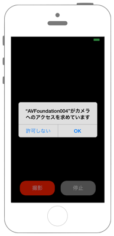

# 撮影した動画を保存する



`Info.plist`に`NSMicrophoneUsageDescription`と`NSCameraUsageDescription`、`NSPhotoLibraryUsageDescription`を追加します

```swift fct_label="Swift 4.x"
//
//  ViewController.swift
//  avfoundation004
//
//  Copyright © 2016年 FaBo, Inc. All rights reserved.
//
import UIKit
import AVFoundation
import AssetsLibrary

class ViewController: UIViewController, AVCaptureFileOutputRecordingDelegate {
    
    // スタートボタン.
    private var myButtonStart: UIButton!
    
    // ストップボタン.
    private var myButtonStop: UIButton!
    
    // ビデオのアウトプット.
    private var myVideoOutput: AVCaptureMovieFileOutput!
    
    override func viewDidLoad() {
        super.viewDidLoad()
        
        // セッションの作成.
        let mySession = AVCaptureSession()
        
        // デバイス.
        var myDevice: AVCaptureDevice!
        
        // 出力先を生成.
        let myImageOutput = AVCaptureStillImageOutput()
        
        // マイクを取得.
        let audioCaptureDevice = AVCaptureDevice.devices(for: AVMediaType.audio)
        
        // マイクをセッションのInputに追加.
        let audioInput = try! AVCaptureDeviceInput.init(device: audioCaptureDevice.first!)
        
        // デバイス一覧の取得.
        let devices = AVCaptureDevice.devices()
        
        // バックライトをmyDeviceに格納.
        for device in devices {
            if(device.position == AVCaptureDevice.Position.back){
                myDevice = device
            }
        }
        
        // バックカメラを取得.
        let videoInput = try! AVCaptureDeviceInput.init(device: myDevice)
        
        // ビデオをセッションのInputに追加.
        mySession.addInput(videoInput)
        
        // オーディオをセッションに追加.
        mySession.addInput(audioInput);
        
        // セッションに追加.
        mySession.addOutput(myImageOutput)
        
        // 動画の保存.
        myVideoOutput = AVCaptureMovieFileOutput()
        
        // ビデオ出力をOutputに追加.
        mySession.addOutput(myVideoOutput)
        
        // 画像を表示するレイヤーを生成.
        let myVideoLayer = AVCaptureVideoPreviewLayer.init(session: mySession)
        myVideoLayer.frame = self.view.bounds
        myVideoLayer.videoGravity = AVLayerVideoGravity.resizeAspectFill
        
        // Viewに追加.
        self.view.layer.addSublayer(myVideoLayer)
        
        // セッション開始.
        mySession.startRunning()
        
        // UIボタンを作成.
        myButtonStart = UIButton(frame: CGRect(x: 0, y: 0, width: 120, height: 50))
        myButtonStop = UIButton(frame: CGRect(x: 0, y: 0, width: 120, height: 50))
        
        myButtonStart.backgroundColor = UIColor.red
        myButtonStop.backgroundColor = UIColor.gray
        
        myButtonStart.layer.masksToBounds = true
        myButtonStop.layer.masksToBounds = true
        
        myButtonStart.setTitle("撮影", for: .normal)
        myButtonStop.setTitle("停止", for: .normal)
        
        myButtonStart.layer.cornerRadius = 20.0
        myButtonStop.layer.cornerRadius = 20.0
        
        myButtonStart.layer.position = CGPoint(x: self.view.bounds.width/2 - 70, y:self.view.bounds.height-50)
        myButtonStop.layer.position = CGPoint(x: self.view.bounds.width/2 + 70, y:self.view.bounds.height-50)
        
        myButtonStart.addTarget(self, action: #selector(ViewController.onClickMyButton), for: .touchUpInside)
        myButtonStop.addTarget(self, action: #selector(ViewController.onClickMyButton), for: .touchUpInside)
        
        // UIボタンをViewに追加.
        self.view.addSubview(myButtonStart);
        self.view.addSubview(myButtonStop);
    }
    
    /*
     ボタンイベント.
     */
    @objc internal func onClickMyButton(sender: UIButton){
        
        // 撮影開始.
        if( sender == myButtonStart ){
            let paths = NSSearchPathForDirectoriesInDomains(.documentDirectory, .userDomainMask, true)
            
            // フォルダ.
            let documentsDirectory = paths[0]
            
            // ファイル名.
            let filePath = "\(documentsDirectory)/test.mp4"
            
            // URL.
            let fileURL = URL(fileURLWithPath: filePath)
            
            // 録画開始.
            myVideoOutput.startRecording(to: fileURL, recordingDelegate: self)
        }
            // 撮影停止.
        else if ( sender == myButtonStop ){
            myVideoOutput.stopRecording()
        }
    }
    
    // MARK: - AVCaptureFileOutputRecordingDelegate
    
    /*
     動画のキャプチャーが終わった時に呼ばれるメソッド.
     */
    func fileOutput(_ output: AVCaptureFileOutput, didFinishRecordingTo outputFileURL: URL, from connections: [AVCaptureConnection], error: Error?) {
        //AssetsLibraryを生成する.
        let assetsLib = ALAssetsLibrary()
        
        //動画のパスから動画をフォトライブラリに保存する.
        assetsLib.writeVideoAtPath(toSavedPhotosAlbum: outputFileURL, completionBlock: nil)    }
}
```

```swift fct_label="Swift 3.x"
//
//  ViewController.swift
//  avfoundation004
//
//  Copyright © 2016年 FaBo, Inc. All rights reserved.
//
import UIKit
import AVFoundation
import AssetsLibrary

class ViewController: UIViewController, AVCaptureFileOutputRecordingDelegate {
    
    // スタートボタン.
    private var myButtonStart: UIButton!
    
    // ストップボタン.
    private var myButtonStop: UIButton!
    
    // ビデオのアウトプット.
    private var myVideoOutput: AVCaptureMovieFileOutput!
    
    override func viewDidLoad() {
        super.viewDidLoad()
        
        // セッションの作成.
        let mySession = AVCaptureSession()
        
        // デバイス.
        var myDevice: AVCaptureDevice!
        
        // 出力先を生成.
        let myImageOutput = AVCaptureStillImageOutput()
        
        // マイクを取得.
        let audioCaptureDevice = AVCaptureDevice.devices(withMediaType: AVMediaTypeAudio)
        
        // マイクをセッションのInputに追加.
        let audioInput = try! AVCaptureDeviceInput.init(device: audioCaptureDevice?.first as! AVCaptureDevice)
        
        // デバイス一覧の取得.
        let devices = AVCaptureDevice.devices()
        
        // バックライトをmyDeviceに格納.
        for device in devices! {
            if(device.position == AVCaptureDevicePosition.back){
                myDevice = device as? AVCaptureDevice
            }
        }
        
        // バックカメラを取得.
        let videoInput = try! AVCaptureDeviceInput.init(device: myDevice)
        
        // ビデオをセッションのInputに追加.
        mySession.addInput(videoInput)
        
        // オーディオをセッションに追加.
        mySession.addInput(audioInput);
        
        // セッションに追加.
        mySession.addOutput(myImageOutput)
        
        // 動画の保存.
        myVideoOutput = AVCaptureMovieFileOutput()
        
        // ビデオ出力をOutputに追加.
        mySession.addOutput(myVideoOutput)
        
        // 画像を表示するレイヤーを生成.
        let myVideoLayer = AVCaptureVideoPreviewLayer.init(session: mySession)
        myVideoLayer?.frame = self.view.bounds
        myVideoLayer?.videoGravity = AVLayerVideoGravityResizeAspectFill
        
        // Viewに追加.
        self.view.layer.addSublayer(myVideoLayer!)
        
        // セッション開始.
        mySession.startRunning()
        
        // UIボタンを作成.
        myButtonStart = UIButton(frame: CGRect(x: 0, y: 0, width: 120, height: 50))
        myButtonStop = UIButton(frame: CGRect(x: 0, y: 0, width: 120, height: 50))
        
        myButtonStart.backgroundColor = UIColor.red
        myButtonStop.backgroundColor = UIColor.gray
        
        myButtonStart.layer.masksToBounds = true
        myButtonStop.layer.masksToBounds = true
        
        myButtonStart.setTitle("撮影", for: .normal)
        myButtonStop.setTitle("停止", for: .normal)
        
        myButtonStart.layer.cornerRadius = 20.0
        myButtonStop.layer.cornerRadius = 20.0
        
        myButtonStart.layer.position = CGPoint(x: self.view.bounds.width/2 - 70, y:self.view.bounds.height-50)
        myButtonStop.layer.position = CGPoint(x: self.view.bounds.width/2 + 70, y:self.view.bounds.height-50)
        
        myButtonStart.addTarget(self, action: #selector(ViewController.onClickMyButton), for: .touchUpInside)
        myButtonStop.addTarget(self, action: #selector(ViewController.onClickMyButton), for: .touchUpInside)
        
        // UIボタンをViewに追加.
        self.view.addSubview(myButtonStart);
        self.view.addSubview(myButtonStop);
    }
    
    /*
     ボタンイベント.
     */
    internal func onClickMyButton(sender: UIButton){
        
        // 撮影開始.
        if( sender == myButtonStart ){
            let paths = NSSearchPathForDirectoriesInDomains(.documentDirectory, .userDomainMask, true)
            
            // フォルダ.
            let documentsDirectory = paths[0]
            
            // ファイル名.
            let filePath = "\(documentsDirectory)/test.mp4"
            
            // URL.
            let fileURL = URL(fileURLWithPath: filePath!)
            
            // 録画開始.
            myVideoOutput.startRecording(toOutputFileURL: fileURL, recordingDelegate: self)
        }
            // 撮影停止.
        else if ( sender == myButtonStop ){
            myVideoOutput.stopRecording()
        }
    }
    
    // MARK: - AVCaptureFileOutputRecordingDelegate
    
    /*
     動画のキャプチャーが終わった時に呼ばれるメソッド.
     */
    func capture(_ captureOutput: AVCaptureFileOutput!, didFinishRecordingToOutputFileAt outputFileURL: URL!, fromConnections connections: [AnyObject]!, error: Error!) {
        //AssetsLibraryを生成する.
        let assetsLib = ALAssetsLibrary()
        
        //動画のパスから動画をフォトライブラリに保存する.
        assetsLib.writeVideoAtPath(toSavedPhotosAlbum: outputFileURL, completionBlock: nil)
    }
}
```

```swift fct_label="Swift 2.3"
//
//  ViewController.swift
//  avfoundation004
//
//  Copyright © 2016年 FaBo, Inc. All rights reserved.
//
import UIKit
import AVFoundation
import AssetsLibrary

class ViewController: UIViewController, AVCaptureFileOutputRecordingDelegate {
    
    // スタートボタン.
    private var myButtonStart : UIButton!
    
    // ストップボタン.
    private var myButtonStop : UIButton!
    
    // ビデオのアウトプット.
    private var myVideoOutput : AVCaptureMovieFileOutput!
    
    override func viewDidLoad() {
        super.viewDidLoad()
        
        // セッションの作成.
        let mySession : AVCaptureSession = AVCaptureSession()
        
        // デバイス.
        var myDevice : AVCaptureDevice!
        
        // 出力先を生成.
        let myImageOutput = AVCaptureStillImageOutput()
        
        // マイクを取得.
        let audioCaptureDevice = AVCaptureDevice.devicesWithMediaType(AVMediaTypeAudio)
        
        // マイクをセッションのInputに追加.
        let audioInput = try! AVCaptureDeviceInput.init(device: audioCaptureDevice?.first as! AVCaptureDevice)
        
        // デバイス一覧の取得.
        let devices = AVCaptureDevice.devices()
        
        // バックライトをmyDeviceに格納.
        for device in devices{
            if(device.position == AVCaptureDevicePosition.Back){
                myDevice = device as! AVCaptureDevice
            }
        }
        
        // バックカメラを取得.
        let videoInput = try! AVCaptureDeviceInput.init(device: myDevice)
        
        // ビデオをセッションのInputに追加.
        mySession.addInput(videoInput)
        
        // オーディオをセッションに追加.
        mySession.addInput(audioInput);
        
        // セッションに追加.
        mySession.addOutput(myImageOutput)
        
        // 動画の保存.
        myVideoOutput = AVCaptureMovieFileOutput()
        
        // ビデオ出力をOutputに追加.
        mySession.addOutput(myVideoOutput)
        
        // 画像を表示するレイヤーを生成.
        let myVideoLayer = AVCaptureVideoPreviewLayer.init(session: mySession)
        myVideoLayer.frame = self.view.bounds
        myVideoLayer.videoGravity = AVLayerVideoGravityResizeAspectFill
        
        // Viewに追加.
        self.view.layer.addSublayer(myVideoLayer)
        
        // セッション開始.
        mySession.startRunning()
        
        // UIボタンを作成.
        myButtonStart = UIButton(frame: CGRectMake(0,0,120,50))
        myButtonStop = UIButton(frame: CGRectMake(0,0,120,50))
        
        myButtonStart.backgroundColor = UIColor.redColor();
        myButtonStop.backgroundColor = UIColor.grayColor();
        
        myButtonStart.layer.masksToBounds = true
        myButtonStop.layer.masksToBounds = true
        
        myButtonStart.setTitle("撮影", forState: .Normal)
        myButtonStop.setTitle("停止", forState: .Normal)
        
        myButtonStart.layer.cornerRadius = 20.0
        myButtonStop.layer.cornerRadius = 20.0
        
        myButtonStart.layer.position = CGPoint(x: self.view.bounds.width/2 - 70, y:self.view.bounds.height-50)
        myButtonStop.layer.position = CGPoint(x: self.view.bounds.width/2 + 70, y:self.view.bounds.height-50)
        
        myButtonStart.addTarget(self, action: #selector(ViewController.onClickMyButton(_:)), forControlEvents: .TouchUpInside)
        myButtonStop.addTarget(self, action: #selector(ViewController.onClickMyButton(_:)), forControlEvents: .TouchUpInside)
        
        // UIボタンをViewに追加.
        self.view.addSubview(myButtonStart);
        self.view.addSubview(myButtonStop);
    }
    
    /*
     ボタンイベント.
     */
    internal func onClickMyButton(sender: UIButton){
        
        // 撮影開始.
        if( sender == myButtonStart ){
            let paths = NSSearchPathForDirectoriesInDomains(.DocumentDirectory, .UserDomainMask, true)
            
            // フォルダ.
            let documentsDirectory = paths[0] 
            
            // ファイル名.
            let filePath : String? = "\(documentsDirectory)/test.mp4"
            
            // URL.
            let fileURL = NSURL(fileURLWithPath: filePath!)
            
            // 録画開始.
            myVideoOutput.startRecordingToOutputFileURL(fileURL, recordingDelegate: self)
        }
            
            // 撮影停止.
        else if ( sender == myButtonStop ){
            myVideoOutput.stopRecording()
        }
    }
    
    // MARK: - AVCaptureFileOutputRecordingDelegate
    
    /*
     動画のキャプチャーが終わった時に呼ばれるメソッド.
     */
    func captureOutput(captureOutput: AVCaptureFileOutput!, didFinishRecordingToOutputFileAtURL outputFileURL: NSURL!, fromConnections connections: [AnyObject]!, error: NSError!) {
        
        //AssetsLibraryを生成する.
        let assetsLib = ALAssetsLibrary()
        
        //動画のパスから動画をフォトライブラリに保存する.
        assetsLib.writeVideoAtPathToSavedPhotosAlbum(outputFileURL, completionBlock: nil)
    }
}
```

## 3.xと4.xの差分
* `AVCaptureDevice.devices(withMediaType: AVMediaTypeAudio)` が `AVCaptureDevice.devices(for: AVMediaType.audio)` に変更
* `AVCaptureDeviceInput.init(device: audioCaptureDevice?.first as! AVCaptureDevice)` が `AVCaptureDeviceInput.init(device: audioCaptureDevice.first!)` に変更
* `devices!` が `devices` に変更
* `AVCaptureDevicePosition` が `AVCaptureDevice.Position` に変更
* `myVideoLayer?` と `myVideoLayer!` を `myVideoLayer` に変更
* `device as? AVCaptureDevice` を `device` に変更
* `AVLayerVideoGravityResizeAspectFill` が `AVLayerVideoGravity.resizeAspectFill` に変更
* `internal func onClickMyButton(sender: UIButton)` に `@objc` を追加
* `filePath!` を `filePath` に変更
* `startRecording(toOutputFileURL: fileURL, recordingDelegate: self)` が `startRecording(to: fileURL, recordingDelegate: self)` に変更
* `capture(_ captureOutput: AVCaptureFileOutput!, didFinishRecordingToOutputFileAt outputFileURL: URL!, fromConnections connections: [AnyObject]!, error: Error!)` が `fileOutput(_ output: AVCaptureFileOutput, didFinishRecordingTo outputFileURL: URL, from connections: [AVCaptureConnection], error: Error?)` に変更

## 2.xと3.xの差分

* `ALAssetsLibrary.writeVideoAtPathToSavedPhotosAlbum(outputFileURL, completionBlock: nil)`から`ALAssetsLibrary.writeVideoAtPath(toSavedPhotosAlbum videoPathURL: URL!, completionBlock: ALAssetsLibraryWriteVideoCompletionBlock!)`に変更する
* `AVCaptureFileOutputRecordingDelegate`プロトコルにおけるのインタフェースの変更
    * ` func captureOutput(captureOutput: AVCaptureFileOutput!, didFinishRecordingToOutputFileAtURL outputFileURL: NSURL!, fromConnections connections: [AnyObject]!, error: NSError!)` → `func capture(_ captureOutput: AVCaptureFileOutput!, didFinishRecordingToOutputFileAt outputFileURL: URL!, fromConnections connections: [AnyObject]!, error: Error!)`
* `AVCaptureDevice.defaultDeviceWithMediaType(AVMediaTypeVideo)`から`AVCaptureDevice.defaultDevice(withMediaType: AVMediaTypeVideo)`に変更
* `AVCaptureDevice.devicesWithMediaType(AVMediaTypeAudio)`から`AVCaptureDevice.devices(withMediaType: AVMediaTypeAudio)`に変更
* `AVCaptureDevicePosition.Back`から`AVCaptureDevicePosition.back`に変更
* `CGSizeMake(CGFloat, CGFloat)`から`CGSize(width: CGFloat, height: CGFloat)`に変更
* `UIButton.setTitle(String?, forState: UIControlState)`から`UIButton.setTitle(String?, for: UIControlState)`に変更
* `NSURL`から`URL`に変更
* `AVCaptureMovieFileOutput.startRecordingToOutputFileURL(NSURL!, recordingDelegate: AVCaptureFileOutputRecordingDelegate!)`から`AVCaptureMovieFileOutput.startRecording(toOutputFileURL: URL!, recordingDelegate: AVCaptureFileOutputRecordingDelegate!)`に変更

## Reference

* AV Foundation Framework
    * https://developer.apple.com/library/ios/documentation/AVFoundation/Reference/AVFoundationFramework/
