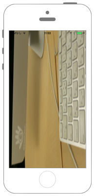

# 動画から静止画を取り出す



```swift fct_label="Swift 5.x/4.x/3.x"
//
//  ViewController.swift
//  avfoundation005
//
//  Copyright © 2016年 FaBo, Inc. All rights reserved.
//
import UIKit
import AVFoundation
import AssetsLibrary

class ViewController: UIViewController {
    
    override func viewDidLoad() {
        
        // パスからassetを生成.
        let path = Bundle.main.path(forResource: "test", ofType: "mov")
        let fileURL = URL(fileURLWithPath: path!)
        let avAsset = AVURLAsset(url: fileURL, options: nil)
        
        // assetから画像をキャプチャーする為のジュネレーターを生成.
        let generator = AVAssetImageGenerator(asset: avAsset)
        generator.maximumSize = self.view.frame.size
        
        // 動画の指定した時間での画像を得る(今回は動画の最後のキャプチャを撮る).
        let capturedImage = try! generator.copyCGImage(at: avAsset.duration, actualTime: nil)
        
        // 静止画用のImageViewを生成.
        let imageView = UIImageView(frame: self.view.frame)
        imageView.image = UIImage(cgImage: capturedImage)
        print(avAsset.duration)
        
        // imageViewをviewに追加.
        self.view.addSubview(imageView)
    }
}
```

```swift fct_label="Swift 2.3"
//
//  ViewController.swift
//  avfoundation005
//
//  Copyright © 2016年 FaBo, Inc. All rights reserved.
//
import UIKit
import AVFoundation
import AssetsLibrary

class ViewController: UIViewController {
    
    override func viewDidLoad() {
        
        // パスからassetを生成.
        let path = NSBundle.mainBundle().pathForResource("test", ofType: "mov")
        let fileURL = NSURL(fileURLWithPath: path!)
        let avAsset = AVURLAsset(URL: fileURL, options: nil)
        
        // assetから画像をキャプチャーする為のジュネレーターを生成.
        let generator = AVAssetImageGenerator(asset: avAsset)
        generator.maximumSize = self.view.frame.size
        
        // 動画の指定した時間での画像を得る(今回は動画の最後のキャプチャを撮る).
        let capturedImage = try! generator.copyCGImageAtTime(avAsset.duration, actualTime: nil)
        
        // 静止画用のImageViewを生成.
        let imageView = UIImageView(frame: self.view.frame)
        imageView.image = UIImage(CGImage: capturedImage)
        print(avAsset.duration)
        
        // imageViewをviewに追加.
        self.view.addSubview(imageView)
    }
}
```

## 2.xと3.xの差分

* `NSBundle.mainBundle().pathForResource(String?, ofType: String?)`から`Bundle.main.path(forResource: String?, ofType: String?)`に変更
* `NSURL`から`URL`に変更
* `AVURLAsset(URL: NSURL)`に`AVURLAsset(url: URL)`に変更
* `AVAssetImageGenerator.copyCGImageAtTime(CMTime, actualTime: UnsafeMutablePointer<CMTime>)`から`AVAssetImageGenerator.copyCGImage(at: CMTime, actualTime: UnsafeMutablePointer<CMTime>?)`に変更
* `UIImage(CGImage: CGImage)`から`UIImage(cgImage: CGImage)`に変更

## Reference

* AV Foundation Framework
    * https://developer.apple.com/library/ios/documentation/AVFoundation/Reference/AVFoundationFramework/
* NSBundle
    * https://developer.apple.com/library/mac/documentation/Cocoa/Reference/Foundation/Classes/NSBundle_Class/
    * https://developer.apple.com/reference/foundation/nsbundle
* AssetsLibrary
    * https://developer.apple.com/library/ios/documentation/AssetsLibrary/Reference/AssetsLibraryFramework/
