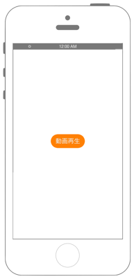
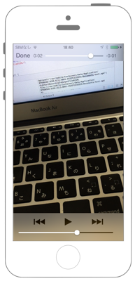

# MediaPlayerを使った動画の再生

 

## Swift 3.0

`Info.plist`に`NSAppleMusicUsageDescription`を追加します

```swift
//
//  ViewController.swift
//  avfoundation007
//
//  Created by akimach on 2016/08/28.
//  Copyright © 2016年 akimacho. All rights reserved.
//
import UIKit
import MediaPlayer

class ViewController: UIViewController {
    
    // MPMoviePlayerViewControllerの宣言.
    var myMoviePlayerView: MPMoviePlayerViewController!
    
    override func viewDidLoad() {
        super.viewDidLoad()
        
        // ボタンの生成.
        let myButton = UIButton()
        myButton.frame.size = CGSize(width: 100, height: 40)
        myButton.layer.position = CGPoint(x: self.view.bounds.width/2, y: self.view.bounds.height/2)
        myButton.layer.masksToBounds = true
        myButton.layer.cornerRadius = 20.0
        myButton.backgroundColor = UIColor.orange
        myButton.setTitle("動画再生", for: .normal)
        myButton.setTitleColor(UIColor.white, for: .normal)
        myButton.setTitleShadowColor(UIColor.gray, for: .normal)
        myButton.addTarget(self, action: #selector(onClickMyButton(sender:)), for: .touchUpInside)
        self.view.addSubview(myButton)
    }
    
    // ボタンのクリックイベント.
    func onClickMyButton(sender: UIButton) {
        
        // 動画のパス.
        let myMoviePath = URL.init(fileURLWithPath: Bundle.main.path(forResource: "test", ofType: "mov")!)
        
        // MPMoviePlayerViewControllerのインスタンスを生成.
        myMoviePlayerView = MPMoviePlayerViewController(contentURL: myMoviePath)
        
        // 動画の再生が終了した時のNotification.
        NotificationCenter.default.addObserver(self, selector: #selector(moviePlayBackDidFinish(notification:)),
                                                         name: Notification.Name.MPMoviePlayerPlaybackDidFinish,
                                                         object: myMoviePlayerView.moviePlayer)
        
        // 画面遷移.
        self.present(myMoviePlayerView, animated: true, completion: nil)
    }
    
    // 動画の再生が終了した時に呼ばれるメソッド.
    func moviePlayBackDidFinish(notification: NSNotification) {
        print("moviePlayBackDidFinish:")
        
        // 通知があったらnotificationを削除.
        NotificationCenter.default.removeObserver(self, name: Notification.Name.MPMoviePlayerPlaybackDidFinish, object: nil)
    }
    
}
```

## Swift 2.3

```swift
//
//  ViewController.swift
//  avfoundation007
//
//  Created by akimach on 2016/08/28.
//  Copyright © 2016年 akimacho. All rights reserved.
//
import UIKit
import MediaPlayer

class ViewController: UIViewController {
    
    // MPMoviePlayerViewControllerの宣言.
    var myMoviePlayerView: MPMoviePlayerViewController!
    
    override func viewDidLoad() {
        super.viewDidLoad()
        
        // ボタンの生成.
        let myButton = UIButton()
        myButton.frame.size = CGSize(width: 100, height: 40)
        myButton.layer.position = CGPoint(x: self.view.bounds.width/2, y: self.view.bounds.height/2)
        myButton.layer.masksToBounds = true
        myButton.layer.cornerRadius = 20.0
        myButton.backgroundColor = UIColor.orangeColor()
        myButton.setTitle("動画再生", forState: .Normal)
        myButton.setTitleColor(UIColor.whiteColor(), forState: .Normal)
        myButton.setTitleShadowColor(UIColor.grayColor(), forState: .Normal)
        myButton.addTarget(self, action: #selector(ViewController.onClickMyButton(_:)), forControlEvents: .TouchUpInside)
        self.view.addSubview(myButton)
    }
    
    // ボタンのクリックイベント.
    func onClickMyButton(sender: UIButton) {
        
        // 動画のパス.
        let myMoviePath = NSURL.fileURLWithPath(NSBundle.mainBundle().pathForResource("test", ofType: "mov")!)
        
        // MPMoviePlayerViewControllerのインスタンスを生成.
        myMoviePlayerView = MPMoviePlayerViewController(contentURL: myMoviePath)
        
        // 動画の再生が終了した時のNotification.
        NSNotificationCenter.defaultCenter().addObserver(self, selector: #selector(ViewController.moviePlayBackDidFinish(_:)),
                                                         name: MPMoviePlayerPlaybackDidFinishNotification,
                                                         object: myMoviePlayerView.moviePlayer)
        
        // 画面遷移.
        self.presentViewController(myMoviePlayerView, animated: true, completion: nil)
    }
    
    // 動画の再生が終了した時に呼ばれるメソッド.
    func moviePlayBackDidFinish(notification: NSNotification) {
        print("moviePlayBackDidFinish:")
        
        // 通知があったらnotificationを削除.
        NSNotificationCenter.defaultCenter().removeObserver(self, name: MPMoviePlayerPlaybackDidFinishNotification, object: nil)
    }
    
}
```

## 2.xと3.xの差分

* UIColorによる色指定の簡略化
* `NSURL`から`URL`に変更
* `CGRectMake(CGFloat, CGFloat, CGFloat, CGFloat)`から`CGRect(x: CGFloat, y: CGFloat, width: CGFloat, height: CGFloat)`に変更 
* `UIButton.setTitle(String?, forState: UIControlState)`から`UIButton.setTitle(String?, for: UIControlState)`に変更
* `NSNotificationCenter.defaultCenter().addObserver(AnyObject, selector: Selector, name: String?, object: AnyObject?)`から`NotificationCenter.default.addObserver(AnyObject, selector: Selector, name: NSNotification.Name?, object: AnyObject?)`に変更
* `NSNotificationCenter.defaultCenter().removeObserver(AnyObject, name: String?, object: AnyObject?)`から`NotificationCenter.default.removeObserver(AnyObject, name: NSNotification.Name?, object: AnyObject?)`に変更

## Reference

* AV Foundation Framework
    * https://developer.apple.com/library/ios/documentation/AVFoundation/Reference/AVFoundationFramework/
* NSBundle
    * https://developer.apple.com/library/mac/documentation/Cocoa/Reference/Foundation/Classes/NSBundle_Class/
    * https://developer.apple.com/reference/foundation/nsbundle
