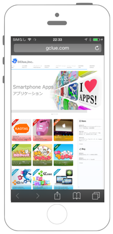
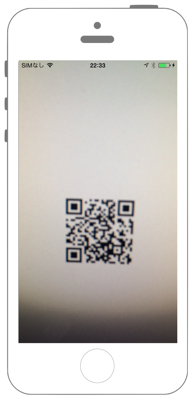
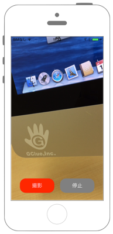

# QRCodeリーダー

  

`Info.plist`に`NSCameraUsageDescription`を追加します。

```swift fct_label="Swift 5.x/4.x"
//
//  ViewController.swift
//  avfoundation008
//
//  Created by akimach on 2016/08/28.
//  Copyright © 2016年 akimacho. All rights reserved.
//
import UIKit
import AVFoundation

class ViewController: UIViewController, AVCaptureMetadataOutputObjectsDelegate {
    
    override func viewDidLoad() {
        super.viewDidLoad()
        
        // セッションの作成.
        let mySession: AVCaptureSession! = AVCaptureSession()
        
        // デバイス一覧の取得.
        let devices = AVCaptureDevice.devices()
        
        // デバイスを格納する.
        var myDevice: AVCaptureDevice!
        
        // バックカメラをmyDeviceに格納.
        for device in devices {
            if(device.position == AVCaptureDevice.Position.back){
                myDevice = device
            }
        }
        
        // バックカメラから入力(Input)を取得.
        let myVideoInput = try! AVCaptureDeviceInput.init(device: myDevice)
        
        if mySession.canAddInput(myVideoInput) {
            // セッションに追加.
            mySession.addInput(myVideoInput)
        }
        
        // 出力(Output)をMeta情報に.
        let myMetadataOutput: AVCaptureMetadataOutput! = AVCaptureMetadataOutput()
        
        if mySession.canAddOutput(myMetadataOutput) {
            // セッションに追加.
            mySession.addOutput(myMetadataOutput)
            // Meta情報を取得した際のDelegateを設定.
            myMetadataOutput.setMetadataObjectsDelegate(self, queue: DispatchQueue.main)
            // 判定するMeta情報にQRCodeを設定.
            myMetadataOutput.metadataObjectTypes = [AVMetadataObject.ObjectType.qr]
        }
        
        // 画像を表示するレイヤーを生成.
        let myVideoLayer = AVCaptureVideoPreviewLayer.init(session: mySession)
        myVideoLayer.frame = self.view.bounds
        myVideoLayer.videoGravity = AVLayerVideoGravity.resizeAspectFill
        
        // Viewに追加.
        self.view.layer.addSublayer(myVideoLayer)
        
        // セッション開始.
        mySession.startRunning()
    }
    
    
    // MARK: - AVCaptureMetadataOutputObjectsDelegate
    
    // Meta情報を検出際に呼ばれるdelegate.
    func metadataOutput(_ output: AVCaptureMetadataOutput, didOutput metadataObjects: [AVMetadataObject], from connection: AVCaptureConnection) {
        if metadataObjects.count > 0 {
            let qrData: AVMetadataMachineReadableCodeObject  = metadataObjects[0] as! AVMetadataMachineReadableCodeObject
            print("\(qrData.type)")
            print("\(qrData.stringValue)")
            
            // SafariでURLを表示.
            UIApplication.shared.openURL(URL(string: qrData.stringValue!)!)
        }
    }
    
}
```

```swift fct_label="Swift 3.x"
//
//  ViewController.swift
//  avfoundation008
//
//  Created by akimach on 2016/08/28.
//  Copyright © 2016年 akimacho. All rights reserved.
//
import UIKit
import AVFoundation

class ViewController: UIViewController, AVCaptureMetadataOutputObjectsDelegate {
    
    override func viewDidLoad() {
        super.viewDidLoad()
        
        // セッションの作成.
        let mySession: AVCaptureSession! = AVCaptureSession()
        
        // デバイス一覧の取得.
        let devices = AVCaptureDevice.devices()
        
        // デバイスを格納する.
        var myDevice: AVCaptureDevice!
        
        // バックカメラをmyDeviceに格納.
        for device in devices! {
            if(device.position == AVCaptureDevicePosition.back){
                myDevice = device as! AVCaptureDevice
            }
        }
        
        // バックカメラから入力(Input)を取得.
        let myVideoInput = try! AVCaptureDeviceInput.init(device: myDevice)
        
        if mySession.canAddInput(myVideoInput) {
            // セッションに追加.
            mySession.addInput(myVideoInput)
        }
        
        // 出力(Output)をMeta情報に.
        let myMetadataOutput: AVCaptureMetadataOutput! = AVCaptureMetadataOutput()
        
        if mySession.canAddOutput(myMetadataOutput) {
            // セッションに追加.
            mySession.addOutput(myMetadataOutput)
            // Meta情報を取得した際のDelegateを設定.
            myMetadataOutput.setMetadataObjectsDelegate(self, queue: DispatchQueue.main)
            // 判定するMeta情報にQRCodeを設定.
            myMetadataOutput.metadataObjectTypes = [AVMetadataObjectTypeQRCode]
        }
        
        // 画像を表示するレイヤーを生成.
        let myVideoLayer = AVCaptureVideoPreviewLayer.init(session: mySession)
        myVideoLayer?.frame = self.view.bounds
        myVideoLayer?.videoGravity = AVLayerVideoGravityResizeAspectFill
        
        // Viewに追加.
        self.view.layer.addSublayer(myVideoLayer!)
        
        // セッション開始.
        mySession.startRunning()
    }
    
    
    // MARK: - AVCaptureMetadataOutputObjectsDelegate
    
    // Meta情報を検出際に呼ばれるdelegate.
    func captureOutput(_ captureOutput: AVCaptureOutput!, didOutputMetadataObjects metadataObjects: [AnyObject]!, from connection: AVCaptureConnection!) {
        if metadataObjects.count > 0 {
            let qrData: AVMetadataMachineReadableCodeObject  = metadataObjects[0] as! AVMetadataMachineReadableCodeObject
            print("\(qrData.type)")
            print("\(qrData.stringValue)")
            
            // SafariでURLを表示.
            UIApplication.shared.openURL(URL(string: qrData.stringValue)!)
        }
    }
}
```

```swift fct_label="Swift 2.3"
//
//  ViewController.swift
//  avfoundation008
//
//  Created by akimach on 2016/08/28.
//  Copyright © 2016年 akimacho. All rights reserved.
//
import UIKit
import AVFoundation

class ViewController: UIViewController, AVCaptureMetadataOutputObjectsDelegate {
    
    override func viewDidLoad() {
        super.viewDidLoad()
        
        // セッションの作成.
        let mySession: AVCaptureSession! = AVCaptureSession()
        
        // デバイス一覧の取得.
        let devices = AVCaptureDevice.devices()
        
        // デバイスを格納する.
        var myDevice: AVCaptureDevice!
        
        // バックカメラをmyDeviceに格納.
        for device in devices{
            if(device.position == AVCaptureDevicePosition.Back){
                myDevice = device as! AVCaptureDevice
            }
        }
        
        // バックカメラから入力(Input)を取得.
        let myVideoInput = try! AVCaptureDeviceInput.init(device: myDevice)
        //let myVideoInput = AVCaptureDeviceInput.deviceInputWithDevice(myDevice, error: nil) as! AVCaptureDeviceInput
        
        if mySession.canAddInput(myVideoInput) {
            // セッションに追加.
            mySession.addInput(myVideoInput)
        }
        
        // 出力(Output)をMeta情報に.
        let myMetadataOutput: AVCaptureMetadataOutput! = AVCaptureMetadataOutput()
        
        if mySession.canAddOutput(myMetadataOutput) {
            // セッションに追加.
            mySession.addOutput(myMetadataOutput)
            // Meta情報を取得した際のDelegateを設定.
            myMetadataOutput.setMetadataObjectsDelegate(self, queue: dispatch_get_main_queue())
            // 判定するMeta情報にQRCodeを設定.
            myMetadataOutput.metadataObjectTypes = [AVMetadataObjectTypeQRCode]
        }
        
        // 画像を表示するレイヤーを生成.
        let myVideoLayer = AVCaptureVideoPreviewLayer.init(session: mySession)
        myVideoLayer.frame = self.view.bounds
        myVideoLayer.videoGravity = AVLayerVideoGravityResizeAspectFill
        
        // Viewに追加.
        self.view.layer.addSublayer(myVideoLayer)
        
        // セッション開始.
        mySession.startRunning()
    }
    
    
    // MARK: - AVCaptureMetadataOutputObjectsDelegate
    
    // Meta情報を検出際に呼ばれるdelegate.
    func captureOutput(captureOutput: AVCaptureOutput!, didOutputMetadataObjects metadataObjects: [AnyObject]!, fromConnection connection: AVCaptureConnection!) {
        if metadataObjects.count > 0 {
            let qrData: AVMetadataMachineReadableCodeObject  = metadataObjects[0] as! AVMetadataMachineReadableCodeObject
            print("\(qrData.type)")
            print("\(qrData.stringValue)")
            
            // SafariでURLを表示.
            UIApplication.sharedApplication().openURL(NSURL(string: qrData.stringValue)!)
        }
    }
}
```

## 3.xと4.xの差分

* `device as! AVCaptureDevice` を `device` に変更
* `devices!` を `devices` に変更
* `AVCaptureDevicePosition` を `AVCaptureDevice.Position` に変更
* `AVMetadataObjectTypeQRCode` が `AVMetadataObject.ObjectType.qr` に変更
* `myVideoLayer?` と `myVideoLayer!` を `myVideoLayer` に変更
* `AVLayerVideoGravityResizeAspectFill` が `AVLayerVideoGravity.resizeAspectFill` に変更
* `qrData.stringValue` を `qrData.stringValue!` に変更
* `captureOutput(_ captureOutput: AVCaptureOutput!, didOutputMetadataObjects metadataObjects: [AnyObject]!, from connection: AVCaptureConnection!)` が `metadataOutput(_ output: AVCaptureMetadataOutput, didOutput metadataObjects: [AVMetadataObject], from connection: AVCaptureConnection)` に変更

## 2.xと3.xの差分

* `AVCaptureDevicePosition.Back`から`AVCaptureDevicePosition.back`に変更
* `dispatch_get_main_queue()`から`DispatchQueue.main`に変更
* `func captureOutput(captureOutput: AVCaptureOutput!, didOutputMetadataObjects metadataObjects: [AnyObject]!, fromConnection connection: AVCaptureConnection!)`から`func captureOutput(_ captureOutput: AVCaptureOutput!, didOutputMetadataObjects metadataObjects: [AnyObject]!, from connection: AVCaptureConnection!)`に変更
* `UIApplication.sharedApplication().openURL(NSURL)`から`UIApplication.shared.openURL(URL)`に変更

## Reference

* AV Foundation Framework
    * https://developer.apple.com/library/ios/documentation/AVFoundation/Reference/AVFoundationFramework/
* AVCaptureMetadataOutputObjectsDelegate
    * https://developer.apple.com/library/ios/documentation/AVFoundation/Reference/AVCaptureMetadataOutputObjectsDelegate_Protocol/
