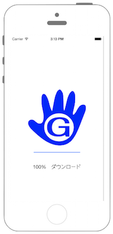

# 通信の進捗を知る



### iOS9からリクエスト先によってはATSを無効化・対処する必要があります

```swift fct_label="Swift 5.x/4.x"
//
//  ViewController.swift
//  Connection005
//
//  Created by Misato Morino on 2016/08/15.
//  Copyright © 2016年 Misato Morino. All rights reserved.
//

import UIKit

class ViewController: UIViewController, URLSessionDownloadDelegate {
    
    var myProgress:UIProgressView!
    var myProgressLabel:UILabel!
    var myImageView: UIImageView!
    var myImage: UIImage!
    
    override func viewDidLoad() {
        super.viewDidLoad()
        
        myImage = UIImage()
        
        myImageView = UIImageView(frame: CGRect(x: 0, y: 0, width: 200, height: 200))
        myImageView.center = self.view.center
        self.view.addSubview(myImageView)
        
        // Progressバーの設定.
        myProgress = UIProgressView(progressViewStyle: UIProgressView.Style.default)
        myProgress.layer.position = CGPoint(x: self.view.frame.width/2, y: 400)
        myProgress.progress = 0.0
        self.view.addSubview(myProgress)
        
        // Progressの内容を表示するためのラベル.
        myProgressLabel = UILabel(frame: CGRect(x: 0, y: 0, width: 200, height: 150))
        myProgressLabel.text = "0%　ダウンロード"
        myProgressLabel.textAlignment = NSTextAlignment.center
        myProgressLabel.center = CGPoint(x: self.view.frame.width/2, y: 450)
        
        self.view.addSubview(myProgressLabel)
        
        // 通信のコンフィグを用意.
        let config: URLSessionConfiguration = URLSessionConfiguration.default
        
        // Sessionを作成する.
        let session: URLSession = Foundation.URLSession(configuration: config, delegate: self, delegateQueue: OperationQueue.main)
        
        // ダウンロード先のURLからリクエストを生成.
        let url:NSURL = NSURL(string: "http://xxx/sample.png")!
        let request: URLRequest = URLRequest(url: url as URL)
        // ダウンロードタスクを生成.
        let task: URLSessionDownloadTask = session.downloadTask(with: request)
        
        // タスクを実行.
        task.resume()
    }
    
    /*
     ダウンロード終了時に呼び出されるデリゲート.
     */
    func urlSession(_ session: URLSession, downloadTask: URLSessionDownloadTask, didFinishDownloadingTo location: URL) {
        
        // ダウンロードしたデータを取り出す.
        let data: NSData = NSData(contentsOf: location as URL)!
        if data.length > 0 {
            myImage = UIImage(data: data as Data)
            myImageView.image = myImage
            print("data is found")
        }
    }
    
    /*
     ダウンロードの開始時に呼び出されるデリゲート.
     */
    func urlSession(_ session: URLSession, downloadTask: URLSessionDownloadTask, didResumeAtOffset fileOffset: Int64, expectedTotalBytes: Int64) {
        myProgress.progress = 0
        myProgress.setProgress(1.0, animated: true)
        myProgressLabel.text = "100% ダウンロード"
    }
    
    /*
     タスク処理中に定期的に呼び出されるデリゲート.
     */
    func urlSession(_ session: URLSession, downloadTask: URLSessionDownloadTask, didWriteData bytesWritten: Int64, totalBytesWritten: Int64, totalBytesExpectedToWrite: Int64) {
        
        let per:Float = Float(totalBytesWritten/totalBytesExpectedToWrite)
        myProgress.setProgress(per, animated: true)
        
        myProgressLabel.text = "\((Int)(myProgress.progress * 100))%　ダウンロード"
        print(myProgress.progress)
        
    }
    
    /*
     タスク終了時に呼び出されるデリゲート.
     */
    func urlSession(_ session: URLSession, task: URLSessionTask, didCompleteWithError error: Error?) {
        
        if error != nil {
            print("ダウンロードが失敗しました")
            print(error)
        } else {
            print("ダウンロードが完了しました")
        }
    }
    
    override func didReceiveMemoryWarning() {
        super.didReceiveMemoryWarning()
        // Dispose of any resources that can be recreated.
    }
}
```

```swift fct_label="Swift 3.x"
//
//  ViewController.swift
//  Connection005
//
//  Created by Misato Morino on 2016/08/15.
//  Copyright © 2016年 Misato Morino. All rights reserved.
//

import UIKit

class ViewController: UIViewController, URLSessionDownloadDelegate {
    
    var myProgress:UIProgressView!
    var myProgressLabel:UILabel!
    var myImageView: UIImageView!
    var myImage: UIImage!
    
    override func viewDidLoad() {
        super.viewDidLoad()
        
        myImage = UIImage()
        
        myImageView = UIImageView(frame: CGRect(x: 0, y: 0, width: 200, height: 200))
        myImageView.center = self.view.center
        self.view.addSubview(myImageView)
        
        // Progressバーの設定.
        myProgress = UIProgressView(progressViewStyle: UIProgressViewStyle.default)
        myProgress.layer.position = CGPoint(x: self.view.frame.width/2, y: 400)
        myProgress.progress = 0.0
        self.view.addSubview(myProgress)
        
        // Progressの内容を表示するためのラベル.
        myProgressLabel = UILabel(frame: CGRect(x: 0, y: 0, width: 200, height: 150))
        myProgressLabel.text = "0%　ダウンロード"
        myProgressLabel.textAlignment = NSTextAlignment.center
        myProgressLabel.center = CGPoint(x: self.view.frame.width/2, y: 450)
        
        self.view.addSubview(myProgressLabel)
        
        // 通信のコンフィグを用意.
        let config: URLSessionConfiguration = URLSessionConfiguration.default
        
        // Sessionを作成する.
        let session: URLSession = Foundation.URLSession(configuration: config, delegate: self, delegateQueue: OperationQueue.main)
        
        // ダウンロード先のURLからリクエストを生成.
        let url:NSURL = NSURL(string: "http://xxx/sample.png")!
        let request: URLRequest = URLRequest(url: url as URL)
        // ダウンロードタスクを生成.
        let task: URLSessionDownloadTask = session.downloadTask(with: request)
        
        // タスクを実行.
        task.resume()
    }
    
    /*
     ダウンロード終了時に呼び出されるデリゲート.
     */
    func urlSession(_ session: URLSession, downloadTask: URLSessionDownloadTask, didFinishDownloadingTo location: URL) {
        
        // ダウンロードしたデータを取り出す.
        let data: NSData = NSData(contentsOf: location as URL)!
        if data.length > 0 {
            myImage = UIImage(data: data as Data)
            myImageView.image = myImage
            print("data is found")
        }
    }

    /*
     ダウンロードの開始時に呼び出されるデリゲート.
     */
    func urlSession(_ session: URLSession, downloadTask: URLSessionDownloadTask, didResumeAtOffset fileOffset: Int64, expectedTotalBytes: Int64) {
        myProgress.progress = 0
        myProgress.setProgress(1.0, animated: true)
        myProgressLabel.text = "100% ダウンロード"
    }
    
    /*
     タスク処理中に定期的に呼び出されるデリゲート.
     */
    func urlSession(_ session: URLSession, downloadTask: URLSessionDownloadTask, didWriteData bytesWritten: Int64, totalBytesWritten: Int64, totalBytesExpectedToWrite: Int64) {
        
        let per:Float = Float(totalBytesWritten/totalBytesExpectedToWrite)
        myProgress.setProgress(per, animated: true)
        
        myProgressLabel.text = "\((Int)(myProgress.progress * 100))%　ダウンロード"
        print(myProgress.progress)

    }
    
    /*
     タスク終了時に呼び出されるデリゲート.
     */
    func urlSession(_ session: URLSession, task: URLSessionTask, didCompleteWithError error: Error?) {
       
        if error != nil {
            print("ダウンロードが失敗しました")
            print(error)
        } else {
            print("ダウンロードが完了しました")
        }
    }
    
    override func didReceiveMemoryWarning() {
        super.didReceiveMemoryWarning()
        // Dispose of any resources that can be recreated.
    }
}
```

```swift fct_label="Swift 2.3"
//
//  ViewController.swift
//  Connection005
//
//  Created by Misato Morino on 2016/08/15.
//  Copyright © 2016年 Misato Morino. All rights reserved.
//

import UIKit

class ViewController: UIViewController, NSURLSessionDownloadDelegate {
    
    var myProgress:UIProgressView!
    var myProgressLabel:UILabel!
    var myImageView: UIImageView!
    var myImage: UIImage!
    
    override func viewDidLoad() {
        super.viewDidLoad()
        
        myImage = UIImage()
        
        myImageView = UIImageView(frame: CGRectMake(0, 0, 200, 200))
        myImageView.center = self.view.center
        self.view.addSubview(myImageView)
        
        // Progressバーの設定.
        myProgress = UIProgressView(progressViewStyle: UIProgressViewStyle.Default)
        myProgress.layer.position = CGPoint(x: self.view.frame.width/2, y: 400)
        myProgress.progress = 0.0
        self.view.addSubview(myProgress)
        
        // Progressの内容を表示するためのラベル.
        myProgressLabel = UILabel(frame: CGRectMake(0, 0, 200, 150))
        myProgressLabel.text = "0%　ダウンロード"
        myProgressLabel.textAlignment = NSTextAlignment.Center
        myProgressLabel.center = CGPoint(x: self.view.frame.width/2, y: 450)
        
        self.view.addSubview(myProgressLabel)
        
        // 通信のコンフィグを用意.
        let config:NSURLSessionConfiguration = NSURLSessionConfiguration.defaultSessionConfiguration()
        
        // Sessionを作成する.
        let session:NSURLSession = NSURLSession(configuration: config, delegate: self, delegateQueue: NSOperationQueue.mainQueue())
        
        // ダウンロード先のURLからリクエストを生成.
        let url: NSURL = NSURL(string: "http://xxx/sample.png")!
        let request: NSURLRequest = NSURLRequest(URL: url)
        // ダウンロードタスクを生成.
        let task: NSURLSessionDownloadTask = session.downloadTaskWithRequest(request)
        
        // タスクを実行.
        task.resume()
    }
    
    /*
     ダウンロード終了時に呼び出されるデリゲート.
     */
    func URLSession(session: NSURLSession, downloadTask: NSURLSessionDownloadTask, didFinishDownloadingToURL location: NSURL) {
        
        // ダウンロードしたデータを取り出す.
        let data: NSData = NSData(contentsOfURL: location)!
        if data.length > 0 {
            myImage = UIImage(data: data)
            myImageView.image = myImage
            print("data is found")
        }
    }
    
    /*
     ダウンロードの開始時に呼び出されるデリゲート.
     */
    func URLSession(session: NSURLSession, downloadTask: NSURLSessionDownloadTask, didResumeAtOffset fileOffset: Int64, expectedTotalBytes: Int64) {
        myProgress.progress = 0
        myProgress.setProgress(1.0, animated: true)
        myProgressLabel.text = "100% ダウンロード"
    }
    
    /*
     タスク処理中に定期的に呼び出されるデリゲート.
     */
    func URLSession(session: NSURLSession, downloadTask: NSURLSessionDownloadTask, didWriteData bytesWritten: Int64, totalBytesWritten: Int64, totalBytesExpectedToWrite: Int64) {
        
        let per:Float = Float(totalBytesWritten/totalBytesExpectedToWrite)
        myProgress.setProgress(per, animated: true)
        
        myProgressLabel.text = "\((Int)(myProgress.progress * 100))%　ダウンロード"
        print(myProgress.progress)
    }
    
    /*
     タスク終了時に呼び出されるデリゲート.
     */
    func URLSession(session: NSURLSession, task: NSURLSessionTask, didCompleteWithError error: NSError?) {
        if error != nil {
            print("ダウンロードが失敗しました")
            print(error)
        } else {
            print("ダウンロードが完了しました")
        }
    }
    
    override func didReceiveMemoryWarning() {
        super.didReceiveMemoryWarning()
        // Dispose of any resources that can be recreated.
    }
} 
```

## 3.xと4.xの差分

* `UIProgressViewStyle` が `UIProgressView.Style` に変更

## 2.xと3.xの差分

* NSURLSessionからURLSessionに変更（他も同じく）
* ```dispatch_async(dispatch_get_main_queue(), {``` から```DispatchQueue.main.async(execute: {```に変更
* ```NSURLSession(configuration: config, delegate: self, delegateQueue: NSOperationQueue.mainQueue())
``` から ```Foundation.URLSession(configuration: config, delegate: self, delegateQueue: OperationQueue.main)
```に変更
* デリゲートメソッドの接頭語が```URLSession``` から ```urlSession``` に変更

## Reference

* URLSession
	* [https://developer.apple.com/reference/foundation/urlsession](https://developer.apple.com/reference/foundation/urlsession)
* URLSessionConfiguration
    * [https://developer.apple.com/reference/foundation/urlsessionconfiguration](https://developer.apple.com/reference/foundation/urlsessionconfiguration)
* NSURL
    * [https://developer.apple.com/reference/foundation/nsurl](https://developer.apple.com/reference/foundation/nsurl)
* URLSessionDownloadDelegate
    * [https://developer.apple.com/reference/foundation/nsurlsessiondownloaddelegate](https://developer.apple.com/reference/foundation/nsurlsessiondownloaddelegate)
