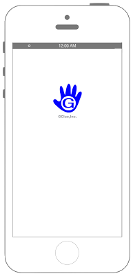

# ファイルのダウンロード



### iOS9からリクエスト先によってはATSを無効化・対処する必要があります

```swift fct_label="Swift 5.x/4.x/3.x"
//
//  ViewController.swift
//  Connection008
//
//  Created by Misato Morino on 2016/08/15.
//  Copyright © 2016年 Misato Morino. All rights reserved.
//

import UIKit

class ViewController: UIViewController, URLSessionDownloadDelegate{
    
    override func viewDidLoad() {
        super.viewDidLoad()
        
        // 通信のコンフィグを用意.
        let config: URLSessionConfiguration = URLSessionConfiguration.background(withIdentifier: "backgroundSession") 
        // Sessionを作成する.
        let session: URLSession = URLSession(configuration: config, delegate: self, delegateQueue: nil)
        
        // ダウンロード先のURLからリクエストを生成.
        let url:NSURL = NSURL(string: "http://xxx/hogehoge/sample.png")!
        let request: URLRequest =  URLRequest(url: url as URL)
        
        // ダウンロードタスクを生成.
        let myTask: URLSessionDownloadTask = session.downloadTask(with: request)
        
        // タスクを実行.
        myTask.resume()
    }
    
    /*
     ダウンロード終了時に呼び出されるデリゲート.
     */
    func urlSession(_ session: URLSession, downloadTask: URLSessionDownloadTask, didFinishDownloadingTo location: URL) {
        
        print("finish download")
        
        var data: NSData!
        
        do {
            data = try NSData(contentsOf: location, options: NSData.ReadingOptions.alwaysMapped)
        } catch {
            print(error)
        }
        
        if let _data = data {
            
            // ダウンロードしてきたデータを処理する.
            // サンプルでは画像をダウンロードするのでそのまま表示する.
            let myImage:UIImage = UIImage(data: _data as Data)!
            let myImageView: UIImageView = UIImageView(frame: CGRect(x: 0, y: 0, width: 100, height: 120))
            myImageView.image = myImage
            myImageView.layer.position = CGPoint(x: self.view.bounds.width/2, y: 200.0)
            self.view.addSubview(myImageView)
        }
        
    }
    
    /*
     タスク終了時に呼び出されるデリゲート.
     */
    func urlSession(_ session: URLSession, task: URLSessionTask, didCompleteWithError error: Error?) {
        
        if error == nil {
            print("ダウンロードが完了しました")
        } else {
            print("ダウンロードが失敗しました")
        }
        
    }

    override func didReceiveMemoryWarning() {
        super.didReceiveMemoryWarning()
        
    }
}
```

```swift fct_label="Swift 2.3"
//
//  ViewController.swift
//  Connection008
//
//  Created by Misato Morino on 2016/08/15.
//  Copyright © 2016年 Misato Morino. All rights reserved.
//

import UIKit

class ViewController: UIViewController, NSURLSessionDownloadDelegate{
    
    override func viewDidLoad() {
        super.viewDidLoad()
        
        // 通信のコンフィグを用意.
        let config:NSURLSessionConfiguration = NSURLSessionConfiguration.backgroundSessionConfigurationWithIdentifier("backgroundSession")
        
        // Sessionを作成する.
        let session:NSURLSession = NSURLSession(configuration: config, delegate: self, delegateQueue: nil)
        
        // ダウンロード先のURLからリクエストを生成.
        let url:NSURL = NSURL(string: "http://xxx/hogehoge/sample.png")!
        let request:NSURLRequest = NSURLRequest(URL: url)
        
        // ダウンロードタスクを生成.
        let myTask:NSURLSessionDownloadTask = session.downloadTaskWithRequest(request)
        
        // タスクを実行.
        myTask.resume()
    }
    
    /*
     ダウンロード終了時に呼び出されるデリゲート.
     */
    func URLSession(session: NSURLSession, downloadTask: NSURLSessionDownloadTask, didFinishDownloadingToURL location: NSURL) {
        
        print("finish download")
        
        var data: NSData!
        
        do {
            data = try NSData(contentsOfURL: location, options: NSDataReadingOptions.DataReadingMappedAlways)
        } catch {
            print(error)
        }
        
        if let _data = data {
            
            // ダウンロードしてきたデータを処理する.
            // サンプルでは画像をダウンロードするのでそのまま表示する.
            let myImage:UIImage = UIImage(data: _data)!
            let myImageView: UIImageView = UIImageView(frame: CGRectMake(0,0,100,120))
            myImageView.image = myImage
            myImageView.layer.position = CGPoint(x: self.view.bounds.width/2, y: 200.0)
            self.view.addSubview(myImageView)
        }
    }
    
    /*
     タスク終了時に呼び出されるデリゲート.
     */
    func URLSession(session: NSURLSession, task: NSURLSessionTask, didCompleteWithError error: NSError?) {
        
        if error == nil {
            print("ダウンロードが完了しました")
        } else {
            print("ダウンロードが失敗しました")
        }
        
    }
    
    override func didReceiveMemoryWarning() {
        super.didReceiveMemoryWarning()
        
    }
}
```

## 2.xと3.xの差分

* NSURLSessionからURLSessionに変更（他も同じく）
* デリゲートメソッドの接頭語が```URLSession``` から ```urlSession``` に変更
* ```NSDataReadingOptions.DataReadingMappedAlways``` から ```NSData.ReadingOptions.alwaysMapped``` に変更

## Reference

* URLSession
	* [https://developer.apple.com/reference/foundation/urlsession](https://developer.apple.com/reference/foundation/urlsession)
* URLSessionConfiguration
    * [https://developer.apple.com/reference/foundation/urlsessionconfiguration](https://developer.apple.com/reference/foundation/urlsessionconfiguration)
* NSURL
    * [https://developer.apple.com/reference/foundation/nsurl](https://developer.apple.com/reference/foundation/nsurl)
* NSURLDownloadDelegate
    * [https://developer.apple.com/reference/foundation/nsurldownloaddelegate](https://developer.apple.com/reference/foundation/nsurldownloaddelegate)
