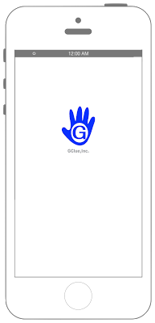

# ファイルのアップロード



### iOS9からリクエスト先によってはATSを無効化・対処する必要があります

```swift fct_label="Swfit 4.x"
//
//  ViewController.swift
//  Connection009
//
//  Created by Misato Morino on 2016/08/15.
//  Copyright © 2016年 Misato Morino. All rights reserved.
//

import UIKit

class ViewController: UIViewController, URLSessionTaskDelegate {
    var json:NSData!
    override func viewDidLoad() {
        super.viewDidLoad()
        
        // 通信のリクエスト生成.
        let myCofig: URLSessionConfiguration = URLSessionConfiguration.default
        
        let url:NSURL = NSURL(string: "http://xxx/hogehoge/upload.php")!
        
        var request: URLRequest = URLRequest(url: url as URL)
        request.httpMethod = "POST"
        
        let session:URLSession = URLSession(configuration: myCofig, delegate: self, delegateQueue: OperationQueue.main)
        
        // 画像データを読み出し、Data型に変換する.
        //        let file:NSData = UIImageJPEGRepresentation(UIImage(named: "sample"))
        let file: NSData = UIImage(named: "sample")!.pngData()! as NSData
        let image: UIImage = UIImage(data: file as Data)!
        
        // 送信するファイルのプレビュー.
        let myImageView: UIImageView = UIImageView(frame: CGRect(x: 0, y: 0, width: 100, height: 120))
        myImageView.image = image
        myImageView.layer.position = CGPoint(x: self.view.bounds.width/2, y: 200.0)
        
        self.view.addSubview(myImageView)
        
        // アップロード用のタスクを生成.
        let task:URLSessionUploadTask = session.uploadTask(with: request, from: file as Data)
        
        // タスクの実行.
        task.resume()
        
    }
    
    /*
     通信終了時に呼び出されるデリゲート.
     */
    func urlSession(_ session: URLSession, task: URLSessionTask, didCompleteWithError error: Error?) {
        print("didCompleteWithError")
        
        // エラーが有る場合にはエラーのコードを取得.
        if error != nil {
            print(error)
        }
    }
    
    func urlSession(_ session: URLSession, task: URLSessionTask, willPerformHTTPRedirection response: HTTPURLResponse, newRequest request: URLRequest, completionHandler: (URLRequest?) -> Void) {
        print("willPerformHTTPRedirection")
    }
    
    func urlSession(_ session: URLSession, task: URLSessionTask, didSendBodyData bytesSent: Int64, totalBytesSent: Int64, totalBytesExpectedToSend: Int64) {
        print("didSendBodyData")
    }
    
    override func didReceiveMemoryWarning() {
        super.didReceiveMemoryWarning()
        
    }
}
```

```swift fct_label="Swift 3.x"
//
//  ViewController.swift
//  Connection009
//
//  Created by Misato Morino on 2016/08/15.
//  Copyright © 2016年 Misato Morino. All rights reserved.
//

import UIKit

class ViewController: UIViewController, URLSessionTaskDelegate {
    var json:NSData!
    override func viewDidLoad() {
        super.viewDidLoad()
        
        // 通信のリクエスト生成.
        let myCofig: URLSessionConfiguration = URLSessionConfiguration.default
       
        let url:NSURL = NSURL(string: "http://xxx/hogehoge/upload.php")!
        
        var request: URLRequest = URLRequest(url: url as URL)
        request.httpMethod = "POST"
        
        let session:URLSession = URLSession(configuration: myCofig, delegate: self, delegateQueue: OperationQueue.main)
        
        // 画像データを読み出し、Data型に変換する.
        //        let file:NSData = UIImageJPEGRepresentation(UIImage(named: "sample"))
        let file: NSData = UIImagePNGRepresentation(UIImage(named: "sample")!)!
        let image: UIImage = UIImage(data: file as Data)!
        
        // 送信するファイルのプレビュー.
        let myImageView: UIImageView = UIImageView(frame: CGRect(x: 0, y: 0, width: 100, height: 120))
        myImageView.image = image
        myImageView.layer.position = CGPoint(x: self.view.bounds.width/2, y: 200.0)
        
        self.view.addSubview(myImageView)
        
        // アップロード用のタスクを生成.
        let task:URLSessionUploadTask = session.uploadTask(with: request, from: file as Data)
        
        // タスクの実行.
        task.resume()
        
    }
    
    /*
     通信終了時に呼び出されるデリゲート.
     */
    func urlSession(_ session: URLSession, task: URLSessionTask, didCompleteWithError error: Error?) {
        print("didCompleteWithError")
        
        // エラーが有る場合にはエラーのコードを取得.
        if error != nil {
            print(error)
        }
    }
    
    func urlSession(_ session: URLSession, task: URLSessionTask, willPerformHTTPRedirection response: HTTPURLResponse, newRequest request: URLRequest, completionHandler: (URLRequest?) -> Void) {
        print("willPerformHTTPRedirection")
    }
    
    func urlSession(_ session: URLSession, task: URLSessionTask, didSendBodyData bytesSent: Int64, totalBytesSent: Int64, totalBytesExpectedToSend: Int64) {
         print("didSendBodyData")
    }
    
    override func didReceiveMemoryWarning() {
        super.didReceiveMemoryWarning()
        
    }
}
```

```swift fct_label="Swift 2.3"
//
//  ViewController.swift
//  Connection009
//
//  Created by Misato Morino on 2016/08/15.
//  Copyright © 2016年 Misato Morino. All rights reserved.
//

import UIKit

class ViewController: UIViewController, NSURLSessionTaskDelegate {
    var json:NSData!
    override func viewDidLoad() {
        super.viewDidLoad()
        
        // 通信のリクエスト生成.
        let myCofig:NSURLSessionConfiguration = NSURLSessionConfiguration.defaultSessionConfiguration()
        
        let url:NSURL = NSURL(string: "http://xxx/hogehoge/upload.php")!
       
        let request:NSMutableURLRequest = NSMutableURLRequest(URL: url)
        request.HTTPMethod = "POST"
        
        let session:NSURLSession = NSURLSession(configuration: myCofig, delegate: self, delegateQueue: NSOperationQueue.mainQueue())
        
        // 画像データを読み出し、Data型に変換する.
//        let file:NSData = UIImageJPEGRepresentation(UIImage(named: "sample"))
        let file: NSData = UIImagePNGRepresentation(UIImage(named: "sample")!)!
        let image: UIImage = UIImage(data: file)!
        
        // 送信するファイルのプレビュー.
        let myImageView: UIImageView = UIImageView(frame: CGRectMake(0,0,100,120))
        myImageView.image = image
        myImageView.layer.position = CGPoint(x: self.view.bounds.width/2, y: 200.0)
        
        self.view.addSubview(myImageView)
        
        // アップロード用のタスクを生成.
        let task:NSURLSessionUploadTask = session.uploadTaskWithRequest(request, fromData: file)
        
        // タスクの実行.
        task.resume()
        
    }
    
    /*
     通信終了時に呼び出されるデリゲート.
     */
    func URLSession(session: NSURLSession, task: NSURLSessionTask, didCompleteWithError error: NSError?) {
        
        print("didCompleteWithError")
        
        // エラーが有る場合にはエラーのコードを取得.
        if error != nil {
            print(error?.code)
        }
    } 
    
    func URLSession(session: NSURLSession, task: NSURLSessionTask, willPerformHTTPRedirection response: NSHTTPURLResponse, newRequest request: NSURLRequest, completionHandler: (NSURLRequest?) -> Void) {
        print("willPerformHTTPRedirection")
    }
    
    func URLSession(session: NSURLSession, task: NSURLSessionTask, didSendBodyData bytesSent: Int64, totalBytesSent: Int64, totalBytesExpectedToSend: Int64) {
        
        print("didSendBodyData")
        
    }
    override func didReceiveMemoryWarning() {
        super.didReceiveMemoryWarning()
        
    }
}
```

## 3.xと4.xの差分

* `UIImagePNGRepresentation(UIImage(named: "sample")!)!` が `UIImage(named: "sample")!.pngData()! as NSData` に変更

## 2.xと3.xの差分

* NSURLSessionからURLSessionに変更（他も同じく）
* デリゲートメソッドの接頭語が```URLSession``` から ```urlSession``` に変更
* 

## Reference

* URLSession
	* [https://developer.apple.com/reference/foundation/urlsession](https://developer.apple.com/reference/foundation/urlsession)
* URLSessionConfiguration
    * [https://developer.apple.com/reference/foundation/urlsessionconfiguration](https://developer.apple.com/reference/foundation/urlsessionconfiguration)
* NSURL
    * [https://developer.apple.com/reference/foundation/nsurl](https://developer.apple.com/reference/foundation/nsurl)
* NSURLDownloadDelegate
    * [https://developer.apple.com/reference/foundation/nsurldownloaddelegate](https://developer.apple.com/reference/foundation/nsurldownloaddelegate)
