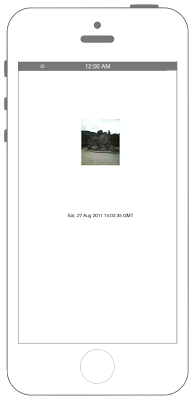

# データの更新日時を取得



### iOS9からリクエスト先によってはATSを無効化・対処する必要があります

```swift fct_label="Swift 5.x/4.x/3.x"
//  ViewController.swift
//  Connection012
//
//  Created by Misato Morino on 2016/08/15.
//  Copyright © 2016年 Misato Morino. All rights reserved.
//

import UIKit

class ViewController: UIViewController, NSURLConnectionDataDelegate{
    
    var myTextView:UITextView!
    
    override func viewDidLoad() {
        super.viewDidLoad()
        
        // 画像のURLを初期化.
        let url = NSURL(string: "http://blogimg.goo.ne.jp/user_image/6b/5d/d7ecfd5f7dc8c1fd7384e5642abfe638.jpg")
        
        // 参照するイメージを表示.
        let imageData: NSData = NSData(contentsOf: url as! URL)!
        let image: UIImage = UIImage(data: imageData as Data)!
        let imageView: UIImageView = UIImageView(frame: CGRect(x: 0, y: 0, width: 100, height: 120))
        imageView.image = image
        imageView.layer.position = CGPoint(x: self.view.bounds.width/2, y: 200.0)
        self.view.addSubview(imageView)
        
        // 更新日の表示用TextViewを用意.
        myTextView = UITextView(frame: CGRect(x: 0, y: 0, width: 300, height: 50))
        myTextView.textAlignment = NSTextAlignment.center
        myTextView.layer.position = CGPoint(x: self.view.bounds.width/2, y: 400.0)
        myTextView.isEditable = false
        
        self.view.addSubview(myTextView)
        
        // サーバーへのリクエストを初期化.
        let req = NSMutableURLRequest(url: url as! URL)
        
        // ヘッダー情報を得るように初期化.
        req.httpMethod = "HEAD"
        
        // サーバーへ通信.
        NSURLConnection(request: req as URLRequest, delegate: self)
        
    }
    
    /*
     サーバからレスポンスが送られてきたとき呼び出されるメソッド.
     */
    func connection(_ connection: NSURLConnection, didReceive response: URLResponse) {
        
        // URLのヘッダー情報を得る.
        let head = response as! HTTPURLResponse
        
        // 更新日時を得る.
        myTextView.text = head.allHeaderFields["Last-Modified"] as! NSString as String
        print(head.allHeaderFields["Last-Modified"] as! NSString)
        
    }
}
```

```swift fct_label="Swift 2.3"
//
//  ViewController.swift
//  Connection012
//
//  Created by Misato Morino on 2016/08/15.
//  Copyright © 2016年 Misato Morino. All rights reserved.
//

import UIKit

class ViewController: UIViewController, NSURLConnectionDataDelegate{
    
    var myTextView:UITextView!
    
    override func viewDidLoad() {
        super.viewDidLoad()
        
        // 画像のURLを初期化.
        let url = NSURL(string: "http://blogimg.goo.ne.jp/user_image/6b/5d/d7ecfd5f7dc8c1fd7384e5642abfe638.jpg")
        
        // 参照するイメージを表示.
        let imageData: NSData = NSData(contentsOfURL: url!)!
        let image: UIImage = UIImage(data: imageData)!
        let imageView: UIImageView = UIImageView(frame: CGRectMake(0,0,100,120))
        imageView.image = image
        imageView.layer.position = CGPoint(x: self.view.bounds.width/2, y: 200.0)
        self.view.addSubview(imageView)
        
        // 更新日の表示用TextViewを用意.
        myTextView = UITextView(frame: CGRectMake(0, 0, 300, 50))
        myTextView.textAlignment = NSTextAlignment.Center
        myTextView.layer.position = CGPoint(x: self.view.bounds.width/2, y: 400.0)
        myTextView.editable = false
        
        self.view.addSubview(myTextView)
        
        // サーバーへのリクエストを初期化.
        let req = NSMutableURLRequest(URL: url!)
        
        // ヘッダー情報を得るように初期化.
        req.HTTPMethod = "HEAD"
        
        // サーバーへ通信.
        NSURLConnection(request: req, delegate: self)
        
    }
    
    /*
     サーバからレスポンスが送られてきたとき呼び出されるメソッド.
     */
    func connection(connection: NSURLConnection, didReceiveResponse response: NSURLResponse) {
        
        // URLのヘッダー情報を得る.
        let head = response as! NSHTTPURLResponse
        
        // 更新日時を得る.
        myTextView.text = head.allHeaderFields["Last-Modified"] as! NSString as String
        print(head.allHeaderFields["Last-Modified"] as! NSString)
        
    }
}
```

## 2.xと3.xの差分

* ```HTTPMethod``` から ```httpMethod``` に変更 

## Reference

* NSURL
    * [https://developer.apple.com/reference/foundation/nsurl](https://developer.apple.com/reference/foundation/nsurl)
* NSURLConnection
    * [https://developer.apple.com/reference/foundation/nsurlconnection](https://developer.apple.com/reference/foundation/nsurlconnection)
* NSURLSessionDelegate
    * [https://developer.apple.com/reference/foundation/nsurlconnectiondelegate](https://developer.apple.com/reference/foundation/nsurlconnectiondelegate)

