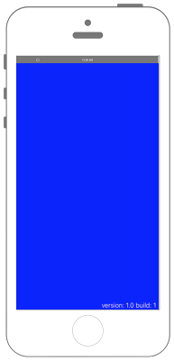

# Versionを表示する　



## Swift 3.x

```swift
//
//  ViewController.swift
//  Config001
//
//  Copyright © 2016年 FaBo, Inc. All rights reserved.
//

import UIKit

class ViewController: UIViewController {

    override func viewDidLoad() {
        super.viewDidLoad()
        // Do any additional setup after loading the view, typically from a nib.
        
        // Versionを取得.
        let version = Bundle.main.object(forInfoDictionaryKey: "CFBundleShortVersionString") as! String
        // Build番号を取得.
        let build = Bundle.main.object(forInfoDictionaryKey: kCFBundleVersionKey as String) as! String

        // 背景を青に.
        self.view.backgroundColor = UIColor.blue
        
        // 画面右下に表示.
        let myLabel: UILabel = UILabel()
        let labelWidth: CGFloat = 150
        let labelHeight: CGFloat = 20
        let posX: CGFloat = self.view.bounds.width - labelWidth
        let posY: CGFloat = self.view.bounds.height - labelHeight
        myLabel.frame = CGRect(x: posX, y: posY, width: labelWidth, height: labelHeight)
        myLabel.text = "version: \(version) build: \(build)"
        myLabel.textColor = UIColor.white
        
        self.view.addSubview(myLabel)
        
    }

    override func didReceiveMemoryWarning() {
        super.didReceiveMemoryWarning()
        // Dispose of any resources that can be recreated.
    }


}


```

## Swift 2.3

```swift
///
//  ViewController.swift
//  Config001
//
//  Copyright © 2016年 FaBo, Inc. All rights reserved.
//

import UIKit

class ViewController: UIViewController {

    override func viewDidLoad() {
        super.viewDidLoad()
        // Do any additional setup after loading the view, typically from a nib.
        
        // Versionを取得.
        let version = NSBundle.mainBundle().objectForInfoDictionaryKey("CFBundleShortVersionString") as! String
        // Build番号を取得.
        let build = NSBundle.mainBundle().objectForInfoDictionaryKey(kCFBundleVersionKey as String) as! String

        // 背景を青に.
        self.view.backgroundColor = UIColor.blueColor()
        
        // 画面右下に表示.
        let myLabel: UILabel = UILabel()
        let labelWidth: CGFloat = 150
        let labelHeight: CGFloat = 20
        let posX: CGFloat = self.view.bounds.width - labelWidth
        let posY: CGFloat = self.view.bounds.height - labelHeight
        myLabel.frame = CGRectMake(posX, posY, labelWidth, labelHeight)
        myLabel.text = "version: \(version) build: \(build)"
        myLabel.textColor = UIColor.whiteColor()
        
        self.view.addSubview(myLabel)
        
    }

    override func didReceiveMemoryWarning() {
        super.didReceiveMemoryWarning()
        // Dispose of any resources that can be recreated.
    }


}


```

## 2.xと3.xの差分

* ```NSBundle.mainBundle().objectForInfoDictionaryKey(キー名)```が```Bundle.main.object(forInfoDictionaryKey: キー名)```に変更

## Reference

* NSBundle
    * [https://developer.apple.com/reference/foundation/nsbundle](https://developer.apple.com/reference/foundation/nsbundle)

