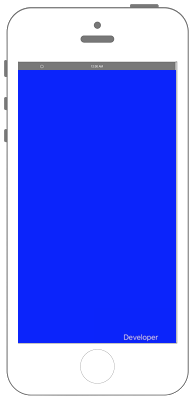
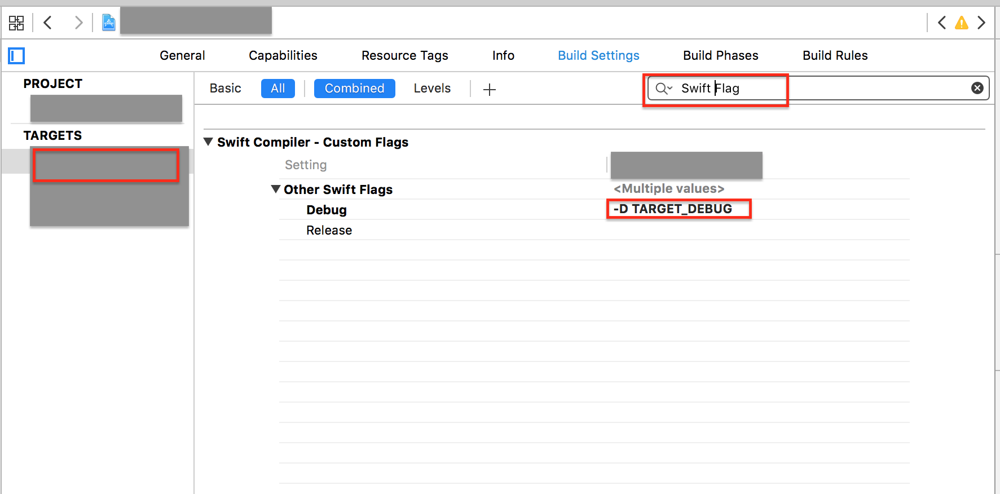

# ProvisioningからDevloperかDistributionかを判定する　




## 設定



```swift fct_label="Swift 5.x/4.x/3.x"
//
//  ViewController.swift
//  config002
//
//  Copyright © 2016年 FaBo, Inc. All rights reserved.
//

import UIKit

class ViewController: UIViewController {
    
    override func viewDidLoad() {
        super.viewDidLoad()
        
        
        // 背景を青に.
        self.view.backgroundColor = UIColor.blue
        
        // 画面右下に表示.
        let myLabel: UILabel = UILabel()
        let labelWidth: CGFloat = 120
        let labelHeight: CGFloat = 20
        let posX: CGFloat = self.view.bounds.width - labelWidth
        let posY: CGFloat = self.view.bounds.height - labelHeight
        myLabel.frame = CGRect(x: posX, y: posY, width: labelWidth, height: labelHeight)
        myLabel.textColor = UIColor.white
        self.view.addSubview(myLabel)
        
        #if TARGET_DEBUG
            myLabel.text = "Developer"
        #else
            myLabel.text = "Destribution"
        #endif
        
    }
    
    override func didReceiveMemoryWarning() {
        super.didReceiveMemoryWarning()
        // Dispose of any resources that can be recreated.
    }
}

```

```swift fct_label="Swift 2.3"
//
//  ViewController.swift
//  config002
//
//  Copyright © 2016年 FaBo, Inc. All rights reserved.
//

import UIKit

class ViewController: UIViewController {

    override func viewDidLoad() {
        super.viewDidLoad()

        
        // 背景を青に.
        self.view.backgroundColor = UIColor.blueColor()
        
        // 画面右下に表示.
        let myLabel: UILabel = UILabel()
        let labelWidth: CGFloat = 120
        let labelHeight: CGFloat = 20
        let posX: CGFloat = self.view.bounds.width - labelWidth
        let posY: CGFloat = self.view.bounds.height - labelHeight
        myLabel.frame = CGRectMake(posX, posY, labelWidth, labelHeight)
        myLabel.textColor = UIColor.whiteColor()
        self.view.addSubview(myLabel)
        
        #if TARGET_DEBUG
            myLabel.text = "Developer"
        #else
            myLabel.text = "Destribution"
        #endif
    }

    override func didReceiveMemoryWarning() {
        super.didReceiveMemoryWarning()
        // Dispose of any resources that can be recreated.
    }
}


```

## 2.xと3.xの差分
* `blueColor()` が `blue` に変更
* `CGRectMake(posX, posY, labelWidth, labelHeight)` が `CGRect(x: posX, y: posY, width: labelWidth, height: labelHeight)` に変更

## Reference

* NSBundle
    * [https://developer.apple.com/reference/foundation/nsbundle](https://developer.apple.com/reference/foundation/nsbundle)

