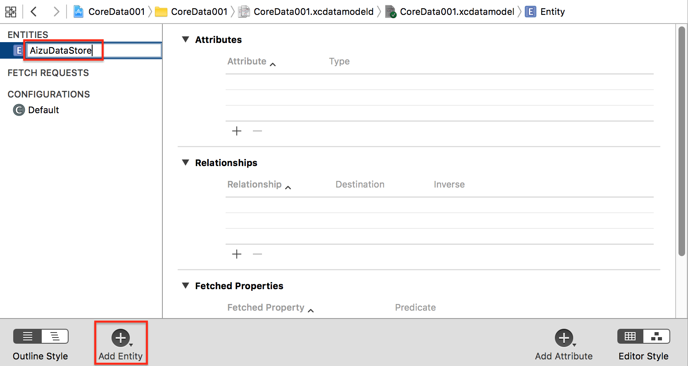

# JSONデータをCoreDataに格納


## 共通

### 使用するJSONデータ

AizuData.json
```json
[
 {"id":1,"title":"鶴ヶ城","content":"お城"},
 {"id":2,"title":"飯盛山","content":"お墓"},
 {"id":3,"title":"さざえ堂","content":"螺旋階段"}
]
```


### CoreDataのEntityの作成と設定





project作成時、Use Core Dataにチェックを入れていない場合は下記をAppDelegateに追記

```swift 
lazy var persistentContainer: NSPersistentContainer = {
    
    let container = NSPersistentContainer(name: "CoreData001")
    container.loadPersistentStores(completionHandler: { (storeDescription, error) in
        if let error = error {
            
            fatalError("Unresolved error, \((error as NSError).userInfo)")
        }
    })
    return container
}()

func saveContext () {
    let context = persistentContainer.viewContext
    if context.hasChanges {
        do {
            try context.save()
        } catch {
            let nserror = error as NSError
            fatalError("Unresolved error \(nserror), \(nserror.userInfo)")
        }
    }
}
```


## ViewController.swift

```swift fct_label="Swift 4.x"
//
//  ViewController.swift
//  CoreData001
//
//  Copyright © 2016年 FaBo, Inc. All rights reserved.
//

import UIKit
import CoreData

class ViewController: UIViewController, UITableViewDelegate, UITableViewDataSource  {
    
    private let AIZU_DATA_STORE: String = "AizuDataStore"
    private var aizuDatas: [AizuDataStore] = []
    
    override func viewDidLoad() {
        super.viewDidLoad()
        // Do any additional setup after loading the view, typically from a nib.
        insertDataFromJson()
        
        aizuDatas = loadDatas()
        
        // Table View.
        let barHeight: CGFloat = UIApplication.shared.statusBarFrame.size.height
        let displayWidth: CGFloat = self.view.frame.width
        let displayHeight: CGFloat = self.view.frame.height
        let myTableView: UITableView = UITableView(frame: CGRect(x: 0, y: barHeight, width: displayWidth, height: displayHeight))
        myTableView.register(UITableViewCell.self, forCellReuseIdentifier: "MyCell")
        myTableView.dataSource = self
        myTableView.delegate = self
        self.view.addSubview(myTableView)
    }
    
    override func didReceiveMemoryWarning() {
        super.didReceiveMemoryWarning()
        // Dispose of any resources that can be recreated.
    }
    
    /*
     CoreDataからデータの読み込み
     */
    func loadDatas() -> [AizuDataStore] {
        
        let appDel: AppDelegate = (UIApplication.shared.delegate as! AppDelegate)
        let context = appDel.persistentContainer.viewContext
        
        // Request
        let fetchRequest: NSFetchRequest<NSFetchRequestResult> = NSFetchRequest(entityName: AIZU_DATA_STORE)
        
        
        fetchRequest.returnsObjectsAsFaults = false
        
        // Access to CoreData
        do {
            if let aizuDatas = try context.fetch(fetchRequest) as? [AizuDataStore] {
                return aizuDatas
            }
            else  {
                return []
            }
            
        } catch let error as NSError{
            print(error.localizedDescription)
            return []
        }
    }
    
    /*
     JSONファイルを読み込みCoreDataにInsert.
     */
    private func insertDataFromJson() {
        
        // Path.
        let jsonDataPath: NSString = Bundle.main.path(forResource: "AizuData", ofType: "json")! as NSString
        // Data.
        let jsonRawData: NSData! = NSData(contentsOfFile: jsonDataPath as String)
        print("jsonRawData:\(jsonRawData)")
        
        // JSONのパース.
        let jsonDictionary: [[String: AnyObject]]
        do {
            jsonDictionary = try JSONSerialization.jsonObject(with: jsonRawData as Data, options: []) as! [[String: AnyObject]]
        }
        catch {
            print("Error JSONObjectWithData:\(error)")
            return
        }
        
        let appDel: AppDelegate = (UIApplication.shared.delegate as! AppDelegate)
        let context = appDel.persistentContainer.viewContext
        
        let fetchRequest: NSFetchRequest<NSFetchRequestResult> = NSFetchRequest(entityName: AIZU_DATA_STORE)
        let deleteAll = NSBatchDeleteRequest(fetchRequest: fetchRequest)
        do {
            try context.execute(deleteAll)
        }
        catch {
            print("Error excuteRequest(deleteAll):\(error)")
        }
        
        
        // Entityを定義.
        let entity: NSEntityDescription! = NSEntityDescription.entity(forEntityName: AIZU_DATA_STORE, in: context)
        
        // JSONデータを配列分、CoreDataに格納.
        for jsonData in jsonDictionary {
            print("jsonData:\(jsonData)")
            
            let aizuDataStore: AizuDataStore = AizuDataStore(entity: entity, insertInto: context)
            
            do {
                try aizuDataStore.updateFromDictionary(dataDictionary: jsonData )
            } catch {
                print("Error updateFromDictionary:\(error)")
            }
            
            do {
                
                try context.save()
            }
            catch {
                print("Error save:\(error)")
            }
        }
        
    }
    
    /*
     Cellが選択された際に呼び出される
     */
    func tableView(_ tableView: UITableView, didSelectRowAt indexPath: IndexPath) {
        print("Num: \(indexPath.row)")
        print("Value: \(aizuDatas[indexPath.row])")
    }
    
    /*
     Cellの総数を返す.
     */
    func tableView(_ tableView: UITableView, numberOfRowsInSection section: Int) -> Int {
        return aizuDatas.count
    }
    
    /*
     Cellに値を設定する
     */
    func tableView(_ tableView: UITableView, cellForRowAt indexPath: IndexPath) -> UITableViewCell {
        // 再利用するCellを取得する.
        let cell = tableView.dequeueReusableCell(withIdentifier: "MyCell", for: indexPath as IndexPath)
        
        // Cellに値を設定する.
        cell.textLabel!.text = "\(aizuDatas[indexPath.row].title)"
        
        return cell
    }
    
}
```

```swift fct_label="Swift 3.x"
//
//  ViewController.swift
//  CoreData001
//
//  Copyright © 2016年 FaBo, Inc. All rights reserved.
//

import UIKit
import CoreData

class ViewController: UIViewController, UITableViewDelegate, UITableViewDataSource  {
    
    private let AIZU_DATA_STORE: String = "AizuDataStore"
    private var aizuDatas: [AizuDataStore] = []
    
    override func viewDidLoad() {
        super.viewDidLoad()
        // Do any additional setup after loading the view, typically from a nib.
        insertDataFromJson()
        
        aizuDatas = loadDatas()
        
        // Table View.
        let barHeight: CGFloat = UIApplication.shared.statusBarFrame.size.height
        let displayWidth: CGFloat = self.view.frame.width
        let displayHeight: CGFloat = self.view.frame.height
        let myTableView: UITableView = UITableView(frame: CGRect(x: 0, y: barHeight, width: displayWidth, height: displayHeight))
        myTableView.register(UITableViewCell.self, forCellReuseIdentifier: "MyCell")
        myTableView.dataSource = self
        myTableView.delegate = self
        self.view.addSubview(myTableView)
    }
    
    override func didReceiveMemoryWarning() {
        super.didReceiveMemoryWarning()
        // Dispose of any resources that can be recreated.
    }
    
    /*
     CoreDataからデータの読み込み
     */
    func loadDatas() -> [AizuDataStore] {
        
        let appDel: AppDelegate = (UIApplication.shared.delegate as! AppDelegate)
        let context = appDel.persistentContainer.viewContext
        
        // Request
        let fetchRequest: NSFetchRequest<NSFetchRequestResult> = NSFetchRequest(entityName: AIZU_DATA_STORE)
        
        
        fetchRequest.returnsObjectsAsFaults = false
        
        // Access to CoreData
        do {
            if let aizuDatas = try context.fetch(fetchRequest) as? [AizuDataStore] {
                return aizuDatas
            }
            else  {
                return []
            }
            
        } catch let error as NSError{
            print(error.localizedDescription)
            return []
        }
    }
    
    /*
     JSONファイルを読み込みCoreDataにInsert.
     */
    private func insertDataFromJson() {
        
        // Path.
        let jsonDataPath: NSString = Bundle.main.path(forResource: "AizuData", ofType: "json")!
        // Data.
        let jsonRawData: NSData! = NSData(contentsOfFile: jsonDataPath as String)
        print("jsonRawData:\(jsonRawData)")
        
        // JSONのパース.
        let jsonDictionary: [[String: AnyObject]]
        do {
            jsonDictionary = try JSONSerialization.jsonObject(with: jsonRawData as Data, options: []) as! [[String: AnyObject]]
        }
        catch {
            print("Error JSONObjectWithData:\(error)")
            return
        }
        
        let appDel: AppDelegate = (UIApplication.shared.delegate as! AppDelegate)
        let context = appDel.persistentContainer.viewContext
        
        let fetchRequest: NSFetchRequest<NSFetchRequestResult> = NSFetchRequest(entityName: AIZU_DATA_STORE)
        let deleteAll = NSBatchDeleteRequest(fetchRequest: fetchRequest)
        do {
            try context.execute(deleteAll)
        }
        catch {
            print("Error excuteRequest(deleteAll):\(error)")
        }
 

        // Entityを定義.
        let entity: NSEntityDescription! = NSEntityDescription.entity(forEntityName: AIZU_DATA_STORE, in: context)

        // JSONデータを配列分、CoreDataに格納.
        for jsonData: AnyObject in jsonDictionary {
            print("jsonData:\(jsonData)")
            
            let aizuDataStore: AizuDataStore = AizuDataStore(entity: entity, insertInto: context)
            
            do {
                try aizuDataStore.updateFromDictionary(dataDictionary: jsonData as! [String : AnyObject])
            } catch {
                print("Error updateFromDictionary:\(error)")
            }
            
            do {
                
                try context.save()
            }
            catch {
                print("Error save:\(error)")
            }
        }
 
    }
    
    /*
     Cellが選択された際に呼び出される
     */
    func tableView(_ tableView: UITableView, didSelectRowAt indexPath: IndexPath) {
        print("Num: \(indexPath.row)")
        print("Value: \(aizuDatas[indexPath.row])")
    }
    
    /*
     Cellの総数を返す.
     */
    func tableView(_ tableView: UITableView, numberOfRowsInSection section: Int) -> Int {
        return aizuDatas.count
    }
    
    /*
     Cellに値を設定する
     */
    func tableView(_ tableView: UITableView, cellForRowAt indexPath: IndexPath) -> UITableViewCell {
        // 再利用するCellを取得する.
        let cell = tableView.dequeueReusableCell(withIdentifier: "MyCell", for: indexPath as IndexPath)
        
        // Cellに値を設定する.
        cell.textLabel!.text = "\(aizuDatas[indexPath.row].title)"
        
        return cell
    }
    
}

```

```swift fct_label="Swift 2.3"
//
//  ViewController.swift
//  CoreData001
//
//  Copyright © 2016年 FaBo, Inc. All rights reserved.
//

import UIKit
import CoreData

class ViewController: UIViewController, UITableViewDelegate, UITableViewDataSource  {

    private let AIZU_DATA_STORE: String = "AizuDataStore"
    private var aizuDatas: [AizuDataStore] = []
    
    override func viewDidLoad() {
        super.viewDidLoad()
        // Do any additional setup after loading the view, typically from a nib.
        insertDataFromJson()
        
        aizuDatas = loadDatas()
        
        // Table View.
        let barHeight: CGFloat = UIApplication.sharedApplication().statusBarFrame.size.height
        let displayWidth: CGFloat = self.view.frame.width
        let displayHeight: CGFloat = self.view.frame.height
        let myTableView: UITableView = UITableView(frame: CGRectMake(0, barHeight, displayWidth, displayHeight))
        myTableView.registerClass(UITableViewCell.self, forCellReuseIdentifier: "MyCell")
        myTableView.dataSource = self
        myTableView.delegate = self
        self.view.addSubview(myTableView)
    }

    override func didReceiveMemoryWarning() {
        super.didReceiveMemoryWarning()
        // Dispose of any resources that can be recreated.
    }
    
    /*
     CoreDataからデータの読み込み
    */
    func loadDatas() -> [AizuDataStore] {
        
        // Context
        let appDel: AppDelegate = UIApplication.sharedApplication().delegate as! AppDelegate
        let context: NSManagedObjectContext = appDel.managedObjectContext
        
        // Request
        let fetchRequest: NSFetchRequest = NSFetchRequest(entityName: AIZU_DATA_STORE)
        fetchRequest.returnsObjectsAsFaults = false
        
        // Access to CoreData
        do {
            if let aizuDatas = try context.executeFetchRequest(fetchRequest) as? [AizuDataStore] {
                return aizuDatas
            }
            else  {
                return []
            }
            
        } catch let error as NSError{
            print(error.localizedDescription)
            return []
        }
    }
    
    /*
     JSONファイルを読み込みCoreDataにInsert.
     */
    private func insertDataFromJson() {
        
        // Path.
        let jsonDataPath: NSString = NSBundle.mainBundle().pathForResource("AizuData", ofType: "json")!
        // Data.
        let jsonRawData: NSData! = NSData(contentsOfFile: jsonDataPath as String)
        print("jsonRawData:\(jsonRawData)")
        
        // JSONのパース.
        let jsonDictionary: [[String: AnyObject]]
        do {
            jsonDictionary = try NSJSONSerialization.JSONObjectWithData(jsonRawData, options: []) as! [[String: AnyObject]]
        }
        catch {
            print("Error JSONObjectWithData:\(error)")
            return
        }
        
        let appDel: AppDelegate = UIApplication.sharedApplication().delegate as! AppDelegate
        let context: NSManagedObjectContext = appDel.managedObjectContext
        
        // 全データを削除.
        let fetchRequest = NSFetchRequest(entityName: AIZU_DATA_STORE)
        let deleteAll = NSBatchDeleteRequest(fetchRequest: fetchRequest)
        do {
            try context.executeRequest(deleteAll)
        }
        catch {
            print("Error excuteRequest(deleteAll):\(error)")
        }
        
        // Entityを定義.
        let entity: NSEntityDescription! = NSEntityDescription.entityForName(AIZU_DATA_STORE, inManagedObjectContext: context)
        
        // JSONデータを配列分、CoreDataに格納.
        for jsonData: AnyObject in jsonDictionary {
            print("jsonData:\(jsonData)")
            
            let aizuDataStore: AizuDataStore = AizuDataStore(entity: entity, insertIntoManagedObjectContext: context)
            
            do {
                try aizuDataStore.updateFromDictionary(jsonData as! [String : AnyObject])
            } catch {
                print("Error updateFromDictionary:\(error)")
            }
            
            do {
                
                try context.save()
            }
            catch {
                print("Error save:\(error)")
            }
        }
    }
    
    /*
     Cellが選択された際に呼び出される
     */
    func tableView(tableView: UITableView, didSelectRowAtIndexPath indexPath: NSIndexPath) {
        print("Num: \(indexPath.row)")
        print("Value: \(aizuDatas[indexPath.row])")
    }
    
    /*
     Cellの総数を返す.
     */
    func tableView(tableView: UITableView, numberOfRowsInSection section: Int) -> Int {
        return aizuDatas.count
    }
    
    /*
     Cellに値を設定する
     */
    func tableView(tableView: UITableView, cellForRowAtIndexPath indexPath: NSIndexPath) -> UITableViewCell {
        // 再利用するCellを取得する.
        let cell = tableView.dequeueReusableCellWithIdentifier("MyCell", forIndexPath: indexPath)
        
        // Cellに値を設定する.
        cell.textLabel!.text = "\(aizuDatas[indexPath.row].title)"
        
        return cell
    }

}
```

### AizuDataStore.swift

```swift fct_label="Swift 4.x/Swift 3.x"
//
//  AizuDataStore.swift
//
//  Copyright © 2016年 FaBo, Inc. All rights reserved.
//

import UIKit
import CoreData

@objc(AizuDataStore)
class AizuDataStore: NSManagedObject {
    
    @NSManaged var id: NSNumber
    @NSManaged var title: String
    @NSManaged var content: String
    
    func updateFromDictionary(dataDictionary: [String: AnyObject]) throws {
        
        // バリデーション.
        guard let tmp_id: NSNumber  = dataDictionary["id"] as? NSNumber,
            let tmp_title: String   = dataDictionary["title"] as? String,
            let tmp_content: String = dataDictionary["content"] as? String
            
            else{
                throw NSError(domain: "Failed validation of JSON object. ", code: -1, userInfo: nil)
        }
        
        // データを反映.
        id = tmp_id
        title = tmp_title
        content = tmp_content
    }
}

```

```swift fct_label="Swift 2.x"
//
//  AizuDataStore.swift
//
//  Copyright © 2016年 FaBo, Inc. All rights reserved.
//

import UIKit
import CoreData

@objc(AizuDataStore)
class AizuDataStore: NSManagedObject {
    
    @NSManaged var id: NSNumber
    @NSManaged var title: String
    @NSManaged var content: String
    
    func updateFromDictionary(dataDictionary: [String: AnyObject]) throws {
        
        // バリデーション.
        guard let tmp_id: NSNumber  = dataDictionary["id"] as? NSNumber,
            tmp_title: String       = dataDictionary["title"] as? String,
            tmp_content: String     = dataDictionary["content"] as? String
            
            else{
                throw NSError(domain: "Failed validation of JSON object. ", code: -1, userInfo: nil)
        }
        
        // データを反映.
        id = tmp_id
        title = tmp_title
        content = tmp_content
    }
}
```

## 3.xと4.xの差分

* `CoreData001.xcdatamodeld` の `AizuDataStore` の `Class/Codegen` を `Manual/None` に変更
* `Bundle.main.path(forResource: "AizuData", ofType: "json")!` に `as NSString` を追加
* `for jsonData: AnyObject in jsonDictionary` を `for jsonData in jsonDictionary` に変更
* `aizuDataStore.updateFromDictionary(dataDictionary: jsonData as! [String : AnyObject])` から `as! [String : AnyObject]` を削除


## 2.xと3.xの差分

* 自動生成されるAppDelegateのCoreDataの記述が変更。
* `let context: NSManagedObjectContext = appDel.managedObjectContext`が`let context = appDel.persistentContainer.viewContext`に。

## Reference

* CoreData
	* [https://developer.apple.com/reference/coredata](https://developer.apple.com/reference/coredata)
