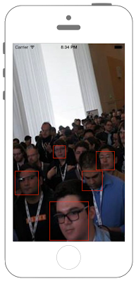

# 顔認識



```swift fct_label="Swift 5.x/4.x"
//
//  ViewController.swift
//  CoreImage004
//
//  Created by Misato Morino on 2016/08/15.
//  Copyright © 2016年 Misato Morino. All rights reserved.
//

import UIKit
import CoreImage

extension UIImage{
    
    // UIImageをリサイズするメソッド.
    class func ResizeÜIImage(image : UIImage,width : CGFloat, height : CGFloat)-> UIImage!{
        
        // 指定された画像の大きさのコンテキストを用意.
        UIGraphicsBeginImageContext(CGSize(width: width, height: height))
        
        // コンテキストに自身に設定された画像を描画する.
        image.draw(in: CGRect(x: 0, y: 0, width: width, height: height))
        
        // コンテキストからUIImageを作る.
        let newImage = UIGraphicsGetImageFromCurrentImageContext()
        
        // コンテキストを閉じる.
        UIGraphicsEndImageContext()
        
        return newImage
    }
    
}


class ViewController: UIViewController {
    
    override func viewDidLoad() {
        super.viewDidLoad()
        
        let myImage : UIImage = UIImage.ResizeÜIImage(image: UIImage(named: "sample")!, width: self.view.frame.width, height: self.view.frame.height)
        
        // UIImageViewの生成.
        let myImageView : UIImageView = UIImageView()
        myImageView.frame = CGRect(x: 0, y: 0, width: myImage.size.width, height: myImage.size.height)
        myImageView.image = myImage
        self.view.addSubview(myImageView)
        
        // NSDictionary型のoptionを生成。顔認識の精度を追加する.
        let options : NSDictionary = NSDictionary(object: CIDetectorAccuracyHigh, forKey: CIDetectorAccuracy as NSCopying)
        
        // CIDetectorを生成。顔認識をするのでTypeはCIDetectorTypeFace.
        let detector : CIDetector = CIDetector(ofType: CIDetectorTypeFace, context: nil, options: options as? [String : AnyObject])!
        
        // detectorで認識した顔のデータを入れておくNSArray.
        let faces : NSArray = detector.features(in: CIImage(image: myImage)!) as NSArray
        
        // UIKitは画面左上に原点があるが、CoreImageは画面左下に原点があるのでそれを揃えなくてはならない.
        // CoreImageとUIKitの原点を画面左上に統一する処理.
        var transform : CGAffineTransform = CGAffineTransform(scaleX: 1, y: -1)
        transform = transform.translatedBy(x: 0, y: -myImageView.bounds.size.height)
        
        // 検出された顔のデータをCIFaceFeatureで処理.
        for feature in faces {
            
            // 座標変換.
            let faceRect : CGRect = (feature as AnyObject).bounds.applying(transform)
            
            // 画像の顔の周りを線で囲うUIViewを生成.
            let faceOutline = UIView(frame: faceRect)
            faceOutline.layer.borderWidth = 1
            faceOutline.layer.borderColor = UIColor.red.cgColor
            myImageView.addSubview(faceOutline)
        }
    }
}
```

```swift fct_label="Swift 3.x"
//
//  ViewController.swift
//  CoreImage004
//
//  Created by Misato Morino on 2016/08/15.
//  Copyright © 2016年 Misato Morino. All rights reserved.
//

import UIKit
import CoreImage

extension UIImage{
    
    // UIImageをリサイズするメソッド.
    class func ResizeÜIImage(image : UIImage,width : CGFloat, height : CGFloat)-> UIImage!{
        
        // 指定された画像の大きさのコンテキストを用意.
        UIGraphicsBeginImageContext(CGSize(width: width, height: height))
        
        // コンテキストに自身に設定された画像を描画する.
        image.draw(in: CGRect(x: 0, y: 0, width: width, height: height))
        
        // コンテキストからUIImageを作る.
        let newImage = UIGraphicsGetImageFromCurrentImageContext()
        
        // コンテキストを閉じる.
        UIGraphicsEndImageContext()
        
        return newImage
    }
    
}


class ViewController: UIViewController {
    
    override func viewDidLoad() {
        super.viewDidLoad()
        
        let myImage : UIImage = UIImage.ResizeÜIImage(image: UIImage(named: "sample")!, width: self.view.frame.width, height: self.view.frame.height)
        
        // UIImageViewの生成.
        let myImageView : UIImageView = UIImageView()
        myImageView.frame = CGRect(x: 0, y: 0, width: myImage.size.width, height: myImage.size.height)
        myImageView.image = myImage
        self.view.addSubview(myImageView)
        
        // NSDictionary型のoptionを生成。顔認識の精度を追加する.
        let options : NSDictionary = NSDictionary(object: CIDetectorAccuracyHigh, forKey: CIDetectorAccuracy)
        
        // CIDetectorを生成。顔認識をするのでTypeはCIDetectorTypeFace.
        let detector : CIDetector = CIDetector(ofType: CIDetectorTypeFace, context: nil, options: options as? [String : AnyObject])!
        
        // detectorで認識した顔のデータを入れておくNSArray.
        let faces : NSArray = detector.features(in: CIImage(image: myImage)!)
        
        // UIKitは画面左上に原点があるが、CoreImageは画面左下に原点があるのでそれを揃えなくてはならない.
        // CoreImageとUIKitの原点を画面左上に統一する処理.
        var transform : CGAffineTransform = CGAffineTransform(scaleX: 1, y: -1)
        transform = transform.translatedBy(x: 0, y: -myImageView.bounds.size.height)
        
        // 検出された顔のデータをCIFaceFeatureで処理.
        for feature in faces {
            
            // 座標変換.
            let faceRect : CGRect = feature.bounds.applying(transform)
            
            // 画像の顔の周りを線で囲うUIViewを生成.
            let faceOutline = UIView(frame: faceRect)
            faceOutline.layer.borderWidth = 1
            faceOutline.layer.borderColor = UIColor.red.cgColor
            myImageView.addSubview(faceOutline)
        }
    } 
}
```

```swift fct_label="Swift 2.x"
//
//  ViewController.swift
//  CoreImage004
//
//  Created by Misato Morino on 2016/08/15.
//  Copyright © 2016年 Misato Morino. All rights reserved.
//

import UIKit
import CoreImage

extension UIImage{
    
    // UIImageをリサイズするメソッド.
    class func ResizeÜIImage(image : UIImage,width : CGFloat, height : CGFloat)-> UIImage!{
        
        // 指定された画像の大きさのコンテキストを用意.
        UIGraphicsBeginImageContext(CGSizeMake(width, height))
        
        // コンテキストに自身に設定された画像を描画する.
        image.drawInRect(CGRectMake(0, 0, width, height))
        
        // コンテキストからUIImageを作る.
        let newImage = UIGraphicsGetImageFromCurrentImageContext()
        
        // コンテキストを閉じる.
        UIGraphicsEndImageContext()
        
        return newImage
    }
    
}


class ViewController: UIViewController {
    
    override func viewDidLoad() {
        super.viewDidLoad()
        
        let myImage : UIImage = UIImage.ResizeÜIImage(UIImage(named: "sample")!, width: self.view.frame.width, height: self.view.frame.height)
        
        // UIImageViewの生成.
        let myImageView : UIImageView = UIImageView()
        myImageView.frame = CGRectMake(0, 0, myImage.size.width, myImage.size.height)
        myImageView.image = myImage
        self.view.addSubview(myImageView)
        
        // NSDictionary型のoptionを生成。顔認識の精度を追加する.
        let options : NSDictionary = NSDictionary(object: CIDetectorAccuracyHigh, forKey: CIDetectorAccuracy)
        
        // CIDetectorを生成。顔認識をするのでTypeはCIDetectorTypeFace.
        let detector : CIDetector = CIDetector(ofType: CIDetectorTypeFace, context: nil, options: options as? [String : AnyObject])
        
        // detectorで認識した顔のデータを入れておくNSArray.
        let faces : NSArray = detector.featuresInImage(CIImage(image: myImage)!)
        
        // UIKitは画面左上に原点があるが、CoreImageは画面左下に原点があるのでそれを揃えなくてはならない.
        // CoreImageとUIKitの原点を画面左上に統一する処理.
        var transform : CGAffineTransform = CGAffineTransformMakeScale(1, -1)
        transform = CGAffineTransformTranslate(transform, 0, -myImageView.bounds.size.height)
        
        // 検出された顔のデータをCIFaceFeatureで処理.
        for feature in faces {
            
            // 座標変換.
            let faceRect : CGRect = CGRectApplyAffineTransform(feature.bounds, transform)
            
            // 画像の顔の周りを線で囲うUIViewを生成.
            let faceOutline = UIView(frame: faceRect)
            faceOutline.layer.borderWidth = 1
            faceOutline.layer.borderColor = UIColor.redColor().CGColor
            myImageView.addSubview(faceOutline)
        }
    } 
}
```

## 3.xと4.xの差分
* `CIDetectorAccuracy` に `as NSCopying` を追加
* `detector.features(in: CIImage(image: myImage)!)` に `as NSArray` を追加
* `feature.bounds.applying(transform)` を `(feature as AnyObject).bounds.applying(transform)` に変更

## 2.xと3.xの差分
* ```init(CIImage:)``` から ```init(ciImage:)``` に変更
* ```CGRectApplyAffineTransform(feature.bounds, transform)``` から ```feature.bounds.applying(transform)```

## Reference

* CIFilter
    * [https://developer.apple.com/reference/coreimage/cifilter](https://developer.apple.com/reference/coreimage/cifilter)
* CIImage
    * [https://developer.apple.com/reference/coreimage/ciimage](https://developer.apple.com/reference/coreimage/ciimage)
* CIDetector
    * [https://developer.apple.com/reference/coreimage/cidetector](https://developer.apple.com/reference/coreimage/cidetector)
* CGAffineTransform
    * [https://developer.apple.com/reference/coregraphics/cgaffinetransform](https://developer.apple.com/reference/coregraphics/cgaffinetransform)
