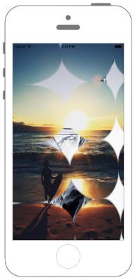

# モッドトランジションフィルタ処理



```swift fct_label="Swift 5.x/4.x"
//
//  ViewController.swift
//  CoreImage016
//

import UIKit
import CoreImage
import Foundation

extension UIImage{

    class func ResizeÜIImage(image : UIImage,width : CGFloat, height :
        CGFloat)-> UIImage!{

        // 指定された画像の大きさのコンテキストを用意.
        UIGraphicsBeginImageContext(CGSize(width: width, height: height))

        // コンテキストに画像を描画.
        image.draw(in: CGRect(x: 0, y: 0, width: width, height: height))

        // コンテキストからUIImageを生成.
        let newImage = UIGraphicsGetImageFromCurrentImageContext()

        // コンテキストを閉じる.
        UIGraphicsGetImageFromCurrentImageContext()

        return newImage
    }
}

class ViewController: UIViewController{
    var myImageView:UIImageView!
    var count = 0.0
    let myFilter = CIFilter(name: "CIModTransition")

    // 画像遷移の時間処理.
    @objc func update(timer: Timer) {

        count += 0.1

        myFilter!.setValue(NSNumber(value:count), forKey: kCIInputTimeKey)

        // 加工後の画像を得る.
        let myOutputImage = UIImage(ciImage: myFilter!.outputImage!)

        // 加工後の画像をUIImageViewに設定.
        myImageView.image = myOutputImage

    }

    override func viewDidLoad() {

        // UIImageViewを生成.
        myImageView = UIImageView(frame: self.view.bounds)
        self.view.addSubview(myImageView)

        // 変換元の画像と遷移の終着点の画像を生成.
        let CIImage1 = CIImage(image: UIImage.ResizeÜIImage(image: UIImage(named:"sample1")!,width: self.view.frame.maxX, height:self.view.frame.maxY))

        let CIImage2 = CIImage(image: UIImage.ResizeÜIImage(image: UIImage(named: "sample2")!, width: self.view.frame.maxX, height:self.view.frame.maxY))

        // CIModTransitionフィルタに必要なパラメータを設定.
        // トランジション領域の中心をx及びy座標で指定.
        let myCenter = CIVector(cgPoint: view.center)
        // 中心から穴の縁までの距離を指定.
        let myRadius = NSNumber(value: 200)
        // 穴の角度を指定.
        let myAngle = NSNumber(value: 2)

        // 各パラメータをセット.
        myFilter!.setValue(myCenter, forKey: kCIInputCenterKey)
        myFilter!.setValue(myRadius, forKey: kCIInputRadiusKey)
        myFilter!.setValue(myAngle, forKey: kCIInputAngleKey)
        myFilter!.setValue(CIImage1, forKey: kCIInputImageKey)
        myFilter!.setValue(CIImage2, forKey: kCIInputTargetImageKey)

        // Nstimerの設定.
        Timer.scheduledTimer(timeInterval: 0.1, target: self, selector: #selector(ViewController.update(timer:)), userInfo: nil, repeats: true)

        // 加工後の画像を得る.
        let myOutputImage = UIImage(ciImage: myFilter!.outputImage!)

        // 加工後の画像をUIImageViewに設定.
        myImageView.image = myOutputImage
    }
}
```

```swift fct_label="Swift 3.x"
//
//  ViewController.swift
//  CoreImage016
//
//  Created by Misato Morino on 2016/09/19.
//  Copyright © 2016年 Misato Morino. All rights reserved.
//

import UIKit
import CoreImage
import Foundation

extension UIImage{
    
    class func ResizeÜIImage(image : UIImage,width : CGFloat, height :
        CGFloat)-> UIImage!{
        
        // 指定された画像の大きさのコンテキストを用意.
        UIGraphicsBeginImageContext(CGSize(width: width, height: height))
        
        // コンテキストに画像を描画.
        image.draw(in: CGRect(x: 0, y: 0, width: width, height: height))
        
        // コンテキストからUIImageを生成.
        let newImage = UIGraphicsGetImageFromCurrentImageContext()
        
        // コンテキストを閉じる.
        UIGraphicsGetImageFromCurrentImageContext()
        
        return newImage
    }
}

class ViewController: UIViewController{
    var myImageView:UIImageView!
    var count = 0.0
    var myTime = NSNumber(value:0.0)
    let myFilter = CIFilter(name: "CIModTransition")
    
    // 画像遷移の時間処理.
    func update(timer: Timer) {
        
        count += 0.1
        myTime = NSNumber(value: count)
        
        myFilter!.setValue(myTime, forKey: kCIInputTimeKey)
        
        // 加工後の画像を得る.
        let myOutputImage = UIImage(ciImage: myFilter!.outputImage!)
        
        // 加工後の画像をUIImageViewに設定.
        myImageView.image = myOutputImage
        
    }
    
    override func viewDidLoad() {
        
        // UIImageViewを生成.
        myImageView = UIImageView(frame: self.view.bounds)
        self.view.addSubview(myImageView)
        
        // 変換元の画像と遷移の終着点の画像を生成.
        let CIImage1 = CIImage(image: UIImage.ResizeÜIImage(image: UIImage(named:"sample1")!,width: self.view.frame.maxX, height:self.view.frame.maxY))
        
        let CIImage2 = CIImage(image: UIImage.ResizeÜIImage(image: UIImage(named: "sample2")!, width: self.view.frame.maxX, height:self.view.frame.maxY))
        
        // CIModTransitionフィルタに必要なパラメータを設定.
        // トランジション領域の中心をx及びy座標で指定.
        let myCenter = CIVector(cgPoint: view.center)
        // 中心から穴の縁までの距離を指定.
        let myRadius = NSNumber(value: 200)
        // 穴の角度を指定.
        let myAngle = NSNumber(value: 2)
        
        // 各パラメータをセット.
        myFilter!.setValue(myCenter, forKey: kCIInputCenterKey)
        myFilter!.setValue(myRadius, forKey: kCIInputRadiusKey)
        myFilter!.setValue(myAngle, forKey: kCIInputAngleKey)
        myFilter!.setValue(CIImage1, forKey: kCIInputImageKey)
        myFilter!.setValue(CIImage2, forKey: kCIInputTargetImageKey)
        
        // Nstimerの設定.
        Timer.scheduledTimer(timeInterval: 0.001, target: self, selector: #selector(ViewController.update(timer:)), userInfo: nil, repeats: true)
        
        // 加工後の画像を得る.
        let myOutputImage = UIImage(ciImage: myFilter!.outputImage!)
        
        // 加工後の画像をUIImageViewに設定.
        myImageView.image = myOutputImage
    }
}
```

```swift fct_label="Swift 2.x"
//
//  ViewController.swift
//  CoreImage016
//
//  Created by Misato Morino on 2016/09/19.
//  Copyright © 2016年 Misato Morino. All rights reserved.
//

import UIKit
import CoreImage
import Foundation

extension UIImage{
    
    class func ResizeÜIImage(image : UIImage,width : CGFloat, height :
        CGFloat)-> UIImage!{
        
        // 指定された画像の大きさのコンテキストを用意.
        UIGraphicsBeginImageContext(CGSizeMake(width, height))
        
        // コンテキストに画像を描画.
        image.drawInRect(CGRectMake(0, 0, width, height))
        
        // コンテキストからUIImageを生成.
        let newImage = UIGraphicsGetImageFromCurrentImageContext()
        
        // コンテキストを閉じる.
        UIGraphicsGetImageFromCurrentImageContext()
        
        return newImage
    }
}

class ViewController: UIViewController{
    var myImageView:UIImageView!
    var count = 0.0
    var myTime = NSNumber(double:0.0)
    let myFilter = CIFilter(name: "CIModTransition")
    
    // 画像遷移の時間処理.
    func update(timer: NSTimer) {
        
        count += 0.1
        myTime = count
        
        myFilter!.setValue(myTime, forKey: kCIInputTimeKey)
        
        // 加工後の画像を得る.
        let myOutputImage = UIImage(CIImage: myFilter!.outputImage!)
        
        // 加工後の画像をUIImageViewに設定.
        myImageView.image = myOutputImage
        
    }
    
    override func viewDidLoad() {
        
        // UIImageViewを生成.
        myImageView = UIImageView(frame: self.view.bounds)
        self.view.addSubview(myImageView)
        
        // 変換元の画像と遷移の終着点の画像を生成.
        let CIImage1 = CIImage(image: UIImage.ResizeÜIImage(UIImage(named:"sample1")!,width: self.view.frame.maxX, height:self.view.frame.maxY))
        
        let CIImage2 = CIImage(image: UIImage.ResizeÜIImage(UIImage(named: "sample2")!, width: self.view.frame.maxX, height:self.view.frame.maxY))
        
        // CIModTransitionフィルタに必要なパラメータを設定.
        // トランジション領域の中心をx及びy座標で指定.
        let myCenter = CIVector(CGPoint: view.center)
        // 中心から穴の縁までの距離を指定.
        let myRadius = NSNumber(int: 200)
        // 穴の角度を指定.
        let myAngle = NSNumber(int: 2)
        
        // 各パラメータをセット.
        myFilter!.setValue(myCenter, forKey: kCIInputCenterKey)
        myFilter!.setValue(myRadius, forKey: kCIInputRadiusKey)
        myFilter!.setValue(myAngle, forKey: kCIInputAngleKey)
        myFilter!.setValue(CIImage1, forKey: kCIInputImageKey)
        myFilter!.setValue(CIImage2, forKey: kCIInputTargetImageKey)
        
        // Nstimerの設定.
        NSTimer.scheduledTimerWithTimeInterval(0.001, target: self, selector: #selector(ViewController.update(_:)), userInfo: nil, repeats: true)
        
        // 加工後の画像を得る.
        let myOutputImage = UIImage(CIImage: myFilter!.outputImage!)
        
        // 加工後の画像をUIImageViewに設定.
        myImageView.image = myOutputImage
    }
}
```

## 3.xと4.xの差分
* `func update(timer: NSTimer)` に `@objc` を付加

## 2.xと3.xの差分
* `init(CIImage:)` から `init(ciImage:)` に変更
* `scheduledTimerWithTimeInterval` から `scheduledTimer` に変更

## Reference

* CIFilter
    * [https://developer.apple.com/reference/coreimage/cifilter](https://developer.apple.com/reference/coreimage/cifilter)
* CIImage
    * [https://developer.apple.com/reference/coreimage/ciimage](https://developer.apple.com/reference/coreimage/ciimage)
