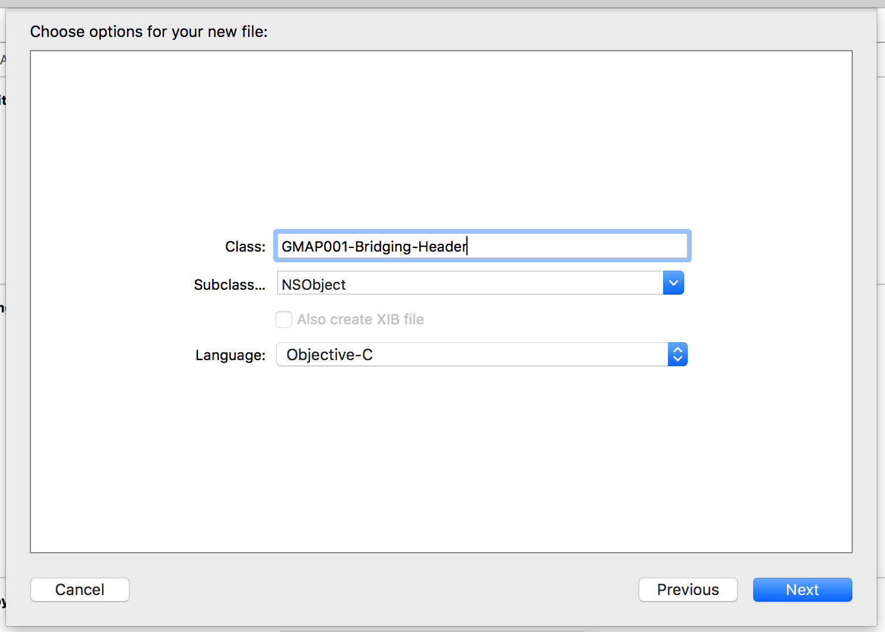
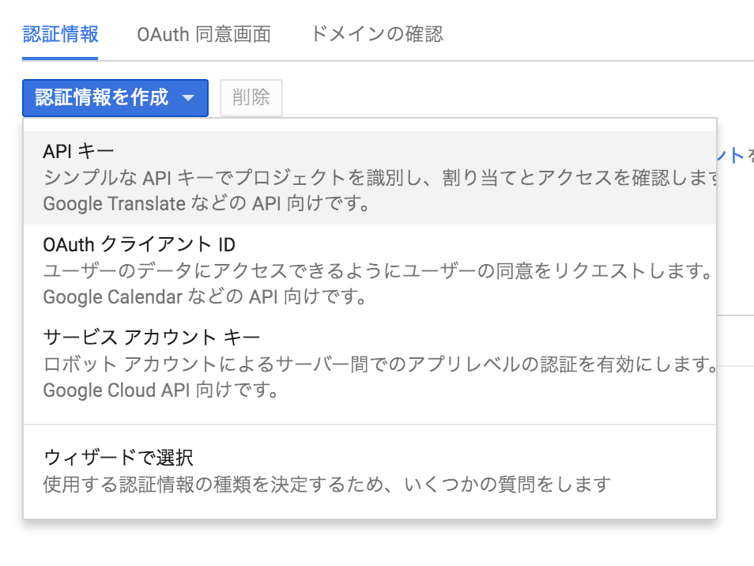
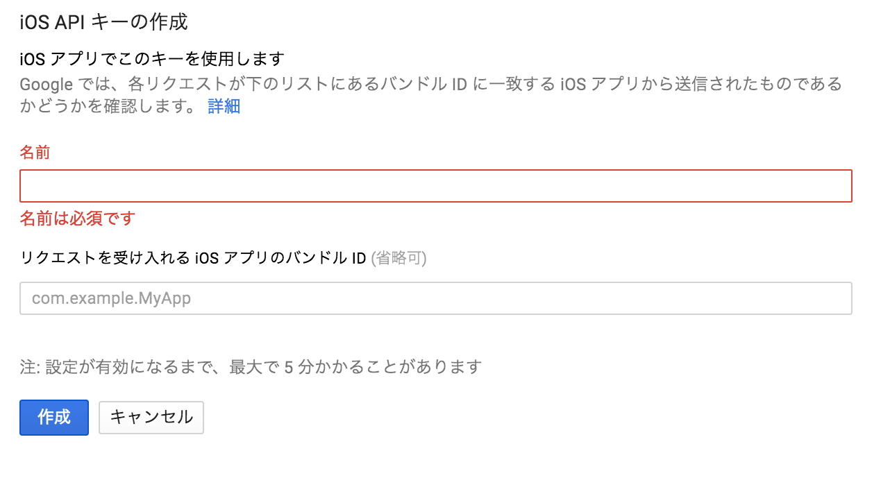

# Swiftで使用するための設定

## CocoaPodsを入手
```
$ sudo gem update --system          # update ruby
$ sudo gem install cocoapods        # install cocoapods
```

## CocoaPodsでAPIをインストール
```
$ cd [your project directory]
$ pod init                        # make Podfile
$ vim Podfile                     # edit Podfile
$ pod install

Analyzing dependencies
Downloading dependencies
Installing GoogleMaps (1.10.0)
Generating Pods project
Integrating client project

[!] Please close any current Xcode sessions and use `[your project name].xcworkspace` for this project from now on.

$ open [your project name].xcworkspace
```

## Podfile
```
source 'https://github.com/CocoaPods/Specs.git'
platform :ios, '9.0'

target 'GMAP001' do
  use_frameworks!
  pod 'GoogleMaps'
end

```

APIをインストールした後は、.xcworkspaceを開くようにする.
またAPIをインストールする前に、XcodeとCocoaPodsのバージョンを最新にする.

### [プロジェクト名]-Bridging-Header.hの作成



### GoogleMaps/GoogleMaps.h をImport
```
#import <GoogleMaps/GoogleMaps.h>
```

### GoogleMap SDK for iOSを有効にする
[googleDevelopers](https://code.google.com/apis/console/)でプロジェクトを作成する.
Google Maps SDK for iOSを選択肢、有効化


### API Keyを発行する



プロジェクトの名前とバンドルIDを入力して、APIkeyを作る.


## Reference
* Google API SDK for iOS - Getting Started
 * [https://developers.google.com/maps/documentation/ios/start](https://developers.google.com/maps/documentation/ios/start)
