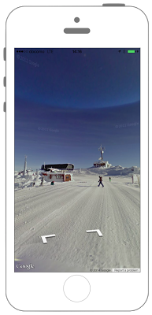

# StreetViewの表示



## Swift3.0
### AppDelegate.swift
```swift
//
//  AppDelegate.swift
//  GoogleMaps003_3.0
//
//  Created by KimikoWatanabe on 2016/08/30.
//  Copyright © 2016年 FaBo, Inc. All rights reserved.
//

import UIKit
import GoogleMaps

@UIApplicationMain
class AppDelegate: UIResponder, UIApplicationDelegate {

    var window: UIWindow?


    func application(_ application: UIApplication, didFinishLaunchingWithOptions launchOptions: [NSObject: AnyObject]?) -> Bool {

        GMSServices.provideAPIKey("取得したAPIKey")

        // Override point for customization after application launch.
        return true
    }
}
```
### ViewController.swift
```swift
//
//  ViewController.swift
//  GoogleMaps003_3.0
//
//  Created by KimikoWatanabe on 2016/08/30.
//  Copyright © 2016年 FaBo, Inc. All rights reserved.
//

import UIKit
import GoogleMaps

class ViewController: UIViewController, GMSMapViewDelegate {

    override func viewDidLoad() {
        super.viewDidLoad()

        // 緯度.
        let lat: CLLocationDegrees = 50.059139

        // 経度.
        let lon: CLLocationDegrees = -122.958391

        // 経緯度を合わせた座標.
        let panoramaNear: CLLocationCoordinate2D  = CLLocationCoordinate2D(latitude: lat,longitude: lon)

        // PanoramaViewを生成.
        let panoView: GMSPanoramaView = GMSPanoramaView(frame: CGRect(x:0, y:0, width:self.view.bounds.width, height:self.view.bounds.height))

        // PanoramaViewに座標をセット.
        panoView.moveNearCoordinate(panoramaNear)

        // viewにPanoramaViewを追加.
        self.view.addSubview(panoView)
    }

    override func didReceiveMemoryWarning() {
        super.didReceiveMemoryWarning()
        // Dispose of any resources that can be recreated.
    }
}

```

## Swift 2.3
### AppDelegate.swift
```swift
//
//  AppDelegate.swift
//  GoogleMaps002_2.3
//
//  Created by KimikoWatanabe on 2016/08/30.
//  Copyright © 2016年 FaBo, Inc. All rights reserved.
//

import UIKit

@UIApplicationMain
class AppDelegate: UIResponder, UIApplicationDelegate {

    var window: UIWindow?

    func application(application: UIApplication, didFinishLaunchingWithOptions launchOptions: [NSObject: AnyObject]?) -> Bool {

        GMSServices.provideAPIKey("取得したAPIKey")

        // Override point for customization after application launch.
        return true
    }
}
```
### ViewController.swift
```swift
//
//  ViewController.swift
//  GoogleMaps002_2.3
//
//  Created by KimikoWatanabe on 2016/08/22.
//  Copyright © 2016年 FaBo, Inc. All rights reserved.
//

import UIKit

class ViewController: UIViewController, GMSMapViewDelegate {

    override func viewDidLoad() {
        super.viewDidLoad()

        // 緯度.
        let lat: CLLocationDegrees = 50.059139

        // 経度.
        let lon: CLLocationDegrees = -122.958391

        // 経緯度を合わせた座標.
        let panoramaNear: CLLocationCoordinate2D  = CLLocationCoordinate2D(latitude: lat,longitude: lon)

        // PanoramaViewを生成.
        let panoView: GMSPanoramaView = GMSPanoramaView(frame: CGRectMake(0, 0, self.view.bounds.width, self.view.bounds.height))

        // PanoramaViewに座標をセット.
        panoView.moveNearCoordinate(panoramaNear)

        // viewにPanoramaViewを追加.
        self.view.addSubview(panoView)
    }

    override func didReceiveMemoryWarning() {
        super.didReceiveMemoryWarning()
        // Dispose of any resources that can be recreated.
    }
}

```

## 2.3と3.0の差分
* CGRectの初期化方法の変更(CGRectMakeの廃止)

## Reference
* Google Map SDK for iOS
 * [https://developers.google.com/maps/documentation/ios/reference/index](https://developers.google.com/maps/documentation/ios/reference/index)
