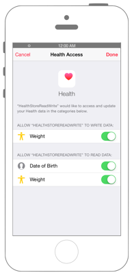

# 体重データのHealthStoreへの読み書き

 

## Swift3.0

`Info.plist`に`NSHealthUpdateUsageDescription`と`NSHealthShareUsageDescription`を追加します

※ Capabilities -> HealthKit をONにしてください。


```swift
//
//  ViewController.swift
//  healthkit002
//
//  Copyright © 2016年 FaBo, Inc. All rights reserved.
//
import UIKit
import HealthKit

class ViewController: UIViewController, UITextFieldDelegate  {
    
    var myHealthStore : HKHealthStore!
    var myReadWeightField: UITextField!
    var myWriteWeightField: UITextField!
    var myReadButton: UIButton!
    var myWriteButton: UIButton!
    
    override func viewDidLoad() {
        super.viewDidLoad()
        
        // HealthStoreの生成.
        myHealthStore = HKHealthStore()
        
        // Write用.
        myWriteWeightField = UITextField(frame: CGRect(x: 0, y: 0, width: 300, height: 30))
        myWriteWeightField.text = "99.9"
        myWriteWeightField.delegate = self
        myWriteWeightField.borderStyle = UITextBorderStyle.roundedRect
        myWriteWeightField.layer.position = CGPoint(x:self.view.bounds.width/2,y:50);
        self.view.addSubview(myWriteWeightField)
        
        // Read用.
        myReadWeightField = UITextField(frame: CGRect(x: 0, y: 0, width: 300, height: 30))
        myReadWeightField.text = ""
        myReadWeightField.delegate = self
        myReadWeightField.borderStyle = UITextBorderStyle.roundedRect
        myReadWeightField.layer.position = CGPoint(x:self.view.bounds.width/2,y:100);
        self.view.addSubview(myReadWeightField)
        
        // 読み込みボタン.
        myReadButton = UIButton()
        myReadButton.frame = CGRect(x: 0, y: 0, width: 200, height: 40)
        myReadButton.backgroundColor = UIColor.red
        myReadButton.layer.masksToBounds = true
        myReadButton.setTitle("体重データ読み込み", for: UIControlState.normal)
        myReadButton.setTitleColor(UIColor.white, for: UIControlState.normal)
        myReadButton.setTitleColor(UIColor.black, for: UIControlState.highlighted)
        myReadButton.layer.cornerRadius = 20.0
        myReadButton.layer.position = CGPoint(x: self.view.frame.width/2, y:200)
        myReadButton.tag = 1
        myReadButton.addTarget(self, action: #selector(ViewController.onClickMyButton(sender:)), for: .touchUpInside)
        self.view.addSubview(myReadButton);
        
        // 書き込みボタン.
        myWriteButton = UIButton()
        myWriteButton.frame = CGRect(x: 0, y: 0, width: 200, height: 40)
        myWriteButton.backgroundColor = UIColor.blue
        myWriteButton.layer.masksToBounds = true
        myWriteButton.setTitle("体重データ書き込み", for: UIControlState.normal)
        myWriteButton.setTitleColor(UIColor.white, for: UIControlState.normal)
        myWriteButton.setTitleColor(UIColor.black, for: UIControlState.highlighted)
        myWriteButton.layer.cornerRadius = 20.0
        myWriteButton.layer.position = CGPoint(x: self.view.frame.width/2, y:250)
        myWriteButton.tag = 2
        myWriteButton.addTarget(self, action: #selector(ViewController.onClickMyButton(sender:)), for: .touchUpInside)
        self.view.addSubview(myWriteButton);
        
        requestAuthorization()
    }
    
    override func didReceiveMemoryWarning() {
        super.didReceiveMemoryWarning()
        // Dispose of any resources that can be recreated.
    }
    
    /*
     ボタンイベント.
     */
    func onClickMyButton(sender: UIButton){
        if(sender.tag == 1){
            readData()
        } else if(sender.tag == 2){
            if let w = Double(myWriteWeightField.text!) {
                writeData(weight: w)
            }
        }
    }
    
    private func requestAuthorization() {
        // 書き込みを許可する型.
        let typeOfWrites = Set(arrayLiteral:
            HKObjectType.quantityType(forIdentifier: HKQuantityTypeIdentifier.bodyMass)!
        )
        
        // 読み込みを許可する型.
        // HKCharacteristicTypeIdentifierDateOfBirthは、readしかできない.
        let typeOfReads = Set(arrayLiteral:
            HKObjectType.quantityType(forIdentifier: HKQuantityTypeIdentifier.bodyMass)!,
            HKCharacteristicType.characteristicType(forIdentifier: HKCharacteristicTypeIdentifier.dateOfBirth)!
        )
        
        //  HealthStoreへのアクセス承認をおこなう.
        myHealthStore.requestAuthorization(toShare: typeOfWrites, read: typeOfReads, completion: { (success, error) in
            if let e = error {
                print("Error: \(e.localizedDescription)")
                return
            }
            print(success ? "Success!" : " Failure!")
        })
    }
    
    /*
     体重を読み出す.
     */
    private func readData() {
        let typeOfWeight = HKObjectType.quantityType(forIdentifier: HKQuantityTypeIdentifier.bodyMass)
        let calendar = Calendar.init(identifier: Calendar.Identifier.gregorian)
        let now = Date()
        let startDate = calendar.startOfDay(for: now)
        let endDate = calendar.date(byAdding: Calendar.Component.day, value: 1, to: startDate)
        let predicate = HKQuery.predicateForSamples(withStart: startDate, end: endDate, options: HKQueryOptions.strictStartDate)
        let statsOptions: HKStatisticsOptions = [HKStatisticsOptions.discreteMin, HKStatisticsOptions.discreteMax]
        
        let query = HKStatisticsQuery(quantityType: typeOfWeight!, quantitySamplePredicate: predicate, options: statsOptions, completionHandler: { (query, result, error) in
            if let e = error {
                print("Error: \(e.localizedDescription)")
                return
            }
            DispatchQueue.main.async {
                guard let r = result else {
                    return
                }
                let min = r.minimumQuantity()
                let max = r.maximumQuantity()
                if min != nil && max != nil {
                    self.myReadWeightField.text = "最小:\(min!) 最大:\(max!)"
                }
            }
        })
        myHealthStore.execute(query)
    }
    
    /*
     体重データを保存.
     */
    private func writeData(weight: Double) {
        // 体重のタイプ.
        let typeOfWeight = HKObjectType.quantityType(forIdentifier: HKQuantityTypeIdentifier.bodyMass)
        // 体重データを作成.
        let myWeight = HKQuantity(unit: HKUnit.gram(), doubleValue: weight)
        // StoreKit保存用データを作成.
        let myWeightData = HKQuantitySample(type: typeOfWeight!, quantity: myWeight, start: Date(), end: Date())
        
        // データの保存.
        myHealthStore.save(myWeightData, withCompletion: { (success, error) in
            if let e = error {
                print("Error: \(e.localizedDescription)")
            }
            print(success ? "Success!" : " Failure!")
        })
    }
}
```

## Swift2.3

```swift
//
//  ViewController.swift
//  healthkit002
//
//  Copyright © 2016年 FaBo, Inc. All rights reserved.
//
import UIKit
import HealthKit

class ViewController: UIViewController, UITextFieldDelegate  {
    
    var myHealthStore : HKHealthStore!
    var myReadWeightField: UITextField!
    var myWriteWeightField: UITextField!
    var myReadButton: UIButton!
    var myWriteButton: UIButton!
    
    override func viewDidLoad() {
        super.viewDidLoad()
        
        // HealthStoreの生成.
        myHealthStore = HKHealthStore()
        
        // Write用.
        myWriteWeightField = UITextField(frame: CGRectMake(0,0,300,30))
        myWriteWeightField.text = "99.9"
        myWriteWeightField.delegate = self
        myWriteWeightField.borderStyle = UITextBorderStyle.RoundedRect
        myWriteWeightField.layer.position = CGPoint(x:self.view.bounds.width/2,y:50);
        self.view.addSubview(myWriteWeightField)
        
        // Read用.
        myReadWeightField = UITextField(frame: CGRectMake(0,0,300,30))
        myReadWeightField.text = ""
        myReadWeightField.delegate = self
        myReadWeightField.borderStyle = UITextBorderStyle.RoundedRect
        myReadWeightField.layer.position = CGPoint(x:self.view.bounds.width/2,y:100);
        self.view.addSubview(myReadWeightField)
        
        // 読み込みボタン.
        myReadButton = UIButton()
        myReadButton.frame = CGRectMake(0,0,200,40)
        myReadButton.backgroundColor = UIColor.redColor();
        myReadButton.layer.masksToBounds = true
        myReadButton.setTitle("体重データ読み込み", forState: UIControlState.Normal)
        myReadButton.setTitleColor(UIColor.whiteColor(), forState: UIControlState.Normal)
        myReadButton.setTitleColor(UIColor.blackColor(), forState: UIControlState.Highlighted)
        myReadButton.layer.cornerRadius = 20.0
        myReadButton.layer.position = CGPoint(x: self.view.frame.width/2, y:200)
        myReadButton.tag = 1
        myReadButton.addTarget(self, action: #selector(ViewController.onClickMyButton(_:)), forControlEvents: .TouchUpInside)
        self.view.addSubview(myReadButton);
        
        // 書き込みボタン.
        myWriteButton = UIButton()
        myWriteButton.frame = CGRectMake(0,0,200,40)
        myWriteButton.backgroundColor = UIColor.blueColor();
        myWriteButton.layer.masksToBounds = true
        myWriteButton.setTitle("体重データ書き込み", forState: UIControlState.Normal)
        myWriteButton.setTitleColor(UIColor.whiteColor(), forState: UIControlState.Normal)
        myWriteButton.setTitleColor(UIColor.blackColor(), forState: UIControlState.Highlighted)
        myWriteButton.layer.cornerRadius = 20.0
        myWriteButton.layer.position = CGPoint(x: self.view.frame.width/2, y:250)
        myWriteButton.tag = 2
        myWriteButton.addTarget(self, action: #selector(ViewController.onClickMyButton(_:)), forControlEvents: .TouchUpInside)
        self.view.addSubview(myWriteButton);
        
        requestAuthorization()
    }
    
    override func didReceiveMemoryWarning() {
        super.didReceiveMemoryWarning()
        // Dispose of any resources that can be recreated.
    }
    
    /*
     ボタンイベント.
     */
    func onClickMyButton(sender: UIButton){
        if(sender.tag == 1){
            readData()
        } else if(sender.tag == 2){
            if let w = Double(myWriteWeightField.text!) {
                writeData(w)
            }
        }
    }
    
    private func requestAuthorization() {
        // 書き込みを許可する型.
        let typeOfWrite = Set(arrayLiteral:
            HKObjectType.quantityTypeForIdentifier(HKQuantityTypeIdentifierBodyMass)!
        )
        
        // 読み込みを許可する型.
        // HKCharacteristicTypeIdentifierDateOfBirthは、readしかできない.
        let typeOfRead = Set(arrayLiteral:
            HKObjectType.quantityTypeForIdentifier(HKQuantityTypeIdentifierBodyMass)!,
            HKCharacteristicType.characteristicTypeForIdentifier(HKCharacteristicTypeIdentifierDateOfBirth)!
        )
        
        //  HealthStoreへのアクセス承認をおこなう.
        myHealthStore.requestAuthorizationToShareTypes(typeOfWrite, readTypes: typeOfRead, completion: { (success, error) in
            if let e = error {
                print("Error: \(e.localizedDescription)")
                return
            }
            print(success ? "Success!" : " Failure!")
        })
    }
    
    /*
     体重を読み出す.
     */
    private func readData() {
        let typeOfWeight = HKObjectType.quantityTypeForIdentifier(HKQuantityTypeIdentifierBodyMass)
        let calendar = NSCalendar.init(identifier: NSCalendarIdentifierGregorian)
        let now = NSDate()
        let startDate = calendar!.startOfDayForDate(now)
        let endDate = calendar?.dateByAddingUnit(NSCalendarUnit.Day, value: 1, toDate: startDate, options: NSCalendarOptions.MatchFirst)
        let predicate = HKQuery.predicateForSamplesWithStartDate(startDate, endDate: endDate, options: HKQueryOptions.StrictStartDate)
        let statsOptions: HKStatisticsOptions = [HKStatisticsOptions.DiscreteMin, HKStatisticsOptions.DiscreteMax]
        
        let query = HKStatisticsQuery(quantityType: typeOfWeight!, quantitySamplePredicate: predicate, options: statsOptions, completionHandler: { (query, result, error) in
            if let e = error {
                print("Error: \(e.localizedDescription)")
                return
            }
            dispatch_async(dispatch_get_main_queue(), {
                guard let r = result else {
                    return
                }
                let min = r.minimumQuantity()
                let max = r.maximumQuantity()
                if min != nil && max != nil {
                    self.myReadWeightField.text = "最小:\(min!) 最大:\(max!)"
                }
            })
        })
        
        
        self.myHealthStore.executeQuery(query)
    }
    
    /*
     体重データを保存.
     */
    private func writeData(weight: Double) {
        // 体重のタイプ.
        let typeOfWeight = HKObjectType.quantityTypeForIdentifier(HKQuantityTypeIdentifierBodyMass)
        // 体重データを作成.
        let myWeight = HKQuantity(unit: HKUnit.gramUnit(), doubleValue: weight)
        // StoreKit保存用データを作成.
        let myWeightData = HKQuantitySample(type: typeOfWeight!, quantity: myWeight, startDate: NSDate(), endDate: NSDate())
        
        // データの保存.
        myHealthStore.saveObject(myWeightData, withCompletion: { (success, error) in
            if let e = error {
                print("Error: \(e.localizedDescription)")
            }
            print(success ? "Success!" : " Failure!")
        })
    }
}
```

## 2.xと3.xの差分

* HealthKitの定数が列挙体に変更
    * 例 : `HKCharacteristicTypeIdentifierDateOfBirth` → `HKCharacteristicTypeIdentifier.dateOfBirth`
* `HKObjectType.characteristicTypeForIdentifier(String)`から`HKObjectType.characteristicType(forIdentifier: HKCharacteristicTypeIdentifier)`に変更
* `HKHealthStore.requestAuthorizationToShareTypes(Set<HKSampleType>?, readTypes: Set<HKObjectType>?, completion: (Bool, NSError?) -> Void)`から`HKHealthStore.requestAuthorization(toShare: Set<HKSampleType>?, read: Set<HKObjectType>?, completion: (Bool, Error?) -> Void)`に変更
* `HKObjectType.quantityTypeForIdentifier(String)`から`HKObjectType.quantityType(forIdentifier: HKQuantityTypeIdentifier)`に変更
* `NSDate`から`Date`に変更
* `dispatch_async(dispatch_queue_t, dispatch_block_t)`から`DispatchQueue.main.async(execute: () -> Void)`に変更
* `HKHealthStore.executeQuery(HKQuery)`から`HKHealthStore.execute(HKQuery)`に変更

## References

* HealthKit
    * https://developer.apple.com/reference/healthkit
