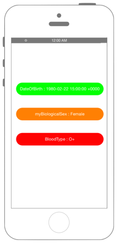
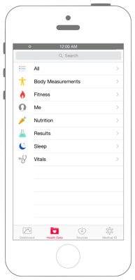
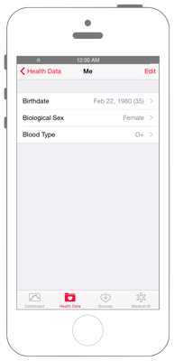

# ユーザー情報の取得



## Swift3.0

`Info.plist`に`NSHealthUpdateUsageDescription`と`NSHealthShareUsageDescription`を追加します

※ Capabilities -> HealthKit をONにしてください。


```swift
//
//  ViewController.swift
//  healthkit003
//
//  Copyright © 2016年 FaBo, Inc. All rights reserved.
//
import UIKit
import HealthKit

class ViewController: UIViewController, UITextFieldDelegate{
    
    // 各インスタンスの生成.
    var myHealthStore = HKHealthStore()
    var myReadBloodField: UITextField!
    var myReadBirthField: UITextField!
    var myReadBiologicalSexField: UITextField!
    
    override func viewDidLoad() {
        super.viewDidLoad()
        
        // 誕生日表示用のテキストフィールドを用意.
        myReadBirthField = UITextField(frame: CGRect(x: 0, y: 0, width: 350, height: 50))
        myReadBirthField.center = CGPoint(x: self.view.center.x, y: 200)
        myReadBirthField.backgroundColor = UIColor.green
        myReadBirthField.textColor = UIColor.white
        myReadBirthField.layer.cornerRadius = 25.0
        myReadBirthField.textAlignment = NSTextAlignment.center
        myReadBirthField.isEnabled = false
        self.view.addSubview(myReadBirthField)
        
        // 性別表示用のテキストフィールドを用意.
        myReadBiologicalSexField = UITextField(frame: CGRect(x: 0, y: 0, width: 350, height: 50))
        myReadBiologicalSexField.center = CGPoint(x: self.view.center.x, y: 300)
        myReadBiologicalSexField.backgroundColor = UIColor.orange
        myReadBiologicalSexField.textColor = UIColor.white
        myReadBiologicalSexField.layer.cornerRadius = 25.0
        myReadBiologicalSexField.textAlignment = NSTextAlignment.center
        myReadBiologicalSexField.isEnabled = false
        self.view.addSubview(myReadBiologicalSexField)
        
        // 血液型表示用のテキストフィールドを用意.
        myReadBloodField = UITextField(frame: CGRect(x: 0, y: 0, width: 350, height: 50))
        myReadBloodField.center = CGPoint(x: self.view.center.x, y: 400)
        myReadBloodField.backgroundColor = UIColor.red
        myReadBloodField.textColor = UIColor.white
        myReadBloodField.layer.cornerRadius = 25.0
        myReadBloodField.textAlignment = NSTextAlignment.center
        myReadBloodField.isEnabled = false
        self.view.addSubview(myReadBloodField)
    }
    
    override func viewDidAppear(_ animated: Bool) {
        super.viewDidAppear(animated)
        // HealthStoreへの許可を申請.
        requestAuthorization()
    }
    
    /*
     Healthデータへのアクセスを申請.
     */
    private func requestAuthorization(){
        
        // 読み込みを許可する型.
        let typeOfRead = Set(arrayLiteral:
            HKObjectType.characteristicType(forIdentifier: HKCharacteristicTypeIdentifier.dateOfBirth)!,
            HKObjectType.characteristicType(forIdentifier: HKCharacteristicTypeIdentifier.biologicalSex)!,
            HKObjectType.characteristicType(forIdentifier: HKCharacteristicTypeIdentifier.bloodType)!
        )
        
        //  HealthStoreへのアクセス承認をおこなう.
        myHealthStore.requestAuthorization(toShare: nil, read: typeOfRead, completion: { (success, error) in
            if let e = error {
                print("Error: \(e.localizedDescription)")
                return
            }
            if success {
                print("Success!")
                // 承認に成功したらデータの読み出しを開始.
                self.readData()
            } else {
                print("Error!")
            }
        })
    }
    
    /*
     データの読み出し.
     */
    private func readData() {
        do {
            // HealthStoreから性別の呼び出し.
            let myBiologicalSex = try myHealthStore.biologicalSex()
            var myBiologicalSexText:String = ""
            switch myBiologicalSex.biologicalSex {
            case HKBiologicalSex.female:
                myBiologicalSexText = "Female"
            case HKBiologicalSex.male:
                myBiologicalSexText = "Male"
            case HKBiologicalSex.notSet:
                myBiologicalSexText = "NotSet"
            default:
                myBiologicalSexText = "error"
                print("error")
            }
            // 読み出したデータをテキストフィールドにセット.
            myReadBiologicalSexField.text = "myBiologicalSex : \(myBiologicalSexText)"
            // HealthStoreから血液型の呼び出し.
            let myBloodType = try myHealthStore.bloodType()
            var myBloodTypeText = ""
            switch myBloodType.bloodType {
            case HKBloodType.aPositive:
                myBloodTypeText = "A+"
            case HKBloodType.aNegative:
                myBloodTypeText = "A-"
            case HKBloodType.bPositive:
                myBloodTypeText = "B+"
            case HKBloodType.bNegative:
                myBloodTypeText = "B-"
            case HKBloodType.abPositive:
                myBloodTypeText = "AB+"
            case HKBloodType.abNegative:
                myBloodTypeText = "AB-"
            case HKBloodType.oPositive:
                myBloodTypeText = "O+"
            case HKBloodType.oNegative:
                myBloodTypeText = "O-"
            default:
                myBloodTypeText = "error"
                print("error")
            }
            // 読み出したデータをテキストフィールドにセット.
            myReadBloodField.text = "BloodType : \(myBloodTypeText)"
            // HealthStoreから誕生日の呼び出し.
            let myBirthdayComps = try myHealthStore.dateOfBirthComponents()
            // 読み出したデータをテキストフィールドにセット.
            myReadBirthField.text = "\(myBirthdayComps.year!)/\(myBirthdayComps.month!)/\(myBirthdayComps.day!)"
        } catch let error as NSError {
            // 読み込みに失敗した場合
            print("A read error occured")
            print("\(error.localizedDescription)")
        }
    }
}
```

## Swift2.3

```swift
//
//  ViewController.swift
//  healthkit003
//
//  Copyright © 2016年 FaBo, Inc. All rights reserved.
//
import UIKit
import HealthKit

class ViewController: UIViewController, UITextFieldDelegate{
    
    // 各インスタンスの生成.
    var myHealthStore = HKHealthStore()
    var myReadBloodField: UITextField!
    var myReadBirthField: UITextField!
    var myReadBiologicalSexField: UITextField!
    
    override func viewDidLoad() {
        super.viewDidLoad()

        // 誕生日表示用のテキストフィールドを用意.
        myReadBirthField = UITextField(frame: CGRectMake(0, 0, 350, 50))
        myReadBirthField.center = CGPoint(x: self.view.center.x, y: 200)
        myReadBirthField.backgroundColor = UIColor.greenColor()
        myReadBirthField.textColor = UIColor.whiteColor()
        myReadBirthField.layer.cornerRadius = 25.0
        myReadBirthField.textAlignment = NSTextAlignment.Center
        myReadBirthField.enabled = false
        self.view.addSubview(myReadBirthField)
        
        // 性別表示用のテキストフィールドを用意.
        myReadBiologicalSexField = UITextField(frame: CGRectMake(0, 0, 350, 50))
        myReadBiologicalSexField.center = CGPoint(x: self.view.center.x, y: 300)
        myReadBiologicalSexField.backgroundColor = UIColor.orangeColor()
        myReadBiologicalSexField.textColor = UIColor.whiteColor()
        myReadBiologicalSexField.layer.cornerRadius = 25.0
        myReadBiologicalSexField.textAlignment = NSTextAlignment.Center
        myReadBiologicalSexField.enabled = false
        self.view.addSubview(myReadBiologicalSexField)
        
        // 血液型表示用のテキストフィールドを用意.
        myReadBloodField = UITextField(frame: CGRectMake(0, 0, 350, 50))
        myReadBloodField.center = CGPoint(x: self.view.center.x, y: 400)
        myReadBloodField.backgroundColor = UIColor.redColor()
        myReadBloodField.textColor = UIColor.whiteColor()
        myReadBloodField.layer.cornerRadius = 25.0
        myReadBloodField.textAlignment = NSTextAlignment.Center
        myReadBloodField.enabled = false
        self.view.addSubview(myReadBloodField)
    }
    
    override func viewDidAppear(animated: Bool) {
        super.viewDidAppear(animated)
        // HealthStoreへの許可を申請.
        requestAuthorization()
    }
    
    /*
     Healthデータへのアクセスを申請.
     */
    private func requestAuthorization(){
        
        // 読み込みを許可する型.
        let typeOfRead = Set(arrayLiteral:
            HKObjectType.characteristicTypeForIdentifier(HKCharacteristicTypeIdentifierDateOfBirth)!,
            HKObjectType.characteristicTypeForIdentifier(HKCharacteristicTypeIdentifierBiologicalSex)!,
            HKObjectType.characteristicTypeForIdentifier(HKCharacteristicTypeIdentifierBloodType)!
        )
        
        //  HealthStoreへのアクセス承認をおこなう.
        myHealthStore.requestAuthorizationToShareTypes(nil, readTypes: typeOfRead, completion: { (success, error) in
            if let e = error {
                print("Error: \(e.localizedDescription)")
                return
            }
            if success {
                print("Success!")
                // 承認に成功したらデータの読み出しを開始.
                self.readData()
            } else {
                print("Error!")
            }
        })
    }
    
    /*
     データの読み出し.
     */
    private func readData() {
        do {
            // HealthStoreから性別の呼び出し.
            let myBiologicalSex = try myHealthStore.biologicalSex()
            var myBiologicalSexText:String = ""
            switch myBiologicalSex.biologicalSex {
            case HKBiologicalSex.Female:
                myBiologicalSexText = "Female"
            case HKBiologicalSex.Male:
                myBiologicalSexText = "Male"
            case HKBiologicalSex.NotSet:
                myBiologicalSexText = "NotSet"
            default:
                myBiologicalSexText = "error"
                print("error")
            }
            // 読み出したデータをテキストフィールドにセット.
            myReadBiologicalSexField.text = "myBiologicalSex : \(myBiologicalSexText)"
            
            // HealthStoreから血液型の呼び出し.
            let myBloodType = try myHealthStore.bloodType()
            var myBloodTypeText = ""
            switch myBloodType.bloodType {
            case HKBloodType.APositive:
                myBloodTypeText = "A+"
            case HKBloodType.ANegative:
                myBloodTypeText = "A-"
            case HKBloodType.BPositive:
                myBloodTypeText = "B+"
            case HKBloodType.BNegative:
                myBloodTypeText = "B-"
            case HKBloodType.ABPositive:
                myBloodTypeText = "AB+"
            case HKBloodType.ABNegative:
                myBloodTypeText = "AB-"
            case HKBloodType.OPositive:
                myBloodTypeText = "O+"
            case HKBloodType.ONegative:
                myBloodTypeText = "O-"
            default:
                myBloodTypeText = "error"
                print("error")
            }
            // 読み出したデータをテキストフィールドにセット.
            myReadBloodField.text = "BloodType : \(myBloodTypeText)"
            // HealthStoreから誕生日の呼び出し.
            let myBirthday = try myHealthStore.dateOfBirth()
            print(myBirthday)
            // 読み出したデータをテキストフィールドにセット.
            myReadBirthField.text = myBirthday.description
        } catch let error as NSError {
            // 読み込みに失敗した場合
            print("A read error occured")
            print("\(error.localizedDescription)")
        }
    }
}
```

## Healthでの設定

誕生日・性別・血液型は公式AppであるHealthでしか登録ができないので、サンプルを動作させる前に登録します

 

## 2.xと3.xの差分

* HealthKitの定数が列挙体に変更
    * 例 : `HKCharacteristicTypeIdentifierDateOfBirth` → `HKCharacteristicTypeIdentifier.dateOfBirth`
* `HKObjectType.characteristicTypeForIdentifier(String)`から`HKObjectType.characteristicType(forIdentifier: HKCharacteristicTypeIdentifier)`に変更
* `HKHealthStore.requestAuthorizationToShareTypes(Set<HKSampleType>?, readTypes: Set<HKObjectType>?, completion: (Bool, NSError?) -> Void)`から`HKHealthStore.requestAuthorization(toShare: Set<HKSampleType>?, read: Set<HKObjectType>?, completion: (Bool, Error?) -> Void)`に変更
* `HKQuantityTypeIdentifierOxygenSaturation`から``に変更
* `HKHealthStore.dateOfBirthComponents()`の利用推奨

## References

* HealthKit
    * https://developer.apple.com/reference/healthkit
