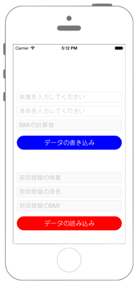

# Weighing scale (IEEE Std 11073-10415 Dev specialization)



## Swift3.0

`Info.plist`に`NSHealthUpdateUsageDescription`と`NSHealthShareUsageDescription`を追加します

※ Capabilities -> HealthKit をONにしてください。


```swift
```

## Swift2.3

```swift
```

## 2.xと3.xの差分

* HealthKitの定数が列挙体に変更
    * 例 : `HKCharacteristicTypeIdentifierDateOfBirth` → `HKCharacteristicTypeIdentifier.dateOfBirth`
* `HKHealthStore.requestAuthorizationToShareTypes(Set<HKSampleType>?, readTypes: Set<HKObjectType>?, completion: (Bool, NSError?) -> Void)`から`HKHealthStore.requestAuthorization(toShare: Set<HKSampleType>?, read: Set<HKObjectType>?, completion: (Bool, Error?) -> Void)`に変更
* `HKObjectType.quantityTypeForIdentifier(String)`から`HKObjectType.quantityType(forIdentifier: HKQuantityTypeIdentifier)`に変更
* `NSDate`から`Date`に変更
* `dispatch_async(dispatch_queue_t, dispatch_block_t)`から`DispatchQueue.main.async(execute: () -> Void)`に変更
* `HKHealthStore.executeQuery(HKQuery)`から`HKHealthStore.execute(HKQuery)`に変更

## References

* HealthKit
    * https://developer.apple.com/reference/healthkit
