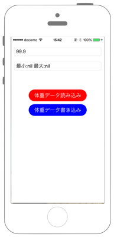

# 睡眠情報の記録

 

## Swift3.0

`Info.plist`に`NSHealthUpdateUsageDescription`と`NSHealthShareUsageDescription`を追加します

※ Capabilities -> HealthKit をONにしてください。


```swift
//
//  ViewController.swift
//  healthkit011
//
//  Copyright © 2016年 FaBo, Inc. All rights reserved.
//
import UIKit
import HealthKit

class ViewController: UIViewController, UITextFieldDelegate, UIScrollViewDelegate {
    // 各インスタンスの生成.
    var myHealthStore = HKHealthStore()
    var myReadSleepField: UITextField!
    var myWriteSleepField: UITextField!
    var myReadButton: UIButton!
    var myWriteButton: UIButton!
    
    var myGoBedTime: UIDatePicker = UIDatePicker()
    var myWakeUpTime: UIDatePicker = UIDatePicker()
    
    override func viewDidLoad() {
        super.viewDidLoad()
        
        let goBedTimeText:UITextView = UITextView(frame: CGRect(x: 0, y: 40, width: 200, height: 50))
        goBedTimeText.font = UIFont.systemFont(ofSize: CGFloat(15))
        goBedTimeText.text = "就寝時間を入力"
        self.view.addSubview(goBedTimeText)
        
        // 就寝時間を入力するためのDatePickerを設置.
        myGoBedTime.frame = CGRect(x: 0, y: 80, width: self.view.frame.width, height: 100)
        myGoBedTime.datePickerMode = UIDatePickerMode.dateAndTime
        myGoBedTime.timeZone = NSTimeZone.local
        myGoBedTime.tag = 0
        myGoBedTime.addTarget(self, action: #selector(ViewController.onDidChangeDate(sender:)), for: .valueChanged)
        self.view.addSubview(myGoBedTime)
        
        let wakeUpTimeText:UITextView = UITextView(frame: CGRect(x: 0, y: 240, width: 500, height: 50))
        wakeUpTimeText.font = UIFont.systemFont(ofSize: CGFloat(15))
        wakeUpTimeText.text = "起床時間を入力"
        self.view.addSubview(wakeUpTimeText)
        
        // 起床時間を入力するためのDatePickerを設置.
        myWakeUpTime.frame = CGRect(x: 0, y: 280, width: self.view.frame.width, height: 100)
        myWakeUpTime.datePickerMode = UIDatePickerMode.dateAndTime
        myWakeUpTime.timeZone = NSTimeZone.local
        myWakeUpTime.tag = 1
        myWakeUpTime.addTarget(self, action: #selector(ViewController.onDidChangeDate(sender:)), for: .valueChanged)
        self.view.addSubview(myWakeUpTime)
        
        // 書き込みボタンを設置.
        myWriteButton = UIButton()
        myWriteButton.frame = CGRect(x: 0, y: 0, width: 300, height: 40)
        myWriteButton.backgroundColor = UIColor.blue
        myWriteButton.layer.masksToBounds = true
        myWriteButton.setTitle("寝た時間を登録する", for: UIControlState.normal)
        myWriteButton.setTitleColor(UIColor.white, for: UIControlState.normal)
        myWriteButton.setTitleColor(UIColor.black, for: UIControlState.highlighted)
        myWriteButton.layer.cornerRadius = 20.0
        myWriteButton.layer.position = CGPoint(x: self.view.frame.width/2, y:450)
        myWriteButton.tag = 2
        myWriteButton.addTarget(self, action: #selector(ViewController.onClickMyButton(sender:)), for: .touchUpInside)
        self.view.addSubview(myWriteButton)
        
        // 表示用フィールドを設置.
        myReadSleepField = UITextField(frame: CGRect(x: 0, y: 0, width: 300, height: 30))
        myReadSleepField.placeholder = "昨日の睡眠時間"
        myReadSleepField.isEnabled = false
        myReadSleepField.delegate = self
        myReadSleepField.borderStyle = UITextBorderStyle.roundedRect
        myReadSleepField.layer.position = CGPoint(x:self.view.bounds.width/2,y:500);
        self.view.addSubview(myReadSleepField)
        
        // 読み込みボタンを設置.
        myReadButton = UIButton()
        myReadButton.frame = CGRect(x: 0, y: 0, width: 300, height: 40)
        myReadButton.backgroundColor = UIColor.red
        myReadButton.layer.masksToBounds = true
        myReadButton.setTitle("昨日の睡眠時間", for: UIControlState.normal)
        myReadButton.setTitleColor(UIColor.white, for: UIControlState.normal)
        myReadButton.setTitleColor(UIColor.black, for: UIControlState.highlighted)
        myReadButton.layer.cornerRadius = 20.0
        myReadButton.layer.position = CGPoint(x: self.view.frame.width/2, y:540)
        myReadButton.tag = 1
        myReadButton.addTarget(self, action: #selector(ViewController.onClickMyButton(sender:)), for: .touchUpInside)
        self.view.addSubview(myReadButton)
    }
    
    override func viewDidAppear(_ animated: Bool) {
        super.viewDidAppear(animated)
        // HealthStoreへの許可を申請.
        requestAuthorization()
    }
    
    /*
     ボタンイベント.
     */
    func onClickMyButton(sender: UIButton){
        if(sender.tag == 1){
            readData()
        } else if(sender.tag == 2){
            writeData(mySleepType: "InBed")
        }
    }
    
    /*
     DatePickerが選ばれた際に呼ばれる.
     */
    func onDidChangeDate(sender: UIDatePicker){
        print(sender.date)
    }
    
    /*
     Healthデータへのアクセスを申請.
     */
    private func requestAuthorization(){
        // 読み込みを許可する型.
        let types = Set(arrayLiteral:
            HKObjectType.categoryType(forIdentifier: HKCategoryTypeIdentifier.sleepAnalysis)!
        )
        
        // HealthStoreへのアクセス承認をおこなう.
        myHealthStore.requestAuthorization(toShare: types, read: types, completion: { (success, error) in
            if let e = error {
                print("Error: \(e.localizedDescription)")
            }
            print(success ? "Success" : "Failure")
        })
    }
    
    /*
     データの読み出し.
     */
    private func readData() {
        // 取得したいデータのタイプを生成.
        let typeOfSleep = HKSampleType.categoryType(forIdentifier: HKCategoryTypeIdentifier.sleepAnalysis)
        let calendar = Calendar.init(identifier: Calendar.Identifier.gregorian)
        let now = Date()
        let startDate = calendar.startOfDay(for: now)
        let endDate = calendar.date(byAdding: Calendar.Component.day, value: 1, to: startDate)
        let predicate = HKQuery.predicateForSamples(withStart: startDate, end: endDate, options: [])
        // データ取得時に登録された時間でソートするためのDescriptorを生成.
        let mySortDescriptor = NSSortDescriptor(key:HKSampleSortIdentifierStartDate, ascending: false)
        // queryを生成.
        let mySampleQuery = HKSampleQuery(sampleType: typeOfSleep!, predicate: predicate, limit: 1, sortDescriptors: [mySortDescriptor])
        { (sampleQuery, results, error ) -> Void in
            if let e = error {
                print("Error: \(e.localizedDescription)")
                return
            }
            // 一番最近に登録されたデータを取得.
            guard let myRecentSample = results!.first else {
                print("error")
                self.myReadSleepField.text = "Data is not found"
                return
            }
            let myGoBedTime = myRecentSample.startDate
            let myWeakUpTime = myRecentSample.endDate
            // 時間の差から睡眠時間を計算.
            let mySleepTime = myWeakUpTime.timeIntervalSince(myGoBedTime)
            // 取得したサンプルを単位に合わせる.
            DispatchQueue.main.async {
                let hour = Int(mySleepTime/(60*60))
                self.myReadSleepField.text = "\(hour)時間"
            }
        }
        // queryを発行.
        self.myHealthStore.execute(mySampleQuery)
    }
    
    /*
     データの書き込み.
     */
    private func writeData(mySleepType:String){
        let typeOfSleep:HKCategoryType = HKObjectType.categoryType(forIdentifier: HKCategoryTypeIdentifier.sleepAnalysis)!
        var mySleepAnalys:HKCategoryValueSleepAnalysis = HKCategoryValueSleepAnalysis(rawValue: 0)!
        
        switch mySleepType {
        case "InBed":
            mySleepAnalys = HKCategoryValueSleepAnalysis.inBed
        case "Asleep":
            mySleepAnalys = HKCategoryValueSleepAnalysis.asleep
        default:
            break
        }
        let mySleepData = HKCategorySample(type: typeOfSleep, value: mySleepAnalys.rawValue, start: myGoBedTime.date, end: myWakeUpTime.date)
        // HealthStoreにデータを保存.
        myHealthStore.save(mySleepData , withCompletion: { (success, error) in
            if let e = error {
                print("Error: \(e.localizedDescription)")
                return
            }
            print(success ? "Success" : "Failure")
        })
    }
}
```

## Swift2.3

```swift
//
//  ViewController.swift
//  healthkit011
//
//  Copyright © 2016年 FaBo, Inc. All rights reserved.
//
import UIKit
import HealthKit

class ViewController: UIViewController, UITextFieldDelegate, UIScrollViewDelegate {
    // 各インスタンスの生成.
    var myHealthStore = HKHealthStore()
    var myReadSleepField: UITextField!
    var myWriteSleepField: UITextField!
    var myReadButton: UIButton!
    var myWriteButton: UIButton!
    
    var myGoBedTime: UIDatePicker = UIDatePicker()
    var myWakeUpTime: UIDatePicker = UIDatePicker()
    
    override func viewDidLoad() {
        super.viewDidLoad()
        
        let goBedTimeText:UITextView = UITextView(frame: CGRectMake(0, 40, 200, 50))
        goBedTimeText.font = UIFont.systemFontOfSize(CGFloat(15))
        goBedTimeText.text = "就寝時間を入力"
        self.view.addSubview(goBedTimeText)
        
        // 就寝時間を入力するためのDatePickerを設置.
        myGoBedTime.frame = CGRectMake(0, 80, self.view.frame.width, 100)
        myGoBedTime.datePickerMode = UIDatePickerMode.DateAndTime
        myGoBedTime.timeZone = NSTimeZone.localTimeZone()
        myGoBedTime.tag = 0
        myGoBedTime.addTarget(self, action: #selector(ViewController.onDidChangeDate(_:)), forControlEvents: .ValueChanged)
        self.view.addSubview(myGoBedTime)
        
        
        let wakeUpTimeText:UITextView = UITextView(frame: CGRectMake(0, 240, 200, 50))
        wakeUpTimeText.font = UIFont.systemFontOfSize(CGFloat(15))
        wakeUpTimeText.text = "起床時間を入力"
        self.view.addSubview(wakeUpTimeText)
        
        // 起床時間を入力するためのDatePickerを設置.
        myWakeUpTime.frame = CGRectMake(0, 280, self.view.frame.width, 100)
        myWakeUpTime.datePickerMode = UIDatePickerMode.DateAndTime
        myWakeUpTime.timeZone = NSTimeZone.localTimeZone()
        myWakeUpTime.tag = 1
        myWakeUpTime.addTarget(self, action: #selector(ViewController.onDidChangeDate(_:)), forControlEvents: .ValueChanged)
        self.view.addSubview(myWakeUpTime)
        
        // 書き込みボタンを設置.
        myWriteButton = UIButton()
        myWriteButton.frame = CGRectMake(0,0,300,40)
        myWriteButton.backgroundColor = UIColor.blueColor();
        myWriteButton.layer.masksToBounds = true
        myWriteButton.setTitle("寝た時間を登録する", forState: UIControlState.Normal)
        myWriteButton.setTitleColor(UIColor.whiteColor(), forState: UIControlState.Normal)
        myWriteButton.setTitleColor(UIColor.blackColor(), forState: UIControlState.Highlighted)
        myWriteButton.layer.cornerRadius = 20.0
        myWriteButton.layer.position = CGPoint(x: self.view.frame.width/2, y:450)
        myWriteButton.tag = 2
        myWriteButton.addTarget(self, action: #selector(ViewController.onClickMyButton(_:)), forControlEvents: .TouchUpInside)
        self.view.addSubview(myWriteButton)
        
        // 表示用フィールドを設置.
        myReadSleepField = UITextField(frame: CGRectMake(0,0,300,30))
        myReadSleepField.placeholder = "昨日の睡眠時間"
        myReadSleepField.enabled = false
        myReadSleepField.delegate = self
        myReadSleepField.borderStyle = UITextBorderStyle.RoundedRect
        myReadSleepField.layer.position = CGPoint(x:self.view.bounds.width/2,y:500);
        self.view.addSubview(myReadSleepField)
        
        // 読み込みボタンを設置.
        myReadButton = UIButton()
        myReadButton.frame = CGRectMake(0,0,300,40)
        myReadButton.backgroundColor = UIColor.redColor();
        myReadButton.layer.masksToBounds = true
        myReadButton.setTitle("昨日の睡眠時間", forState: UIControlState.Normal)
        myReadButton.setTitleColor(UIColor.whiteColor(), forState: UIControlState.Normal)
        myReadButton.setTitleColor(UIColor.blackColor(), forState: UIControlState.Highlighted)
        myReadButton.layer.cornerRadius = 20.0
        myReadButton.layer.position = CGPoint(x: self.view.frame.width/2, y:540)
        myReadButton.tag = 1
        myReadButton.addTarget(self, action: #selector(ViewController.onClickMyButton(_:)), forControlEvents: .TouchUpInside)
        self.view.addSubview(myReadButton)
    }
    
    override func viewDidAppear(animated: Bool) {
        super.viewDidAppear(animated)
        // HealthStoreへの許可を申請.
        requestAuthorization()
    }
    
    /*
     ボタンイベント.
     */
    func onClickMyButton(sender: UIButton){
        if(sender.tag == 1){
            readData()
        } else if(sender.tag == 2){
            writeData("InBed")
        }
    }
    
    /*
     DatePickerが選ばれた際に呼ばれる.
     */
    func onDidChangeDate(sender: UIDatePicker){
        print(sender.date)
    }
    
    /*
     Healthデータへのアクセスを申請.
     */
    private func requestAuthorization(){
        // 読み込みを許可する型.
        let types = Set(arrayLiteral:
            HKObjectType.categoryTypeForIdentifier(HKCategoryTypeIdentifierSleepAnalysis)!
        )
        
        // HealthStoreへのアクセス承認をおこなう.
        myHealthStore.requestAuthorizationToShareTypes(types, readTypes: types, completion: { (success, error) in
            if let e = error {
                print("Error: \(e.localizedDescription)")
            }
            print(success ? "Success" : "Failure")
        })
    }
    
    /*
     データの読み出し.
     */
    private func readData() {
        // 取得したいデータのタイプを生成.
        let typeOfSleep = HKSampleType.categoryTypeForIdentifier(HKCategoryTypeIdentifierSleepAnalysis)
        let calendar = NSCalendar.init(identifier: NSCalendarIdentifierGregorian)
        let now = NSDate()
        let startDate = calendar!.startOfDayForDate(now)
        let endDate = calendar!.dateByAddingUnit(NSCalendarUnit.Day, value: 1, toDate: startDate, options: NSCalendarOptions.MatchFirst)
        let predicate = HKQuery.predicateForSamplesWithStartDate(startDate, endDate: endDate, options: HKQueryOptions.None)
        // データ取得時に登録された時間でソートするためのDescriptorを生成.
        let mySortDescriptor = NSSortDescriptor(key:HKSampleSortIdentifierStartDate, ascending: false)
        // queryを生成.
        let mySampleQuery = HKSampleQuery(sampleType: typeOfSleep!, predicate: predicate, limit: 1, sortDescriptors: [mySortDescriptor])
        { (sampleQuery, results, error ) -> Void in
            if let e = error {
                print("Error: \(e.localizedDescription)")
                return
            }
            // 一番最近に登録されたデータを取得.
            guard let myRecentSample = results!.first else {
                print("error")
                self.myReadSleepField.text = "Data is not found"
                return
            }
            let myGoBedTime = myRecentSample.startDate
            let myWeakUpTime = myRecentSample.endDate
            // 時間の差から睡眠時間を計算.
            let mySleepTime = myWeakUpTime.timeIntervalSinceDate(myGoBedTime)
            // 取得したサンプルを単位に合わせる.
            dispatch_async(dispatch_get_main_queue(),{
                let hour = Int(mySleepTime/(60*60))
                self.myReadSleepField.text = "\(hour)時間"
            })
        }
        
        // queryを発行.
        self.myHealthStore.executeQuery(mySampleQuery)
    }
    
    /*
     データの書き込み.
     */
    private func writeData(mySleepType:String){
        let typeOfSleep:HKCategoryType = HKObjectType.categoryTypeForIdentifier(HKCategoryTypeIdentifierSleepAnalysis)!
        var mySleepAnalys:HKCategoryValueSleepAnalysis = HKCategoryValueSleepAnalysis(rawValue: 0)!
        
        switch mySleepType {
        case "InBed":
            mySleepAnalys = HKCategoryValueSleepAnalysis.InBed
        case "Asleep":
            mySleepAnalys = HKCategoryValueSleepAnalysis.Asleep
        default :
            0
        }
        let mySleepData = HKCategorySample(type: typeOfSleep, value: mySleepAnalys.rawValue, startDate: myGoBedTime.date, endDate: myWakeUpTime.date)
        // HealthStoreにデータを保存.
        myHealthStore.saveObject(mySleepData , withCompletion: { (success, error) in
            if let e = error {
                print("Error: \(e.localizedDescription)")
                return
            }
            print(success ? "Success" : "Failure")
        })
    }
}
```

## 2.xと3.xの差分

* HealthKitの定数が列挙体に変更
    * 例 : `HKCharacteristicTypeIdentifierDateOfBirth` → `HKCharacteristicTypeIdentifier.dateOfBirth`
* `HKHealthStore.requestAuthorizationToShareTypes(Set<HKSampleType>?, readTypes: Set<HKObjectType>?, completion: (Bool, NSError?) -> Void)`から`HKHealthStore.requestAuthorization(toShare: Set<HKSampleType>?, read: Set<HKObjectType>?, completion: (Bool, Error?) -> Void)`に変更
* `HKObjectType.quantityTypeForIdentifier(String)`から`HKObjectType.quantityType(forIdentifier: HKQuantityTypeIdentifier)`に変更
* `NSDate`から`Date`に変更
* `dispatch_async(dispatch_queue_t, dispatch_block_t)`から`DispatchQueue.main.async(execute: () -> Void)`に変更
* `HKHealthStore.executeQuery(HKQuery)`から`HKHealthStore.execute(HKQuery)`に変更

## References

* HealthKit
    * https://developer.apple.com/reference/healthkit
