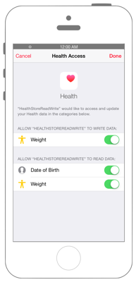
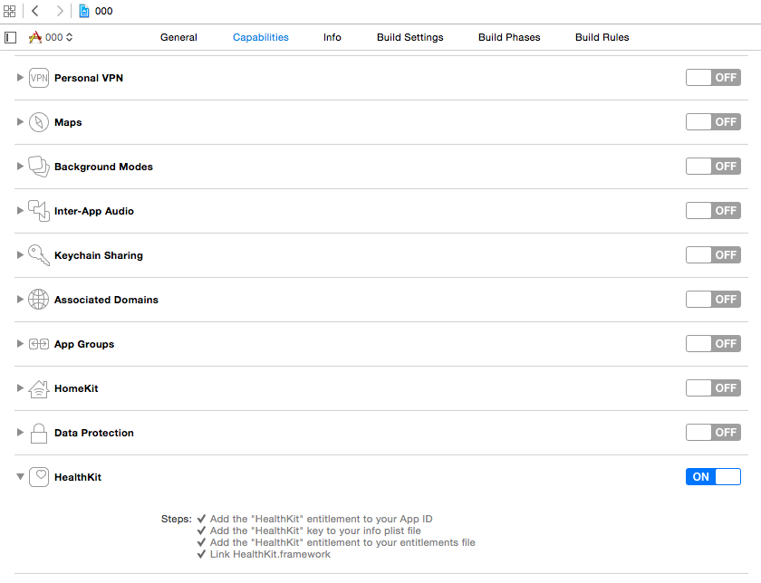

# 取得データの最大値・最小値を得る

 

## Swift3.0

`Info.plist`に`NSHealthUpdateUsageDescription`と`NSHealthShareUsageDescription`を追加します

※ Capabilities -> HealthKit をONにしてください。



```swift
```

## Swift2.3

```swift
```

## 2.xと3.xの差分

* HealthKitの定数が列挙体に変更
    * 例 : `HKCharacteristicTypeIdentifierDateOfBirth` → `HKCharacteristicTypeIdentifier.dateOfBirth`

## References

* HealthKit
    * https://developer.apple.com/reference/healthkit
