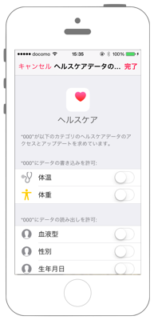

# 認証をする

 

## Swift3.0

`Info.plist`に`NSHealthUpdateUsageDescription`と`NSHealthShareUsageDescription`を追加します

※ Capabilities -> HealthKit をONにしてください。


```swift
//
//  ViewController.swift
//  healthkit001
//
//  Copyright © 2016年 FaBo, Inc. All rights reserved.
//
import UIKit
import HealthKit

class ViewController: UIViewController {
    
    // 各インスタンスの生成.
    var myHealthStore = HKHealthStore()
    
    override func viewDidLoad() {
        super.viewDidLoad()
        
        // 認証用ボタンを作成.
        let myAuthButton = UIButton(frame: CGRect(x: 0, y: 0, width: 200, height: 40))
        myAuthButton.backgroundColor = UIColor.orange
        myAuthButton.layer.masksToBounds = true
        myAuthButton.layer.cornerRadius = 20.0
        myAuthButton.setTitle("認証", for: .normal)
        myAuthButton.center = CGPoint(x: self.view.bounds.width/2,y: 200)
        myAuthButton.addTarget(self, action: #selector(ViewController.onClickMyButton(sender:)), for: .touchUpInside)
        self.view.addSubview(myAuthButton)
    }
    
    /*
     ボタンイベント.
     */
    func onClickMyButton(sender: UIButton){
        requestAuthorization()
    }
    
    private func requestAuthorization(){
        // 読み込みを許可する型.
        let typeOfRead = Set(arrayLiteral:
            HKObjectType.characteristicType(forIdentifier: HKCharacteristicTypeIdentifier.dateOfBirth)!,
            HKObjectType.characteristicType(forIdentifier: HKCharacteristicTypeIdentifier.biologicalSex)!,
            HKObjectType.characteristicType(forIdentifier: HKCharacteristicTypeIdentifier.bloodType)!
        )
        // 書き込みを許可する型.
        let typeOfWrite = Set(arrayLiteral:
            HKObjectType.quantityType(forIdentifier: HKQuantityTypeIdentifier.bodyMass)!,
            HKObjectType.quantityType(forIdentifier: HKQuantityTypeIdentifier.bodyTemperature)!
        )
        // HealthStoreへのアクセス承認をおこなう.
        myHealthStore.requestAuthorization(toShare: typeOfWrite, read: typeOfRead, completion: { (success, error) in
            if let e = error {
                print("Error: \(e.localizedDescription)")
                return
            }
            print(success ? "Success!" : " Failure!")
        })
    }
}
```

## Swift2.3

```swift
//
//  ViewController.swift
//  healthkit001
//
//  Copyright © 2016年 FaBo, Inc. All rights reserved.
//
import UIKit
import HealthKit

class ViewController: UIViewController {
    
    // 各インスタンスの生成.
    var myHealthStore = HKHealthStore()
    
    override func viewDidLoad() {
        super.viewDidLoad()
        
        // 認証用ボタンを作成.
        let myAuthButton = UIButton(frame: CGRectMake(0,0,200,50))
        myAuthButton.backgroundColor = UIColor.orangeColor()
        myAuthButton.layer.masksToBounds = true
        myAuthButton.layer.cornerRadius = 20.0
        myAuthButton.setTitle("認証", forState: .Normal)
        myAuthButton.center = CGPoint(x: self.view.bounds.width/2,y: 200)
        myAuthButton.addTarget(self, action: #selector(ViewController.onClickMyButton(_:)), forControlEvents: .TouchUpInside)
        self.view.addSubview(myAuthButton)
    }
    
    /*
     ボタンイベント.
     */
    func onClickMyButton(sender: UIButton){
        requestAuthorization()
    }
    
    private func requestAuthorization(){
        // 読み込みを許可する型.
        let typeOfRead = Set(arrayLiteral:
            HKObjectType.characteristicTypeForIdentifier(HKCharacteristicTypeIdentifierDateOfBirth)!,
            HKObjectType.characteristicTypeForIdentifier(HKCharacteristicTypeIdentifierBiologicalSex)!,
            HKObjectType.characteristicTypeForIdentifier(HKCharacteristicTypeIdentifierBloodType)!
        )

        // 書き込みを許可する型.
        let typeOfWrite = Set(arrayLiteral:
            HKObjectType.quantityTypeForIdentifier(HKQuantityTypeIdentifierBodyMass)!,
            HKObjectType.quantityTypeForIdentifier(HKQuantityTypeIdentifierBodyTemperature)!
        )
        // HealthStoreへのアクセス承認をおこなう.
        myHealthStore.requestAuthorizationToShareTypes(typeOfWrite, readTypes: typeOfRead, completion: { (success, error) in
            if let e = error {
                print("Error: \(e.localizedDescription)")
                return
            }
            print(success ? "Success!" : " Failure!")
        })
    }
}
```

## 2.xと3.xの差分

* HealthKitの定数が列挙体に変更
    * 例 : `HKCharacteristicTypeIdentifierDateOfBirth` → `HKCharacteristicTypeIdentifier.dateOfBirth`
* `HKObjectType.characteristicTypeForIdentifier(String)`から`HKObjectType.characteristicType(forIdentifier: HKCharacteristicTypeIdentifier)`に変更
* `HKHealthStore.requestAuthorizationToShareTypes(Set<HKSampleType>?, readTypes: Set<HKObjectType>?, completion: (Bool, NSError?) -> Void)`から`HKHealthStore.requestAuthorization(toShare: Set<HKSampleType>?, read: Set<HKObjectType>?, completion: (Bool, Error?) -> Void)`に変更

## References

* HealthKit
    * https://developer.apple.com/reference/healthkit
    * https://developer.apple.com/library/ios/documentation/HealthKit/Reference/HealthKit_Constants/
