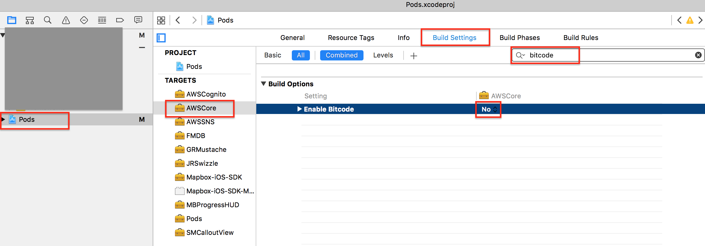

# iTunes AppStore Upload時エラーへの対処

## ERROR ITMS-90635

エラー例）AWSCoreのフレームワークでエラー

> ERROR ITMS-90635: "Invalid Mach-O Format. The Mach-O in bundle "#######.app/Frameworks/AWSCore.framework" isn’t consistent with the Mach-O in the main bundle. The main bundle Mach-O contains armv7(machine code) and arm64(machine code), while the nested bundle Mach-O contains armv7(bitcode) and arm64(bitcode). Verify that all of the targets for a platform have a consistent value for the ENABLE_BITCODE build setting." ERROR ITMS-90635: "Invalid Mach-O Format. The Mach-O in bundle "#######.app/Frameworks/AWSCore.framework" isn’t consistent with the Mach-O in the main bundle. The main bundle Mach-O contains armv7(machine code) and arm64(machine code), while the nested bundle Mach-O contains armv7(bitcode) and arm64(bitcode). Verify that all of the targets for a platform have a consistent value for the ENABLE_BITCODE build setting."

### 対処方法

