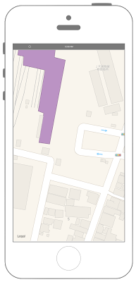

# 地図の表示



## Swift3.0
```swift
//
//  ViewController.swift
//  MapKit001
//
//  Created by Misato Morino on 2016/08/15.
//  Copyright © 2016年 Misato Morino. All rights reserved.
//

import UIKit
import MapKit

class ViewController: UIViewController, MKMapViewDelegate {
    
    // MapView.
    var myMapView : MKMapView!
    
    override func viewDidLoad() {
        super.viewDidLoad()
        
        // MapViewの生成.
        myMapView = MKMapView()
        
        // MapViewのサイズを画面全体に.
        myMapView.frame = self.view.bounds
        
        // Delegateを設定.
        myMapView.delegate = self
        
        // MapViewをViewに追加.
        self.view.addSubview(myMapView)
        
        // 中心点の緯度経度.
        let myLat: CLLocationDegrees = 37.506804
        let myLon: CLLocationDegrees = 139.930531
        let myCoordinate: CLLocationCoordinate2D = CLLocationCoordinate2DMake(myLat, myLon)
        
        // 縮尺.
        let myLatDist : CLLocationDistance = 100
        let myLonDist : CLLocationDistance = 100
        
        // Regionを作成.
        let myRegion: MKCoordinateRegion = MKCoordinateRegionMakeWithDistance(myCoordinate, myLatDist, myLonDist);
        
        // MapViewに反映.
        myMapView.setRegion(myRegion, animated: true)
        
    }
    
    // Regionが変更された時に呼び出されるメソッド.
    func mapView(_ mapView: MKMapView, regionDidChangeAnimated animated: Bool) {
        print("regionDidChangeAnimated")
    } 
}
```

## Swift 2.3
```swift
//
//  ViewController.swift
//  MapKit001
//
//  Created by Misato Morino on 2016/08/15.
//  Copyright © 2016年 Misato Morino. All rights reserved.
//

import UIKit
import MapKit

class ViewController: UIViewController, MKMapViewDelegate {
    
    // MapView.
    var myMapView : MKMapView!
    
    override func viewDidLoad() {
        super.viewDidLoad()
        
        // MapViewの生成.
        myMapView = MKMapView()
        
        // MapViewのサイズを画面全体に.
        myMapView.frame = self.view.bounds
        
        // Delegateを設定.
        myMapView.delegate = self
        
        // MapViewをViewに追加.
        self.view.addSubview(myMapView)
        
        // 中心点の緯度経度.
        let myLat: CLLocationDegrees = 37.506804
        let myLon: CLLocationDegrees = 139.930531
        let myCoordinate: CLLocationCoordinate2D = CLLocationCoordinate2DMake(myLat, myLon)
        
        // 縮尺.
        let myLatDist : CLLocationDistance = 100
        let myLonDist : CLLocationDistance = 100
        
        // Regionを作成.
        let myRegion: MKCoordinateRegion = MKCoordinateRegionMakeWithDistance(myCoordinate, myLatDist, myLonDist);
        
        // MapViewに反映.
        myMapView.setRegion(myRegion, animated: true)
        
    }
    
    // Regionが変更された時に呼び出されるメソッド.
    func mapView(mapView: MKMapView, regionDidChangeAnimated animated: Bool) {
        print("regionDidChangeAnimated")
    } 
}
```

## 2.3と3.0の差分

* ```func mapView(mapView: MKMapView, regionDidChangeAnimated animated: Bool)``` に ```func mapView(_ mapView: MKMapView, regionDidChangeAnimated animated: Bool) ``` に変更

## Reference
* MKMapView
    * [https://developer.apple.com/reference/mapkit/mkmapview](https://developer.apple.com/reference/mapkit/mkmapview)
