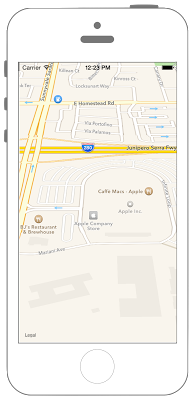

# 3D表示にする



実機でのみ有効

## Swift3.0
```swift
//
//  ViewController.swift
//  swiftdocs
//
//  Created by Misato Morino on 2016/08/15.
//  Copyright © 2016年 Misato Morino. All rights reserved.
//

import UIKit
import MapKit

class ViewController: UIViewController {
    
    override func viewDidLoad() {
        super.viewDidLoad()
        
        // MapViewを生成.
        let myMapView: MKMapView = MKMapView()
        myMapView.frame = self.view.frame
        
        // 経度、緯度、中心点を設定.
        let myLatitude: CLLocationDegrees = 37.331741
        let mylongitude: CLLocationDegrees = -122.030333
        let myCenter: CLLocationCoordinate2D = CLLocationCoordinate2DMake(myLatitude, mylongitude)
        
        // MapViewに中心を設定.
        myMapView.setCenter(myCenter, animated: true)
        
        // 縮尺.
        let mySapn: MKCoordinateSpan = MKCoordinateSpan(latitudeDelta: 0.1, longitudeDelta: 0.1)
        let myRegion: MKCoordinateRegion = MKCoordinateRegion(center: myCenter, span: mySapn)
        
        // MapViewにregionを設定.
        myMapView.region = myRegion
        
        // 自分の視点の座標.
        let fromCoordinate: CLLocationCoordinate2D = CLLocationCoordinate2DMake(37.321432, -122.031351)
        
        // 上空から見下ろす高さ.
        let myAltitude: CLLocationDistance = 150.0
        
        // MapCameraに中心点、視点、高さを設定.
        let myCamera: MKMapCamera = MKMapCamera(lookingAtCenter: myCenter, fromEyeCoordinate: fromCoordinate, eyeAltitude: myAltitude)
        
        // CameraをMapViewに設定.
        myMapView.setCamera(myCamera, animated: true)
        
        // ビルを3Dに見えるようにする.
        myMapView.showsBuildings = true
        
        // MapViewをviewに追加.
        self.view.addSubview(myMapView)
    } 
}
```

## Swift 2.3
```swift
//
//  ViewController.swift
//  MapKit005
//
//  Created by Misato Morino on 2016/08/15.
//  Copyright © 2016年 Misato Morino. All rights reserved.
//

import UIKit
import MapKit

class ViewController: UIViewController {
    
    override func viewDidLoad() {
        super.viewDidLoad()
        
        // MapViewを生成.
        let myMapView: MKMapView = MKMapView()
        myMapView.frame = self.view.frame
        
        // 経度、緯度、中心点を設定.
        let myLatitude: CLLocationDegrees = 37.331741
        let mylongitude: CLLocationDegrees = -122.030333
        let myCenter: CLLocationCoordinate2D = CLLocationCoordinate2DMake(myLatitude, mylongitude)
        
        // MapViewに中心を設定.
        myMapView.setCenterCoordinate(myCenter, animated: true)
        
        // 縮尺.
        let mySapn: MKCoordinateSpan = MKCoordinateSpan(latitudeDelta: 0.1, longitudeDelta: 0.1)
        let myRegion: MKCoordinateRegion = MKCoordinateRegion(center: myCenter, span: mySapn)
        
        // MapViewにregionを設定.
        myMapView.region = myRegion
        
        // 自分の視点の座標.
        let fromCoordinate: CLLocationCoordinate2D = CLLocationCoordinate2DMake(37.321432, -122.031351)
        
        // 上空から見下ろす高さ.
        let myAltitude: CLLocationDistance = 150.0
        
        // MapCameraに中心点、視点、高さを設定.
        let myCamera: MKMapCamera = MKMapCamera(lookingAtCenterCoordinate: myCenter, fromEyeCoordinate: fromCoordinate, eyeAltitude: myAltitude)
        
        // CameraをMapViewに設定.
        myMapView.setCamera(myCamera, animated: true)
        
        // ビルを3Dに見えるようにする.
        myMapView.showsBuildings = true
        
        // MapViewをviewに追加.
        self.view.addSubview(myMapView)
    } 
}
```

## 2.3と3.0の差分

* ```setCenterCoordinate``` から ```setCenter``` に変更
* ```init(lookingAtCenterCoordinate:, fromEyeCoordinate:, eyeAltitude:)``` から ```init(lookingAtCenter:, fromEyeCoordinate:, eyeAltitude:)``` に変更

## Reference
* MKMapView
    * [https://developer.apple.com/reference/mapkit/mkmapview](https://developer.apple.com/reference/mapkit/mkmapview)
* MKMapView - showsbuildings
    * [https://developer.apple.com/reference/mapkit/mkmapview/1452483-showsbuildings](https://developer.apple.com/reference/mapkit/mkmapview/1452483-showsbuildings)
