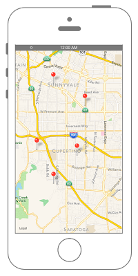

# ピンを長押しした地点にドロップさせる



## Swift3.0
```swift
//
//  ViewController.swift
//  MapKit006
//
//  Created by Misato Morino on 2016/08/15.
//  Copyright © 2016年 Misato Morino. All rights reserved.
//

import UIKit
import MapKit

class ViewController: UIViewController, MKMapViewDelegate {
    
    var myMapView: MKMapView!
    
    override func viewDidLoad() {
        super.viewDidLoad()
        
        // MapViewを生成.
        myMapView = MKMapView()
        myMapView.frame = self.view.frame
        
        // デリゲートを設定.
        myMapView.delegate = self
        
        // 経度、緯度を生成.
        let myLatitude: CLLocationDegrees = 37.331741
        let myLongitude: CLLocationDegrees = -122.030333
        
        // 中心点を指定.
        let center: CLLocationCoordinate2D = CLLocationCoordinate2DMake(myLatitude, myLongitude)
        
        // MapViewに中心点を設定.
        myMapView.setCenter(center, animated: true)
        
        // 縮尺(表示領域)を指定.
        let mySpan: MKCoordinateSpan = MKCoordinateSpan(latitudeDelta: 0.1, longitudeDelta: 0.1)
        let myRegion: MKCoordinateRegion = MKCoordinateRegionMake(center, mySpan)
        
        // MapViewにregionを追加.
        myMapView.region = myRegion
        
        // viewにMapViewを追加.
        self.view.addSubview(myMapView)
        
        // 長押しのUIGestureRecognizerを生成.
        let myLongPress: UILongPressGestureRecognizer = UILongPressGestureRecognizer()
        myLongPress.addTarget(self, action: #selector(ViewController.recognizeLongPress(sender:)))
        
        // MapViewにUIGestureRecognizerを追加.
        myMapView.addGestureRecognizer(myLongPress)
    }
    
    /*
     長押しを感知した際に呼ばれるメソッド.
     */
    func recognizeLongPress(sender: UILongPressGestureRecognizer) {
        
        // 長押しの最中に何度もピンを生成しないようにする.
        if sender.state != UIGestureRecognizerState.began {
            return
        }
        
        // 長押しした地点の座標を取得.
        let location = sender.location(in: myMapView)
        
        // locationをCLLocationCoordinate2Dに変換.
        let myCoordinate: CLLocationCoordinate2D = myMapView.convert(location, toCoordinateFrom: myMapView)
        
        // ピンを生成.
        let myPin: MKPointAnnotation = MKPointAnnotation()
        
        // 座標を設定.
        myPin.coordinate = myCoordinate
        
        // タイトルを設定.
        myPin.title = "タイトル"
        
        // サブタイトルを設定.
        myPin.subtitle = "サブタイトル"
        
        // MapViewにピンを追加.
        myMapView.addAnnotation(myPin)
    }
    
    /*
     addAnnotationした際に呼ばれるデリゲートメソッド.
     */
    func mapView(_ mapView: MKMapView, viewFor annotation: MKAnnotation) -> MKAnnotationView? {
        
        let myPinIdentifier = "PinAnnotationIdentifier"
        
        // ピンを生成.
        let myPinView = MKPinAnnotationView(annotation: annotation, reuseIdentifier: myPinIdentifier)
        
        // アニメーションをつける.
        myPinView.animatesDrop = true
        
        // コールアウトを表示する.
        myPinView.canShowCallout = true
        
        // annotationを設定.
        myPinView.annotation = annotation
        
        return myPinView
    }
    
    override func didReceiveMemoryWarning() {
        super.didReceiveMemoryWarning()
    }
} 
```

## Swift 2.3
```swift
//
//  ViewController.swift
//  MapKit006
//
//  Created by Misato Morino on 2016/08/15.
//  Copyright © 2016年 Misato Morino. All rights reserved.
//

import UIKit
import MapKit

class ViewController: UIViewController, MKMapViewDelegate {
    
    var myMapView: MKMapView!
    
    override func viewDidLoad() {
        super.viewDidLoad()
        
        // MapViewを生成.
        myMapView = MKMapView()
        myMapView.frame = self.view.frame
        
        // デリゲートを設定.
        myMapView.delegate = self
        
        // 経度、緯度を生成.
        let myLatitude: CLLocationDegrees = 37.331741
        let myLongitude: CLLocationDegrees = -122.030333
        
        // 中心点を指定.
        let center: CLLocationCoordinate2D = CLLocationCoordinate2DMake(myLatitude, myLongitude)
        
        // MapViewに中心点を設定.
        myMapView.setCenterCoordinate(center, animated: true)
        
        // 縮尺(表示領域)を指定.
        let mySpan: MKCoordinateSpan = MKCoordinateSpan(latitudeDelta: 0.1, longitudeDelta: 0.1)
        let myRegion: MKCoordinateRegion = MKCoordinateRegionMake(center, mySpan)
        
        // MapViewにregionを追加.
        myMapView.region = myRegion
        
        // viewにMapViewを追加.
        self.view.addSubview(myMapView)
        
        // 長押しのUIGestureRecognizerを生成.
        let myLongPress: UILongPressGestureRecognizer = UILongPressGestureRecognizer()
        myLongPress.addTarget(self, action: #selector(ViewController.recognizeLongPress(_:)))
        
        // MapViewにUIGestureRecognizerを追加.
        myMapView.addGestureRecognizer(myLongPress)
    }
    
    /*
     長押しを感知した際に呼ばれるメソッド.
     */
    func recognizeLongPress(sender: UILongPressGestureRecognizer) {
        
        // 長押しの最中に何度もピンを生成しないようにする.
        if sender.state != UIGestureRecognizerState.Began {
            return
        }
        
        // 長押しした地点の座標を取得.
        let location = sender.locationInView(myMapView)
        
        // locationをCLLocationCoordinate2Dに変換.
        let myCoordinate: CLLocationCoordinate2D = myMapView.convertPoint(location, toCoordinateFromView: myMapView)
        
        // ピンを生成.
        let myPin: MKPointAnnotation = MKPointAnnotation()
        
        // 座標を設定.
        myPin.coordinate = myCoordinate
        
        // タイトルを設定.
        myPin.title = "タイトル"
        
        // サブタイトルを設定.
        myPin.subtitle = "サブタイトル"
        
        // MapViewにピンを追加.
        myMapView.addAnnotation(myPin)
    }
    
    /*
     addAnnotationした際に呼ばれるデリゲートメソッド.
     */
    func mapView(mapView: MKMapView, viewForAnnotation annotation: MKAnnotation) -> MKAnnotationView? {
        
        let myPinIdentifier = "PinAnnotationIdentifier"
        
        // ピンを生成.
        let myPinView = MKPinAnnotationView(annotation: annotation, reuseIdentifier: myPinIdentifier)
        
        // アニメーションをつける.
        myPinView.animatesDrop = true
        
        // コールアウトを表示する.
        myPinView.canShowCallout = true
        
        // annotationを設定.
        myPinView.annotation = annotation
        
        return myPinView
    }
    
    override func didReceiveMemoryWarning() {
        super.didReceiveMemoryWarning()
    }
}
```

## 2.3と3.0の差分

* ```setCenterCoordinate``` から ```setCenter``` に変更
* ```locationInView``` から ```location(in:)``` に変更
* ```convertPoint``` から ```convert``` に変更
* ```func mapView(mapView: MKMapView, viewForAnnotation annotation: MKAnnotation) -> MKAnnotationView? ``` から ```func mapView(_ mapView: MKMapView, viewFor annotation: MKAnnotation) -> MKAnnotationView?``` に変更

## Reference
* MKMapView
    * [https://developer.apple.com/reference/mapkit/mkmapview](https://developer.apple.com/reference/mapkit/mkmapview)
* MKPinAnnotationView
    * [https://developer.apple.com/reference/mapkit/mkpinannotationview](https://developer.apple.com/reference/mapkit/mkpinannotationview)
* MKPointAnnotation
    * [https://developer.apple.com/reference/mapkit/mkpointannotation](https://developer.apple.com/reference/mapkit/mkpointannotation)
* MKAnnotation
    * [https://developer.apple.com/reference/mapkit/mkannotation](https://developer.apple.com/reference/mapkit/mkannotation)
