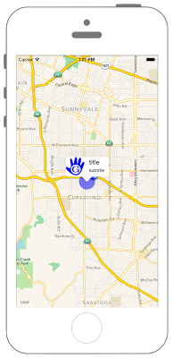

# アノテーションに画像を追加



## Swift3.0
```swift
//
//  ViewController.swift
//  MapKit007
//
//  Created by Misato Morino on 2016/08/15.
//  Copyright © 2016年 Misato Morino. All rights reserved.
//

import UIKit
import MapKit

class ViewController: UIViewController, MKMapViewDelegate {
    
    // 経度緯度.
    let myLan: CLLocationDegrees = 37.331741
    let myLon: CLLocationDegrees = -122.030333
    
    var center: CLLocationCoordinate2D!
    
    override func viewDidLoad() {
        super.viewDidLoad()
        
        // 地図の中心の座標.
        center = CLLocationCoordinate2DMake(myLan, myLon)
        
        // mapViewを生成.
        let myMapView: MKMapView = MKMapView()
        myMapView.frame = self.view.frame
        myMapView.center = self.view.center
        myMapView.centerCoordinate = center
        myMapView.delegate = self
        
        // 縮尺を指定.
        let mySpan: MKCoordinateSpan = MKCoordinateSpan(latitudeDelta: 0.1, longitudeDelta: 0.1)
        let myRegion: MKCoordinateRegion = MKCoordinateRegion(center: center, span: mySpan)
        
        // regionをmapViewに追加.
        myMapView.region = myRegion
        
        // viewにmapViewを追加.
        self.view.addSubview(myMapView)
        
        // 円を描画する(半径500m).
       // let myCircle: MKCircle = MKCircle(centerCoordinate: center, radius: CLLocationDistance(500))
        let myCircle: MKCircle = MKCircle(center: center, radius: CLLocationDistance(500))
        
        // mapViewにcircleを追加.
        myMapView.add(myCircle)
        
        // centerを指すアノテーションを生成.
        let myPointAnnotation: MKPointAnnotation = MKPointAnnotation()
        myPointAnnotation.title = "title"
        myPointAnnotation.subtitle = "subtitle"
        myPointAnnotation.coordinate = center
        
        // mapViewにアノテーションを追加.
        myMapView.addAnnotation(myPointAnnotation)
    }
    
    override func didReceiveMemoryWarning() {
        super.didReceiveMemoryWarning()
    }
    
    /*
     addAnnotationした際に呼ばれるデリゲートメソッド.
     */
    func mapView(_ mapView: MKMapView, viewFor annotation: MKAnnotation) -> MKAnnotationView? {
        
        // Identifier生成.
        let myAnnotationIdentifier: String = "myAnnotation"
        
        // アノテーション生成.
        var myAnnotationView = mapView.dequeueReusableAnnotationView(withIdentifier: myAnnotationIdentifier)
        
        if myAnnotationView == nil {

            myAnnotationView = MKPinAnnotationView(annotation: annotation, reuseIdentifier: myAnnotationIdentifier)
            
            // アノテーションのコールアウトを許可.
            myAnnotationView!.canShowCallout = true
            
            // アノテーションに画像を追加.
            myAnnotationView!.leftCalloutAccessoryView = UIImageView(image: UIImage(named: "logo"))
        }
        
        return myAnnotationView
    }
    
    /*
     addOverlayした際に呼ばれるデリゲートメソッド.
     */
    func mapView(_ mapView: MKMapView, rendererFor overlay: MKOverlay) -> MKOverlayRenderer {
        
        // rendererを生成.
        let myCircleView: MKCircleRenderer = MKCircleRenderer(overlay: overlay)
        
        // 円の内部を青色で塗りつぶす.
        myCircleView.fillColor = UIColor.blue
        
        // 円を透過させる.
        myCircleView.alpha = 0.5
        
        // 円周の線の太さ.
        myCircleView.lineWidth = 0.5
        
        return myCircleView
    }
}
```

## Swift 2.3
```swift
//
//  ViewController.swift
//  MapKit007
//
//  Created by Misato Morino on 2016/08/15.
//  Copyright © 2016年 Misato Morino. All rights reserved.
//

import UIKit
import MapKit

class ViewController: UIViewController, MKMapViewDelegate {
    
    // 経度緯度.
    let myLan: CLLocationDegrees = 37.331741
    let myLon: CLLocationDegrees = -122.030333
    
    var center: CLLocationCoordinate2D!
    
    override func viewDidLoad() {
        super.viewDidLoad()
        
        // 地図の中心の座標.
        center = CLLocationCoordinate2DMake(myLan, myLon)
        
        // mapViewを生成.
        let myMapView: MKMapView = MKMapView()
        myMapView.frame = self.view.frame
        myMapView.center = self.view.center
        myMapView.centerCoordinate = center
        myMapView.delegate = self
        
        // 縮尺を指定.
        let mySpan: MKCoordinateSpan = MKCoordinateSpan(latitudeDelta: 0.1, longitudeDelta: 0.1)
        let myRegion: MKCoordinateRegion = MKCoordinateRegion(center: center, span: mySpan)
        
        // regionをmapViewに追加.
        myMapView.region = myRegion
        
        // viewにmapViewを追加.
        self.view.addSubview(myMapView)
        
        // 円を描画する(半径500m).
        let myCircle: MKCircle = MKCircle(centerCoordinate: center, radius: CLLocationDistance(500))
        
        // mapViewにcircleを追加.
        myMapView.addOverlay(myCircle)
        
        // centerを指すアノテーションを生成.
        let myPointAnnotation: MKPointAnnotation = MKPointAnnotation()
        myPointAnnotation.title = "title"
        myPointAnnotation.subtitle = "subtitle"
        myPointAnnotation.coordinate = center
        
        // mapViewにアノテーションを追加.
        myMapView.addAnnotation(myPointAnnotation)
    }
    
    override func didReceiveMemoryWarning() {
        super.didReceiveMemoryWarning()
    }
    
    /*
     addAnnotationした際に呼ばれるデリゲートメソッド.
     */
    func mapView(mapView: MKMapView, viewForAnnotation annotation: MKAnnotation) -> MKAnnotationView? {
        
        // Identifier生成.
        let myAnnotationIdentifier: String = "myAnnotation"
        
        // アノテーション生成.
        var myAnnotationView = mapView.dequeueReusableAnnotationViewWithIdentifier(myAnnotationIdentifier)
        
        if myAnnotationView == nil {

            myAnnotationView = MKPinAnnotationView(annotation: annotation, reuseIdentifier: myAnnotationIdentifier)
            
            // アノテーションのコールアウトを許可.
            myAnnotationView!.canShowCallout = true
            
            // アノテーションに画像を追加.
            myAnnotationView!.leftCalloutAccessoryView = UIImageView(image: UIImage(named: "logo"))
        }
        
        return myAnnotationView
    }
    
    /*
     addOverlayした際に呼ばれるデリゲートメソッド.
     */
    func mapView(mapView: MKMapView, rendererForOverlay overlay: MKOverlay) -> MKOverlayRenderer {
        
        // rendererを生成.
        let myCircleView: MKCircleRenderer = MKCircleRenderer(overlay: overlay)
        
        // 円の内部を青色で塗りつぶす.
        myCircleView.fillColor = UIColor.blueColor()
        
        // 円を透過させる.
        myCircleView.alpha = 0.5
        
        // 円周の線の太さ.
        myCircleView.lineWidth = 0.5
        
        return myCircleView
    }
}
```

## 2.3と3.0の差分

* ```addOverlay``` から ```add``` に変更
* ```MKCircle(centerCoordinate:, radius:)``` から ```MKCircle(center:, radius:)``` に変更

## Reference
* MKPinAnnotationView
    * [https://developer.apple.com/reference/mapkit/mkpinannotationview](https://developer.apple.com/reference/mapkit/mkpinannotationview)
* MKCircle
    * [https://developer.apple.com/reference/mapkit/mkcircle](https://developer.apple.com/reference/mapkit/mkcircle)
* MKCircleRenderer
    * [https://developer.apple.com/reference/mapkit/mkcirclerenderer](https://developer.apple.com/reference/mapkit/mkcirclerenderer)
