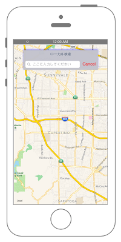

# ローカル検索



## Swift3.0
```swift
//
//  ViewController.swift
//  MapKit010
//
//  Created by Misato Morino on 2016/08/15.
//  Copyright © 2016年 Misato Morino. All rights reserved.
//

import UIKit
import MapKit

class ViewController: UIViewController, MKMapViewDelegate, UISearchBarDelegate {
    
    var myMapView: MKMapView = MKMapView()
    var mySearchBar: UISearchBar!
    var myRegion: MKCoordinateRegion!
    
    override func viewDidLoad() {
        super.viewDidLoad()
        
        // MapViewを生成.
        let myMapView: MKMapView = MKMapView()
        myMapView.frame = self.view.frame
        
        // 経度、緯度を設定.
        let myLatitude: CLLocationDegrees = 37.331741
        let myLongitude: CLLocationDegrees = -122.030333
        
        // 中心点を設定.
        let center: CLLocationCoordinate2D = CLLocationCoordinate2DMake(myLatitude, myLongitude)
        
        // MapViewに中心点を設定.
        myMapView.setCenter(center, animated: true)
        
        // 縮尺(表示領域)を指定.
        let mySpan: MKCoordinateSpan = MKCoordinateSpan(latitudeDelta: 0.1, longitudeDelta: 0.1)
        myRegion = MKCoordinateRegionMake(center, mySpan)
        
        // MapViewにregionを追加.
        myMapView.region = myRegion
        
        // viewにMapViewを追加.
        self.view.addSubview(myMapView)
        
        // searchBar生成.
        mySearchBar = UISearchBar(frame: CGRect(x: 0, y: 0, width: 300, height: 80))
        mySearchBar.layer.position = CGPoint(x: self.view.frame.width/2, y: 80)
        mySearchBar.delegate = self
        mySearchBar.layer.shadowColor = UIColor.blue.cgColor
        mySearchBar.layer.shadowOpacity = 0.5
        mySearchBar.layer.masksToBounds = false
        mySearchBar.showsCancelButton = true
        mySearchBar.showsBookmarkButton = false
        mySearchBar.prompt = "ローカル検索"
        mySearchBar.placeholder = "ここに入力してください"
        mySearchBar.tintColor = UIColor.red
        mySearchBar.showsSearchResultsButton = false
        
        // searchBarをviewに追加.
        self.view.addSubview(mySearchBar)
    }
    
    /*
     Searchボタンが押された時に呼ばれる.
     */
    func searchBarSearchButtonClicked(_ searchBar: UISearchBar) {
        
        // 編集終了.
        self.view.endEditing(true)
        
        // request生成.
        let myRequest: MKLocalSearchRequest = MKLocalSearchRequest()
        
        // 範囲を指定.
        myRequest.region = myRegion
        
        // 検索するワードをsearchBarのテキストに指定.
        myRequest.naturalLanguageQuery = searchBar.text
        
        // LocalSearchを生成.
        let mySearch: MKLocalSearch = MKLocalSearch(request: myRequest)
        
        // 検索開始.
        mySearch.start { (response, error) -> Void in
            
            if error != nil {
                print("地名無し")
            }
            else if response!.mapItems.count > 0 {
                for item in response!.mapItems {
                    
                    // 検索結果の内名前を出力.
                    print(item.name)
                }
            }
        }
    }
    
    /*
     Cancelボタンが押された時に呼ばれる.
     */
    func searchBarCancelButtonClicked(_ searchBar: UISearchBar) {
        searchBar.text = ""
    }
    
    override func didReceiveMemoryWarning() {
        super.didReceiveMemoryWarning()
    }
} 
```

## Swift 2.3
```swift
//
//  ViewController.swift
//  MapKit010
//
//  Created by Misato Morino on 2016/08/15.
//  Copyright © 2016年 Misato Morino. All rights reserved.
//

import UIKit
import MapKit

class ViewController: UIViewController, MKMapViewDelegate, UISearchBarDelegate {
    
    var myMapView: MKMapView = MKMapView()
    var mySearchBar: UISearchBar!
    var myRegion: MKCoordinateRegion!
    
    override func viewDidLoad() {
        super.viewDidLoad()
        
        // MapViewを生成.
        let myMapView: MKMapView = MKMapView()
        myMapView.frame = self.view.frame
        
        // 経度、緯度を設定.
        let myLatitude: CLLocationDegrees = 37.331741
        let myLongitude: CLLocationDegrees = -122.030333
        
        // 中心点を設定.
        let center: CLLocationCoordinate2D = CLLocationCoordinate2DMake(myLatitude, myLongitude)
        
        // MapViewに中心点を設定.
        myMapView.setCenterCoordinate(center, animated: true)
        
        // 縮尺(表示領域)を指定.
        let mySpan: MKCoordinateSpan = MKCoordinateSpan(latitudeDelta: 0.1, longitudeDelta: 0.1)
        myRegion = MKCoordinateRegionMake(center, mySpan)
        
        // MapViewにregionを追加.
        myMapView.region = myRegion
        
        // viewにMapViewを追加.
        self.view.addSubview(myMapView)
        
        // searchBar生成.
        mySearchBar = UISearchBar(frame: CGRectMake(0, 0, 300, 80))
        mySearchBar.layer.position = CGPointMake(self.view.frame.width/2, 80)
        mySearchBar.delegate = self
        mySearchBar.layer.shadowColor = UIColor.blueColor().CGColor
        mySearchBar.layer.shadowOpacity = 0.5
        mySearchBar.layer.masksToBounds = false
        mySearchBar.showsCancelButton = true
        mySearchBar.showsBookmarkButton = false
        mySearchBar.prompt = "ローカル検索"
        mySearchBar.placeholder = "ここに入力してください"
        mySearchBar.tintColor = UIColor.redColor()
        mySearchBar.showsSearchResultsButton = false
        
        // searchBarをviewに追加.
        self.view.addSubview(mySearchBar)
    }
    
    /*
     Searchボタンが押された時に呼ばれる.
     */
    func searchBarSearchButtonClicked(searchBar: UISearchBar) {
        
        // 編集終了.
        self.view.endEditing(true)
        
        // request生成.
        let myRequest: MKLocalSearchRequest = MKLocalSearchRequest()
        
        // 範囲を指定.
        myRequest.region = myRegion
        
        // 検索するワードをsearchBarのテキストに指定.
        myRequest.naturalLanguageQuery = searchBar.text
        
        // LocalSearchを生成.
        let mySearch: MKLocalSearch = MKLocalSearch(request: myRequest)
        
        // 検索開始.
        mySearch.startWithCompletionHandler { (response, error) -> Void in
            
            if error != nil {
                print("地名無し")
            }
            else if response!.mapItems.count > 0 {
                for item in response!.mapItems {
                    
                    // 検索結果の内名前を出力.
                    print(item.name)
                }
            }
        }
    }
    
    /*
     Cancelボタンが押された時に呼ばれる.
     */
    func searchBarCancelButtonClicked(searchBar: UISearchBar) {
        searchBar.text = ""
    }
    
    override func didReceiveMemoryWarning() {
        super.didReceiveMemoryWarning()
    }
}
```

## 2.3と3.0の差分

* ```setCenterCoordinate``` から ```setCenter``` に変更
* ```startWithCompletionHandler``` から ```start``` に変更

## Reference
* MKLocalSearch
    * [https://developer.apple.com/reference/mapkit/mklocalsearch](https://developer.apple.com/reference/mapkit/mklocalsearch)
* MKLocalSearchRequest
    * [https://developer.apple.com/reference/mapkit/mklocalsearchrequest](https://developer.apple.com/reference/mapkit/mklocalsearchrequest)
* MKLocalSearchResponse
    * [https://developer.apple.com/reference/mapkit/mklocalsearchresponse](https://developer.apple.com/reference/mapkit/mklocalsearchresponse)
