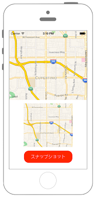

# 地図のスナップショットを撮る



## Swift3.0
```swift
//
//  ViewController.swift
//  MapKit014
//
//  Created by Misato Morino on 2016/08/15.
//  Copyright © 2016年 Misato Morino. All rights reserved.
//

import UIKit
import MapKit

class ViewController: UIViewController {
    
    var myMapView: MKMapView!
    var mySnapShotOptions: MKMapSnapshotOptions = MKMapSnapshotOptions()
    var mySnapShot: MKMapSnapshotter!
    
    override func viewDidLoad() {
        super.viewDidLoad()
        
        // MapViewを生成.
        myMapView = MKMapView()
        myMapView.frame = CGRect(x: 0, y: 0, width: self.view.frame.width, height: self.view.frame.height/2)
        
        // 経度、緯度を設定.
        let myLatitude: CLLocationDegrees = 37.331741
        let myLongitude: CLLocationDegrees = -122.030333
        
        // 中心点を設定.
        let center: CLLocationCoordinate2D = CLLocationCoordinate2DMake(myLatitude, myLongitude)
        
        // MapViewに中心点を設定.
        myMapView.setCenter(center, animated: true)
        
        // 縮尺(表示領域)を指定.
        let mySpan: MKCoordinateSpan = MKCoordinateSpan(latitudeDelta: 0.05, longitudeDelta: 0.05)
        let myRegion: MKCoordinateRegion = MKCoordinateRegionMake(center, mySpan)
        
        // MapViewにregionを追加.
        myMapView.region = myRegion
        
        // viewにMapViewを追加.
        self.view.addSubview(myMapView)
        
        // UIButtonを生成.
        let myButton: UIButton = UIButton(frame: CGRect(x: 0, y: 0, width: 200, height: 50))
        myButton.layer.position = CGPoint(x: self.view.frame.width/2, y: self.view.frame.height-50)
        myButton.layer.cornerRadius = 20.0
        myButton.backgroundColor = UIColor.red
        myButton.setTitle("スナップショット", for: .normal)
        myButton.setTitleColor(UIColor.white, for: .normal)
        myButton.addTarget(self, action: #selector(ViewController.onClickMyButton(sender:)), for: .touchUpInside)
        
        // UIButtonをviewに追加.
        self.view.addSubview(myButton)
        
        // MKMapSnapShotOptionsの設定.
        mySnapShotOptions.region = myRegion
        mySnapShotOptions.size = myMapView.frame.size
        mySnapShotOptions.scale = UIScreen.main.scale
        
        // MKMapSnapShotterにMKMapSnapShotOptionsをセット.
        mySnapShot = MKMapSnapshotter(options: mySnapShotOptions)
    }
    
    
    /*
     ボタンを押したときに呼ばれるメソッド.
     */
    func onClickMyButton(sender: UIButton) {
        
        //実行中のスナップショットがあったら中止する.
        mySnapShot.cancel()
        
        // UIImageViewの生成.
        let myImageView: UIImageView = UIImageView(frame: CGRect(x: 0, y: 0, width: 250, height: 180))
        myImageView.layer.position = CGPoint(x: self.view.frame.width/2, y: self.view.frame.height-180)
        
        // 画像のアスペクト比を維持.
        myImageView.contentMode = UIViewContentMode.scaleAspectFit
        
        // スナップショットを撮る.
        mySnapShot.start { (snapshot, error) -> Void in
            if error == nil {
                myImageView.image = snapshot!.image
            } else {
                print("error")
            }
        }
        
        // UIImageViewをviewに追加.
        self.view.addSubview(myImageView)
    }
    
    override func didReceiveMemoryWarning() {
        super.didReceiveMemoryWarning()
    }
} 
```

## Swift 2.3
```swift
//
//  ViewController.swift
//  MapKit014
//
//  Created by Misato Morino on 2016/08/15.
//  Copyright © 2016年 Misato Morino. All rights reserved.
//

import UIKit
import MapKit

class ViewController: UIViewController {
    
    var myMapView: MKMapView!
    var mySnapShotOptions: MKMapSnapshotOptions = MKMapSnapshotOptions()
    var mySnapShot: MKMapSnapshotter!
    
    override func viewDidLoad() {
        super.viewDidLoad()
        
        // MapViewを生成.
        myMapView = MKMapView()
        myMapView.frame = CGRectMake(0, 0, self.view.frame.width, self.view.frame.height/2)
        
        // 経度、緯度を設定.
        let myLatitude: CLLocationDegrees = 37.331741
        let myLongitude: CLLocationDegrees = -122.030333
        
        // 中心点を設定.
        let center: CLLocationCoordinate2D = CLLocationCoordinate2DMake(myLatitude, myLongitude)
        
        // MapViewに中心点を設定.
        myMapView.setCenterCoordinate(center, animated: true)
        
        // 縮尺(表示領域)を指定.
        let mySpan: MKCoordinateSpan = MKCoordinateSpan(latitudeDelta: 0.05, longitudeDelta: 0.05)
        let myRegion: MKCoordinateRegion = MKCoordinateRegionMake(center, mySpan)
        
        // MapViewにregionを追加.
        myMapView.region = myRegion
        
        // viewにMapViewを追加.
        self.view.addSubview(myMapView)
        
        // UIButtonを生成.
        let myButton: UIButton = UIButton(frame: CGRectMake(0, 0, 200, 50))
        myButton.layer.position = CGPointMake(self.view.frame.width/2, self.view.frame.height-50)
        myButton.layer.cornerRadius = 20.0
        myButton.backgroundColor = UIColor.redColor()
        myButton.setTitle("スナップショット", forState: .Normal)
        myButton.setTitleColor(UIColor.whiteColor(), forState: .Normal)
        myButton.addTarget(self, action: #selector(ViewController.onClickMyButton(_:)), forControlEvents: .TouchUpInside)
        
        // UIButtonをviewに追加.
        self.view.addSubview(myButton)
        
        // MKMapSnapShotOptionsの設定.
        mySnapShotOptions.region = myRegion
        mySnapShotOptions.size = myMapView.frame.size
        mySnapShotOptions.scale = UIScreen.mainScreen().scale
        
        // MKMapSnapShotterにMKMapSnapShotOptionsをセット.
        mySnapShot = MKMapSnapshotter(options: mySnapShotOptions)
    }
    
    
    /*
     ボタンを押したときに呼ばれるメソッド.
     */
    func onClickMyButton(sender: UIButton) {
        
        //実行中のスナップショットがあったら中止する.
        mySnapShot.cancel()
        
        // UIImageViewの生成.
        let myImageView: UIImageView = UIImageView(frame: CGRectMake(0, 0, 250, 180))
        myImageView.layer.position = CGPointMake(self.view.frame.width/2, self.view.frame.height-180)
        
        // 画像のアスペクト比を維持.
        myImageView.contentMode = UIViewContentMode.ScaleAspectFit
        
        // スナップショットを撮る.
        mySnapShot.startWithCompletionHandler { (snapshot, error) -> Void in
            if error == nil {
                myImageView.image = snapshot!.image
            } else {
                print("error")
            }
        }
        
        // UIImageViewをviewに追加.
        self.view.addSubview(myImageView)
    }
    
    override func didReceiveMemoryWarning() {
        super.didReceiveMemoryWarning()
    }
}
```

## 2.3と3.0の差分

* ```setCenterCoordinate``` から ```setCenter``` に変更
* ```startWithCompletionHandler``` から ```start``` に変更

## Reference
* MKMapView
    * [https://developer.apple.com/reference/mapkit/mkmapview](https://developer.apple.com/reference/mapkit/mkmapview)
* MKMapSnapshotter
    * [https://developer.apple.com/reference/mapkit/mkmapsnapshotter](https://developer.apple.com/reference/mapkit/mkmapsnapshotter)
