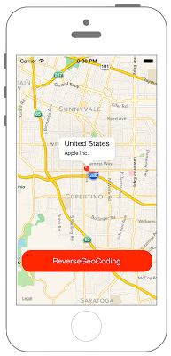

# 逆ジオコーディング



## Swift3.0
```swift
//
//  ViewController.swift
//  MapKit016
//
//  Created by Misato Morino on 2016/08/15.
//  Copyright © 2016年 Misato Morino. All rights reserved.
//

import UIKit
import MapKit

class ViewController: UIViewController, MKMapViewDelegate {
    
    var mapView: MKMapView!
    var myPin: MKPointAnnotation!
    let myLat: CLLocationDegrees = 37.331741
    let myLon: CLLocationDegrees = -122.030333
    
    override func viewDidLoad() {
        super.viewDidLoad()
        
        // UIButtonを作成する.
        let myButton: UIButton = UIButton(frame: CGRect(x: 0, y: 0, width: 300, height: 50))
        myButton.layer.position = CGPoint(x: self.view.frame.width/2, y: self.view.frame.height-100)
        myButton.layer.masksToBounds = true
        myButton.layer.cornerRadius = 20.0
        myButton.setTitle("ReverseGeoCoding", for: .normal)
        myButton.backgroundColor = UIColor.red
        myButton.setTitleColor(UIColor.white, for: .normal)
        myButton.addTarget(self, action: #selector(ViewController.onClickMyButton(sender:)), for: .touchUpInside)
        
        
        let center: CLLocationCoordinate2D = CLLocationCoordinate2DMake(myLat, myLon)
        
        // MapViewを生成.
        mapView = MKMapView(frame: CGRect(x: 0, y: 0, width: self.view.frame.size.width, height: self.view.frame.size.height))
        
        // MapViewの中心位置を指定.
        mapView.centerCoordinate = center
        
        // mapViewにdelegateを指定.
        mapView.delegate = self
        
        // 縮尺を変更.
        // 倍率を指定.
        let span : MKCoordinateSpan = MKCoordinateSpan(latitudeDelta: 0.1, longitudeDelta: 0.1)
        
        // MapViewで指定した中心位置とMKCoordinateSapnで宣言したspanを指定する.
        let region : MKCoordinateRegion = MKCoordinateRegion(center: center, span: span)
        
        // MapViewのregionプロパティにregionを指定.
        mapView.region = region
        
        // MapViewをviewに追加.
        self.view.addSubview(mapView)
        
        // UIButtonをviewに追加.
        self.view.addSubview(myButton)
        
        // pinアノテーションを作成.
        myPin = MKPointAnnotation()
        myPin.coordinate = center
        myPin.title = "Country"
        myPin.subtitle = "Name"
        
        // アノテーションをmaoViewに追加.
        mapView.addAnnotation(myPin)
    }
    
    /*
     ボタンが押されたら呼ばれるメソッド
     */
    func onClickMyButton(sender: UIButton) {
        // geocoderを作成.
        let myGeocorder = CLGeocoder()
        
        // locationを作成.
        let myLocation = CLLocation(latitude: myLat, longitude: myLon)
        
        // 逆ジオコーディング開始.
        myGeocorder.reverseGeocodeLocation(myLocation, completionHandler: { (placemarks, error) -> Void in
            
            for placemark in placemarks! {
                
                print("Name: \(placemark.name)")
                print("Country: \(placemark.country)")
                print("ISOcountryCode: \(placemark.isoCountryCode)")
                print("administrativeArea: \(placemark.administrativeArea)")
                print("subAdministrativeArea: \(placemark.subAdministrativeArea)")
                print("Locality: \(placemark.locality)")
                print("PostalCode: \(placemark.postalCode)")
                print("areaOfInterest: \(placemark.areasOfInterest)")
                print("Ocean: \(placemark.ocean)")
                
                // pinのタイトルとサブタイトルを変更する.
                self.myPin.title = "\(placemark.country)"
                self.myPin.subtitle = "\(placemark.name)"
            }
        })
    }
    
    override func didReceiveMemoryWarning() {
        super.didReceiveMemoryWarning()
    }
    
}
```

## Swift 2.3
```swift
//
//  ViewController.swift
//  MapKit016
//
//  Created by Misato Morino on 2016/08/15.
//  Copyright © 2016年 Misato Morino. All rights reserved.
//

import UIKit
import MapKit

class ViewController: UIViewController, MKMapViewDelegate {
    
    var mapView: MKMapView!
    var myPin: MKPointAnnotation!
    let myLat: CLLocationDegrees = 37.331741
    let myLon: CLLocationDegrees = -122.030333
    
    override func viewDidLoad() {
        super.viewDidLoad()
        
        // UIButtonを作成する.
        let myButton: UIButton = UIButton(frame: CGRectMake(0, 0, 300, 50))
        myButton.layer.position = CGPointMake(self.view.frame.width/2, self.view.frame.height-100)
        myButton.layer.masksToBounds = true
        myButton.layer.cornerRadius = 20.0
        myButton.setTitle("ReverseGeoCoding", forState: .Normal)
        myButton.backgroundColor = UIColor.redColor()
        myButton.setTitleColor(UIColor.whiteColor(), forState: .Normal)
        myButton.addTarget(self, action: #selector(ViewController.onClickMyButton(_:)), forControlEvents: .TouchUpInside)
        
        
        let center: CLLocationCoordinate2D = CLLocationCoordinate2DMake(myLat, myLon)
        
        // MapViewを生成.
        mapView = MKMapView(frame: CGRectMake(0, 0, self.view.frame.size.width, self.view.frame.size.height))
        
        // MapViewの中心位置を指定.
        mapView.centerCoordinate = center
        
        // mapViewにdelegateを指定.
        mapView.delegate = self
        
        // 縮尺を変更.
        // 倍率を指定.
        let span : MKCoordinateSpan = MKCoordinateSpan(latitudeDelta: 0.1, longitudeDelta: 0.1)
        
        // MapViewで指定した中心位置とMKCoordinateSapnで宣言したspanを指定する.
        let region : MKCoordinateRegion = MKCoordinateRegion(center: center, span: span)
        
        // MapViewのregionプロパティにregionを指定.
        mapView.region = region
        
        // MapViewをviewに追加.
        self.view.addSubview(mapView)
        
        // UIButtonをviewに追加.
        self.view.addSubview(myButton)
        
        // pinアノテーションを作成.
        myPin = MKPointAnnotation()
        myPin.coordinate = center
        myPin.title = "Country"
        myPin.subtitle = "Name"
        
        // アノテーションをmaoViewに追加.
        mapView.addAnnotation(myPin)
    }
    
    /*
     ボタンが押されたら呼ばれるメソッド
     */
    func onClickMyButton(sender: UIButton) {
        // geocoderを作成.
        let myGeocorder = CLGeocoder()
        
        // locationを作成.
        let myLocation = CLLocation(latitude: myLat, longitude: myLon)
        
        // 逆ジオコーディング開始.
        myGeocorder.reverseGeocodeLocation(myLocation,
                                           completionHandler: { (placemarks, error) -> Void in
                                            
            for placemark in placemarks! {
                                                
                print("Name: \(placemark.name)")
                print("Country: \(placemark.country)")
                print("ISOcountryCode: \(placemark.ISOcountryCode)")
                print("administrativeArea: \(placemark.administrativeArea)")
                print("subAdministrativeArea: \(placemark.subAdministrativeArea)")
                print("Locality: \(placemark.locality)")
                print("PostalCode: \(placemark.postalCode)")
                print("areaOfInterest: \(placemark.areasOfInterest)")
                print("Ocean: \(placemark.ocean)")
                                                
                // pinのタイトルとサブタイトルを変更する.
                self.myPin.title = "\(placemark.country)"
                self.myPin.subtitle = "\(placemark.name)"
            }
        })
    }
    
    override func didReceiveMemoryWarning() {
        super.didReceiveMemoryWarning()
    }
    
}
```

## 2.3と3.0の差分

* ```setCenterCoordinate``` から ```setCenter``` に変更

## Reference
* CLGeocoder
    * [https://developer.apple.com/reference/corelocation/clgeocoder](https://developer.apple.com/reference/corelocation/clgeocoder)
